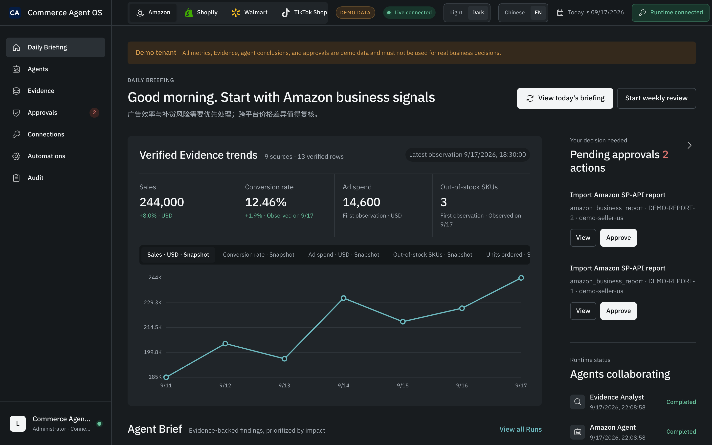

<div align="center">

# 越境EC AI 知識基盤

### 人が読める。agent にインストールできる。運用として動かせる。

**すべての数字は CI で検証済み · すべてのプロンプトに幻覚防止のガードレール · すべての章に「効かないとき」を明記**

🇯🇵 日本語&nbsp;·&nbsp;[🇨🇳 中文](README_ZH.md)&nbsp;·&nbsp;[🇺🇸 English](README.md)&nbsp;&nbsp;|&nbsp;&nbsp;📖 [オンラインで読む](https://kangise.github.io/ecommerce-ai-skills/)&nbsp;&nbsp;|&nbsp;&nbsp;📦 [agent にインストール](dist/)

[](https://creativecommons.org/publicdomain/zero/1.0/)
[](https://github.com/kangise/ecommerce-ai-skills/actions/workflows/pages.yml)
[](https://github.com/kangise/ecommerce-ai-skills)
[](https://github.com/kangise/ecommerce-ai-skills)

</div>

<br>

<p align="center">
  
</p>
<p align="center"><sub>デモテナント上の Commerce Agent OS：検証済みエビデンス、人の承認待ちのアクション、それらを生成した agent を 1 画面で。</sub></p>

<br>

```bash
pip install "ecommerce-ai-skills[mcp] @ git+https://github.com/kangise/ecommerce-ai-skills"
opc-ecommerce demo-seed --db ./demo.sqlite && opc-ecommerce demo --db ./demo.sqlite --port 8788
# その後 http://127.0.0.1:8788/app を開く
```

<br>
<p align="center">
  
</p>

<br>

## これは何か

越境EC の AI 実践知識ライブラリ。**同じコンテンツに 3 つの使い方がある**:

| 使い方 | 何か | 入口 |
|---|---|---|
| **本として読む** | 69 章、選品から成長まで、中/英/日 3 言語で完訳 | [オンラインサイト](https://kangise.github.io/ecommerce-ai-skills/) |
| **agent にインストール** | 知識 + 領域モデル + ガード付き能力。MCP 一行の設定で Claude / Cursor に接続 | [`dist/`](dist/) |
| **そのまま動かす** | Commerce Agent OS — 実店舗データに接続し、複数 agent が検証し、人が承認する運用ランタイム | `opc-ecommerce demo` |

3 つとも**同じ CI ゲート**が守る。ゲートを通らなければ、どれも出荷されない。

<br>

## 動かす — Commerce Agent OS

最初の 2 つは「AI に知識を渡す」使い方。3 つ目は**実際に働かせる**——同じ ontology と skill を、承認・監査・障害復旧を備えたランタイムに載せたもの。

```bash
pip install "ecommerce-ai-skills[mcp] @ git+https://github.com/kangise/ecommerce-ai-skills"

opc-ecommerce demo-seed --db ./demo.sqlite     # 隔離されたデモテナントを作る
opc-ecommerce demo --db ./demo.sqlite --port 8788
# ブラウザで http://127.0.0.1:8788/app を開く
```

デモテナントは全体を通して `DEMO DATA` と表示され、実データとは物理的に隔離されます。

**現在できること**

| 能力 | 説明 |
|---|---|
| 実データの取り込み | Amazon SP-API / Amazon Ads / Shopify の 3 コネクタ。Business Report、広告、FBA、返品、Listing の CSV/XLSX を永続 Evidence として取り込み |
| 複数 agent の検証 | Weekly Ops Council：証拠検証 Agent と各マーケットプレイス専門 Agent が並列に確認し、クロスプラットフォーム Controller と店長 Agent が優先事項を統合 |
| 人による承認ゲート | 書き込みは proposal → 承認 → 実行を経る。広告系の操作は capability gate が追加され、未認可なら blocked |
| 永続的な実行 | job / schedule / report-sync / daily-ops の 4 種の worker が中断後に再開。冪等リースと復旧つき |
| 全経路の監査 | すべての結論は入力ソースの引用が必須。テナント隔離、API キーのローテーション、操作監査ログ |
| 運用 UI | `/app` の 7 ビュー：ブリーフィング、agent、証拠、承認、接続、自動化、監査。中英の設定を保持、ライト/ダークテーマ対応 |

**モデルプロバイダ**: 既定は OpenAI。`EAI_AGENT_PROVIDER=anthropic` で Claude に切り替わります。両者は同じ契約に従い、認証情報は環境変数のみ、エンドポイントは公式ホストに固定、監査記録には実際に使ったプロバイダ名が入ります。認識できない値は起動時に失敗し、黙って別のベンダーに流れることはありません。

**あえてやらないこと** — 実際の認証情報がない、あるいは証拠が不完全なときは**明示的に失敗**し、もっともらしい代替結果を作りません。知識層のデータ規律と同じ原則です。

接続の詳細は [`integration/runtime-api.md`](integration/runtime-api.md) を参照。

<br>

## あなたは誰 → どこから

<p align="center">
  
</p>

<br>

## なぜ「またプロンプト集」ではないのか

<p align="center">
  
</p>

AI に「このカテゴリの月間販売数はどれくらい?」と聞けば、ほぼ確実にもっともらしい数字が返ってくる — **そして AI はそれを実際には知らない**。

選品・仕入れ・価格設定の先には実際の資金が動いている。Agent 時代はさらに危険だ。モデルは自分が知らない数字を使って値付けし、発注する。

**このライブラリの違いは、プロンプトがより凝っていることではない。AI がどこで止まるべきかの線を引いてあることだ。**

<br>

## 30 秒で違いが分かる

これを [ChatGPT](https://chatgpt.com/) または [Claude](https://claude.ai/) に貼り付けてください:

```
<役割>Amazon [US/DE/JP] に詳しい越境EC の選品コンサルタント</役割>

<私の条件>
- 立ち上げ資金: ¥[X] 万
- 経験レベル: [初心者/経験あり/ベテラン]
- 好みのカテゴリ: [好みがあれば記入、なければ「不問」]
- リスク選好: [保守/中程度/積極]
</私の条件>

<ツールデータ>
[任意。Helium 10 / Jungle Scout から書き出したカテゴリデータを貼る。空欄の場合は下のデータ規律を参照]
</ツールデータ>

<タスク>
カテゴリの方向性を 5 つ推奨してください。各々に:
1. カテゴリ名と簡単な説明
2. なぜ今が機会になりうるか(判断の根拠も示す)
3. この機会を確認するために私が検証すべきデータ(具体的な指標と取得ツールを挙げる)
4. 主なリスクと対応策
5. 立ち上げ資金の桁感(提示した予算で賄えるか)
6. 推奨の参入戦略(差別化の方向)
</タスク>

<データ規律>
- **月販・価格・利益率の具体的な数字は出さないこと**。<ツールデータ> に載っている場合のみ可。あなたはリアルタイムの市場データを持っておらず、捏造された数字は誤った仕入れにつながる
- <ツールデータ> が空のときは 3 番が最も重要。答えを推測せず、何を調べるべきかを教えること
- 結論ごとに出典を付す: [ツールデータ] または [カテゴリ常識からの推論]
- 判断材料が足りなければ、結論より先に私にデータを求めること
</データ規律>

<制約>
- すでにレッドオーシャンのカテゴリ(スマホケース、ケーブルなど)は推奨しない
- 差別化余地のあるカテゴリを優先
- 私の資金と経験の制約を考慮
</制約>

<出力形式>
カテゴリの方向性をちょうど 5 つ推奨し、各カテゴリを <タスク> の 6 項目の固定構成で出力:
1. カテゴリ名と簡単な説明(1〜2 文)
2. なぜ今が機会になりうるか(判断の根拠)
3. 検証すべきデータ(具体的な指標 + 取得ツール)
4. 主なリスクと対応策
5. 立ち上げ資金の桁感(私の予算で賄えるか)
6. 推奨の参入戦略(差別化の方向)
</出力形式>

<セルフチェック>
提出前に確認: (1) 私が提供していない数字が 1 つも含まれていない (2) 各カテゴリに「次に検証すべきこと」が書かれている (3) 推奨はちょうど 5 件
</セルフチェック>

注意:
- すでにレッドオーシャンのカテゴリ(スマホケース、ケーブルなど)は推奨しない
- 差別化余地のあるカテゴリを優先
- 私の資金と経験の制約を考慮
```

**数字を捏造していないことに注目。データをどこで調べるべきかを正確に伝えている。**

出典: [A1 商品リサーチ · 3.7 カテゴリ機会の発見](src/a-operators/a1-product-research.md)

<br>

## 3 つの実用例

### 1 · 新商品の Amazon Listing を書く（コーディング不要）

[A2 Listing 最適化](src/a-operators/a2-listing-optimization.md)を開き、「Listing 一括生成」のプロンプトをコピーして、商品情報を埋めるだけ。

得られるのは**プラットフォームのハード制約**付きの Listing:タイトル ≤200 文字かつ最初の 80 文字に最高検索ボリュームのキーワード、5 つの Bullet 各 ≤200 文字で HTML なし、バックエンド Search Terms は 1 行 ≤250 バイト。

> これは適当に書いたルールではなく、Amazon の実際の制限で、[`ontology/constraints.yaml`](ontology/constraints.yaml) に格納され、プロンプトの `<セルフチェック>` ブロックが 1 件ずつ照合する。制約を 1 か所変更すれば、それを参照するすべてのプロンプトが門禁 `O5` によって一緒に変更される。

### 2 · Claude Desktop を EC コンサルタントにする（5 分）

先にサーバー依存関係をインストールする:

```bash
python3 -m pip install "ecommerce-ai-skills[mcp] @ git+https://github.com/kangise/ecommerce-ai-skills"
```

```json
{
  "mcpServers": {
    "opc-ecommerce": {
      "command": "opc-ecommerce",
      "args": ["mcp"]
    }
  }
}
```

> `opc-ecommerce` は pip インストール時に作成されるコマンドで、知識パッケージは同梱されているためリポジトリの clone は不要です。Claude Desktop がコマンドを見つけられない場合は、`which opc-ecommerce` の出力（絶対パス）を `command` に指定してください。clone から使う場合：`"command": "python3", "args": ["/path/to/ecommerce-ai-skills/integration/mcp-server.py", "--dist", "/path/to/ecommerce-ai-skills/dist"]`。

インストール後:

| あなたの質問 | それがやること |
|---|---|
| 「ACOS が 40% まで上がった、どうする?」 | `ecom-advertising` にルーティングし、一般的なアドバイスではなく診断パスを提示する |
| 「需要予測に AI を使うべき?」 | `ecom-applicability` にルーティングし、**「データが 1 年未満なら使うべきではない」**と答える — 全章の失效境界（適用外になる条件）が組み込まれているから |
| 「商品が画像と違うという苦情にどう返信?」 | `ecom-customer-service` にルーティングし、コピー規律付きの返信テンプレートを提示する |

詳細は [`dist/integration/mcp.md`](dist/integration/mcp.md)。

### 3 · チームでクロスプラットフォーム出品、ルールを覚える必要なし

同じ「タイトル」もプラットフォームごとに別物。[`ontology/constraints.yaml`](ontology/constraints.yaml) で確認できる:

```yaml
amazon.listing.title.max_length:       200  文字
shopify.product_page.title.max_length:  70  文字
tiktok_shop.product.title.max_length:   80  文字
```

チームのチャットでまた聞かれたら、このリンクを投げるだけ。あるいは `ecom-listing` skill で 3 プラットフォーム分の準拠バリアントを一度に生成できる。

<br>

## 本だけではない — 4 層構造

| 層 | 内容 | 規模 | 対象 |
|---|---|---|---|
| **知識ベース** | 69 章、3 言語（中/英/日） | 69 章 | 人の読解 · agent 検索 |
| **Ontology** | E コマース領域モデル | 100 実体 · 322 制約 · 78 関係 · 8 プロセス | agent 間の共有契約 |
| **Skills + プロンプト** | ガード付きの実行可能能力 | 878 プロンプト · 9 つのインストール可能な skill | agent の直接呼び出し |
| **Runtime** | 複数 agent の運用ランタイム + UI | 54 の API エンドポイント · 7 ビュー · 3 プラットフォームコネクタ | 実店舗の日常運用 |

上の 3 層は**知識**、4 層目はそれを**実データに接続して実行する**。前 3 層は `dist/` に、4 層目は `pip install` するランタイムパッケージに入ります。

`dist/` のディレクトリ構成:

```
dist/
  SKILL.md       ← agent の入口。読めばリクエストのルーティング方法が分かる
  ontology.json  ← E コマース領域モデル（実体、関係、制約）
  prompts.json   ← ガード付きのプロンプト、3 言語
  skills/        ← 9 つの domain skill。各 manifest + playbook + 境界
  knowledge/     ← 69 章の構造化索引
  integration/   ← MCP Server の導入ガイド
```

MCP Server は 8 つの resource（ontology 5 種 + 知識索引 + 章全文 + 用語集）と 5 つの tool（`route_query` / `get_constraints` / `search_knowledge` / `read_chapter` / `list_skills`）を公開します。自分で確認するには:

```bash
python3 integration/mcp-server.py --cli
```

稼働中の Runtime を指すと（`OPC_RUNTIME_URL` + `OPC_RUNTIME_API_KEY`）、**読み取り専用**の運用 tool が 4 つ増えます：ブリーフィング、指標観測、承認待ちのアクション、取り込み済み Evidence。ACOS が 40% のときどうするかだけでなく、いま ACOS がいくつなのかも agent が直接見られます。

承認は公開しません。書き込みは proposal → 人の承認 → 実行を経るもので、`approve` を tool にするのは、その門を守る鍵をモデルに渡すのと同じです。何が承認待ちかは agent にも見えますが、承認するのは人です。

<br>

## なぜ信頼できるのか

「真面目にやっています」ではなく、**43 項目の CI ゲート**による。すべて通過しなければデプロイは停止する:

| ゲート | 何をチェックするか |
|---|---|
| `M1` | 本文のすべてのハード数字に、出典・検証日・緩和語・明示マークのいずれかがある |
| `M2` | 各ハウツー章に「この方法が効かないとき」セクションがある |
| `M4` | すべての外部リンクがプローブ済みで、死リンクでない |
| `M7` | `verified` マークが 18 か月を超えると自動で期限切れエラーになる |
| `N3` `N4` | 各プロンプトにセルフチェックブロックと出力形式がある |
| `O5` | 本文に書かれた制約値が ontology と一致する |
| `parity` | 3 言語のファイルがすべて存在し、構造が一致する |

自分で走らせて確認:

```bash
python3 scripts/verify_all.py
```

> 完全なゲートリストと設計理由は [`scripts/README.md`](scripts/README.md) に。既知の未完了項目は [`CONTRIBUTING.md`](CONTRIBUTING.md) に隠さず書いてある。

<br>

## どこから始めるか

| あなたは | ここから |
|---------|---------|
| まず AI に何ができるのか知りたい | [AI 全景評価](src/0-foundations/ai-landscape.md) — 各工程の成熟度が 30 分で分かる |
| 運用担当、今日から使いたい | [A1 選品](src/a-operators/a1-product-research.md) · [A2 Listing](src/a-operators/a2-listing-optimization.md) · [A3 広告](src/a-operators/a3-advertising.md) |
| すでに AI を使っていて自動化したい | [A14 運用の Agent 化](src/a-operators/a14-operations-agent.md) — まずどの工程が値するかを判断する |
| 技術側、自分で組む | [B4 Agent ワークフロー](src/b-developers/b4-agent-workflow.md) · [B6 MCP 統合](src/b-developers/b6-mcp-agentic-workflow.md) |
| 目下のコンプライアンスが気になる | [関税と de minimis](src/a-operators/a11-financial-analysis.md) · [EU AI Act](src/a-operators/a6-compliance.md) |

<br>

## その他の関心事

- **内容は 3 か月で古びない** — 本文は能力のレベルだけを書き、型番と価格は検証日付きの[モデルマトリクス](src/resources/model-matrix.md) 1 ページに集約。期限切れは `M7` がエラーにする
- **Agent 時代に使える** — プロンプトだけでなく、[スキルファイルへの移行方法](src/0-foundations/f2-prompt-engineering.md)と、[絶対に Agent に渡してはいけない動作](src/a-operators/a14-operations-agent.md)まで
- **CC0** — 自由にコピーしてよい。帰属表示も不要、知らせる必要もない

---

## コンテンツ索引

| ドメイン | トピック |
|----------|----------|
| AI 基礎 | [AI 技術の変遷](src/0-foundations/f1-ai-evolution.md) · [プロンプトエンジニアリング](src/0-foundations/f2-prompt-engineering.md) · [RAG](src/0-foundations/f3-rag-knowledge.md) · [Agent](src/0-foundations/f4-agent-automation.md) · [RPA](src/0-foundations/f5-rpa-automation.md) · [ツール比較](src/0-foundations/f6-ai-tools-comparison.md) · [AI 活用成熟度マップ](src/0-foundations/ai-landscape.md) |
| 商品リサーチ | [商品リサーチ](src/a-operators/a1-product-research.md) · [価格戦略](src/a-operators/a8-pricing-strategy.md) · [知的財産保護](src/a-operators/a12-ip-protection.md) |
| サプライチェーン | [在庫とサプライチェーン](src/a-operators/a5-inventory.md) |
| コンテンツと転換率 | [商品ページ最適化](src/a-operators/a2-listing-optimization.md) · [ビジュアルコンテンツ](src/a-operators/a7-visual-content.md) · [ブランド構築](src/a-operators/a10-brand-building.md) |
| 集客 | [広告最適化](src/a-operators/a3-advertising.md) · [SEO / GEO](src/a-operators/a9-seo-geo.md) · [グロースハック](src/a-operators/a13-ai-growth-hack.md) |
| ソーシャルメディア | [Instagram / Facebook](src/e-social-media/e1-instagram-facebook-ai-guide.md) · [YouTube](src/e-social-media/e2-youtube-ai-guide.md) · [小紅書 (RED)](src/e-social-media/e3-xiaohongshu-ai-guide.md) · [Pinterest](src/e-social-media/e4-pinterest-ai-guide.md) · [WhatsApp](src/e-social-media/e5-whatsapp-business-ai-guide.md) · [Reddit](src/e-social-media/e6-reddit-ai-guide.md) · [クロスチャネル](src/e-social-media/e7-social-media-cross-channel.md) |
| カスタマー対応 | [カスタマーサービスとアフターケア](src/a-operators/a4-customer-service.md) |
| コンプライアンスと財務 | [コンプライアンスとリスク管理](src/a-operators/a6-compliance.md) · [財務分析](src/a-operators/a11-financial-analysis.md) · [AI リスクガバナンス](src/c-managers/c4-ai-risk-governance.md) |
| モール型 EC | [Walmart](src/d-platforms/d4-walmart-ai-guide.md) · [eBay](src/d-platforms/d9-ebay-ai-guide.md) · [AliExpress](src/d-platforms/d10-aliexpress-ai-guide.md) · [Temu](src/d-platforms/d5-temu-seller-guide.md) · [Faire](src/d-platforms/d12-faire-wholesale-ai-guide.md) |
| 自社 EC (DTC) | [Shopify](src/d-platforms/shopify-ai-guide.md) |
| ショート動画 EC | [TikTok Shop](src/d-platforms/tiktok-shop-ai-guide.md) |
| アジア太平洋 | [東南アジア](src/d-platforms/d6-southeast-asia-ai-guide.md) · [日本 (楽天市場)](src/d-platforms/d8-rakuten-japan-ai-guide.md) · [韓国 (Coupang)](src/d-platforms/d11-coupang-korea-ai-guide.md) |
| 欧州・中南米 | [Mercado Libre](src/d-platforms/d7-mercado-libre-ai-guide.md) · [Otto / Zalando](src/d-platforms/d13-europe-marketplaces-guide.md) |
| クロスプラットフォーム | [プラットフォーム連携](src/d-platforms/cross-platform-strategy.md) · [プラットフォーム比較](src/d-platforms/platform-comparison.md) |
| AI システム構築 | [データパイプライン](src/b-developers/b1-data-pipeline.md) · [予測モデル](src/b-developers/b2-prediction-models.md) · [RAG ナレッジベース](src/b-developers/b3-rag-knowledge-base.md) · [Agent ワークフロー](src/b-developers/b4-agent-workflow.md) · [ローカルデプロイ](src/b-developers/b5-local-model-deploy.md) · [MCP](src/b-developers/b6-mcp-agentic-workflow.md) · [レビュー NLP](src/b-developers/b7-review-nlp-system.md) · [ダッシュボード](src/b-developers/b8-ecommerce-dashboard.md) · [画像パイプライン](src/b-developers/b9-ai-image-pipeline.md) |
| チームとマネジメント | [AI 能力アセスメント](src/c-managers/c1-ai-assessment.md) · [チームビルディング](src/c-managers/c2-team-building.md) · [ROI 評価](src/c-managers/c3-roi-evaluation.md) · [競合インテリジェンス](src/c-managers/c5-competitive-intelligence.md) |

---

## ノートブックラボ

Google Colab でそのまま動く Jupyter ノートブック 18 本 — セットアップ不要:

[商品リサーチ](https://colab.research.google.com/github/kangise/ecommerce-ai-skills/blob/main/notebooks/a1-product-research.ipynb) · [多言語商品ページ](https://colab.research.google.com/github/kangise/ecommerce-ai-skills/blob/main/notebooks/a2-multilingual-listing.ipynb) · [広告](https://colab.research.google.com/github/kangise/ecommerce-ai-skills/blob/main/notebooks/a3-advertising.ipynb) · [低評価レビュー](https://colab.research.google.com/github/kangise/ecommerce-ai-skills/blob/main/notebooks/a4-negative-review-analysis.ipynb) · [在庫補充](https://colab.research.google.com/github/kangise/ecommerce-ai-skills/blob/main/notebooks/a5-inventory-reorder.ipynb) · [コンプライアンス](https://colab.research.google.com/github/kangise/ecommerce-ai-skills/blob/main/notebooks/a6-compliance-checker.ipynb) · [価格トラッカー](https://colab.research.google.com/github/kangise/ecommerce-ai-skills/blob/main/notebooks/a8-price-tracker.ipynb) · [GEO 監査](https://colab.research.google.com/github/kangise/ecommerce-ai-skills/blob/main/notebooks/a9-geo-audit.ipynb) · [ブランド監査](https://colab.research.google.com/github/kangise/ecommerce-ai-skills/blob/main/notebooks/a10-brand-audit.ipynb) · [利益計算](https://colab.research.google.com/github/kangise/ecommerce-ai-skills/blob/main/notebooks/a11-profit-calculator.ipynb) · [特許検索](https://colab.research.google.com/github/kangise/ecommerce-ai-skills/blob/main/notebooks/a12-ip-patent-search.ipynb) · [データパイプライン](https://colab.research.google.com/github/kangise/ecommerce-ai-skills/blob/main/notebooks/b1-data-pipeline.ipynb) · [売上予測](https://colab.research.google.com/github/kangise/ecommerce-ai-skills/blob/main/notebooks/b2-sales-forecast.ipynb) · [レビュー NLP](https://colab.research.google.com/github/kangise/ecommerce-ai-skills/blob/main/notebooks/b7-review-analysis.ipynb) · [ダッシュボード](https://colab.research.google.com/github/kangise/ecommerce-ai-skills/blob/main/notebooks/b8-dashboard-demo.ipynb) · [ROI 評価](https://colab.research.google.com/github/kangise/ecommerce-ai-skills/blob/main/notebooks/c3-roi-evaluation.ipynb) · [クロスプラットフォームコンテンツ](https://colab.research.google.com/github/kangise/ecommerce-ai-skills/blob/main/notebooks/d3-cross-platform-content.ipynb) · [SNS コンテンツカレンダー](https://colab.research.google.com/github/kangise/ecommerce-ai-skills/blob/main/notebooks/e1-social-content-calendar.ipynb)

## 事例研究

[AI 商品ページ最適化](src/case-studies/ai-listing-optimization.md) — SKU あたり 4 時間 → 45 分

[AI 広告最適化](src/case-studies/ai-ppc-optimization.md) — ACOS 35% → 18%

[レビュー起点の商品開発](src/case-studies/ai-review-to-product.md) — 評価 4.6★ vs 競合 4.2★

[すべての事例 →](src/case-studies/)

---

## コミュニティ

ecommerce-ai-skills は **AAAI China Chapter** のオープンソースプロジェクトとして、越境EC における AI の実践活用を推進しています。

- **Star** を付けて更新をフォロー
- [Issue を提出](https://github.com/kangise/ecommerce-ai-skills/issues)して問題報告や改善提案
- [PR を提出](https://github.com/kangise/ecommerce-ai-skills/pulls)してプロンプト・ノートブック・事例を投稿

## コントリビュート

特に歓迎するもの:

1. **プロンプトテンプレート** — 実務で検証済みのプロンプト(テストに使った AI ツールを明記)
2. **ノートブック** — Google Colab 無料枠で動くハンズオンチュートリアル
3. **事例研究** — AI で EC の課題をどう解決したか、その成果
4. **ツールレビュー** — 実際に使った AI ツールの長所と短所
5. **修正** — リンク切れや古くなった内容の修正

詳細は [CONTRIBUTING.md](CONTRIBUTING.md) をご覧ください。

---

[CC0 1.0](https://creativecommons.org/publicdomain/zero/1.0/) — 帰属表示不要で自由に利用可能 · [免責事項](DISCLAIMER.md) · *An AAAI China Chapter Initiative*
