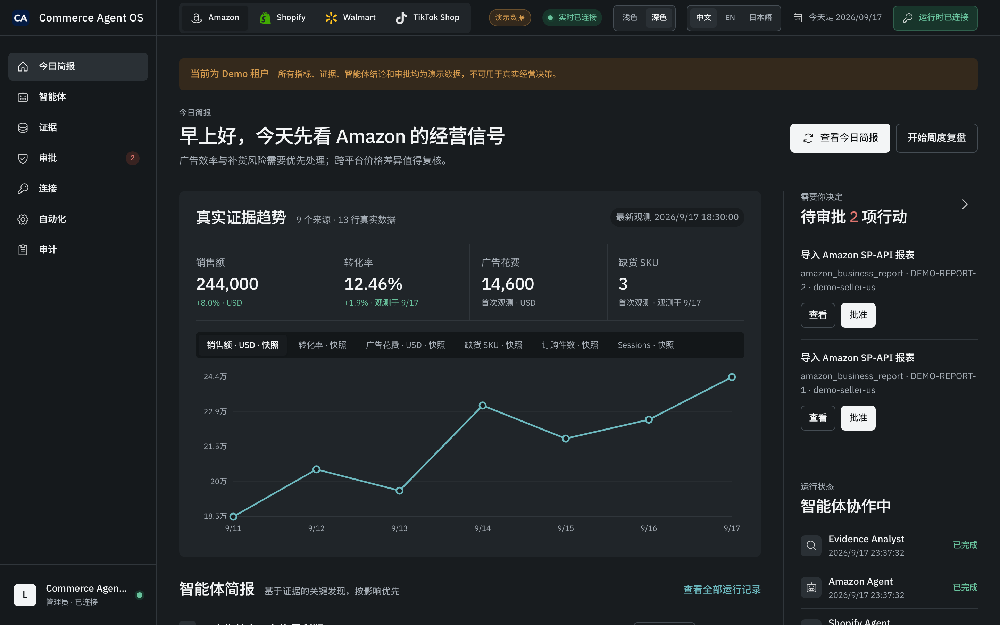
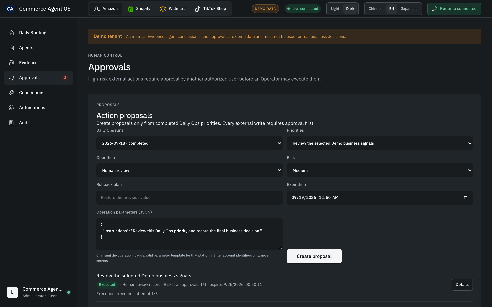
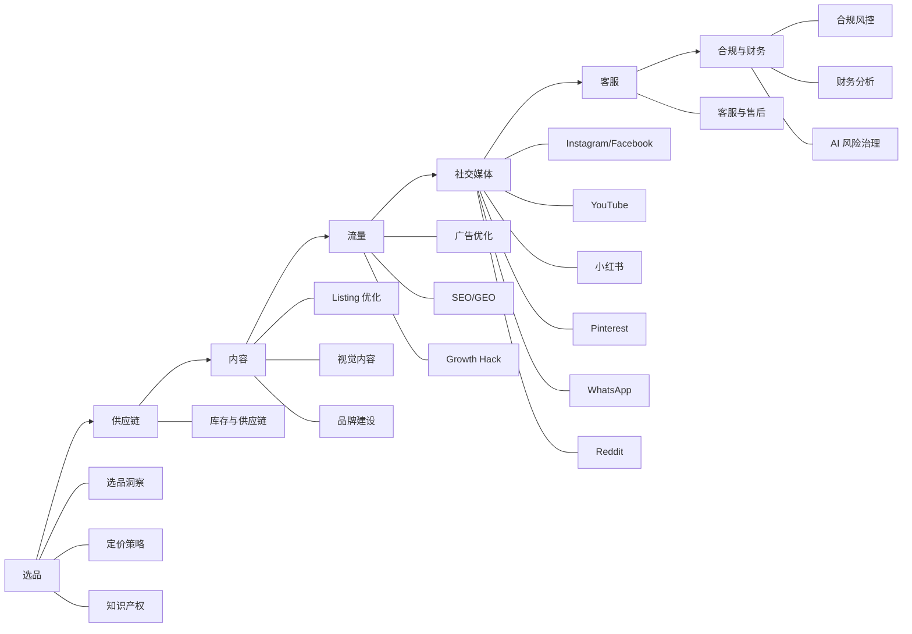
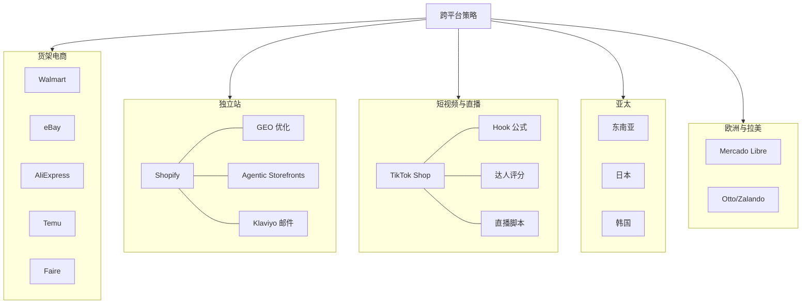
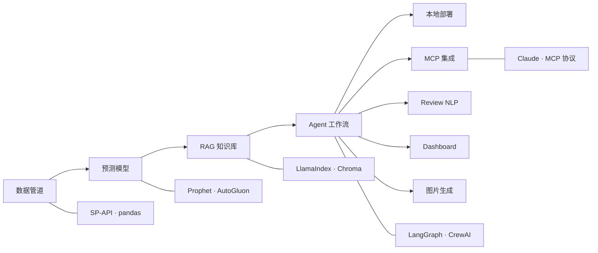
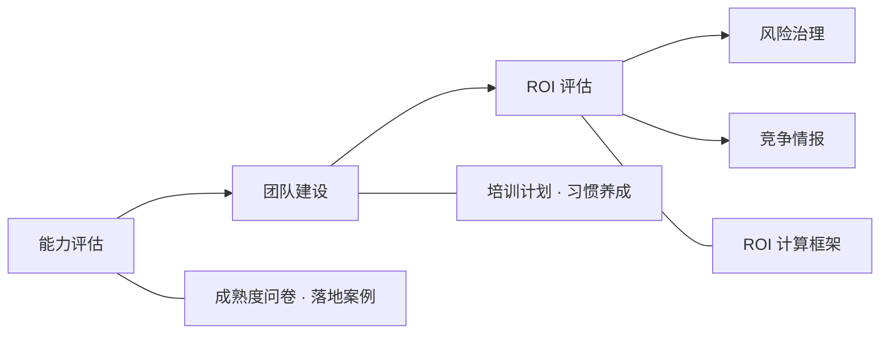

<div align="center">

# 跨境电商 AI 知识底座

### 人可以读，agent 可以装，运营可以跑。

**每个数字都经 CI 核验 · 每个 Prompt 都带反幻觉护栏 · 每章都写明什么时候不管用**

🇨🇳 中文&nbsp;·&nbsp;[🇺🇸 English](README.md)&nbsp;·&nbsp;[🇯🇵 日本語](README_JA.md)&nbsp;&nbsp;|&nbsp;&nbsp;📖 [在线阅读](https://kangise.github.io/ecommerce-ai-skills/)&nbsp;&nbsp;|&nbsp;&nbsp;📦 [给 agent 装](dist/)&nbsp;&nbsp;|&nbsp;&nbsp;🖥️ [跑起来](#跑起来--commerce-agent-os)

[](https://creativecommons.org/publicdomain/zero/1.0/)
[](https://github.com/kangise/ecommerce-ai-skills/actions/workflows/pages.yml)
[](https://github.com/kangise/ecommerce-ai-skills)
[](https://github.com/kangise/ecommerce-ai-skills)

</div>

<br>

<p align="center">
  
</p>
<p align="center"><sub>Commerce Agent OS 运行在一个演示租户上：已核验的证据、待人工审批的动作、产出它们的 agent，同一屏内。</sub></p>

<br>

**在 Claude Code 里**：安装 9 个 skill；只有名称和描述常驻上下文，用到时才加载正文。

```
/plugin marketplace add kangise/ecommerce-ai-skills
/plugin install ecommerce-ai-skills@ecommerce-ai-skills
```

**在本地运行运营界面：**

```bash
pip install "ecommerce-ai-skills[mcp] @ git+https://github.com/kangise/ecommerce-ai-skills"
opc-ecommerce demo-seed --db ./demo.sqlite && opc-ecommerce demo --db ./demo.sqlite --port 8788
# 然后打开 http://127.0.0.1:8788/app
```

<br>
<p align="center">
  
</p>

<br>

## 这是什么

跨境电商的 AI 实操知识库，同一份内容有三种用法：

| 用法 | 说明 | 入口 |
|---|---|---|
| **当书读** | 69 章，覆盖选品到增长，中英日三语完整 | [在线站点](https://kangise.github.io/ecommerce-ai-skills/) |
| **给 agent 装** | 知识、领域模型、带护栏的能力打包成能力包：Claude Code 插件，或一行 MCP 配置接入 Claude Desktop / Cursor | [`dist/`](dist/) |
| **直接运行** | Commerce Agent OS：连接真实店铺数据，多个 agent 并行审查，写操作需人工审批 | `opc-ecommerce demo` |

三种用法共用同一套 CI 门禁。门禁不通过，三者都不发布。

<br>

## 运行 — Commerce Agent OS

前两种用法把知识提供给 AI，第三种让 AI 执行实际操作。同一套 ontology 和 skill 装进运行时，由运行时提供审批、审计和故障恢复。

```bash
pip install "ecommerce-ai-skills[mcp] @ git+https://github.com/kangise/ecommerce-ai-skills"

opc-ecommerce demo-seed --db ./demo.sqlite     # 创建隔离的演示租户
opc-ecommerce demo --db ./demo.sqlite --port 8788
# 浏览器打开 http://127.0.0.1:8788/app
```

演示租户全程标记 `DEMO DATA`，与真实数据分库存储。

**当前能力**

| | |
|---|---|
| 数据接入 | Amazon SP-API / Amazon Ads / Shopify 三个连接器。Business Report、广告、FBA、退货、Listing 的 CSV/XLSX 导入后成为持久化 Evidence，可重复引用 |
| 多 agent 审查 | Weekly Ops Council：证据 agent 与各平台专属 agent 并行审查，跨平台 controller 和店长 agent 汇总本周优先事项 |
| 人工审批 | 写操作走 proposal → 审批 → 执行。广告类动作额外受 capability gate 约束，未授权返回 blocked |
| 断点恢复 | job / schedule / report-sync / daily-ops 四类 worker 支持中断后恢复，用幂等租约避免重复执行 |
| 审计 | 每条结论必须标注数据来源。租户隔离，API key 可轮换，操作记录完整留存 |
| 操作界面 | `/app` 提供七个页面：简报、智能体、证据、审批、连接、自动化、审计。中英日文偏好持久化，支持明暗主题 |

<p align="center">
  
</p>
<p align="center"><sub>审批：每一次外部写入都是一条带回滚方案和有效期的提案，需另一位授权用户批准，操作员才能执行。</sub></p>

**模型接入**：默认 OpenAI，把 `EAI_AGENT_PROVIDER` 设为 `anthropic` 即切到 Claude。两个 provider 走同一套契约——凭证只存环境变量、端点锁死官方域名、审计记录写的是实际用的那个。取值无法识别时启动即报错，不会静默改道。

**明确不做的事** — 凭证缺失或证据不完整时直接报错终止，不生成推测性结果。与知识层的数据纪律一致。

接入细节见 [`integration/runtime-api.md`](integration/runtime-api.md)。

<br>

## 你是谁 → 从哪进

<p align="center">
  
</p>

<br>

## 为什么不是又一个 Prompt 合集

<p align="center">
  
</p>

问 AI「这个品类月销量大概多少」，它几乎一定会给你一个看起来很合理的数字——**而它并不知道**。

选品、备货、定价后面跟着真金白银。Agent 时代更危险：模型拿着它不知道的数去调价、去下单。

**这个库的区别不是提示词更花哨，是划清了 AI 该在哪儿停下。**

<br>

## 30 秒看出区别

把这段复制到 [ChatGPT](https://chatgpt.com/) 或 [Claude](https://claude.ai/)：

```
<角色>精通 Amazon US 市场的跨境电商选品顾问</角色>

<产品>便携式颈挂风扇（Neck Fan），目标站点 Amazon US</产品>

<任务>
1. 这个品类的竞争结构是怎样的？哪些因素决定胜负
2. 差异化可以从哪几个方向切入
3. 进入前必须核实哪些数据？逐条说明去哪查、查哪个字段
4. 风险提示（合规、专利、季节性库存）
</任务>

<数据纪律>
- **不要给出具体的月销量、售价、市场规模数字。** 你不掌握实时市场数据，
  编造的数字会导致我压错货
- 需要某个数字才能判断时，告诉我该去哪里查，然后停下来
- 每个结论标注来源：[品类常识推断] 或 [需我提供数据]
</数据纪律>
```

**注意它的回答里没有编造的数字**，而是告诉你「这几个数你得自己去 Helium 10 查」。

<br>

## 三个真实用法

### 1 · 给新品写 Amazon Listing（不需要写代码）

打开 [A2 Listing 优化](src/a-operators/a2-listing-optimization.md)，复制「Listing 全套生成」那段 Prompt，把产品信息填进去。

拿到的是一份带**平台硬约束**的 Listing：标题 ≤200 字符且前 80 字符含最高搜索量词、5 条 Bullet 各 ≤200 字符无 HTML、后台 Search Terms 每行 ≤250 字节。

> 这些不是随口写的规则，是 Amazon 的实际限制，存在 [`ontology/constraints.yaml`](ontology/constraints.yaml) 里，Prompt 的 `<自检>` 块会逐条核对。改一处约束，所有引用它的 Prompt 由门禁 `O5` 盯着一起改。

### 2 · 让 Claude Desktop 变成电商顾问（5 分钟）

先安装服务依赖：

```bash
python3 -m pip install "ecommerce-ai-skills[mcp] @ git+https://github.com/kangise/ecommerce-ai-skills"
```

```json
{
  "mcpServers": {
    "opc-ecommerce": {
      "command": "opc-ecommerce",
      "args": ["mcp"]
    }
  }
}
```

> `opc-ecommerce` 是 pip 安装时生成的命令，知识包随包内置，不需要 clone 仓库。Claude Desktop 找不到该命令时，把 `which opc-ecommerce` 输出的绝对路径填进 `command`。用仓库 clone 的话：`"command": "python3", "args": ["/path/to/ecommerce-ai-skills/integration/mcp-server.py", "--dist", "/path/to/ecommerce-ai-skills/dist"]`。

装完之后：

| 你问 | 它做什么 |
|---|---|
| 「ACOS 涨到 40% 怎么办」 | 路由到 `ecom-advertising`，给诊断路径而不是通用建议 |
| 「我该不该用 AI 做需求预测」 | 路由到 `ecom-applicability`，**回答「样本不足一年不该」**——因为它装了每章的失效边界 |
| 「客户投诉和图片不符怎么回」 | 路由到 `ecom-customer-service`，给带文案纪律的回复模板 |

详见 [`dist/integration/mcp.md`](dist/integration/mcp.md)。

### 3 · 团队跨平台上新，规则不用记

同一个「标题」在三个平台是三回事，[`ontology/constraints.yaml`](ontology/constraints.yaml) 里查得到：

```yaml
amazon.listing.title.max_length:       200  字符
shopify.product_page.title.max_length:  70  字符
tiktok_shop.product.title.max_length:   80  字符
```

团队再在群里问，甩链接。或者直接用 `ecom-listing` skill 一次生成三个平台的合规变体。

<br>

## 不仅是书 — 四层结构

| 层 | 内容 | 规模 | 给谁 |
|---|---|---|---|
| **知识库** | 69 章，三语（中/英/日） | 69 章 | 人读 · agent 检索 |
| **Ontology** | 电商领域模型 | 100 实体 · 322 约束 · 78 关系 · 8 流程 | agent 之间的共享契约 |
| **Skills + Prompts** | 带护栏的可执行能力 | 878 条 Prompt · 9 个可安装 skill | agent 直接调用 |
| **Runtime** | 多 agent 运行时，含操作界面 | 54 个 API 端点 · 7 个页面 · 3 个平台连接器 | 店铺日常运营 |

前三层是知识，第四层负责连接真实数据并执行。前三层打包在 `dist/` 中，第四层是 `pip` 安装的运行时。

`dist/` 目录结构：

```
dist/
  SKILL.md       ← agent 入口，读它就知道怎么路由请求
  ontology.json  ← 电商领域模型（实体、关系、约束）
  prompts.json   ← 带护栏的 Prompt，三语
  skills/        ← 9 个 domain skill，各含 manifest + playbook + 边界
  knowledge/     ← 69 章结构化索引
  integration/   ← MCP Server 接入指南
```

MCP Server 提供 8 个 resource（ontology 五件套、知识索引、章节全文、术语表）和 5 个 tool（`route_query` / `get_constraints` / `search_knowledge` / `read_chapter` / `list_skills`）。可自行验证：

```bash
python3 integration/mcp-server.py --cli
```

配置一个运行中的 runtime（`OPC_RUNTIME_URL` + `OPC_RUNTIME_API_KEY`）后，会增加四个只读运营 tool：简报、指标观测、待审批动作、已导入证据。agent 由此不仅能回答「ACOS 达到 40% 应如何处理」，还能读取当前实际的 ACOS。

审批不通过 MCP 开放。写操作必须走 proposal → 人工审批 → 执行；将 approve 暴露为 tool 会使这一约束失效。agent 可以查看待审批项，审批动作仍由人完成。

<br>

## 为什么可以信这些内容

不是靠「我们很认真」，是靠 **43 项 CI 门禁**，每一项必须通过，失败就阻止部署：

| 门禁 | 查什么 |
|---|---|
| `M1` | 正文里每个硬数字必须有来源、核验日期、对冲词，或显式标记 |
| `M2` | 每个指南章必须有「什么时候这套不管用」小节 |
| `M4` | 每个外链都探测过且不是死链 |
| `M7` | `verified` 标记超过 18 个月自动过期报错 |
| `N3` `N4` | 每个 Prompt 有自检块和输出格式 |
| `O5` | 正文写的约束值必须和 ontology 一致 |
| `parity` | 三语文件都存在且结构一致 |

跑一遍自己看：

```bash
python3 scripts/verify_all.py
```

> 完整门禁清单和设计理由见 [`scripts/README.md`](scripts/README.md)。已知未关闭项写在 [`CONTRIBUTING.md`](CONTRIBUTING.md) 里，不藏。

<br>

## 从哪开始

| 你是谁 | 从这里进 |
|--------|---------|
| 想先知道 AI 到底能干什么 | [AI 全景评估](src/0-foundations/ai-landscape.md) — 30 分钟看完每个环节的成熟度 |
| 运营，想马上用起来 | [A1 选品](src/a-operators/a1-product-research.md) · [A2 Listing](src/a-operators/a2-listing-optimization.md) · [A3 广告](src/a-operators/a3-advertising.md) |
| 已经在用 AI，想自动化 | [A14 运营 Agent 化](src/a-operators/a14-operations-agent.md) — 先判断哪些环节值得做 |
| 技术，要自己搭 | [B4 Agent 工作流](src/b-developers/b4-agent-workflow.md) · [B6 MCP 集成](src/b-developers/b6-mcp-agentic-workflow.md) |
| 关心眼下的合规 | [关税与 de minimis](src/a-operators/a11-financial-analysis.md) · [EU AI Act](src/a-operators/a6-compliance.md) |

<br>

## 其他你可能关心的

- **内容不会三个月就烂掉** — 正文只写能力档位，型号价格集中在[模型矩阵](src/resources/model-matrix.md)一页维护，带核验日期，过期由 `M7` 报错
- **Agent 时代可用** — 不止给 Prompt，还给[迁移到技能文件的方法](src/0-foundations/f2-prompt-engineering.md)和[哪些动作绝不能交给 Agent](src/a-operators/a14-operations-agent.md)
- **CC0** — 随便抄，不用署名，不用告诉我

---

## 内容索引

| Domain | Topics |
|--------|--------|
| AI 基础 | [AI 演进](src/0-foundations/f1-ai-evolution.md) · [Prompt 工程](src/0-foundations/f2-prompt-engineering.md) · [RAG](src/0-foundations/f3-rag-knowledge.md) · [Agent](src/0-foundations/f4-agent-automation.md) · [RPA](src/0-foundations/f5-rpa-automation.md) · [工具对比](src/0-foundations/f6-ai-tools-comparison.md) · [AI 全景评估](src/0-foundations/ai-landscape.md) |
| 选品与市场 | [选品洞察](src/a-operators/a1-product-research.md) · [定价策略](src/a-operators/a8-pricing-strategy.md) · [知识产权](src/a-operators/a12-ip-protection.md) |
| 供应链 | [库存与供应链](src/a-operators/a5-inventory.md) |
| 内容与转化 | [Listing 优化](src/a-operators/a2-listing-optimization.md) · [视觉内容](src/a-operators/a7-visual-content.md) · [品牌建设](src/a-operators/a10-brand-building.md) |
| 流量与获客 | [广告优化](src/a-operators/a3-advertising.md) · [SEO/GEO](src/a-operators/a9-seo-geo.md) · [Growth Hack](src/a-operators/a13-ai-growth-hack.md) |
| 社交媒体 | [Instagram/Facebook](src/e-social-media/e1-instagram-facebook-ai-guide.md) · [YouTube](src/e-social-media/e2-youtube-ai-guide.md) · [小红书](src/e-social-media/e3-xiaohongshu-ai-guide.md) · [Pinterest](src/e-social-media/e4-pinterest-ai-guide.md) · [WhatsApp](src/e-social-media/e5-whatsapp-business-ai-guide.md) · [Reddit](src/e-social-media/e6-reddit-ai-guide.md) · [跨渠道](src/e-social-media/e7-social-media-cross-channel.md) |
| 客户运营 | [客服与售后](src/a-operators/a4-customer-service.md) |
| 合规与财务 | [合规风控](src/a-operators/a6-compliance.md) · [财务分析](src/a-operators/a11-financial-analysis.md) · [AI 风险治理](src/c-managers/c4-ai-risk-governance.md) |
| 多平台 — 货架 | [Walmart](src/d-platforms/d4-walmart-ai-guide.md) · [eBay](src/d-platforms/d9-ebay-ai-guide.md) · [AliExpress](src/d-platforms/d10-aliexpress-ai-guide.md) · [Temu](src/d-platforms/d5-temu-seller-guide.md) · [Faire](src/d-platforms/d12-faire-wholesale-ai-guide.md) |
| 多平台(独立站) | [Shopify](src/d-platforms/shopify-ai-guide.md) |
| 多平台(短视频) | [TikTok Shop](src/d-platforms/tiktok-shop-ai-guide.md) |
| 多平台(亚太) | [东南亚](src/d-platforms/d6-southeast-asia-ai-guide.md) · [日本](src/d-platforms/d8-rakuten-japan-ai-guide.md) · [韩国](src/d-platforms/d11-coupang-korea-ai-guide.md) |
| 多平台(欧拉美) | [Mercado Libre](src/d-platforms/d7-mercado-libre-ai-guide.md) · [Otto/Zalando](src/d-platforms/d13-europe-marketplaces-guide.md) |
| 跨平台策略 | [跨平台协同](src/d-platforms/cross-platform-strategy.md) · [平台对比](src/d-platforms/platform-comparison.md) |
| AI 系统构建 | [数据管道](src/b-developers/b1-data-pipeline.md) · [预测模型](src/b-developers/b2-prediction-models.md) · [RAG 知识库](src/b-developers/b3-rag-knowledge-base.md) · [Agent](src/b-developers/b4-agent-workflow.md) · [本地部署](src/b-developers/b5-local-model-deploy.md) · [MCP](src/b-developers/b6-mcp-agentic-workflow.md) · [Review NLP](src/b-developers/b7-review-nlp-system.md) · [Dashboard](src/b-developers/b8-ecommerce-dashboard.md) · [图片生成](src/b-developers/b9-ai-image-pipeline.md) |
| 团队与管理 | [能力评估](src/c-managers/c1-ai-assessment.md) · [团队建设](src/c-managers/c2-team-building.md) · [ROI](src/c-managers/c3-roi-evaluation.md) · [竞争情报](src/c-managers/c5-competitive-intelligence.md) |

---

## AI 基础

不管你是什么角色，建议先建立 AI 的基本认知。这部分按 4 个维度展开：AI 是什么、怎么和 AI 对话、怎么让 AI 自动干活、怎么把 AI 能力固化成可复用的工具。

### AI 认知
---

> AI 不是魔法，而是概率。理解它的能力边界，才能知道什么时候该信任它、什么时候该质疑它。

[AI 技术演进](src/0-foundations/f1-ai-evolution.md)梳理了从规则系统到大语言模型的完整脉络，帮你理解为什么 2024 年之后 AI 在电商领域突然变得实用。[AI 全景评估](src/0-foundations/ai-landscape.md)把跨境电商的每个业务环节按 AI 成熟度打分，帮你判断哪些环节值得优先投入、哪些还不成熟。[AI 工具对比](src/0-foundations/f6-ai-tools-comparison.md)帮你在 ChatGPT、Claude、Gemini 等工具之间做选择。

### Prompt 工程
---

> Prompt 是你和 AI 之间的接口。同样的模型，好的 Prompt 和差的 Prompt 输出质量可以差 10 倍。

[Prompt 工程](src/0-foundations/f2-prompt-engineering.md)不只是"怎么写提示词"，而是一套系统化的方法论 — 角色设定、上下文注入、输出格式控制、Chain-of-Thought 推理。这篇指南教你从"能用"到"好用"到"稳定好用"。

### Agent 与自动化
---

> Prompt 是一次性的对话，Agent 是持续运行的工作流。当你需要 AI 自动执行多步骤任务时，就需要从 Prompt 升级到 Agent。

[RAG](src/0-foundations/f3-rag-knowledge.md) 让 AI 能查阅你的私有数据（产品手册、历史报告），而不只是依赖训练数据。[Agent](src/0-foundations/f4-agent-automation.md) 让 AI 能自主规划和执行多步骤任务 — 比如自动监控竞品价格变化并生成调价建议。[RPA 自动化](src/0-foundations/f5-rpa-automation.md)覆盖了不需要 AI 判断的重复性操作，和 Agent 互补。

### Skills 与工具生态
---

> Skills 是把 AI 能力固化成可复用模块的方式。写一次 Skill，团队所有人都能用同样的质量标准调用 AI。

[AI Skills 与 Rules 合集](src/resources/awesome-ai-skills.md)收集了 Kiro Skills、Cursor Rules、Claude SKILL.md 和 OpenClaw Skills 的最佳实践。[MCP 与 Agent 工具集](src/resources/awesome-mcp-agents.md)收集了 30+ 电商相关的 MCP Server（Shopify、Amazon Ads、SEO 等）和 7 大 Agent 框架，让你的 AI 工具能直接连接电商平台的数据和操作。

---

## 运营路径

以 Amazon 为主线，覆盖跨境电商运营的完整业务链路。不需要写代码，每个环节都有可直接复制的 Prompt。



### 选品

---

> 选品的本质是在需求和供给之间找不对称 — 需求大但供给不足的品类就是机会。AI 把信息收集和模式识别的效率提升了 10 倍。


[选品与市场洞察](src/a-operators/a1-product-research.md)用 AI 从 50 条竞品差评中[提取核心痛点](src/a-operators/a1-product-research.md#31-竞品-review-痛点分析)，用 [5 个维度快速评估市场可行性](src/a-operators/a1-product-research.md#32-市场可行性快速评估)（需求、竞争、利润、供应链、合规），再通过[关键词聚类](src/a-operators/a1-product-research.md#33-关键词需求聚类)发现蓝海需求。流程完整 [SOP](src/a-operators/a1-product-research.md#4-选品实战工作流)，也列出[常见的选品陷阱](src/a-operators/a1-product-research.md#5-常见选品陷阱)。

在亚马逊，定价直接决定 Buy Box 归属和利润空间。[定价策略](src/a-operators/a8-pricing-strategy.md)讲了 [Buy Box 的定价逻辑](src/a-operators/a8-pricing-strategy.md#21-amazon-buy-box-定价策略)、如何做[价格弹性分析](src/a-operators/a8-pricing-strategy.md#22-价格弹性分析)找到最优价格点，以及怎么用 AI 做[竞品价格带分析](src/a-operators/a8-pricing-strategy.md#23-竞品价格带分析)。

选品阶段最容易忽略的风险是[知识产权](src/a-operators/a12-ip-protection.md)。在投入开模和备货之前，先做[专利排查](src/a-operators/a12-ip-protection.md#21-选品阶段的专利排查)，用 [AI 辅助分析专利风险](src/a-operators/a12-ip-protection.md#22-ai-辅助专利分析)，了解 [TRO（临时限制令）](src/a-operators/a12-ip-protection.md#23-tro临时限制令风险防范)的防范方法，避免产品上架后被投诉下架。


**Skills**: [Competitive Analysis](https://github.com/kostja94/marketing-skills) · [Market Research Analyst](https://github.com/f/awesome-chatgpt-prompts) · [更多 →](src/resources/skills-library.md#选品与市场)

### 供应链
---

> 库存的本质是用资金换时间 — 备多了占资金，备少了丢销售。AI 让你用数据而不是直觉做这个权衡。

[库存与供应链](src/a-operators/a5-inventory.md)从 [FBA 库存的关键指标](src/a-operators/a5-inventory.md#12-amazon-fba-库存关键指标)讲起 — IPI 分数、库存周转率、长期仓储费，这些指标决定了你的资金效率。然后教你用 AI 做补货预测（避免断货丢排名）、计算安全库存（避免超储占资金）、评估供应商（避免品控翻车）。


**Skills**: [Data Analysis](https://github.com/levnikolaevich/claude-code-skills) · [更多 →](src/resources/skills-library.md#技术构建数据--agent--mcp)

### 内容
---

> 转化的本质是在 3 秒内回答用户的问题："这个产品能解决我的问题吗？" Listing 的每一个字、每一张图都在回答这个问题。

[Listing 优化](src/a-operators/a2-listing-optimization.md)是最高频的场景。Amazon 的搜索算法已经从 A9 演进到了 [COSMO + Rufus](src/a-operators/a2-listing-optimization.md#11-amazon-搜索算法演进从-a9-到-cosmo--rufus)，这意味着 Listing 不能再堆关键词，而要覆盖用户意图。这篇指南教你用一个 Prompt [生成完整的标题+五点+描述+Search Terms](src/a-operators/a2-listing-optimization.md#31-listing-全套生成标题--五点--描述--search-terms)，做[多语言本地化](src/a-operators/a2-listing-optimization.md#32-多语言本地化不是直译)（不是翻译，是文化适配+本地关键词+度量转换），以及通过 [Q&A 预埋](src/a-operators/a2-listing-optimization.md)让 Rufus 在回答用户问题时推荐你的产品。

Listing 文字做好了，还需要视觉。[视觉内容](src/a-operators/a7-visual-content.md)教你用 Midjourney 和 DALL-E [生成产品主图](src/a-operators/a7-visual-content.md#2-ai-产品图片生成)、[信息图和卖点图](src/a-operators/a7-visual-content.md#23-信息图卖点图-ai-生成)，以及 [AI 产品视频](src/a-operators/a7-visual-content.md#3-ai-产品视频生成)。

如果你想做品牌而不只是卖货，[品牌建设](src/a-operators/a10-brand-building.md)讲了如何用 AI 构建[品牌故事](src/a-operators/a10-brand-building.md#21-品牌故事框架)、保持[跨平台视觉一致性](src/a-operators/a10-brand-building.md#3-ai-品牌视觉一致性)，以及 [2026 年 DTC 品牌的趋势](src/a-operators/a10-brand-building.md#13-2026-年-dtc-品牌趋势)。


**Skills**: [Direct Response Copy](https://gist.github.com/boringmarketer/96192770df22ac2a9ff4aed72b4c20f4) · [Marketing Skills (127)](https://github.com/kostja94/marketing-skills) · [CRO & Copywriting](https://github.com/coreyhaines31/marketingskills) · [更多 →](src/resources/skills-library.md#内容与转化listing--文案--视觉)

### 流量
---

> 流量的本质是注意力的分配。付费流量买的是确定性，自然流量赚的是复利。2026 年最大的变量是 AI 搜索 — 用户不再搜关键词，而是问 AI "推荐一个适合露营的灯"。

付费流量看[广告优化](src/a-operators/a3-advertising.md)。核心是用 AI [分析搜索词报告](src/a-operators/a3-advertising.md#31-搜索词报告分析)，把关键词分成四象限（明星词、潜力词、观察词、浪费词），然后用[否定关键词策略](src/a-operators/a3-advertising.md#33-否定关键词策略)砍掉浪费性支出，用 [A/B 测试](src/a-operators/a3-advertising.md#32-广告文案-ab-测试)优化广告文案。新品卖家可以直接用[30 天广告启动计划](src/a-operators/a3-advertising.md)。

自然流量看 [SEO/GEO](src/a-operators/a9-seo-geo.md)。除了传统的 [Amazon SEO](src/a-operators/a9-seo-geo.md#21-2026-amazon-seo-核心清单) 和 [Google SEO for Shopify](src/a-operators/a9-seo-geo.md#3-google-seo-for-shopify)，2026 年最重要的变化是 [GEO（生成式引擎优化）](src/a-operators/a9-seo-geo.md#4-geo-优化实操)— 让你的产品被 ChatGPT、Perplexity 和 Gemini 推荐给用户。

想要系统化的增长方法论？[AI Growth Hack](src/a-operators/a13-ai-growth-hack.md) 把从选品验证到规模化拆成了 5 个阶段，每个阶段都有对应的 AI 工作流。


**Skills**: [Claude SEO](https://github.com/AgriciDaniel/claude-seo) · [SEO & Analytics](https://github.com/coreyhaines31/marketingskills) · [Growth Engineering](https://github.com/coreyhaines31/marketingskills) · [Google Indexing](https://github.com/goenning/google-indexing-script) · [更多 →](src/resources/skills-library.md#流量与获客广告--seo--geo)

### 社交媒体
---

> 社交媒体的本质不是"发帖"，而是在用户的决策链路上埋下触点。一个用户从"刷到"到"下单"可能跨越 3 个平台，你需要在每个节点都有存在感。

[Instagram 和 Facebook](src/e-social-media/e1-instagram-facebook-ai-guide.md) 是发现阶段的主力 — 用户在刷 Feed 时被你的产品打动。[内容策略和 TikTok、YouTube 完全不同](src/e-social-media/e1-instagram-facebook-ai-guide.md#2-instagram-vs-tiktok-vs-youtube内容策略差异)，这篇指南教你批量生成 Reels 脚本、用 Advantage+ 智能投放。[YouTube](src/e-social-media/e2-youtube-ai-guide.md) 是比较阶段的关键 — 用户搜"XX 产品评测"时，你的视频需要出现在前面。理解 [YouTube 搜索算法的双引擎](src/e-social-media/e2-youtube-ai-guide.md#21-youtube-搜索算法的双引擎)后，用 AI 做关键词研究和评测脚本。[小红书](src/e-social-media/e3-xiaohongshu-ai-guide.md)是种草阶段的核心渠道，算法由 [CES 评分机制](src/e-social-media/e3-xiaohongshu-ai-guide.md#11-ces-评分机制)和独特的[流量分发逻辑](src/e-social-media/e3-xiaohongshu-ai-guide.md#12-流量分发逻辑)驱动。[Pinterest](src/e-social-media/e4-pinterest-ai-guide.md) 本质上是一个视觉搜索引擎，用户带着购买意图来搜灵感。[WhatsApp](src/e-social-media/e5-whatsapp-business-ai-guide.md) 在拉美和东南亚是购买阶段的主要触达渠道。[Reddit](src/e-social-media/e6-reddit-ai-guide.md) 正在成为决策阶段的关键 — 越来越多消费者在下单前搜 ["Reddit before buying"](src/e-social-media/e6-reddit-ai-guide.md#11-reddit-before-buying-趋势)，2026 年还上线了 [AI 购物搜索](src/e-social-media/e6-reddit-ai-guide.md#12-reddit-ai-购物搜索2026-新功能)。[跨渠道策略](src/e-social-media/e7-social-media-cross-channel.md)教你把这些触点串成一个完整的用户旅程。


**Skills**: [Channel Strategy (127)](https://github.com/kostja94/marketing-skills) · [Social Media Manager](https://github.com/f/awesome-chatgpt-prompts) · [更多 →](src/resources/skills-library.md#社交媒体)

### 客服
---

> 客服的本质是把问题变成信任。一个处理得当的差评比一个五星好评更能建立品牌信誉。

[客服与售后](src/a-operators/a4-customer-service.md)覆盖了 Amazon [客服场景的全景](src/a-operators/a4-customer-service.md#12-客服场景全景)。用 AI 批量分析差评（自动分类、频率统计、改善方案），把用户的不满转化为产品改进方向。生成多语言客服回复，让每一次互动都在积累信任。写[账号申诉 Plan of Action](src/a-operators/a6-compliance.md#36-amazon-政策违规应对) 时，AI 帮你结构化 Root Cause + Actions + Prevention，提高通过率。


**Skills**: [Customer Service Rep](https://github.com/f/awesome-chatgpt-prompts) · [更多 →](src/resources/skills-library.md#客服与售后)

### 合规与财务
---

> 合规和财务是生意的底线。很多卖家在增长阶段忽略合规，等到被罚款或下架时才发现代价远超预防成本。利润不是你以为赚了多少，而是扣掉所有隐藏成本后还剩多少。


[合规与风控](src/a-operators/a6-compliance.md)从[主要市场的合规框架对比](src/a-operators/a6-compliance.md#12-主要市场的合规框架对比)讲起，教你做 [CE/FCC/PSE/UKCA 多市场合规对比](src/a-operators/a6-compliance.md#31-多市场合规对比深化版)、[估算合规成本](src/a-operators/a6-compliance.md#33-合规成本估算)（认证费+测试费+标签费+年度维护），以及应对 [BSA AI Agent 合规新规](src/a-operators/a6-compliance.md#61-2026-新趋势amazon-ai-agent-合规要求bsa-更新)。[财务分析](src/a-operators/a11-financial-analysis.md)帮你看清[常见的财务盲区](src/a-operators/a11-financial-analysis.md#11-常见的财务盲区)，用 [Amazon 真实利润计算公式](src/a-operators/a11-financial-analysis.md#21-amazon-真实利润计算公式)算出含所有隐藏成本的真实利润，通过[成本优化矩阵](src/a-operators/a11-financial-analysis.md#31-成本优化矩阵)找到降本空间。[AI 风险治理](src/c-managers/c4-ai-risk-governance.md)帮你建立 AI 使用的治理政策。

---


**Skills**: [Accountant](https://github.com/f/awesome-chatgpt-prompts) · [更多 →](src/resources/skills-library.md#合规与财务)

## 多平台

> 多平台的本质不是"多开几个店"，而是用不同渠道触达不同阶段的用户。Amazon 是搜索意图最强的渠道，TikTok 是发现意图最强的渠道，Shopify 是品牌溢价最高的渠道 — 它们不是竞争关系，而是协同关系。



### 货架电商
---
> 货架电商的竞争维度是搜索排名和价格 — 用户带着明确的购买意图来，你的工作是在搜索结果里赢得点击。

[Walmart](src/d-platforms/d4-walmart-ai-guide.md) 是 Amazon 卖家最自然的第二平台 — Listing Quality Score 决定搜索排名，Walmart Connect 广告体系和 Amazon PPC 逻辑类似但竞争更小。[eBay](src/d-platforms/d9-ebay-ai-guide.md) 适合二手和翻新品，拍卖模式下定价策略完全不同。[AliExpress](src/d-platforms/d10-aliexpress-ai-guide.md) 的全托管模式正在改变南欧市场，卖家只需供货，平台负责定价和运营。[Temu](src/d-platforms/d5-temu-seller-guide.md) 的指南重点不是教你运营（卖家自主空间有限），而是帮你做竞争分析和入驻决策。[Faire](src/d-platforms/d12-faire-wholesale-ai-guide.md) 是 B2B 批发渠道，算法优化和零售商关系管理是关键。

### 独立站
---
> 独立站的本质是品牌资产 — 你拥有用户数据、定价权和复购关系，代价是需要自己解决流量问题。

[Shopify AI 指南](src/d-platforms/shopify-ai-guide.md)是一篇 2200 行的完整手册，从选品到 [GEO 优化](src/d-platforms/shopify-ai-guide.md#213-geo-优化实操-让-ai-推荐你的产品)到 [Agentic Storefronts](src/d-platforms/shopify-ai-guide.md#212-agentic-storefronts-与-ucp-协议-在-ai-平台内直接卖货)到 [Klaviyo 邮件个性化](src/d-platforms/shopify-ai-guide.md#23-shopify-邮件营销深度方法论-从-klaviyo-到-ai-个性化)到 [Amazon 转 Shopify 迁移](src/d-platforms/shopify-ai-guide.md#28-从-amazon-迁移到-shopify-的完整方法论)。

### 短视频与直播
---
> 短视频电商的本质是"被动发现" — 用户不是来买东西的，而是在刷内容时被你的产品打动。这要求完全不同的内容策略。

[TikTok Shop](src/d-platforms/tiktok-shop-ai-guide.md) 的 1600 行指南覆盖了 [Hook 公式](src/d-platforms/tiktok-shop-ai-guide.md#152-hook-设计方法论-不是吸引注意力而是制造信息缺口)、[3 幕视频脚本](src/d-platforms/tiktok-shop-ai-guide.md#153-视频脚本的3-幕结构)、[达人量化评分](src/d-platforms/tiktok-shop-ai-guide.md#162-ai-达人筛选的量化评分模型)、[直播分钟级脚本](src/d-platforms/tiktok-shop-ai-guide.md#173-直播脚本的节奏设计)和 [GMV Max 优化](src/d-platforms/tiktok-shop-ai-guide.md#142-gmv-max-强制化-2025-年-9-月起的重大变化)。

### 亚太
---
> 亚太市场的核心挑战是本地化深度 — 不只是语言翻译，而是支付习惯、物流期望和消费文化的全面适配。

[东南亚](src/d-platforms/d6-southeast-asia-ai-guide.md)（Shopee + Lazada）需要适配 6 种语言、COD 支付习惯和直播带货文化。[日本 Rakuten](src/d-platforms/d8-rakuten-japan-ai-guide.md) 的店铺自定义程度远超 Amazon，积分生态和 R-Mail 邮件营销是核心差异。[韩国 Coupang](src/d-platforms/d11-coupang-korea-ai-guide.md) 的 Rocket Delivery 要求本地仓发货，韩语 Listing 的写法和中文、英文完全不同。

### 欧洲与拉美
---
> 欧洲和拉美的核心挑战是合规复杂度 — 每个国家的税务、认证和消费者保护法规都不同，进入门槛高但竞争相对小。

[Mercado Libre](src/d-platforms/d7-mercado-libre-ai-guide.md) 是拉美最大的电商平台，西语/葡语本地化和 CBT（跨境贸易）模式是进入门槛。[Otto 和 Zalando](src/d-platforms/d13-europe-marketplaces-guide.md) 是德国市场的主力，EU 合规要求（CE 认证、EPR 注册、VAT 申报、GPSR 产品安全法规）是最大的挑战，但也是竞争壁垒。

### 跨平台策略
---
> 跨平台的核心不是"复制粘贴"，而是让每个平台的数据互相喂养 — Amazon 的 Review 数据驱动 TikTok 的 Hook，TikTok 的种草流量反哺 Amazon 的品牌搜索。

[跨平台协同](src/d-platforms/cross-platform-strategy.md)教你一个核心文档适配三个平台。[平台全景对比](src/d-platforms/platform-comparison.md)把 13 个平台和 7 个社交渠道放在一起对比。

---

## 技术路径

> 技术的本质是把重复的判断变成可复用的系统。当你发现自己每周都在做同样的数据分析、同样的报告整理、同样的决策流程，就是该用代码把它自动化的时候。



### 数据与预测
---

> 数据是决策的原材料。没有数据管道，所有的 AI 应用都是空中楼阁。

从[数据管道](src/b-developers/b1-data-pipeline.md)开始，了解 [Amazon 数据源全景](src/b-developers/b1-data-pipeline.md#12-amazon-数据源全景)，用 SP-API 和 pandas 搭建自动化报告处理。然后用[预测模型](src/b-developers/b2-prediction-models.md)做 SKU 销量预测，理解[时间序列预测的原理](src/b-developers/b2-prediction-models.md#11-时间序列预测的第一性原理)和电商预测的特殊挑战。

### 知识库与 Agent
---

> 知识库解决"AI 知道什么"的问题，Agent 解决"AI 能做什么"的问题。前者是记忆，后者是行动。

想做智能问答？[RAG 知识库](src/b-developers/b3-rag-knowledge-base.md)讲了 [RAG 和 Fine-tuning 怎么选](src/b-developers/b3-rag-knowledge-base.md#12-rag-vs-fine-tuning-的选择)，用 LlamaIndex + Chroma 搭建产品 FAQ 系统。想做自动化？[Agent 工作流](src/b-developers/b4-agent-workflow.md)讲了 [Agent、Chain 和 RAG 三种模式的区别](src/b-developers/b4-agent-workflow.md#12-agent-vs-chain-vs-rag三种模式的区别)和 [ReAct 思维框架](src/b-developers/b4-agent-workflow.md#13-react-模式agent-的核心思维框架)，用 LangGraph + CrewAI 构建运营监控 Agent。想用 Claude 直接管理广告和产品？[MCP 集成](src/b-developers/b6-mcp-agentic-workflow.md)讲了 [MCP 协议和传统 API 的区别](src/b-developers/b6-mcp-agentic-workflow.md#12-mcp-vs-传统-api-集成)。

### 部署与应用
---

> 从 Notebook 到生产环境的距离，往往比从零到 Notebook 更远。这几个模块帮你跨过这个鸿沟。

[本地模型部署](src/b-developers/b5-local-model-deploy.md)帮你做[云端 vs 本地的决策](src/b-developers/b5-local-model-deploy.md#12-云端-vs-本地决策框架)，用 Ollama + LoRA 在本地运行和微调 LLM。[Review NLP 系统](src/b-developers/b7-review-nlp-system.md)用 BERTopic 做主题建模和情感分析，自动生成 Review 洞察。[电商 Dashboard](src/b-developers/b8-ecommerce-dashboard.md) 用 Streamlit + Plotly 搭建多平台 KPI 看板，加上 AI 异常检测。[AI 图片生成 Pipeline](src/b-developers/b9-ai-image-pipeline.md) 用 ComfyUI/Stable Diffusion 批量生成产品图。

---

## 管理路径

> AI 转型失败的最常见原因不是技术不行，而是组织没准备好。工具买了没人用，用了没人衡量效果，衡量了没人持续优化。管理者的角色不是选工具，而是建机制。



### 评估与规划
---

> AI 落地的第一步不是选工具，而是搞清楚团队现在在哪、要去哪、差距有多大。

先做 [AI 能力评估](src/c-managers/c1-ai-assessment.md)，了解 [AI 落地的三个阶段](src/c-managers/c1-ai-assessment.md#12-ai-落地的三个阶段)，用 [10 个问题的成熟度问卷](src/c-managers/c1-ai-assessment.md#41-ai-成熟度评估问卷10-个问题)评估团队现状，参考 [5 人、20 人、50 人团队的落地案例](src/c-managers/c1-ai-assessment.md#7-学习资源)。

### 团队与 ROI
---

> 工具买了没人用是最大的浪费。AI 转型的成功标准不是"买了什么工具"，而是"多少人每天在用"。

通过[团队建设](src/c-managers/c2-team-building.md)制定培训计划、养成使用习惯，目标是让 80%+ 的人每天用 AI。用 [ROI 评估](src/c-managers/c3-roi-evaluation.md)量化每个 AI 项目的投入回报，建立可复用的 ROI 计算框架。

### 风险与竞争
---

> AI 带来效率的同时也带来风险 — 幻觉、隐私泄露、合规违规。不管控风险的 AI 应用，迟早会出事。

[AI 风险治理](src/c-managers/c4-ai-risk-governance.md)帮你建立 AI 使用的治理政策，管控幻觉风险和数据隐私问题。[竞争情报](src/c-managers/c5-competitive-intelligence.md)帮你监控竞品的 AI 动态，分析竞争格局变化。

---

## Notebook

18 个 Colab Notebook，一键运行：[选品](https://colab.research.google.com/github/kangise/ecommerce-ai-skills/blob/main/notebooks/a1-product-research.ipynb) · [Listing](https://colab.research.google.com/github/kangise/ecommerce-ai-skills/blob/main/notebooks/a2-multilingual-listing.ipynb) · [广告](https://colab.research.google.com/github/kangise/ecommerce-ai-skills/blob/main/notebooks/a3-advertising.ipynb) · [差评](https://colab.research.google.com/github/kangise/ecommerce-ai-skills/blob/main/notebooks/a4-negative-review-analysis.ipynb) · [库存](https://colab.research.google.com/github/kangise/ecommerce-ai-skills/blob/main/notebooks/a5-inventory-reorder.ipynb) · [合规](https://colab.research.google.com/github/kangise/ecommerce-ai-skills/blob/main/notebooks/a6-compliance-checker.ipynb) · [定价](https://colab.research.google.com/github/kangise/ecommerce-ai-skills/blob/main/notebooks/a8-price-tracker.ipynb) · [GEO](https://colab.research.google.com/github/kangise/ecommerce-ai-skills/blob/main/notebooks/a9-geo-audit.ipynb) · [品牌](https://colab.research.google.com/github/kangise/ecommerce-ai-skills/blob/main/notebooks/a10-brand-audit.ipynb) · [利润](https://colab.research.google.com/github/kangise/ecommerce-ai-skills/blob/main/notebooks/a11-profit-calculator.ipynb) · [IP](https://colab.research.google.com/github/kangise/ecommerce-ai-skills/blob/main/notebooks/a12-ip-patent-search.ipynb) · [数据](https://colab.research.google.com/github/kangise/ecommerce-ai-skills/blob/main/notebooks/b1-data-pipeline.ipynb) · [预测](https://colab.research.google.com/github/kangise/ecommerce-ai-skills/blob/main/notebooks/b2-sales-forecast.ipynb) · [NLP](https://colab.research.google.com/github/kangise/ecommerce-ai-skills/blob/main/notebooks/b7-review-analysis.ipynb) · [Dashboard](https://colab.research.google.com/github/kangise/ecommerce-ai-skills/blob/main/notebooks/b8-dashboard-demo.ipynb) · [ROI](https://colab.research.google.com/github/kangise/ecommerce-ai-skills/blob/main/notebooks/c3-roi-evaluation.ipynb) · [跨平台](https://colab.research.google.com/github/kangise/ecommerce-ai-skills/blob/main/notebooks/d3-cross-platform-content.ipynb) · [社交](https://colab.research.google.com/github/kangise/ecommerce-ai-skills/blob/main/notebooks/e1-social-content-calendar.ipynb)

## 案例

[AI Listing 优化](src/case-studies/ai-listing-optimization.md) — 4 小时 → 45 分钟/SKU

[AI 广告优化](src/case-studies/ai-ppc-optimization.md) — ACOS 35% → 18%

[AI Review 驱动选品](src/case-studies/ai-review-to-product.md) — 评分 4.6 vs 竞品 4.2

[全部案例 →](src/case-studies/)

---

欢迎贡献。详见 [CONTRIBUTING.md](CONTRIBUTING.md)。

[CC0 1.0](https://creativecommons.org/publicdomain/zero/1.0/) · [免责声明](DISCLAIMER.md) · [隐私](PRIVACY.md) · [安全](SECURITY.md) · *An AAAI China Chapter Initiative*
