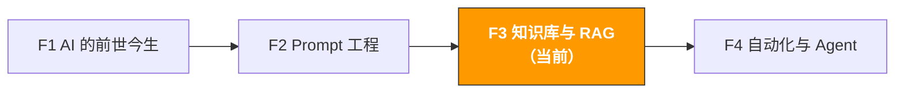

# F3. 知识库与 RAG | Knowledge Base & RAG

> **路径**: Path 0: AI 基础先行 · **模块**: F3
> **最后更新**: 2026-07-31
> **难度**: 中级
> **预计时间**: 2 小时
> **前置模块**: [F1 AI 的前世今生](f1-ai-evolution.md)、[F2 Prompt 工程](f2-prompt-engineering.md)

---




---

## 章节导航

1. [为什么 AI 不知道你的产品信息](#1-为什么-ai-不知道你的产品信息) · 2. [Embedding 原理](#2-embedding-原理让-ai-理解语义) · 3. [向量数据库](#3-向量数据库存储和检索语义) · 4. [RAG 架构](#4-rag-架构完整的工作流程) · 5. [实操概览](#5-实操概览搭建产品知识库) · 6. [RAG 优化技巧](#6-rag-优化技巧) · 7. [常见问题](#7-常见问题) · 8. [学习资源](#8-学习资源) · 9. [常见陷阱](#9-常见陷阱) · 10. [完成标志](#10-完成标志)


## 本模块你将理解

为什么 ChatGPT 不知道你的产品信息？怎么让 AI 基于你的私有数据回答问题？RAG 是解决这个问题的核心技术。

完成本模块后，你将能够：
- 理解为什么 AI 不知道你的产品、政策和内部数据
- 用通俗语言解释 Embedding（向量嵌入）的原理
- 知道向量数据库是什么、为什么需要它
- 理解 RAG 的完整架构和工作流程
- 判断什么场景该用 RAG，什么场景不需要
- 了解搭建产品知识库的基本步骤（技术实操参考 [B3 RAG 知识库](../b-developers/b3-rag-knowledge-base.md)）

> **本模块定位**：建立概念理解，不需要写代码。如果你想动手搭建 RAG 系统，完成本模块后进入 [Path B: B3 RAG 知识库](../b-developers/b3-rag-knowledge-base.md)。

---

## 1. 为什么 AI 不知道你的产品信息

### 1.1 AI 的知识来源

回忆 F1 的内容：LLM 的知识全部来自训练数据。训练数据是互联网上的公开文本 维基百科、新闻、论坛、代码库等。

**AI 知道的：**
- Amazon 平台的一般规则和政策（公开信息）
- 常见品类的一般特征（公开讨论）
- 通用的电商运营知识（博客、教程）

**AI 不知道的：**
- 你的产品具体参数和卖点
- 你的内部定价策略和利润数据
- 你的供应商信息和采购成本
- 你的历史销售数据和趋势
- 你的客服 SOP 和内部政策
- 最新的平台政策变化（训练数据有截止日期）

### 1.2 三种让 AI "知道"你的数据的方法

| 方法 | 原理 | 优点 | 缺点 | 适合场景 |
|------|------|------|------|---------|
| **直接粘贴** | 把数据放在 Prompt 里 | 最简单，零成本 | 受上下文窗口限制（128K-1M token） | 数据量小（<50 页） |
| **Fine-tuning** | 用你的数据重新训练模型 | 模型"记住"你的知识 | 成本高、更新慢、可能遗忘 | 需要改变模型风格/格式 |
| **RAG** | 实时检索相关数据，注入 Prompt | 数据实时更新、成本低、可解释 | 需要搭建检索系统 | 数据量大、需要实时更新 |

### 1.3 用跨境电商类比理解

**直接粘贴** = 你把所有资料打印出来摊在桌上，让助理看着回答问题。
- 资料少的时候没问题
- 资料多了桌子放不下（上下文窗口限制）

**Fine-tuning** = 你让助理花一个月把所有资料背下来。
- 背完之后回答很快
- 但资料更新了需要重新背（重新训练）
- 而且可能背串了（幻觉）

**RAG** = 你给助理一个文件柜和一套检索系统。每次有问题，助理先去文件柜里找到相关资料，然后基于资料回答。
- 文件柜可以随时更新
- 回答有据可查（可以追溯到具体文档）
- 文件柜可以无限大

> **结论**：对于跨境电商团队，RAG 是最实用的方案。数据量大、更新频繁、需要可追溯 这三个特点完美匹配 RAG 的优势。

---

## 2. Embedding 原理：让 AI "理解"语义

### 2.1 什么是 Embedding

Embedding（向量嵌入）是把文本转换成一组数字（向量）的技术。这组数字捕捉了文本的"语义"。

**直觉理解：**

想象你要在地图上标记不同的产品。传统方式是用关键词匹配 "蓝牙耳机"只能匹配包含"蓝牙耳机"这四个字的文档。

Embedding 的方式是把每个产品放在一个"语义空间"里：
- "蓝牙耳机"和"无线耳机"在语义空间里很近（意思相似）
- "蓝牙耳机"和"蓝牙音箱"距离中等（有关联但不同）
- "蓝牙耳机"和"厨房刀具"在语义空间里很远（完全不相关）

```
语义空间示意（简化为 2D）：

音频设备
↑
蓝牙音箱 无线耳机
蓝牙耳机
智能手表 有线耳机

← 可穿戴 配件 →

手机壳

厨房刀具（很远，不在这个区域）
```

实际的 Embedding 不是 2D 而是 768D 或 1536D（几百到几千个维度），但原理一样：语义相似的文本，向量距离近。

### 2.2 Embedding 的工作过程

```
输入文本 → Embedding 模型 → 向量（一组数字）

示例：
"这款蓝牙耳机降噪效果很好"
→ [0.12, -0.34, 0.56, 0.78, -0.23, ..., 0.45] (1536 个数字)

"这个无线耳机的主动降噪很棒"
→ [0.11, -0.32, 0.55, 0.79, -0.21, ..., 0.44] (1536 个数字)

两个向量非常接近 → 语义相似！
```

### 2.3 常用 Embedding 模型

| 模型 | 提供商 | 维度 | 价格 | 适合场景 |
|------|--------|------|------|---------|
| text-embedding-3-small | OpenAI | 1536 | $0.02/M tokens | 性价比最高，推荐首选 |
| text-embedding-3-large | OpenAI | 3072 | $0.13/M tokens | 需要更高精度时 |
| Voyage-3 | Voyage AI | 1024 | $0.06/M tokens | 代码和技术文档 |
| BGE-M3 | BAAI | 1024 | 免费（开源） | 多语言、本地部署 |
| Cohere Embed v3 | Cohere | 1024 | $0.10/M tokens | 多语言搜索 |

**跨境电商推荐：**
- 预算有限：OpenAI text-embedding-3-small（便宜且效果好）
- 多语言需求：BGE-M3（开源免费，中英日德法都支持）
- 数据隐私：BGE-M3 本地部署（数据不出服务器）

### 2.4 关键词搜索 vs 语义搜索

| 维度 | 关键词搜索 | 语义搜索（Embedding） |
|------|----------|---------------------|
| 原理 | 精确匹配关键词 | 匹配语义相似度 |
| "无线耳机" 能找到 "蓝牙耳机" 吗？ | 不能（关键词不同） | 能（语义相似） |
| "earphone noise cancel" 能找到中文文档吗？ | 不能（语言不同） | 能（跨语言语义匹配） |
| 速度 | 极快 | 快（毫秒级） |
| 适合场景 | 精确查找已知内容 | 模糊查找、跨语言查找 |

> **实际应用中，最好的方案是混合搜索**：先用关键词搜索缩小范围，再用语义搜索精确匹配。这就是 2026 年 RAG 系统的主流做法。

---

## 3. 向量数据库：存储和检索语义

<!-- claims: illustrative -->

> 本节的数字是为说明而构造的，不是实测值。


### 3.1 为什么需要向量数据库

普通数据库（MySQL、PostgreSQL）擅长精确查询："找出价格 = $25.99 的产品"。

但它们不擅长语义查询："找出和'降噪效果差'语义相似的 Review"。

向量数据库专门为存储和检索向量设计，能在毫秒内从百万条向量中找到最相似的几条。

### 3.2 主流向量数据库对比

| 数据库 | 类型 | 价格 | 适合场景 | 特点 |
|--------|------|------|---------|------|
| [Chroma](https://www.trychroma.com/) | 嵌入式 | 免费开源 | 原型开发、小规模 | Python 原生，最简单 |
| [FAISS](https://github.com/facebookresearch/faiss) | 库 | 免费开源 | 大规模、高性能 | Meta 出品，速度极快 |
| [Pinecone](https://www.pinecone.io/) | 云服务 | 免费层 + 付费 | 生产环境、免运维 | 全托管，开箱即用 |
| [Weaviate](https://weaviate.io/) | 自托管/云 | 免费开源 | 混合搜索 | 支持关键词 + 语义混合搜索 |
| [Qdrant](https://qdrant.tech/) | 自托管/云 | 免费开源 | 高性能生产环境 | Rust 编写，性能优秀 |
| [pgvector](https://github.com/pgvector/pgvector) | PostgreSQL 扩展 | 免费 | 已有 PostgreSQL 的团队 | 不需要额外数据库 |

**跨境电商推荐：**
- 刚开始尝试：Chroma（最简单，10 行代码搞定）
- 生产环境：Pinecone（免运维）或 Qdrant（自托管）
- 已有 PostgreSQL：pgvector（不需要额外基础设施）

来源：[Vector Databases 2026 Guide](https://iterathon.tech/blog/vector-databases-ai-applications-guide)、[Embeddings and Vector Databases Guide](https://tutorialq.com/ai/machine-learning/embeddings-and-vector-databases)

### 3.3 向量数据库的工作流程

```
写入阶段（一次性）：
文档 → 分块（Chunking）→ Embedding 模型 → 向量 → 存入向量数据库

查询阶段（每次提问）：
用户问题 → Embedding 模型 → 查询向量 → 向量数据库检索 → 返回最相似的文档块
```

**分块（Chunking）是关键：**

你不能把一整份 50 页的产品手册作为一个向量存储 太大了，语义会被稀释。需要把文档切成小块：

| 分块策略 | 块大小 | 适合场景 |
|---------|--------|---------|
| 按段落 | 100-300 字 | 结构化文档（FAQ、政策） |
| 按固定长度 | 500-1000 字 | 长篇文档（产品手册） |
| 按语义 | 自动检测 | 混合内容（Review、邮件） |
| 按标题层级 | 按 H1/H2/H3 切分 | Markdown/HTML 文档 |

> **分块的黄金法则**：每个块应该包含一个完整的信息单元。太小会丢失上下文，太大会引入噪音。500-1000 字通常是好的起点。

---

## 4. RAG 架构：完整的工作流程

### 4.1 RAG 的三个阶段

```
阶段 1：索引（Indexing） 一次性准备

文档收集 → 文档分块 → 生成 Embedding
↓ ↓ ↓
产品手册 500字/块 向量化
FAQ 文档
Review 数据 → 存入向量数据库
政策文件


阶段 2：检索（Retrieval） 每次提问

用户问题 → 生成查询向量 → 向量数据库检索
↓ ↓
"这个产品防水吗？" 返回 Top 5 相关文档块


阶段 3：生成（Generation） 每次提问

系统 Prompt + 检索到的文档块 + 用户问题
↓
发送给 LLM
↓
LLM 基于检索到的内容生成回答
"根据产品手册，本产品支持 IPX5 防水..."

```

### 4.2 RAG vs 直接问 AI 的效果对比

**场景：客户问"你们的蓝牙耳机支持什么蓝牙版本？"**

**直接问 AI（无 RAG）：**
```
AI："一般来说，2024-2025 年的蓝牙耳机通常支持蓝牙 5.0 或 5.3..."
→ 泛泛而谈，不是你的产品的具体信息
```

**用 RAG：**
```
RAG 检索到的文档块：
"产品型号 XB-500，蓝牙版本 5.3，支持 AAC/SBC/LDAC 编码，
连接距离 15 米，支持同时连接 2 台设备。"

AI 基于检索内容回答：
"我们的 XB-500 蓝牙耳机支持蓝牙 5.3，支持 AAC、SBC 和 LDAC
音频编码，连接距离可达 15 米，并且支持同时连接 2 台设备。"
→ 精确、具体、基于你的产品数据
```

### 4.3 RAG 在跨境电商中的应用场景

> **相关阅读**: [B3 RAG 知识库系统](../b-developers/b3-rag-knowledge-base.md) RAG 系统构建实操详见 B3 · [A4 客服与售后](../a-operators/a4-customer-service.md) RAG 在客服 FAQ 自动回答中的应用场景详见 A4。

| 场景 | 知识库内容 | 用户问题示例 | 价值 |
|------|----------|------------|------|
| **产品 FAQ 系统** | 产品手册、规格参数、使用说明 | "这个产品能用多久？""支持快充吗？" | 客服效率提升 80% |
| **内部政策查询** | 退换货政策、定价规则、审批流程 | "欧洲站的退货政策是什么？" | 新员工快速上手 |
| **合规知识库** | 各市场认证要求、法规文档 | "卖蓝牙产品到日本需要什么认证？" | 减少合规风险 |
| **竞品情报库** | 竞品 Review、Listing、价格历史 | "竞品 A 最近的差评主要是什么？" | 竞品监控自动化 |
| **运营 SOP 库** | 操作手册、最佳实践、案例库 | "新品上架的标准流程是什么？" | 团队知识沉淀 |
| **供应商信息库** | 供应商资料、报价、沟通记录 | "上次和工厂 B 谈的价格是多少？" | 采购决策支持 |

### 4.4 RAG 的 Prompt 设计

RAG 系统中，发送给 LLM 的 Prompt 通常包含三个部分：

```
系统 Prompt（固定）：
"你是一个产品客服助手。请基于以下参考资料回答用户问题。
如果参考资料中没有相关信息，请明确告知用户你不确定，
不要编造答案。回答时请标注信息来源。"

检索到的文档块（动态）：
---参考资料开始---
[文档块 1]: 产品型号 XB-500，蓝牙版本 5.3...
[文档块 2]: 防水等级 IPX5，可在雨中使用...
[文档块 3]: 续航时间：ANC 开启 30 小时，关闭 50 小时...
---参考资料结束---

用户问题（动态）：
"这个耳机能在游泳时用吗？"
```

**关键设计原则：**

| 原则 | 说明 | 为什么重要 |
|------|------|-----------|
| 明确指示基于资料回答 | "请基于以下参考资料回答" | 减少 AI 编造信息 |
| 允许说"不知道" | "如果资料中没有，请说明" | 避免强行回答导致错误 |
| 要求标注来源 | "请标注信息来源" | 方便验证和追溯 |
| 限定回答范围 | "只回答与产品相关的问题" | 防止 AI 回答无关问题 |

### 4.5 RAG 的评估指标

搭建 RAG 系统后，怎么知道它好不好？需要评估两个维度：

**检索质量：**

| 指标 | 含义 | 怎么测 |
|------|------|--------|
| 召回率（Recall） | 相关文档有没有被检索到 | 准备测试问题，检查检索结果是否包含正确文档 |
| 精确率（Precision） | 检索到的文档是否都相关 | 检查 Top-5 结果中有多少是真正相关的 |
| MRR（Mean Reciprocal Rank） | 正确文档排在第几位 | 正确文档排名越靠前越好 |

**生成质量：**

| 指标 | 含义 | 怎么测 |
|------|------|--------|
| 忠实度（Faithfulness） | 回答是否基于检索到的内容 | 检查回答中的信息是否都能在检索文档中找到 |
| 相关性（Relevancy） | 回答是否回答了用户的问题 | 人工评估回答是否切题 |
| 完整性（Completeness） | 回答是否覆盖了所有相关信息 | 检查是否遗漏了重要信息 |

**简单的评估方法：**

准备 20-30 个测试问题和标准答案，定期运行测试，追踪质量变化。

```
测试集示例：
| 问题 | 期望答案 | 期望引用的文档 |
|------|---------|--------------|
| "蓝牙版本是多少？" | "5.3" | product_spec.md |
| "能在水里用吗？" | "IPX5 防水，可防溅水但不能浸泡" | product_spec.md |
| "保修多久？" | "12 个月" | warranty_policy.md |
```

### 4.6 RAG 的成本分析

| 成本项 | 一次性 | 持续 | 说明 |
|--------|--------|------|------|
| Embedding 生成 | $0.01-0.10 | | 取决于文档量（1000 页约 $0.05） |
| 向量数据库 | $0 | $0-50/月 | Chroma 免费，Pinecone 有免费层 |
| LLM API 调用 | | $0.01-0.10/次 | 每次查询的 LLM 费用 |
| 开发时间 | 8-40 小时 | 2-4 小时/月 | 搭建 + 维护 |

**成本估算示例（小型产品知识库）：**

```
文档量：50 个产品手册 + 500 条 FAQ = 约 200 页
Embedding 成本：$0.02（一次性）
向量数据库：$0（Chroma 本地）
每月查询量：1000 次
LLM 成本：$5-10/月（T3 高速档）
总月度成本：$5-10

对比人工成本：
客服每天回答 30 个产品问题 × 5 分钟/个 = 2.5 小时/天
月度人工成本：2.5h × 22 天 × $15/h = $825

ROI：($825 - $10) / $10 = 8,150%
```

---

## 5. 实操概览：搭建产品知识库

> 本节提供概念性的步骤说明。完整的代码实操请参考 [B3 RAG 知识库](../b-developers/b3-rag-knowledge-base.md)。

### 5.1 最简 RAG 系统（10 行代码）

用 LlamaIndex + Chroma，10 行 Python 代码就能搭建一个可用的 RAG 系统：

```python
# 概念性代码（完整版见 B3 模块）
from llama_index.core import VectorStoreIndex, SimpleDirectoryReader

# 1. 读取文档（产品手册、FAQ 等）
documents = SimpleDirectoryReader("product_docs/").load_data()

# 2. 建立索引（自动分块 + Embedding + 存储）
index = VectorStoreIndex.from_documents(documents)

# 3. 创建查询引擎
query_engine = index.as_query_engine()

# 4. 提问
response = query_engine.query("这个产品的蓝牙版本是多少？")
print(response)
# → "根据产品手册，XB-500 支持蓝牙 5.3..."
```

### 5.2 搭建步骤概览

```
Step 1：收集文档（1-2 小时）
产品手册（PDF/Word）
FAQ 文档
客服常见问题和回答
产品规格参数表
内部政策文档

Step 2：文档预处理（30 分钟）
转换为统一格式（文本/Markdown）
清理格式问题（乱码、多余空行）
检查内容完整性

Step 3：搭建 RAG 系统（1-2 小时）
安装依赖（pip install llama-index chromadb）
配置 Embedding 模型和 LLM
加载文档并建立索引
测试查询效果

Step 4：优化和部署（持续）
调整分块策略
优化检索参数
添加新文档
监控回答质量
```

### 5.3 不写代码也能用的 RAG 方案

如果你不想写代码，以下工具提供了开箱即用的 RAG 功能：

| 工具 | 价格 | 特点 | 适合谁 |
|------|------|------|--------|
| ChatGPT + 文件上传 | $20/月（Plus） | 上传 PDF/文档，直接提问 | 个人使用，文档量小 |
| Claude + Projects | $20/月（Pro） | 创建项目，上传多个文档作为知识库 | 个人使用，需要长期知识库 |
| Notion AI | $10/月 | 基于 Notion 笔记的 AI 问答 | 团队已用 Notion |
| Dify | 免费开源 | 可视化搭建 RAG 应用 | 想自定义但不想写太多代码 |
| Coze | 免费 | 字节跳动出品，中文友好 | 中文场景，快速搭建 |

---

## 6. RAG 优化技巧

### 6.1 影响 RAG 质量的关键因素

| 因素 | 影响 | 优化方向 |
|------|------|---------|
| **分块策略** | 块太大 → 噪音多；块太小 → 上下文丢失 | 测试不同块大小，500-1000 字起步 |
| **Embedding 模型** | 模型质量决定语义理解准确度 | 用 OpenAI 或 BGE-M3，不要用太老的模型 |
| **检索数量（Top-K）** | 太少 → 可能漏掉关键信息；太多 → 引入噪音 | 从 Top-5 开始，根据效果调整 |
| **文档质量** | 垃圾进垃圾出 | 确保文档内容准确、格式清晰 |
| **查询改写** | 用户问题可能不够精确 | 用 LLM 改写用户问题后再检索 |

### 6.2 高级 RAG 模式（2026）

```
基础 RAG（Naive RAG）：
用户问题 → 检索 → 生成
简单但有效，适合大多数场景

高级 RAG（Advanced RAG）：
用户问题 → 查询改写 → 混合检索 → 重排序 → 生成
查询改写：用 LLM 优化用户问题
混合检索：关键词 + 语义同时检索
重排序：用 Cross-Encoder 对检索结果重新排序
适合对质量要求高的场景

模块化 RAG（Modular RAG）：
用户问题 → 路由 → 选择最佳检索策略 → 多源检索 → 融合 → 生成
路由：判断问题类型，选择不同的检索策略
多源检索：同时从多个知识库检索
融合：合并多个来源的结果
适合复杂的企业级应用
```

来源：[RAG Architecture Guide 2026](https://ztabs.co/blog/rag-architecture-guide)、[RAG Systems Production Guide 2026](https://iterathon.tech/blog/rag-systems-production-guide-2025)

---

## 7. 常见问题

### 7.1 RAG FAQ

| 问题 | 回答 |
|------|------|
| "RAG 和直接上传文件到 ChatGPT 有什么区别？" | ChatGPT 的文件上传本质上也是一种 RAG，但你无法控制分块策略、检索参数等。自建 RAG 可以完全定制。 |
| "我的数据量很小（<10 个文档），需要 RAG 吗？" | 不需要。直接上传到 ChatGPT/Claude 就够了。RAG 的价值在数据量大（50+ 文档）时才明显。 |
| "RAG 能保证 100% 准确吗？" | 不能。RAG 减少幻觉但不能消除。检索可能漏掉关键信息，LLM 也可能误解检索内容。始终需要人工审核关键回答。 |
| "多语言文档可以放在同一个知识库吗？" | 可以，但建议用支持多语言的 Embedding 模型（如 BGE-M3）。或者按语言分别建立索引。 |
| "RAG 系统需要多少钱？" | 最低成本：Chroma（免费）+ OpenAI Embedding（$0.02/M tokens）+ T3 高速档 LLM。1000 次查询约 $1-2。 |
| "数据安全怎么办？" | 用本地 Embedding 模型（BGE-M3）+ 本地 LLM（Ollama）+ 本地向量数据库（Chroma），数据完全不出服务器。 |

### 7.2 什么时候不需要 RAG

| 场景 | 为什么不需要 | 替代方案 |
|------|------------|---------|
| 数据量很小（<10 页） | 直接放进 Prompt 就够了 | ChatGPT/Claude 文件上传 |
| 不需要实时更新 | 数据固定不变 | Fine-tuning 可能更合适 |
| 只需要改变输出风格 | RAG 解决的是"知识"问题，不是"风格"问题 | Fine-tuning 或 Prompt 调整 |
| 通用知识问题 | AI 已经知道的信息不需要 RAG | 直接问 AI |

---

## 8. 学习资源

### 8.1 入门推荐

| 资源 | 来源 | 为什么推荐 |
|------|------|-----------|
| [Building RAG from Scratch](https://www.deeplearning.ai/courses/building-evaluating-advanced-rag) | DeepLearning.AI | 免费课程，从零搭建 RAG |
| [LlamaIndex 官方教程](https://docs.llamaindex.ai/en/stable/getting_started/starter_example/) | LlamaIndex | 最简单的 RAG 入门，10 行代码 |
| [RAG Architecture Guide 2026](https://ztabs.co/blog/rag-architecture-guide) | ZTabs | 2026 年最新的 RAG 架构全景 |
| [Embeddings Guide](https://tutorialq.com/ai/machine-learning/embeddings-and-vector-databases) | TutorialQ | Embedding 和向量数据库的通俗解释 |

### 8.2 进阶推荐

| 资源 | 来源 | 为什么推荐 |
|------|------|-----------|
| [B3 RAG 知识库模块](../b-developers/b3-rag-knowledge-base.md) | ecommerce-ai-skills | 本 Hub 的技术实操模块，完整代码 |
| [Vector Databases 2026 Guide](https://iterathon.tech/blog/vector-databases-ai-applications-guide) | Iterathon | 向量数据库选型和生产部署指南 |
| [Retrieval-Augmented Generation (RAG) Paper](https://arxiv.org/abs/2005.11401) | Meta AI | RAG 原始论文（2020），理解理论基础 |

## 9. 常见陷阱

### 9.1 以为 RAG 能消除幻觉

RAG 减少的是「凭空编造」，不能消除「检索到了但理解错了」和「检索不到却硬答」。真正的防线是在 Prompt 里要求标注来源，并允许模型回答「资料里没有」。

### 9.2 切块（chunking）策略照抄默认值

默认的固定长度切块会把一张规格表或一段合规条文拦腰截断，检索出来的片段自然答不对。电商场景里，按语义单元（一个 SKU、一条政策、一个 FAQ）切通常比按字数切好得多。

### 9.3 知识库只建不维护

产品参数、平台政策、运费规则都在变。RAG 系统最常见的失败不是技术问题，而是里面的资料过期了半年没人更新，结果比不用还危险。

### 9.4 用 RAG 做本该用数据库做的事

「上个月哪个 SKU 卖得最好」是一个 SQL 查询，不是一个语义检索问题。把结构化查询塞进 RAG，既慢又不准。

---

## 什么时候这套不管用

- **文档少于几十份。** RAG 的收益来自"从大量文本里找到相关几段"。只有十几份产品手册时，全文塞进上下文窗口更简单也更准——现在的模型上下文足够放下几十万字，检索这一层反而引入了新的失败点。
- **答案需要全局汇总而不是定位。** "我们所有产品里退货率最高的是哪三个"这种问题，RAG 检索出的是几个相似段落，不是全量统计。这类问题该查数据库，不该问 RAG。检索式问答擅长"在哪里说过 X"，不擅长"X 一共有多少"。
- **文档本身就是错的或过期的。** RAG 忠实地把你给它的东西找出来。知识库里躺着两年前的费率表，它就会自信地告诉客户两年前的费率。上线 RAG 之前先做一次文档盘点，比调 chunk_size 重要得多。
- **回答错了要担责任。** 客服机器人直接回复客户、合规问答直接用于申报——这些场景 RAG 的"检索不到就编"是真实风险。要么加人工复核，要么在 Prompt 里强制"检索不到就说不知道"并实测它真的会这么做（本章 §7 的客服 Prompt 就是这个用途）。

---

## 10. 完成标志

- [ ] 能解释为什么 AI 不知道你的产品信息
- [ ] 理解 Embedding 的概念（文本 → 向量 → 语义相似度）
- [ ] 知道向量数据库的作用和主流选择
- [ ] 能画出 RAG 的三阶段架构（索引 → 检索 → 生成）
- [ ] 能判断一个场景是否需要 RAG
- [ ] 了解至少一种不写代码的 RAG 方案（ChatGPT 文件上传 / Claude Projects）

完成以上所有项目后，你已经理解了让 AI 使用私有数据的核心技术。接下来进入 [F4 自动化与 Agent](f4-agent-automation.md)，学习如何让 AI 不只回答问题，还能执行任务。
