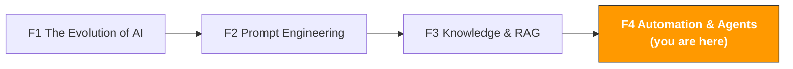

# F4. Automation & AI Agents

> **Track**: Path 0: AI Foundations · **Module**: F4
> **Last updated**: 2026-07-31
> **Level**: Intermediate
> **Time**: 2 hours
> **Prerequisites**: [F1 The Evolution of AI](f1-ai-evolution.md), [F2 Prompt Engineering](f2-prompt-engineering.md), [F3 Knowledge & RAG](f3-rag-knowledge.md)

---




---

## Chapter Navigation

1. [From prompt to agent](#1-from-prompt-to-agent-four-levels-of-ai-capability) · 2. [The three-layer automation model](#2-the-three-layer-automation-model) · 3. [MCP in detail](#3-mcp-in-detail) · 4. [Agent framework landscape](#4-agent-framework-landscape) · 5. [10 e-commerce agent scenarios](#5-10-cross-border-e-commerce-agent-scenarios) · 6. [Security & risk](#6-security--risk) · 7. [Implementation roadmap](#7-implementation-roadmap) · 8. [Learning resources](#8-learning-resources) · 9. [Common Traps](#9-common-traps) · 10. [Completion checklist](#10-completion-checklist)


## What You'll Understand

AI isn't just a Q&A tool. When it can use tools, execute tasks, and make decisions autonomously, it becomes an agent — a real digital assistant.

After this module you'll be able to:
- Understand the upgrade path from prompt to agent
- Master the three-layer automation model (script → workflow → agent)
- Understand MCP's architecture and applications in depth
- Know the main agent frameworks (LangGraph, CrewAI)
- Assess the feasibility and ROI of 10 cross-border e-commerce agent scenarios
- Know the security risks of agents and how to handle them

> **This module's scope**: building conceptual understanding and scenario judgment. To actually build agents, continue to [Path B: B4 AI Agents & Automation](../b-developers/b4-agent-workflow.md) afterward.

---

## 1. From Prompt to Agent: Four Levels of AI Capability

### 1.1 The AI capability ladder

```
Level 1: single turn (prompt → response)
You ask, the AI answers
No memory, no tools, no action
Example: ask ChatGPT "write me a listing title"
Value: information retrieval and content generation

Level 2: multi-turn (conversation)
The AI remembers earlier turns
You can iterate and refine the output
Example: work with Claude to progressively polish a market analysis
Value: collaborative content creation and analysis

Level 3: tool-augmented (tool-augmented LLM)
The AI can call external tools to get information
But a human still triggers every step
Example: AI calls a calculator for profit, a search engine for data
Value: more accurate analysis and computation

Level 4: autonomous agent (autonomous agent)
The AI plans tasks, calls tools, and acts on its own
It can handle multi-step, complex tasks
Example: AI monitors competitors, analyzes changes, writes a report, sends email
Value: true automation — freeing up people
```

### 1.2 The e-commerce analogy

| AI level | Analogy | What you do |
|----------|---------|-------------|
| Level 1, single turn | Ask a passerby a question | You ask, they answer, done |
| Level 2, multi-turn | A meeting with a consultant | You lead the discussion, they advise |
| Level 3, tool-augmented | A consultant with a laptop | You say "look up the data," they do and report back |
| Level 4, autonomous agent | You hired a full-time assistant | You say "give me a weekly competitor report," they handle everything |

### 1.3 Why 2025–2026 is the agent boom

Three conditions matured simultaneously in 2025:

| Condition | 2023 state | 2025–2026 state |
|-----------|-----------|------------------|
| **Model capability** | GPT-4 just released, limited reasoning | the T1 frontier tier handles multi-step reasoning reliably |
| **Tool protocol** | every tool needs custom integration | MCP standardizes it — plug and play |
| **Framework maturity** | LangChain early, buggy | LangGraph/CrewAI production-ready |

---

## 2. The Three-Layer Automation Model

### 2.1 The three layers

```
Layer 1: script automation
What: code that runs a fixed procedure
Traits: deterministic, reliable, but inflexible
Tools: Python scripts, cron jobs, shell scripts
Example: download the Amazon sales report daily
Fits: highly repetitive, fixed-flow tasks with no judgment
E-commerce: report downloads, data merging, format conversion

Layer 2: workflow automation
What: visual tools connecting multiple steps and services
Traits: more flexible than scripts, supports branching, still a predefined flow
Tools: Zapier, Make (Integromat), n8n, Power Automate
Example: new negative review → auto-classify → notify the team → draft a reply
Fits: cross-system flows with conditional logic, but logic can be predefined
E-commerce: order anomaly alerts, stock alerts, review monitoring

Layer 3: agent automation
What: AI plans and executes tasks, handling uncertainty
Traits: flexible, handles the unexpected, but needs supervision
Tools: LangGraph, CrewAI, AutoGPT
Example: AI analyzes market shifts, judges whether to reprice, drafts a repricing plan
Fits: needs judgment and decisions; flows aren't fully fixed; must adapt
E-commerce: smart sourcing, adaptive ad optimization, multi-market coordination
```

### 2.2 The three layers compared

| Dimension | Script | Workflow | Agent |
|-----------|--------|----------|-------|
| Flexibility | low (fixed flow) | medium (predefined branches) | high (autonomous decisions) |
| Reliability | high (deterministic) | high | medium (can err) |
| Technical bar | needs coding | low (visual) | medium–high |
| Maintenance | low | medium | high |
| Fits | simple repetition | cross-system flows | complex judgment |
| Human oversight | none | occasional | often |
| Cost | low | medium | high (API call fees) |

### 2.3 Which layer? A decision framework

```
What's your task?

Fully fixed flow, no judgment needed?
→ Layer 1: script automation
e.g., download reports, merge Excel, send email daily

Mostly fixed with a few conditional branches?
→ Layer 2: workflow automation
e.g., new review ≤ 3 stars → notify ops → draft a reply

Requires understanding content, judgment, handling uncertainty?
→ Layer 3: agent automation
e.g., analyze competitor strategy shifts, decide whether to reprice

Not sure?
Start at Layer 1 and upgrade gradually
Solve what scripts can, then workflows for the rest,
and only then consider agents
```

> **Core principle**: don't use a complex solution where a simple one works. If a script can do it, don't use an agent. An agent's value is handling tasks scripts and workflows can't.

### 2.4 The three layers working together

**Scenario: a competitor monitoring and response system**

```
Layer 1 (script):
Run a Python script on a schedule daily
Fetch competitor price, BSR, and review data via Amazon SP-API
Store in a database
Output: raw data

Layer 2 (workflow):
Detect changes (price down > 10%, new negatives > 5)
Trigger alerts (Slack/email)
Auto-generate a change summary
Output: alert + summary

Layer 3 (agent):
Receive the alert and data
Analyze why the competitor's strategy changed (promo? clearing stock? new-product pressure?)
Assess the impact on us
Generate a response plan (match price? adjust ads? increase promotion?)
Draft an execution plan
Output: analysis report + response plan (executed after human review)
```

---

## 3. MCP in Detail

> **Full tool set**: [Awesome MCP & Agent Tools](../resources/awesome-mcp-agents.md) — a complete list of e-commerce MCP servers, agent frameworks, and external awesome lists. Includes 30+ MCP servers (Shopify/Amazon/Google Ads/Meta Ads) and 7 agent frameworks.

### 3.1 MCP's core concepts

MCP (Model Context Protocol) is the open protocol Anthropic launched in late 2024, and by 2026 it's the industry standard for connecting AI to external tools. OpenAI, Google, and Microsoft all support it.

**MCP's three core components:**

```

MCP Host
The app running the AI model
e.g., Claude Desktop, Kiro, Cursor, VS Code

MCP Client
The connection manager inside the host
Handles communication with MCP servers

MCP Server
The adapter providing specific tool capabilities
e.g., a filesystem server, database server, email server

```

**An MCP server provides three kinds of capability:**

| Capability | Meaning | Example |
|------------|---------|---------|
| **Tools** | functions the AI can call | send email, query a database, read/write files |
| **Resources** | data the AI can read | file contents, database records, API responses |
| **Prompts** | predefined interaction templates | standardized analysis flows, report templates |

Sources: [MCP Protocol Documentation](https://modelcontextprotocol.io/), [MCP Guide 2026](https://robomotion.io/blog/mcp-explained-why-model-context-protocol-matters-in-2026)

### 3.2 How MCP works

```
User: "Look up today's Amazon order data for me"


MCP Host (Claude Desktop)
AI understands the intent, decides to call a tool


MCP Client
Finds the "amazon-sp-api" MCP server


MCP Server (amazon-sp-api)
Calls the Amazon SP-API for order data


Returns data to the AI


AI answers from the data:
"There are 47 orders today, total sales $1,234.56..."
```

### 3.3 Common MCP servers for cross-border e-commerce

| MCP server | Capability | Application |
|-----------|-----------|-------------|
| **filesystem** | read/write local files | analyze local Excel reports, CSV data |
| **sqlite / postgres** | database operations | query product/order databases |
| **fetch** | HTTP requests | call external APIs, fetch web data |
| **gmail / outlook** | email operations | read supplier email, send reports |
| **slack** | Slack messages | send alerts, team collaboration |
| **puppeteer** | browser automation | collect competitor data, screenshot comparisons |
| **memory** | knowledge graph | store and retrieve structured knowledge |

### 3.4 MCP vs traditional API integration

| Dimension | Traditional API integration | MCP |
|-----------|----------------------------|-----|
| Dev cost | custom code per tool | standardized protocol, plug and play |
| Maintenance | update each API integration on change | servers update independently |
| Ecosystem | fragmented | unified, community-shared servers |
| Security | each implements its own | protocol-level permission control |
| Analogy | a different charger per device | one USB-C port |

### 3.5 A2A: agents collaborating

MCP solves "AI connecting to tools." Google's 2025 **A2A (Agent-to-Agent) protocol** solves "agents collaborating with each other."

```
MCP: vertical integration (AI ↔ tools)
AI calls the filesystem
AI calls the database
AI calls an API

A2A: horizontal collaboration (agent ↔ agent)
The sourcing agent passes results to the listing agent
The listing agent passes results to the advertising agent
Multiple agents collaborate on a complex task
```

**MCP + A2A = a complete agent infrastructure**

Source: [MCP vs A2A Guide](https://learndevrel.com/blog/mcp-vs-a2a)

---

## 4. Agent Framework Landscape

### 4.1 The main frameworks compared

| Framework | Type | Fits | Technical bar | GitHub stars |
|-----------|------|------|---------------|--------------|
| [LangGraph](https://github.com/langchain-ai/langgraph) | dev framework | custom agent workflows | high (needs Python) | 10K+ |
| [CrewAI](https://github.com/crewAIInc/crewAI) | multi-agent framework | multiple agents collaborating | medium | 25K+ |
| [AutoGPT](https://github.com/Significant-Gravitas/AutoGPT) | autonomous agent | exploratory tasks | medium | 170K+ |
| [Dify](https://github.com/langgenius/dify) | low-code platform | quickly build AI apps | low | 55K+ |
| [Coze](https://www.coze.com/) | no-code platform | quickly build bots | lowest | N/A (commercial) |

### 4.2 Choosing a framework

```
Your technical level?

Can't code
Want a fast build → Coze (no-code, Chinese-friendly)
Want more control → Dify (low-code, visual)

Know basic Python
A single agent → LangGraph (most flexible)
Multiple agents collaborating → CrewAI (multi-agent orchestration)

Want a personal AI assistant
```

### 4.3 LangGraph: the most flexible framework

> **Related**: [B4 AI Agents & Workflow Automation](../b-developers/b4-agent-workflow.md) for the hands-on build

LangGraph, from the LangChain team, models agent behavior as a **state graph**.

```
LangGraph's core concepts:

State: the agent's current information and context
Node: each operation the agent performs
Edge: connections between nodes, with conditions

Example — a competitor analysis agent:

fetch data → analyze changes → judge importance

important change | not important

deep analysis | log it

generate report

send notification
```

### 4.4 CrewAI: multi-agent collaboration

CrewAI's idea is a "team" of specialized agents, each with a role.

```
CrewAI example — a sourcing team:

Agent 1: market researcher
Role: gather market data and trends
Tools: Google Trends API, Amazon data
Output: market analysis report

Agent 2: competitor analyst
Role: analyze competitors' strengths/weaknesses
Tools: review analysis, listing comparison
Output: competitor analysis report

Agent 3: financial analyst
Role: compute profit and ROI
Tools: cost calculator, FBA fee estimator
Output: profit analysis report

Agent 4: decision advisor
Role: synthesize all analyses, recommend
Input: the reports from the first 3 agents
Output: Go/No-Go recommendation + action plan

Flow: Agent 1 → Agent 2 → Agent 3 → Agent 4
```

---

## 5. 10 Cross-Border E-Commerce Agent Scenarios

> **Related**: [D2 TikTok Shop AI Guide](../d-platforms/tiktok-shop-ai-guide.md) for TikTok Shop automation

### 5.1 Overview

| # | Scenario | Automation layer | Difficulty | Expected ROI | Priority |
|---|----------|------------------|------------|--------------|----------|
| 1 | Competitor monitoring & alerts | Layer 2–3 | | high | |
| 2 | Automated review analysis | Layer 2–3 | | high | |
| 3 | Stock alerts & restock advice | Layer 1–2 | | high | |
| 4 | Multilingual support assistant | Layer 3 | | high | |
| 5 | Listing quality inspection | Layer 2–3 | | medium | |
| 6 | Automated ad optimization | Layer 3 | | high | |
| 7 | Sourcing intelligence gathering | Layer 2–3 | | medium | |
| 8 | Automated compliance checks | Layer 2–3 | | medium | |
| 9 | Supplier communication assistant | Layer 3 | | medium | |
| 10 | Full-funnel operations agent | Layer 3 | | very high | (long-term goal) |

### 5.2 Scenario detail

**Scenario 1: competitor monitoring & alerts**

```
Trigger: scheduled daily / real-time monitoring
Input: competitor ASIN list
Flow:
1. [script] fetch competitor price, BSR, review data
2. [script] compare to yesterday, detect changes
3. [workflow] change over threshold → trigger alert
4. [agent] analyze cause, generate response advice
Output: alert + analysis report + response advice
Tools: Python + Amazon SP-API + LLM
Expected: from "check manually once a week" to "real-time monitoring, auto-analysis"
```

**Scenario 2: automated review analysis**

```
Trigger: a new review appears
Input: the new review content
Flow:
1. [script] detect new reviews
2. [agent] analyze sentiment and topic
3. [agent] if negative, analyze cause and draft a reply
4. [workflow] notify ops for review
Output: review analysis + reply draft + trend report
Tools: Python + LLM + Slack/email notification
Expected: negative-review response time from 24 h to 2 h
```

**Scenario 3: stock alerts & restock advice**

```
Trigger: scheduled daily
Input: sales data, stock data, supplier lead times
Flow:
1. [script] fetch current stock and recent sales
2. [script] compute safety stock and projected stockout date
3. [workflow] stock below the safety line → alert
4. [agent] factor in seasonality and promo plans, generate restock advice
Output: stock status report + restock advice + urgency ranking
Tools: Python + pandas + LLM
Expected: stockout rate −50%, turnover +20%
```

**Scenario 4: multilingual support assistant**

```
Trigger: a customer message arrives
Input: customer message (any language)
Flow:
1. [agent] detect language, translate to Chinese (if needed)
2. [agent] retrieve relevant info from the product knowledge base (RAG)
3. [agent] draft a reply (in the target language)
4. [workflow] send to a support rep for review
Output: translation + reply draft + reference sources
Tools: LLM + RAG + support-system integration
Expected: response time −70%, language coverage from 2 to 5
```

**Scenario 5: listing quality inspection**

```
Trigger: scheduled weekly / after a listing update
Input: all live product listings
Flow:
1. [script] fetch all listing content
2. [agent] check title length, keyword coverage, bullet quality
3. [agent] compare to competitor listings, find gaps
4. [agent] generate improvement advice with priority
Output: listing quality scorecard + advice + priority
Tools: Python + LLM + Amazon SP-API
Expected: more consistent listing quality, conversion +5–10%
```

**Scenarios 6–10 in brief:**

| Scenario | Core value | Key challenge |
|----------|-----------|---------------|
| 6. Automated ad optimization | real-time bid and budget adjustment | needs care — wrong decisions cost a lot |
| 7. Sourcing intelligence | auto-discover category opportunities | many data sources, needs cross-validation |
| 8. Automated compliance | auto-check compliance before launch | regulations change often, maintain the knowledge base |
| 9. Supplier communication | auto-translate and draft supplier email | business communication needs a human touch |
| 10. Full-funnel operations agent | full automation from sourcing to after-sales | a long-term vision; today's tech isn't mature |

### 5.3 Recommended priority

```
Phase 1 (start now, 1–2 weeks):
Scenario 3: stock alerts (script-level, simplest)
Scenario 2: review analysis (manual with ChatGPT/Claude, establish the flow)
Investment: a few hours of scripting + an AI subscription

Phase 2 (1–2 months):
Scenario 1: competitor monitoring (script + workflow)
Scenario 5: listing inspection (agent-level)
Scenario 4: multilingual support (RAG + agent)
Investment: 1–2 weeks of dev + a RAG build

Phase 3 (3–6 months):
Scenario 6: ad optimization (needs careful testing)
Scenario 7: sourcing intelligence (needs multi-source integration)
Scenario 8: compliance checks (needs a maintained knowledge base)
Investment: ongoing development and tuning

Long-term (6–12 months):
Scenarios 9–10: advanced agent collaboration
Requires further maturity of the tech
```

---

## 6. Security & Risk

### 6.1 The agent risk matrix

| Risk type | Meaning | Severity | Mitigation |
|-----------|---------|----------|-----------|
| **Excess permissions** | the agent can do things it shouldn't | high | least privilege — grant only what's needed |
| **Data leakage** | the agent sends sensitive data externally | high | data classification; keep sensitive data off external APIs |
| **Wrong decisions** | the agent makes a bad business call | high | critical decisions must be human-reviewed |
| **Hallucinated action** | the agent acts on wrong information | medium | verify data sources before acting |
| **Runaway cost** | heavy API calls spike the bill | medium | set call caps and budget alerts |
| **Loops** | the agent gets stuck in an infinite loop | medium | set max steps and timeouts |

### 6.2 Security best practices

```
Principle 1: least privilege
The agent can only access the data and tools it needs
Don't give the agent admin rights
Review the agent's permissions periodically

Principle 2: human-in-the-loop
Critical actions (send email, reprice, place orders) require human confirmation
The agent proposes; humans decide
Support both "auto-execute" and "needs approval" modes

Principle 3: monitoring and auditing
Log all agent actions
Set alerts for anomalous behavior
Review decision quality periodically

Principle 4: gradual delegation
Phase 1: the agent can only read data and generate reports
Phase 2: the agent can draft content (published after human review)
Phase 3: low-risk actions can auto-execute
Phase 4: high-risk actions still need human approval

Principle 5: fail-safe
The agent stops automatically on error instead of continuing
Provide rollback (agent actions can be undone)
Have a backup plan (a manual flow when the agent is unavailable)
```

### 6.3 Data security classification

| Data level | Example | External API OK? | Recommended approach |
|------------|---------|------------------|----------------------|
| Public | competitor listings, public reviews | yes | ChatGPT/Claude API |
| Internal | sales reports, ops data | with care | enterprise API (data not used for training) |
| Sensitive | profit data, supplier prices | not advised | local model (Ollama + Llama) |
| Confidential | passwords, API keys | never | keep it out of AI; use traditional encryption |

---

## 7. Implementation Roadmap

### 7.1 From zero to agent

```
Weeks 1–2: build the foundation
Finish all of Path 0 (you're here)
Start using ChatGPT/Claude for daily operations
Build a prompt template library
Output: a personal AI habit

Weeks 3–4: script automation
Learn basic Python (if you don't know it)
Write your first automation script (report download / data merge)
Set up a scheduled job
Output: 2–3 automation scripts

Month 2: workflow automation
Choose a workflow tool (Zapier/Make/n8n)
Build your first workflow (review monitoring → notification)
Build a RAG knowledge base (product FAQ)
Output: 2–3 workflows + a knowledge base

Months 3–4: agent basics
Learn LangGraph or CrewAI
Build your first agent (a competitor analysis agent)
Configure MCP servers (filesystem, database)
Output: one working agent

Months 5–6: agent optimization
Extend agent capability (more tools, more scenarios)
Establish monitoring and auditing
Roll out to the team
Output: an agent system + team usage norms
```

### 7.2 Roadmaps by role

| Role | Focus | Suggested path |
|------|-------|----------------|
| Operator | use existing AI tools well + simple automation | Path 0 → Path A → Zapier/Make workflows |
| Technical | build agent systems | Path 0 → Path B (focus on B4) → LangGraph/CrewAI |
| Manager | understand agent limits, set strategy | Path 0 → Path C → assess the team's agent needs |

---

## 8. Learning Resources

### 8.1 Getting started

| Resource | Source | Why |
|----------|--------|-----|
| [AI Agents in LangGraph](https://www.deeplearning.ai/courses/ai-agents-in-langgraph) | DeepLearning.AI | free course, LangGraph agent intro |
| [Multi AI Agent Systems with CrewAI](https://www.deeplearning.ai/courses/multi-ai-agent-systems-with-crewai) | DeepLearning.AI | free course, multi-agent collaboration |
| [MCP official docs](https://modelcontextprotocol.io/) | Anthropic | the authoritative MCP reference |

### 8.2 Going deeper

| Resource | Source | Why |
|----------|--------|-----|
| [B4 AI Agents & Automation](../b-developers/b4-agent-workflow.md) | ecommerce-ai-skills | this hub's hands-on module |
| [Building Effective Agents](https://www.anthropic.com/research/building-effective-agents) | Anthropic | Anthropic's official agent-design guide |
| [LangGraph Documentation](https://langchain-ai.github.io/langgraph/) | LangChain | full LangGraph docs |
| [The AI Agent Landscape 2026](https://learndevrel.com/blog/openclaw-ai-agent-phenomenon) | LearnDevRel | a 2026 agent-ecosystem overview |

---

## 9. Common Traps

### 9.1 Using an Agent for the sake of using an Agent

A fixed process is simpler, cheaper, and more controllable as a Chain. An Agent earns its cost when there's genuine uncertainty — you don't know what it'll hit mid-run and the AI has to judge.

### 9.2 Granting write access from day one

Letting an Agent reprice, order, or send messages costs far more when it errs than the time it saves. Run read-only first, watch its judgment quality for a while, then open up gradually.

### 9.3 Not setting an iteration cap

Runaway loops are the most common cause of runaway cost. `recursion_limit` is mandatory, not optional.

### 9.4 Feeding raw tool output straight to the model

The tool returns 500 rows and the model only needs to know which one is anomalous. Aggregate in code first. **If code can compute it, don't pay a model to.**

---

## 10. Completion Checklist

- [ ] Understand the four levels of AI capability (conversation → multi-turn → tool-augmented → agent)
- [ ] Can distinguish the three automation layers (script → workflow → agent) and judge when to use which
- [ ] Understand MCP's architecture and role
- [ ] Know the traits and fit of at least 3 agent frameworks
- [ ] Can assess the feasibility and priority of 10 e-commerce agent scenarios
- [ ] Know agents' security risks and mitigations
- [ ] Have a clear personal/team agent implementation roadmap

---

## When this doesn't work

- **The task is one step, or the steps never vary.** "Translate this review into German" does not need an agent; one API call does it. An agent's cost comes from multi-turn reasoning and tool calls, and you only get something for that cost when what to do next genuinely depends on what came back. Fixed sequences are cheaper and more predictable in a workflow tool (see [F5](f5-rpa-automation.md)).
- **The data your tools return is unreliable.** An agent decides its next step from what a tool returned. If your inventory API lags, or a report endpoint occasionally returns empty, the agent will not notice the data is wrong — it will carry it forward, confidently, at every step. Fix the reliability of the data source before agentifying anything on top of it.
- **The action is irreversible and nobody approves it.** Automatic repricing, placing purchase orders, replying to customer complaints — one wrong judgement and the damage is done. The right shape for these is an agent that proposes and a human who confirms (the human-in-the-loop example in this chapter), not full autonomy. The test is whether a mistake can be undone, not how unlikely it is.
- **You cannot yet say what it saves.** Building and maintaining an agent costs far more than a script. If you cannot name the specific actions it replaces each week and how many minutes each used to take, you are probably paying for the architecture itself. Write those actions down first (the task triage table in [A14](../a-operators/a14-operations-agent.md)), then decide.

---

## Congratulations — you've finished Path 0!

You've built a solid AI foundation. You now understand:
- AI's essence (predict next token) and its limits
- How to communicate with AI systematically (CRISP + advanced techniques)
- How to make AI use your private data (RAG)
- How to upgrade AI from "answering questions" to "executing tasks" (agents)

**Next, choose a track by your role:**

| Who you are | Recommended track | Core goal |
|-------------|-------------------|-----------|
| Operator | [Path A: AI-Powered Operations](../a-operators/) | boost operations efficiency 3–10× with AI |
| Technical | [Path B: Building AI Systems](../b-developers/) | build AI-driven e-commerce tools and systems |
| Manager | [Path C: AI Strategy & Execution](../c-managers/) | create an actionable team AI adoption plan |
