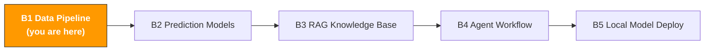

# B1. Data Collection & Processing Automation

> **Track**: Path B: Developers · **Module**: B1
> **Last updated**: 2026-07-31
> **Level**: Intermediate
> **Prerequisite**: Python basics (variables, functions, lists, dicts)
> **Time**: 1 hour a day, 1–2 weeks

[](https://colab.research.google.com/github/kangise/ecommerce-ai-skills/blob/main/notebooks/b1-data-pipeline.ipynb) Run the companion Notebook directly in Colab

---




---

## Chapter Navigation

1. [Data-Engineering Methodology](#1-data-engineering-methodology) · 2. [Core Skill](#2-core-skill-pandas-data-processing) · 3. [SP-API Data Collection](#3-sp-api-data-collection) · 4. [Browser Automation](#4-browser-automation-selenium--playwright) · 5. [Data Storage &amp; Queries](#5-data-storage--queries) · 6. [Data Visualization &amp; Reporting](#6-data-visualization--reporting) · 7. [Hands-On Project](#7-hands-on-project-build-a-complete-data-pipeline) · 8. [Learning Resources](#8-learning-resources) · 9. [Common Traps](#9-common-traps) · 10. [Completion Checklist](#10-completion-checklist)


## What You'll Build

An automated data pipeline: from Amazon reports to a cleaned analysis dataset.

After this module you'll be able to:
- Batch-read and clean various Amazon reports (Business Report, Advertising Report, FBA Report) with pandas
- Handle real-world encoding issues, inconsistent date formats, and multi-marketplace column-name differences
- Correctly compute composite metrics (ASP, CR, etc. must be recomputed from base metrics, not summed directly)
- Automatically collect order, inventory, and ad data with SP-API
- Automatically download reports not available via API from Seller Central with Playwright
- Do high-performance local queries on medium-sized data with DuckDB
- Build a complete pipeline from data collection to report generation, scheduled with cron

---

## 1. Data-Engineering Methodology

> **Related**: [A3 Advertising](../a-operators/a3-advertising.md) for ad-report analysis applications · [F4 Automation & Agents](../0-foundations/f4-agent-automation.md) for the Agent-theory basis of data-processing automation.

### 1.1 The first principle of an e-commerce data pipeline

A data pipeline is fundamentally about turning "raw data scattered everywhere" into "information you can use for decisions directly."

For cross-border e-commerce, a data pipeline has a few particularities:
- **Small volume but fast-changing**: a mid-size seller's daily data may be only a few MB, but report formats, column names, and encoding change as the Amazon back end updates
- **Fragmented sources**: sales in the Business Report, ads in the Advertising Console, inventory in the FBA Report, reviews on the front-end page
- **Metric-calculation traps**: ASP (average selling price) can't be averaged directly across rows — it must be recomputed as GMS ÷ Units; CR (conversion rate) likewise

**ETL vs ELT choice:**

| Mode | Meaning | Best scenario |
|------|---------|---------------|
| ETL | clean and transform first, then store | large volume, fixed schema, traditional data warehouse |
| ELT | store raw data first, then transform on demand | small volume but format-variable e-commerce |

For cross-border e-commerce, ELT is recommended: store the raw report first (keep the raw data), then write scripts to clean and compute on demand. Reasons:
1. Amazon report formats may change; keeping raw data makes it easy to backtrack
2. Different analysis needs require different cleaning logic on the same data
3. Small volume (usually <100MB), so storage cost is negligible

### 1.2 The Amazon data-source landscape

| Data source | How to get it | Content | Update frequency | Best for |
|-------------|---------------|---------|------------------|----------|
| Business Reports | Seller Central download / SP-API | sales, traffic, conversion, Buy Box % | daily | daily monitoring, weekly/monthly reports |
| Advertising Reports | Advertising Console / SP-API | ad spend, clicks, ACOS, keyword performance | daily | ad optimization, ROI analysis |
| Inventory Reports | Seller Central / SP-API | FBA quantity, sellable/unsellable, age | daily | stock alerts, restock decisions |
| FBA Reports | Seller Central download | logistics fees, return details, storage fees | monthly | cost analysis, return-rate monitoring |
| Brand Analytics | Seller Central (brand sellers) | search-term rank, market basket, repeat purchase | weekly | keyword strategy, competitor analysis |
| SP-API | REST API calls | orders, catalog, pricing, inventory | real-time | automated systems, real-time monitoring |
| Review data | front-end scraping / third-party tools | ratings, review text, images | irregular | product improvement, competitor analysis |

> **Key insight**: the Business Report and Advertising Report are the two most-used sources, covering 80% of daily analysis needs. SP-API fits scenarios needing real-time data or automation. Brand Analytics data is extremely valuable but only brand sellers can access it.

### 1.3 Tech-stack choices

| Tool | Use | Why choose it | Install |
|------|-----|---------------|---------|
| [pandas](https://pandas.pydata.org/) | data-processing core | for e-commerce data scale (<1GB) pandas is plenty, most mature ecosystem | `pip install pandas` |
| [openpyxl](https://openpyxl.readthedocs.io/) | Excel read/write | pandas's default engine for .xlsx | `pip install openpyxl` |
| [python-amazon-sp-api](https://github.com/saleweaver/python-amazon-sp-api) | SP-API wrapper | the most active Python SP-API library, 1k+ stars | `pip install python-amazon-sp-api` |
| [DuckDB](https://duckdb.org/) | local high-performance queries | query CSV/Parquet directly, no import needed, 10–100× faster than SQLite | `pip install duckdb` |
| [Playwright](https://playwright.dev/python/) | browser automation | more modern than Selenium, auto-wait, more stable | `pip install playwright` |
| [schedule](https://github.com/dbader/schedule) | scheduled tasks | pure Python, more readable than cron | `pip install schedule` |
| [Streamlit](https://streamlit.io/) | quick dashboards | build an interactive data dashboard in tens of lines | `pip install streamlit` |

**Why not Spark/Airflow?**

Cross-border e-commerce's data scale (usually <1GB) doesn't need distributed computing. The ops cost of Spark and Airflow far outweighs the benefit. pandas + DuckDB + cron is the best combo:
- pandas handles <100MB data effortlessly
- DuckDB handles 100MB–10GB data 10×+ faster than pandas
- cron (or the schedule library) is enough for scheduled tasks, no need for Airflow's DAG orchestration

---

## 2. Core Skill: pandas Data Processing

### 2.1 Common data issues in Amazon reports

Before writing code, understand the "pitfalls" you'll hit. These recur constantly in real business:

| Issue | Symptom | Solution |
|-------|---------|----------|
| Encoding | garbled Chinese/Japanese | US/EU reports use `utf-8-sig` (handle BOM), JP reports use `shift_jis` or `cp932` |
| Inconsistent date format | US: `01/15/2025`, DE: `15.01.2025`, JP: `2025/01/15` | use `pd.to_datetime()`'s `dayfirst` parameter, or convert uniformly |
| Numeric columns with commas | `"1,234.56"` read as a string | `df['col'].str.replace(',', '').astype(float)` |
| Currency symbols | `"$29.99"` or `"€24,99"` | `str.replace('[$€¥£]', '', regex=True)` |
| Multi-marketplace column-name differences | US: `Units Ordered`, DE: `Bestellte Einheiten` | build a column-name mapping dict |
| Ratio metrics can't be summed directly | averaging CR across rows → wrong | must recompute from base metrics: CR = Total Units ÷ Total Sessions |
| Blank and summary rows | a "Total" row at the report's end | filter out non-data rows after reading |

### 2.2 Code example: reading and cleaning an Amazon Business Report

This is the code you'll use most. A robust reader function needs to handle all the issues listed above:

> **What this chapter's code needs**: `pip install pandas numpy openpyxl duckdb matplotlib python-dotenv python-amazon-sp-api playwright`

```python
import pandas as pd
import numpy as np
from pathlib import Path

def load_business_report(filepath: str, market: str = "US") -> pd.DataFrame:
    """
    Read an Amazon Business Report CSV/Excel, handling common data issues.

    Args:
        filepath: report file path (supports .csv and .xlsx)
        market: market ID (US, DE, FR, IT, ES, UK, JP)

    Returns:
        cleaned DataFrame
    """
    path = Path(filepath)

    # 1. Choose encoding by market
    encoding_map = {
        "US": "utf-8-sig",
        "UK": "utf-8-sig",
        "DE": "utf-8-sig",
        "FR": "utf-8-sig",
        "IT": "utf-8-sig",
        "ES": "utf-8-sig",
        "JP": "cp932", # JP marketplace uses a Shift-JIS variant
    }
    encoding = encoding_map.get(market, "utf-8-sig")

    # 2. Read the file
    if path.suffix == ".csv":
        df = pd.read_csv(filepath, encoding=encoding)
    elif path.suffix in (".xlsx", ".xls"):
        df = pd.read_excel(filepath, engine="openpyxl")
    else:
        raise ValueError(f"Unsupported file format: {path.suffix}")

    # 3. Unify column names (handle multilingual column-name differences)
    column_mapping = {
        # German column-name mapping
        "Bestellte Einheiten": "Units Ordered",
        "Sitzungen": "Sessions",
        "Seitenaufrufe": "Page Views",
        # Japanese column-name mapping
        "注文された商品の売上": "Ordered Product Sales",
        "セッション": "Sessions",
        # General cleanup
        "(Child) ASIN": "ASIN",
        "Child ASIN": "ASIN",
    }
    df = df.rename(columns=column_mapping)

    # 4. Clean numeric columns (strip commas, currency symbols)
    numeric_cols = ["Units Ordered", "Ordered Product Sales",
                    "Sessions", "Page Views"]
    for col in numeric_cols:
        if col in df.columns:
            df[col] = (
                df[col]
                .astype(str)
                .str.replace(",", "", regex=False)
                .str.replace(r"[$€¥£]", "", regex=True)
                .str.strip()
            )
            df[col] = pd.to_numeric(df[col], errors="coerce").fillna(0)

    # 5. Filter invalid rows (summary rows, blank rows)
    if "ASIN" in df.columns:
        df = df[df["ASIN"].notna() & (df["ASIN"] != "")]
        df = df[~df["ASIN"].str.contains("Total|合計", na=False)]

    # 6. Add a market ID
    df["Market"] = market

    return df

# Usage example
# df_us = load_business_report("reports/us_business_report.csv", market="US")
# df_jp = load_business_report("reports/jp_business_report.csv", market="JP")
```

> **Important**: this function handles 80% of common issues. But in real business you may also hit Amazon changing report formats — add try-except and logging.

### 2.3 Code example: multi-report merging and metric calculation

Cross-border operations often need to merge reports from multiple markets and time periods. Here's a key trap: **ratio metrics can't be summed or averaged directly**.

```python
def merge_reports(report_files: dict[str, str]) -> pd.DataFrame:
    """
    Merge Business Reports from multiple markets.

    Args:
        report_files: a {market: filepath} dict
            e.g. {"US": "us_report.csv", "DE": "de_report.csv"}

    Returns:
        merged DataFrame
    """
    frames = []
    for market, filepath in report_files.items():
        df = load_business_report(filepath, market=market)
        frames.append(df)

    merged = pd.concat(frames, ignore_index=True)
    return merged

def calculate_metrics(df: pd.DataFrame, group_by: list[str]) -> pd.DataFrame:
    """
    Compute core metrics by the given dimensions.

    Key principle: ratio metrics MUST be recomputed from base metrics!
    - ASP = GMS / Units (don't average the ASP column)
    - CR = Units / Sessions (don't average the CR column)
    - Buy Box % = weighted average (weighted by Sessions)

    Args:
        df: DataFrame with base metrics
        group_by: list of grouping dimensions, e.g. ["Market", "Category"]

    Returns:
        aggregated DataFrame
    """
    # Compute row-level GMS first
    if "GMS" not in df.columns:
        if "Ordered Product Sales" in df.columns:
            df["GMS"] = df["Ordered Product Sales"]
        elif "Units Ordered" in df.columns and "Unit Price" in df.columns:
            df["GMS"] = df["Units Ordered"] * df["Unit Price"]

    # Aggregate base metrics by dimension
    agg_dict = {
        "Units Ordered": "sum",
        "GMS": "sum",
        "Sessions": "sum",
        "Page Views": "sum",
    }
    # Only aggregate columns that exist
    agg_dict = {k: v for k, v in agg_dict.items() if k in df.columns}

    summary = df.groupby(group_by).agg(agg_dict).reset_index()

    # Recompute ratio metrics from base metrics
    if "GMS" in summary.columns and "Units Ordered" in summary.columns:
        summary["ASP"] = np.where(
            summary["Units Ordered"] > 0,
            summary["GMS"] / summary["Units Ordered"],
            0
        )

    if "Units Ordered" in summary.columns and "Sessions" in summary.columns:
        summary["CR"] = np.where(
            summary["Sessions"] > 0,
            summary["Units Ordered"] / summary["Sessions"],
            0
        )

    return summary.round(2)

# Usage example
# reports = {"US": "us_report.csv", "DE": "de_report.csv", "JP": "jp_report.csv"}
# merged = merge_reports(reports)
#
# # Summarize by market
# by_market = calculate_metrics(merged, group_by=["Market"])
#
# # Summarize by market + category
# by_market_cat = calculate_metrics(merged, group_by=["Market", "Category"])
```

> **Why can't ASP be averaged directly?** Say product A sells at $10 for 100 units and product B at $100 for 1 unit. A direct average ASP = ($10 + $100) / 2 = $55. But the true ASP = ($10×100 + $100×1) / 101 = $10.89 — off by 5×. This is the most common mistake in e-commerce data analysis.

### 2.4 Code example: automated weekly-report generation

Chain the above together to generate a complete HTML weekly report:

```python
from datetime import datetime

def generate_weekly_report(
    report_files: dict[str, str],
    output_path: str = "weekly_report.html"
) -> str:
    """
    Generate an HTML weekly report from raw reports.

    Full pipeline: read → merge → clean → compute → output
    """
    # 1. Read and merge
    merged = merge_reports(report_files)

    # 2. Summarize by market
    market_summary = calculate_metrics(merged, group_by=["Market"])

    # 3. Summarize by category (if a Category column exists)
    category_summary = None
    if "Category" in merged.columns:
        category_summary = calculate_metrics(
            merged, group_by=["Category"]
        ).sort_values("GMS", ascending=False)

    # 4. Compute overall metrics
    total_gms = merged["GMS"].sum() if "GMS" in merged.columns else 0
    total_units = merged["Units Ordered"].sum()
    overall_asp = total_gms / total_units if total_units > 0 else 0

    # 5. Generate HTML
    report_date = datetime.now().strftime("%Y-%m-%d")
    html = f"""<!DOCTYPE html>
<html lang="en">
<head>
<meta charset="UTF-8">
<title>Weekly Report {report_date}</title>
<style>
body {{ font-family: -apple-system, sans-serif; max-width: 900px; margin: 0 auto; padding: 20px; }}
table {{ border-collapse: collapse; width: 100%; margin: 16px 0; }}
th, td {{ border: 1px solid #ddd; padding: 8px 12px; text-align: right; }}
th {{ background: #f5f5f5; text-align: left; }}
.metric {{ font-size: 24px; font-weight: bold; color: #1a73e8; }}
.card {{ display: inline-block; padding: 16px 24px; margin: 8px; border: 1px solid #e0e0e0; border-radius: 8px; }}
</style>
</head>
<body>
<h1>Weekly Report</h1>
<p>Generated: {report_date}</p>

<div>
<div class="card">
<div>Total GMS</div>
<div class="metric">${total_gms:,.2f}</div>
</div>
<div class="card">
<div>Total Units</div>
<div class="metric">{total_units:,}</div>
</div>
<div class="card">
<div>ASP</div>
<div class="metric">${overall_asp:.2f}</div>
</div>
</div>

<h2>By Market</h2>
{market_summary.to_html(index=False)}
"""
    if category_summary is not None:
        html += f"""
<h2>By Category</h2>
{category_summary.to_html(index=False)}
"""
    html += """
</body>
</html>"""

    with open(output_path, "w", encoding="utf-8") as f:
        f.write(html)

    print(f"Weekly report generated: {output_path}")
    return output_path

# Usage example
# generate_weekly_report(
# report_files={"US": "us_report.csv", "DE": "de_report.csv"},
# output_path="output/weekly_report_2025_01_20.html"
# )
```

> **Why HTML instead of Excel?** An HTML report opens directly in a browser, shares via email, and embeds into internal systems. No software to install. And HTML supports richer styling and interactivity (like Chart.js charts).

---

## 3. SP-API Data Collection

### 3.1 SP-API intro

Amazon's Selling Partner API (SP-API) is the official channel for real-time data. Compared to manual report downloads, SP-API's advantages:
- **Automation**: scripts call on a schedule, no manual work
- **Real-time**: order data is near real-time, inventory data updates hourly
- **Structured**: returns JSON, ready to use

**Prep (one-time setup):**

1. Register a developer account in [Seller Central](https://sellercentral.amazon.com/)
2. Create an SP-API app, get `client_id` and `client_secret`
3. Get a `refresh_token` (via the OAuth flow)
4. Install the Python library: `pip install python-amazon-sp-api`

**Credential management (important! don't hardcode):**

```python
# config.json — don't commit to Git! Add to .gitignore
{
"refresh_token": "your_refresh_token",
"lwa_app_id": "your_client_id",
"lwa_client_secret": "your_client_secret",
"aws_access_key": "your_aws_key",
"aws_secret_key": "your_aws_secret",
"role_arn": "your_role_arn"
}
```

```python
# Or use environment variables (recommended)
import os
from dotenv import load_dotenv

load_dotenv() # load from the .env file

credentials = {
"refresh_token": os.getenv("SP_API_REFRESH_TOKEN"),
"lwa_app_id": os.getenv("SP_API_CLIENT_ID"),
"lwa_client_secret": os.getenv("SP_API_CLIENT_SECRET"),
}
```

> **Security reminder**: leaked SP-API credentials can lead to your store's data being stolen. Always use environment variables or an encrypted config file, and never commit credentials to Git.

### 3.2 Code example: fetching order data

```python
from sp_api.api import Orders
from sp_api.base import Marketplaces
from datetime import datetime, timedelta
import pandas as pd

def fetch_orders(
    credentials: dict,
    marketplace: Marketplaces = Marketplaces.US,
    days_back: int = 7
) -> pd.DataFrame:
    """
    Fetch order data for the last N days.

    Args:
        credentials: SP-API credentials dict
        marketplace: target market
        days_back: days to look back

    Returns:
        orders DataFrame
    """
    orders_api = Orders(credentials=credentials, marketplace=marketplace)

    created_after = (
        datetime.utcnow() - timedelta(days=days_back)
    ).isoformat()

    all_orders = []
    next_token = None

    while True:
        if next_token:
            response = orders_api.get_orders(
                NextToken=next_token
            )
        else:
            response = orders_api.get_orders(
                CreatedAfter=created_after,
                OrderStatuses=["Shipped", "Unshipped"],
                MaxResultsPerPage=100
            )

        orders = response.payload.get("Orders", [])
        all_orders.extend(orders)

        next_token = response.payload.get("NextToken")
        if not next_token:
            break

    # Convert to DataFrame
    if not all_orders:
        return pd.DataFrame()

    df = pd.json_normalize(all_orders)

    # Clean key fields
    if "OrderTotal.Amount" in df.columns:
        df["OrderTotal.Amount"] = pd.to_numeric(
            df["OrderTotal.Amount"], errors="coerce"
        )

    if "PurchaseDate" in df.columns:
        df["PurchaseDate"] = pd.to_datetime(df["PurchaseDate"])

    return df

# Usage example
# from sp_api.base import Marketplaces
# orders = fetch_orders(credentials, Marketplaces.US, days_back=30)
# print(f"Fetched {len(orders)} orders")
```

Reference docs: [SP-API Orders API](https://developer-docs.amazon.com/sp-api/docs/orders-api-v0-reference) | [python-amazon-sp-api docs](https://python-amazon-sp-api.readthedocs.io/)

### 3.3 Code example: fetching inventory data

Inventory monitoring is the lifeline of cross-border e-commerce. Stockout = lost rank = lost money.

```python
from sp_api.api import Inventories
from sp_api.base import Marketplaces
import pandas as pd

def fetch_inventory(
    credentials: dict,
    marketplace: Marketplaces = Marketplaces.US,
    granularity: str = "Marketplace"
) -> pd.DataFrame:
    """
    Fetch FBA inventory summary data.

    Args:
        credentials: SP-API credentials
        marketplace: target market
        granularity: granularity ("Marketplace" or "Country")

    Returns:
        inventory DataFrame with sellable/unsellable quantities, etc.
    """
    inv_api = Inventories(
        credentials=credentials, marketplace=marketplace
    )

    all_items = []
    next_token = None

    while True:
        kwargs = {
            "granularityType": granularity,
            "granularityId": marketplace.marketplace_id,
            "marketplaceIds": [marketplace.marketplace_id],
        }
        if next_token:
            kwargs["nextToken"] = next_token

        response = inv_api.get_inventory_summary_marketplace(**kwargs)

        summaries = response.payload.get("inventorySummaries", [])
        all_items.extend(summaries)

        next_token = response.payload.get("nextToken")
        if not next_token:
            break

    if not all_items:
        return pd.DataFrame()

    df = pd.json_normalize(all_items)

    # Add an inventory-health flag
    if "totalQuantity" in df.columns:
        df["stock_status"] = df["totalQuantity"].apply(
            lambda x: "out of stock" if x == 0
            else "low stock" if x < 50
            else "normal"
        )

    return df

# Usage example
# inventory = fetch_inventory(credentials, Marketplaces.US)
# low_stock = inventory[inventory["stock_status"] != "normal"]
# print(f"SKUs needing attention: {len(low_stock)}")
```

### 3.4 Code example: fetching an advertising report

Ad data is the basis for optimizing ACOS. SP-API's ad reports are asynchronous: request the report first, wait for it to be generated, then download.

```python
from sp_api.api import Reports
from sp_api.base import Marketplaces
import time
import json
import gzip
import pandas as pd

def request_advertising_report(
    credentials: dict,
    marketplace: Marketplaces = Marketplaces.US,
    report_type: str = "GET_FLAT_FILE_ALL_ORDERS_DATA_BY_ORDER_DATE_GENERAL",
    days_back: int = 7
) -> pd.DataFrame:
    """
    Request and download an SP-API report (async flow).

    SP-API report flow:
    1. Create the report request → get a reportId
    2. Poll the report status → wait for DONE
    3. Get the report document → download the content

    Args:
        credentials: SP-API credentials
        marketplace: target market
        report_type: report type (see SP-API docs)
        days_back: days to look back
    """
    reports_api = Reports(
        credentials=credentials, marketplace=marketplace
    )

    from datetime import datetime, timedelta
    start_date = (
        datetime.utcnow() - timedelta(days=days_back)
    ).strftime("%Y-%m-%dT00:00:00Z")
    end_date = datetime.utcnow().strftime("%Y-%m-%dT23:59:59Z")

    # Step 1: create the report request
    create_response = reports_api.create_report(
        reportType=report_type,
        dataStartTime=start_date,
        dataEndTime=end_date,
        marketplaceIds=[marketplace.marketplace_id]
    )
    report_id = create_response.payload["reportId"]
    print(f"Report request created: {report_id}")

    # Step 2: poll status (wait up to 5 minutes)
    max_wait = 300 # seconds
    elapsed = 0
    poll_interval = 15

    while elapsed < max_wait:
        status_response = reports_api.get_report(report_id)
        status = status_response.payload["processingStatus"]

        if status == "DONE":
            doc_id = status_response.payload["reportDocumentId"]
            print(f"Report generation done: {doc_id}")
            break
        elif status in ("CANCELLED", "FATAL"):
            raise RuntimeError(f"Report generation failed: {status}")

        print(f"Waiting... ({elapsed}s, status: {status})")
        time.sleep(poll_interval)
        elapsed += poll_interval
    else:
        raise TimeoutError("Report generation timed out (5 minutes)")

    # Step 3: download the report document
    doc_response = reports_api.get_report_document(
        doc_id, download=True
    )

    # Parse the content (usually TSV format)
    content = doc_response.payload.get("document", "")
    if isinstance(content, bytes):
        content = content.decode("utf-8")

    from io import StringIO
    df = pd.read_csv(StringIO(content), sep="\t")

    print(f"Fetched {len(df)} rows")
    return df

# Usage example
# ad_report = request_advertising_report(
# credentials, Marketplaces.US,
# report_type="GET_FLAT_FILE_ALL_ORDERS_DATA_BY_ORDER_DATE_GENERAL",
# days_back=30
# )
```

> **Common report types**:
> - `GET_FLAT_FILE_ALL_ORDERS_DATA_BY_ORDER_DATE_GENERAL` — orders report
> - `GET_FBA_MYI_UNSUPPRESSED_INVENTORY_DATA` — FBA inventory report
> - `GET_MERCHANT_LISTINGS_ALL_DATA` — listings report
>
> Full list: [SP-API Report Type Values](https://developer-docs.amazon.com/sp-api/docs/report-type-values)

### 3.5 Code example: a scheduled data-collection script

Chain the collection logic together with the `schedule` library:

```python
import schedule
import time
import logging
from datetime import datetime
from pathlib import Path

# Configure logging
logging.basicConfig(
    level=logging.INFO,
    format="%(asctime)s [%(levelname)s] %(message)s",
    handlers=[
        logging.FileHandler("pipeline.log"),
        logging.StreamHandler()
    ]
)
logger = logging.getLogger(__name__)

def daily_data_collection():
    """Daily data-collection task"""
    today = datetime.now().strftime("%Y%m%d")
    output_dir = Path(f"data/raw/{today}")
    output_dir.mkdir(parents=True, exist_ok=True)

    logger.info(f"Starting daily data collection: {today}")

    try:
        # 1. Fetch order data
        orders = fetch_orders(credentials, days_back=1)
        orders.to_csv(output_dir / "orders.csv", index=False)
        logger.info(f"Order data: {len(orders)} rows")

        # 2. Fetch inventory data
        inventory = fetch_inventory(credentials)
        inventory.to_csv(output_dir / "inventory.csv", index=False)
        logger.info(f"Inventory data: {len(inventory)} rows")

        # 3. Check low-stock alerts
        low_stock = inventory[
            inventory.get("stock_status", "") != "normal"
        ] if "stock_status" in inventory.columns else pd.DataFrame()

        if len(low_stock) > 0:
            logger.warning(f"{len(low_stock)} SKUs have abnormal stock!")
            # You can add email/Slack notifications here

        logger.info(f"Daily collection done: {output_dir}")

    except Exception as e:
        logger.error(f"Collection failed: {e}", exc_info=True)

def weekly_report_generation():
    """Weekly report-generation task"""
    logger.info("Starting weekly report...")
    try:
        # Merge this week's daily data
        # ... call generate_weekly_report()
        logger.info("Weekly report done")
    except Exception as e:
        logger.error(f"Weekly report failed: {e}", exc_info=True)

# Set scheduled tasks
schedule.every().day.at("08:00").do(daily_data_collection)
schedule.every().monday.at("09:00").do(weekly_report_generation)

if __name__ == "__main__":
    logger.info("Data pipeline started")
    logger.info(f"Scheduled: daily 08:00 collection, Monday 09:00 weekly report")

    # Run once at startup
    daily_data_collection()

    while True:
        schedule.run_pending()
        time.sleep(60)
```

> **Production advice**: the `schedule` library fits development and small-scale use. For production, prefer system-level cron (macOS/Linux) or Windows Task Scheduler — more stable and doesn't depend on a Python process running continuously.
>
> ```bash
> # macOS/Linux cron example (run at 8 AM daily)
> # Edit crontab: crontab -e
> 0 8 * * * /usr/bin/python3 /path/to/daily_collection.py >> /path/to/cron.log 2>&1
> ```

---

## 4. Browser Automation (Selenium / Playwright)

### 4.1 When you need browser automation

SP-API covers most data needs, but some data can only be downloaded from Seller Central web pages:

| Data | Available via SP-API? | Needs browser automation? |
|------|----------------------|---------------------------|
| Order data | yes | no |
| Inventory data | yes | no |
| Business Report | partial | full version needs download |
| Brand Analytics | no | must log in to download |
| QuickSight reports | no | must log in to download |
| Detailed ad reports | yes (Advertising API) | no |
| A+ Content data | no | yes |

### 4.2 Playwright vs Selenium comparison

| Dimension | Playwright | Selenium |
|-----------|-----------|----------|
| Install | `pip install playwright && playwright install` | `pip install selenium webdriver-manager` |
| Auto-wait | built-in smart waiting | needs manual `WebDriverWait` |
| Browser support | Chromium, Firefox, WebKit | Chrome, Firefox, Edge, Safari |
| Speed | faster (communicates directly via CDP) | slower (via the WebDriver protocol) |
| Debugging | `PWDEBUG=1` for visual debugging | needs extra config |
| Community | newer but growing fast | mature, lots of docs and tutorials |
| Recommendation | first choice for new projects | keep using for existing projects |

**Conclusion**: use Playwright for new projects; no need to migrate existing Selenium code.

### 4.3 Code example: auto-download a Business Report with Playwright

```python
from playwright.sync_api import sync_playwright
from pathlib import Path
import time

def download_business_report(
    email: str,
    password: str,
    marketplace_url: str = "https://sellercentral.amazon.com",
    download_dir: str = "downloads",
    otp_callback=None
) -> str:
    """
    Auto-log in to Seller Central and download the Business Report.

    Args:
        email: Seller Central login email
        password: login password
        marketplace_url: Seller Central URL
        download_dir: download directory
        otp_callback: OTP-code callback function (for 2FA)

    Returns:
        the downloaded file's path

    Note:
    - Amazon has anti-bot mechanisms; frequent logins may trigger verification
    - Prefer headful mode (non-headless) to reduce detection probability
    - 2FA needs manual input or handling via the OTP callback
    """
    download_path = Path(download_dir).resolve()
    download_path.mkdir(parents=True, exist_ok=True)

    with sync_playwright() as p:
        # Use headful mode (visible browser window)
        browser = p.chromium.launch(
            headless=False, # set True to run headless, but easier to detect
            slow_mo=500 # 500ms between steps, to mimic human operation
        )

        context = browser.new_context(
            accept_downloads=True,
            viewport={"width": 1280, "height": 800}
        )
        page = context.new_page()

        try:
            # 1. Navigate to the login page
            page.goto(marketplace_url)
            page.wait_for_load_state("networkidle")

            # 2. Log in
            page.fill("#ap_email", email)
            page.click("#continue")
            page.fill("#ap_password", password)
            page.click("#signInSubmit")

            # 3. Handle 2FA (if needed)
            if page.locator("#auth-mfa-otpcode").is_visible(timeout=5000):
                if otp_callback:
                    otp = otp_callback()
                else:
                    otp = input("Enter the 2FA code: ")
                page.fill("#auth-mfa-otpcode", otp)
                page.click("#auth-signin-button")

            page.wait_for_load_state("networkidle")

            # 4. Navigate to the Business Report page
            report_url = (
                f"{marketplace_url}/business-reports"
                "/ref=xx_sitemetric_dnav_xx"
            )
            page.goto(report_url)
            page.wait_for_load_state("networkidle")

            # 5. Click the download button
            with page.expect_download() as download_info:
                # Select "Detail Page Sales and Traffic"
                page.click("text=Download")

            download = download_info.value
            dest = str(download_path / download.suggested_filename)
            download.save_as(dest)

            print(f"Report downloaded: {dest}")
            return dest

        finally:
            browser.close()

# Usage example
# filepath = download_business_report(
# email="your_email@example.com",
# password="your_password",
# download_dir="data/raw/business_reports"
# )
```

> **Important reminders**:
> 1. Browser automation logging in to Seller Central may violate Amazon's ToS — use with caution
> 2. Frequent automated logins may trigger account-security verification
> 3. Prefer SP-API for data; use browser automation only as a last resort
> 4. Don't hardcode the password; use environment variables or a secrets-management tool

---

## 5. Data Storage & Queries

### 5.1 File storage vs database

| Option | Data volume | Query speed | Best scenario | Learning cost |
|--------|-------------|-------------|---------------|---------------|
| CSV/Excel | <100MB | slow (full load) | small-scale, ad-hoc analysis | zero |
| Parquet | <1GB | fast (columnar storage) | medium-scale, repeated queries | low |
| DuckDB | 100MB–10GB | very fast (OLAP engine) | medium-scale, complex queries | low |
| SQLite | <1GB | medium | scenarios needing transactions | low |
| PostgreSQL | >1GB | fast | large-scale, multi-user | medium |

**Recommended path**:
- Starting out: CSV/Excel (you're already using it)
- Data grows to 50MB+: switch to Parquet format (noticeably faster reads and writes, and much smaller on disk)
- Need complex queries (JOIN, window functions): bring in DuckDB
- Multi-person collaboration or a web app: PostgreSQL

### 5.2 DuckDB quick start

DuckDB is the most talked-about embedded analytical database in recent years. Its killer feature: **query CSV/Parquet files directly, no import needed**.

```python
import duckdb

# Query a CSV file directly — no need to read with pandas first!
result = duckdb.sql("""
SELECT
Market,
COUNT(*) as order_count,
SUM("Units Ordered") as total_units,
SUM("Ordered Product Sales") as total_gms,
SUM("Ordered Product Sales") / NULLIF(SUM("Units Ordered"), 0) as asp
FROM read_csv_auto('data/raw/20250120/orders.csv')
GROUP BY Market
ORDER BY total_gms DESC
""")

print(result.fetchdf()) # returns a pandas DataFrame
```

**DuckDB's advantage scenarios:**

```python
# Scenario 1: query across multiple CSV files (wildcards)
# One line of SQL queries orders.csv in all date folders under data/raw/
result = duckdb.sql("""
SELECT
*,
filename as source_file
FROM read_csv_auto('data/raw/*/orders.csv', filename=true)
WHERE "Units Ordered" > 10
ORDER BY "Ordered Product Sales" DESC
LIMIT 100
""")

# Scenario 2: window functions — compute each ASIN's sales rank
result = duckdb.sql("""
SELECT
ASIN,
Market,
"Units Ordered",
RANK() OVER (
PARTITION BY Market
ORDER BY "Units Ordered" DESC
) as rank_in_market
FROM read_csv_auto('data/raw/20250120/orders.csv')
""")

# Scenario 3: export query results directly to Parquet (10× faster than CSV)
duckdb.sql("""
COPY (
SELECT * FROM read_csv_auto('data/raw/*/orders.csv')
) TO 'data/processed/all_orders.parquet' (FORMAT PARQUET)
""")

# Scenario 4: mix with a pandas DataFrame
import pandas as pd

df_inventory = pd.read_csv("data/raw/inventory.csv")

# DuckDB can query a pandas DataFrame directly!
result = duckdb.sql("""
SELECT
o.ASIN,
o."Units Ordered",
i.totalQuantity as current_stock,
i.totalQuantity / NULLIF(o."Units Ordered", 0) as days_of_stock
FROM read_csv_auto('data/raw/20250120/orders.csv') o
JOIN df_inventory i ON o.ASIN = i.asin
WHERE i.totalQuantity < 100
ORDER BY days_of_stock ASC
""")
print("ASINs with under 30 days of stock:")
print(result.fetchdf())
```

> **DuckDB vs pandas performance**: for CSV files of 100MB+, DuckDB's query speed is usually 10–100× pandas. Why: DuckDB uses columnar storage and vectorized execution, while pandas has to load the whole file into memory.
>
> Reference: [DuckDB official docs](https://duckdb.org/) | [DuckDB vs pandas benchmark](https://duckdb.org/2021/05/14/sql-on-pandas.html)

---

## 6. Data Visualization & Reporting

### 6.1 matplotlib/seaborn basic charts

For quick data exploration and analysis, matplotlib and seaborn are the most direct choice:

```python
import matplotlib.pyplot as plt
import matplotlib
import pandas as pd

# Set a CJK font (macOS)
matplotlib.rcParams["font.sans-serif"] = ["PingFang SC", "Heiti TC", "Arial"]
matplotlib.rcParams["axes.unicode_minus"] = False

def plot_market_comparison(df: pd.DataFrame, metric: str = "GMS"):
    """
    Plot a multi-market metric-comparison bar chart.

    Args:
        df: DataFrame with a Market column and the metric column
        metric: the metric name to compare
    """
    fig, ax = plt.subplots(figsize=(10, 6))

    colors = {"US": "#FF9900", "DE": "#003399", "JP": "#BC002D"}

    bars = ax.bar(
        df["Market"],
        df[metric],
        color=[colors.get(m, "#666") for m in df["Market"]]
    )

    # Show the value above each bar
    for bar in bars:
        height = bar.get_height()
        ax.text(
            bar.get_x() + bar.get_width() / 2., height,
            f"${height:,.0f}" if metric == "GMS" else f"{height:,.0f}",
            ha="center", va="bottom", fontweight="bold"
        )

    ax.set_title(f"{metric} by Market", fontsize=14, fontweight="bold")
    ax.set_ylabel(metric)
    ax.spines["top"].set_visible(False)
    ax.spines["right"].set_visible(False)

    plt.tight_layout()
    plt.savefig(f"output/{metric}_by_market.png", dpi=150)
    plt.show()

# Usage example
# market_data = calculate_metrics(merged, group_by=["Market"])
# plot_market_comparison(market_data, "GMS")
# plot_market_comparison(market_data, "Units Ordered")
```

### 6.2 Streamlit quick dashboard

Streamlit can build an interactive data dashboard in tens of lines. Great for internal teams:

```python
# dashboard.py — run: streamlit run dashboard.py
import streamlit as st
import pandas as pd
import duckdb

st.set_page_config(page_title="E-Commerce Dashboard", layout="wide")
st.title("E-Commerce Dashboard")

# Sidebar: file upload
uploaded_file = st.sidebar.file_uploader(
    "Upload a Business Report", type=["csv", "xlsx"]
)

if uploaded_file:
    # Read the data
    if uploaded_file.name.endswith(".csv"):
        df = pd.read_csv(uploaded_file, encoding="utf-8-sig")
    else:
        df = pd.read_excel(uploaded_file, engine="openpyxl")

    st.sidebar.success(f"Loaded {len(df)} rows")

    # Core-metric cards
    col1, col2, col3, col4 = st.columns(4)

    total_units = df["Units Ordered"].sum() if "Units Ordered" in df.columns else 0
    total_gms = df["GMS"].sum() if "GMS" in df.columns else 0
    asp = total_gms / total_units if total_units > 0 else 0

    col1.metric("Total Units", f"{total_units:,}")
    col2.metric("Total GMS", f"${total_gms:,.2f}")
    col3.metric("ASP", f"${asp:.2f}")
    col4.metric("SKU Count", f"{df['ASIN'].nunique() if 'ASIN' in df.columns else 0}")

    # Filter by dimension
    if "Market" in df.columns:
        selected_market = st.sidebar.multiselect(
            "Select markets", df["Market"].unique(), default=df["Market"].unique()
        )
        df = df[df["Market"].isin(selected_market)]

    # Data table
    st.subheader("Data detail")
    st.dataframe(df, use_container_width=True)

    # DuckDB custom query
    st.subheader("Custom SQL query")
    query = st.text_area(
        "Enter SQL (table name is df)",
        value='SELECT Market, SUM("Units Ordered") as units FROM df GROUP BY Market'
    )
    if st.button("Run query"):
        try:
            result = duckdb.sql(query).fetchdf()
            st.dataframe(result)
        except Exception as e:
            st.error(f"Query error: {e}")

else:
    st.info("Please upload a Business Report file on the left")
```

> **Streamlit's advantages**: zero front-end code, auto-refresh, built-in chart components, one-click deploy to [Streamlit Cloud](https://streamlit.io/cloud) (free). Great for internal team dashboards.

### 6.3 HTML report generation (self-contained, shareable directly)

For reports shared via email or IM, self-contained HTML is the best format. Load Chart.js from a CDN, no build step needed:

```python
def generate_html_dashboard(
    df: pd.DataFrame,
    title: str = "Business Report",
    output_path: str = "report.html"
):
    """
    Generate a self-contained HTML report with Chart.js interactive charts.
    Open directly in a browser, no dependencies needed.
    """
    # Prepare chart data
    if "Market" in df.columns and "GMS" in df.columns:
        market_data = df.groupby("Market")["GMS"].sum().reset_index()
        labels = market_data["Market"].tolist()
        values = market_data["GMS"].tolist()
    else:
        labels, values = [], []

    import json

    html = f"""<!DOCTYPE html>
<html lang="en">
<head>
<meta charset="UTF-8">
<title>{title}</title>
<script src="https://cdn.jsdelivr.net/npm/chart.js@4.4.0"></script>
<style>
* {{ margin: 0; padding: 0; box-sizing: border-box; }}
body {{ font-family: -apple-system, BlinkMacSystemFont, sans-serif;
max-width: 1200px; margin: 0 auto; padding: 24px;
background: #f8f9fa; color: #333; }}
h1 {{ margin-bottom: 24px; }}
.cards {{ display: flex; gap: 16px; margin-bottom: 24px; }}
.card {{ flex: 1; background: white; padding: 20px;
border-radius: 12px; box-shadow: 0 1px 3px rgba(0,0,0,0.1); }}
.card-value {{ font-size: 28px; font-weight: 700; color: #1a73e8; }}
.card-label {{ font-size: 14px; color: #666; margin-top: 4px; }}
.chart-container {{ background: white; padding: 24px;
border-radius: 12px; box-shadow: 0 1px 3px rgba(0,0,0,0.1);
margin-bottom: 24px; }}
canvas {{ max-height: 400px; }}
</style>
</head>
<body>
<h1>{title}</h1>

<div class="cards">
<div class="card">
<div class="card-value">{df["GMS"].sum() if "GMS" in df.columns else 0:,.0f}</div>
<div class="card-label">Total GMS ($)</div>
</div>
<div class="card">
<div class="card-value">{df["Units Ordered"].sum() if "Units Ordered" in df.columns else 0:,}</div>
<div class="card-label">Total Units</div>
</div>
</div>

<div class="chart-container">
<canvas id="marketChart"></canvas>
</div>

<script>
new Chart(document.getElementById('marketChart'), {{
type: 'bar',
data: {{
labels: {json.dumps(labels)},
datasets: [{{
label: 'GMS ($)',
data: {json.dumps(values)},
backgroundColor: ['#FF9900', '#003399', '#BC002D', '#009639', '#0055A4']
}}]
}},
options: {{
responsive: true,
plugins: {{ legend: {{ display: false }} }}
}}
}});
</script>
</body>
</html>"""

    with open(output_path, "w", encoding="utf-8") as f:
        f.write(html)

    print(f"HTML report generated: {output_path}")
    return output_path
```

> **Why self-contained HTML?** One .html file is the complete report, sent directly via email, Slack, or WeChat. The recipient double-clicks to view, no software to install. Chart.js loads from a CDN, so the file itself is only a few KB.
---
---

## 7. Hands-On Project: Build a Complete Data Pipeline

### 7.1 Project architecture

Integrate all the skills above into one complete project:

```
data-pipeline/
config.json # config (API credential paths, report dir)
.env # environment variables (API keys, not committed to Git)
.gitignore # ignore .env, data/raw/, *.log
requirements.txt # Python dependencies

extract/ # data-collection layer
__init__.py
sp_api_client.py # SP-API data collection (orders, inventory)
report_downloader.py # browser automation report downloads
file_watcher.py # watch a folder, auto-process new reports

transform/ # data-cleaning and transformation layer
__init__.py
cleaners.py # general cleaning functions (encoding, numeric, date)
business_report.py # Business Report-specific cleaning
advertising.py # ad-report-specific cleaning
metrics.py # metric calculation (GMS, ASP, CR)

load/ # data-storage layer
__init__.py
file_store.py # CSV/Parquet file storage
duckdb_store.py # DuckDB query interface

report/ # report-generation layer
__init__.py
html_report.py # HTML report generation
excel_report.py # Excel report generation
templates/ # HTML templates
weekly.html

data/ # data directory (not committed to Git)
raw/ # raw data (organized by date)
20250120/
processed/ # cleaned data

output/ # output reports
weekly/

schedule.py # scheduled-task entry
run_pipeline.py # manual-run entry
README.md # project readme
```

### 7.2 Steps to build from scratch

**Step 1: initialize the project**

```bash
mkdir data-pipeline && cd data-pipeline
python3 -m venv venv
source venv/bin/activate # macOS/Linux

# Create the directory structure
mkdir -p extract transform load report/templates data/raw data/processed output

# Install dependencies
pip install pandas openpyxl duckdb python-amazon-sp-api \
python-dotenv schedule playwright requests
pip freeze > requirements.txt

# Initialize the Playwright browser
playwright install chromium
```

**Step 2: config file**

```python
# config.py — unified config management
import json
import os
from pathlib import Path
from dotenv import load_dotenv

load_dotenv()

# Project root
ROOT_DIR = Path(__file__).parent

# Data directories
RAW_DATA_DIR = ROOT_DIR / "data" / "raw"
PROCESSED_DATA_DIR = ROOT_DIR / "data" / "processed"
OUTPUT_DIR = ROOT_DIR / "output"

# SP-API credentials (read from environment variables)
SP_API_CREDENTIALS = {
    "refresh_token": os.getenv("SP_API_REFRESH_TOKEN", ""),
    "lwa_app_id": os.getenv("SP_API_CLIENT_ID", ""),
    "lwa_client_secret": os.getenv("SP_API_CLIENT_SECRET", ""),
    "aws_access_key": os.getenv("AWS_ACCESS_KEY", ""),
    "aws_secret_key": os.getenv("AWS_SECRET_KEY", ""),
    "role_arn": os.getenv("SP_API_ROLE_ARN", ""),
}

# Market config
MARKETS = {
    "US": {"encoding": "utf-8-sig", "currency": "USD"},
    "DE": {"encoding": "utf-8-sig", "currency": "EUR"},
    "JP": {"encoding": "cp932", "currency": "JPY"},
}

# Ensure directories exist
for d in [RAW_DATA_DIR, PROCESSED_DATA_DIR, OUTPUT_DIR]:
    d.mkdir(parents=True, exist_ok=True)
```

**Step 3: the main pipeline script**

```python
# run_pipeline.py — run the full pipeline manually
import argparse
from datetime import datetime
from pathlib import Path

from config import RAW_DATA_DIR, OUTPUT_DIR, MARKETS
from extract.sp_api_client import fetch_orders, fetch_inventory
from transform.business_report import load_business_report
from transform.metrics import calculate_metrics, merge_reports
from report.html_report import generate_html_dashboard

def run(date_str: str = None, markets: list = None):
    """
    Run the full data pipeline.

    Args:
        date_str: data date (YYYYMMDD), defaults to today
        markets: list of markets to process, defaults to all
    """
    date_str = date_str or datetime.now().strftime("%Y%m%d")
    markets = markets or list(MARKETS.keys())

    print(f"Pipeline started: {date_str}, markets: {markets}")

    # === Extract ===
    raw_dir = RAW_DATA_DIR / date_str
    raw_dir.mkdir(parents=True, exist_ok=True)

    # Check for manually downloaded report files
    report_files = {}
    for market in markets:
        pattern = f"*{market.lower()}*business*report*"
        found = list(raw_dir.glob(pattern))
        if found:
            report_files[market] = str(found[0])
            print(f"Found {market} report: {found[0].name}")

    if not report_files:
        print("No report files found, trying SP-API...")
        # You can call the SP-API collection logic here
        return

    # === Transform ===
    merged = merge_reports(report_files)
    print(f"Merge done: {len(merged)} rows")

    # Summarize by market
    market_summary = calculate_metrics(merged, group_by=["Market"])

    # Save the processed data
    from config import PROCESSED_DATA_DIR
    processed_dir = PROCESSED_DATA_DIR / date_str
    processed_dir.mkdir(parents=True, exist_ok=True)
    merged.to_parquet(processed_dir / "merged.parquet", index=False)

    # === Load & Report ===
    output_path = OUTPUT_DIR / f"report_{date_str}.html"
    generate_html_dashboard(
        merged,
        title=f"Business Report {date_str}",
        output_path=str(output_path)
    )

    print(f"\nPipeline done!")
    print(f"Processed data: {processed_dir / 'merged.parquet'}")
    print(f"Output report: {output_path}")

if __name__ == "__main__":
    parser = argparse.ArgumentParser(description="Data pipeline")
    parser.add_argument("--date", help="data date YYYYMMDD")
    parser.add_argument("--markets", nargs="+", help="market list")
    args = parser.parse_args()

    run(date_str=args.date, markets=args.markets)
```

```bash
# Run examples
python3 run_pipeline.py # process today's data
python3 run_pipeline.py --date 20250120 # process a specific date
python3 run_pipeline.py --markets US DE # process only US and DE
```

### 7.3 Common issues and debugging tips

| Issue | Symptom | Solution |
|-------|---------|----------|
| Encoding error | `UnicodeDecodeError` | check the market param is correct, JP uses `cp932` |
| SP-API auth failure | `401 Unauthorized` | check whether the refresh_token expired, re-authorize |
| SP-API throttling | `429 Too Many Requests` | add `time.sleep(1)` or use exponential backoff |
| Report format change | `KeyError: 'Units Ordered'` | print `df.columns` to check names, update the mapping |
| Playwright timeout | `TimeoutError` | increase the `timeout` param, check the network |
| DuckDB type error | `Conversion Error` | use `TRY_CAST` instead of `CAST`, or clean the data first |
| Out of memory | `MemoryError` | use DuckDB instead of pandas, or process in batches |
| cron not running | no log output | check the Python path (use absolute paths), check permissions |

**Debugging tips:**

```python
# 1. Quickly inspect a DataFrame's structure
def inspect(df: pd.DataFrame, name: str = "df"):
    """Quickly inspect a DataFrame's structure and data quality"""
    print(f"\n{'='*50}")
    print(f"{name}: {df.shape[0]} rows × {df.shape[1]} cols")
    print(f"Columns: {list(df.columns)}")
    print(f"Dtypes:\n{df.dtypes}")
    print(f"Missing:\n{df.isnull().sum()[df.isnull().sum() > 0]}")
    print(f"First 3 rows:\n{df.head(3)}")
    print(f"{'='*50}\n")

# 2. Safe numeric conversion
def safe_numeric(series: pd.Series) -> pd.Series:
    """Safely convert a column to numeric, unconvertible values become NaN"""
    return pd.to_numeric(
        series.astype(str)
        .str.replace(",", "")
        .str.replace(r"[$€¥£%]", "", regex=True)
        .str.strip(),
        errors="coerce"
    )

# 3. Data-quality check
def quality_check(df: pd.DataFrame) -> dict:
    """Return a data-quality report"""
    return {
        "total_rows": len(df),
        "null_pct": (df.isnull().sum() / len(df) * 100).to_dict(),
        "duplicate_rows": df.duplicated().sum(),
        "negative_values": {
            col: (df[col] < 0).sum()
            for col in df.select_dtypes(include="number").columns
        }
    }
```

---

## 8. Learning Resources

### 8.1 Free courses and tutorials

| Resource | Platform | Length | For whom | Link |
|----------|----------|--------|----------|------|
| Kaggle: Pandas Course | Kaggle | 4h | pandas from scratch | [kaggle.com/learn/pandas](https://www.kaggle.com/learn/pandas) |
| Automate the Boring Stuff | online book | self-paced | Python-automation intro | [automatetheboringstuff.com](https://automatetheboringstuff.com/) |
| SP-API official docs | Amazon | self-paced | developers needing SP-API | [developer-docs.amazon.com/sp-api](https://developer-docs.amazon.com/sp-api) |
| DuckDB official docs | DuckDB | self-paced | want to query local files with SQL | [duckdb.org](https://duckdb.org/) |
| Playwright Python docs | Microsoft | self-paced | browser automation | [playwright.dev/python](https://playwright.dev/python/) |
| pandas official docs | pandas | self-paced | advanced-usage reference | [pandas.pydata.org](https://pandas.pydata.org/) |

### 8.2 Recommended YouTube channels

| Channel | Focus | Why |
|---------|-------|-----|
| Corey Schafer | Python basics + pandas | clear explanations, good for beginners, the pandas series is a classic |
| sentdex | Python data analysis | many hands-on projects, from collection to visualization |
| Rob Mulla | pandas + data science | focused on pandas tips, efficient short-video learning |
| ArjanCodes | Python engineering practice | code architecture, design patterns, for writing better pipelines |

### 8.3 Recommended GitHub repos

| Repo | Stars | Use |
|------|-------|-----|
| [python-amazon-sp-api](https://github.com/saleweaver/python-amazon-sp-api) | 1k+ | SP-API Python wrapper, this module's core dependency |
| [awesome-pandas](https://github.com/tommyod/awesome-pandas) | 500+ | curated pandas learning resources |
| [DuckDB](https://github.com/duckdb/duckdb) | 20k+ | embedded analytical-database source |
| [Playwright Python](https://github.com/microsoft/playwright-python) | 10k+ | browser-automation framework |

## 9. Common Traps

### 9.1 Assuming the report format is stable

Platforms rename columns, change language, and change encoding. Without schema validation, the pipeline will one day silently write bad data downstream. **Validate column names and row counts on every read and fail loudly on mismatch** — better than computing a wrong conclusion.

### 9.2 Treating summary rows as data rows

Amazon reports often carry a Total row at the end; not filtering it doubles every statistic. This is the most common silent error there is.

### 9.3 Merging before normalizing time zone and currency

Combining multi-marketplace data where dates are in local time and amounts in local currency produces meaningless totals. Normalize to one baseline before loading.

### 9.4 A pipeline that isn't idempotent

Re-run it and it writes again. Design so identical input produces identical results no matter how many times it runs — otherwise you won't dare retry after a failure.

---

## 10. Completion Checklist

- [ ] Wrote a script to auto-read and clean an Amazon Business Report (handling encoding, numeric, date issues)
- [ ] Wrote a script to auto-merge multiple markets' reports and correctly compute ASP and CR (recomputed from base metrics)
- [ ] Fetched at least one data type (orders or inventory) with SP-API
- [ ] Ran at least one SQL query on a CSV file with DuckDB
- [ ] Generated a self-contained HTML weekly report (with a Chart.js chart)
- [ ] Built a complete pipeline project structure (extract → transform → load → report)

Complete all of the above and you've mastered the core skills of an e-commerce data pipeline. Next: [B2 Prediction Models](b2-prediction-models.md) — learn sales forecasting with Prophet.

---

## When this doesn't work

- **Your data still fits in tens of thousands of rows.** The pipeline in this chapter is over-engineering for data Excel can still open. A few tens of thousands of rows is one pandas script; DuckDB, Parquet and a scheduler exist so you do not have to rewrite when the file stops opening. The test is how long a manual pass takes and how often you repeat it, not how professional the stack looks.
- **The upstream is flaky and you have not handled failure.** SP-API throttles, times out, and returns empty when a report is not ready. The difference between a script that runs and a pipeline that holds is exactly that handling. A scheduled job with no retries, no resume and no failure alert will quietly drop several days of data while you are not looking.
- **It is a one-off analysis.** When you need to answer one question — which SKUs lost money last quarter — exporting a CSV and analysing it is ten times faster than building a pipeline. Pipeline cost only amortises across repeated runs. Do not build infrastructure for a single pass.
- **An off-the-shelf tool already covers it.** Multi-platform aggregation, stock sync and reporting all have mature SaaS, usually costing less per month than the time you will spend maintaining your own. Build it yourself because no tool does the thing you need, or because the data cannot go to a third party — not because your own code feels more controllable.

---

## Appendix: Code Cheat Sheet

### Common pandas operations

```python
# Read
df = pd.read_csv("file.csv", encoding="utf-8-sig")
df = pd.read_excel("file.xlsx", engine="openpyxl")

# Clean
df["col"] = df["col"].str.replace(",", "").astype(float) # strip commas, to numeric
df["date"] = pd.to_datetime(df["date"]) # to date
df = df.dropna(subset=["ASIN"]) # drop blank rows
df = df[df["Units"] >= 0] # filter negatives

# Aggregate (correctly compute ratio metrics)
summary = df.groupby("Market").agg(
units=("Units Ordered", "sum"),
gms=("GMS", "sum"),
sessions=("Sessions", "sum")
).reset_index()
summary["ASP"] = summary["gms"] / summary["units"] # recompute ASP
summary["CR"] = summary["units"] / summary["sessions"] # recompute CR

# Export
df.to_csv("output.csv", index=False)
df.to_excel("output.xlsx", index=False)
df.to_parquet("output.parquet", index=False) # recommended!
```

### Common SP-API endpoints

| Endpoint | Use | python-amazon-sp-api class |
|----------|-----|----------------------------|
| Orders API | get order list and details | `sp_api.api.Orders` |
| Catalog Items API | get product info | `sp_api.api.CatalogItems` |
| FBA Inventory API | get FBA inventory | `sp_api.api.Inventories` |
| Reports API | request and download reports | `sp_api.api.Reports` |
| Product Pricing API | get product pricing | `sp_api.api.ProductPricing` |
| Notifications API | subscribe to event notifications | `sp_api.api.Notifications` |

Full API reference: [SP-API docs](https://developer-docs.amazon.com/sp-api) | [python-amazon-sp-api docs](https://python-amazon-sp-api.readthedocs.io/)

### Common DuckDB queries

```sql
-- Query a CSV directly
SELECT * FROM read_csv_auto('data.csv') LIMIT 10;

-- Query multiple files (wildcard)
SELECT * FROM read_csv_auto('data/raw/*/orders.csv');

-- Aggregate query
SELECT Market, SUM("Units Ordered") as units, SUM(GMS) as gms
FROM read_csv_auto('data.csv')
GROUP BY Market;

-- Window function (ranking)
SELECT *, RANK() OVER (PARTITION BY Market ORDER BY GMS DESC) as rank
FROM read_csv_auto('data.csv');

-- Export to Parquet
COPY (SELECT * FROM read_csv_auto('data.csv'))
TO 'output.parquet' (FORMAT PARQUET);

-- Query a pandas DataFrame (in Python)
-- duckdb.sql("SELECT * FROM df WHERE units > 100")
```

### Data-cleaning checklist

Before processing any Amazon report, check the following:

- [ ] Correct file encoding (US/EU: utf-8-sig, JP: cp932)
- [ ] Column names unified (handle multilingual differences)
- [ ] Numeric columns stripped of commas and currency symbols
- [ ] Date columns converted to datetime type
- [ ] Summary rows (Total/合計) and blank rows filtered
- [ ] Negatives and zeros handled (filter or flag)
- [ ] Ratio metrics recomputed from base metrics (not summed/averaged directly)
- [ ] A market ID column (Market) added
- [ ] Data-quality check passed (missing values, duplicate rows, outliers)

[< Path B overview](../README.md) | [B2 Prediction Models >](b2-prediction-models.md)
