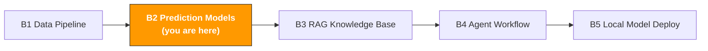

# B2. Prediction Models & Intelligent Decision

> **Track**: Path B: Developers · **Module**: B2
> **Last updated**: 2026-07-31
> **Level**: Intermediate → Advanced
> **Prerequisite**: B1 data-pipeline basics (pandas, data cleaning), Python basics
> **Time**: 1 hour a day, 2–3 weeks
---




---

## Chapter Navigation

1. [Forecasting methodology](#1-forecasting-methodology) · 2. [Tool landscape](#2-tool-landscape) · 3. [Hands-on code](#3-hands-on-code) · 4. [Model evaluation](#4-model-evaluation) · 5. [Hands-on project](#5-hands-on-project-build-a-sku-sales-forecasting-system) · 6. [Common traps](#6-common-traps) · 7. [Learning resources](#7-learning-resources)


## What You'll Build

A sales-forecasting model + a Review topic-analysis system.

After this module you'll be able to:
- Forecast 30/60/90-day SKU sales with Prophet, outputting predictions and confidence intervals
- Understand the core principle of time-series forecasting (trend + seasonality + noise decomposition)
- Handle e-commerce-forecasting challenges: promo spikes, new-product cold start, competitor impact
- Do zero-config modeling with AutoGluon, auto-selecting the best algorithm
- Auto-discover topics and sentiment trends in Review text with BERTopic
- Turn forecasts into restock decisions (connecting the [A5 inventory module](../a-operators/a5-inventory.md))
- Evaluate model quality with MAPE/MAE/RMSE, and validate forecast reliability with backtesting

---

> **Related case study**: [Multilingual Recommendation System](../case-studies/multilingual-recommendation.md) another modelling walk-through — cross-language, cross-culture recommendation, complementary to the time-series forecasting here.

## 1. Forecasting Methodology

<!-- claims: illustrative -->

> The numbers in this section are constructed to illustrate the point, not measured.


> **Related**: [A5 Inventory & Supply Chain](../a-operators/a5-inventory.md) for applying sales forecasts to restock decisions · [D3 Cross-Platform AI Strategy](../d-platforms/cross-platform-strategy.md) for cross-platform demand forecasting.

### 1.1 The first principle of time-series forecasting

Any time-series data can be decomposed into three components:

```
Observed = Trend + Seasonality + Residual (noise)
```

| Component | Meaning | E-commerce example |
|-----------|---------|--------------------|
| Trend | long-term up or down direction | sales grow month over month after launch; an old product enters decline |
| Seasonality | a repeating pattern with a fixed period | highest sales every Monday (weekend orders arrive Monday); Q4 peak |
| Noise | unexplainable random fluctuation | a sudden influencer mention spikes sales for a day, then it recovers |

**Additive vs multiplicative model:**

- **Additive model**: `y = trend + seasonality + noise` — the seasonal swing amplitude is fixed (e.g., 1000 extra units every Q4)
- **Multiplicative model**: `y = trend × seasonality × noise` — the seasonal swing amplitude changes with the trend (e.g., 30% more every Q4)

E-commerce usually is more accurate with a **multiplicative model**, because the larger the sales base, the larger the absolute seasonal swing.

**Decomposition visualization:**

> **What this chapter's code needs**: `pip install prophet pandas numpy matplotlib statsmodels scikit-learn bertopic sentence-transformers autogluon.timeseries`

```python
import pandas as pd
from statsmodels.tsa.seasonal import seasonal_decompose
import matplotlib.pyplot as plt
import matplotlib

matplotlib.rcParams["font.sans-serif"] = ["PingFang SC", "Heiti TC", "Arial"]
matplotlib.rcParams["axes.unicode_minus"] = False

def decompose_sales(df: pd.DataFrame, date_col: str = "date", value_col: str = "units"):
    """
    Decompose a sales time series into trend, seasonality, and noise.

    Args:
        df: DataFrame with date and sales
        date_col: date column name
        value_col: sales column name
    """
    ts = df.set_index(date_col)[value_col]
    ts = ts.asfreq("D").fillna(method="ffill") # fill in missing dates

    # Multiplicative decomposition, period=7 (weekly seasonality)
    result = seasonal_decompose(ts, model="multiplicative", period=7)

    fig, axes = plt.subplots(4, 1, figsize=(12, 8), sharex=True)
    result.observed.plot(ax=axes[0], title="Observed")
    result.trend.plot(ax=axes[1], title="Trend")
    result.seasonal.plot(ax=axes[2], title="Seasonality")
    result.resid.plot(ax=axes[3], title="Residual")

    plt.tight_layout()
    plt.savefig("output/decomposition.png", dpi=150)
    plt.show()

    return result

# Usage example
# df = pd.read_csv("data/daily_sales.csv")
# result = decompose_sales(df, date_col="date", value_col="units")
```

> **Key insight**: if the decomposed "noise" component still has a clear pattern (e.g., a huge residual at every promo), your model lacks modeling of promo events. This is exactly what Prophet's `holidays` parameter solves.

### 1.2 The special challenges of e-commerce forecasting

E-commerce sales forecasting is harder than traditional retail because of several unique disturbances:

| Challenge | Symptom | Impact | Response strategy |
|-----------|---------|--------|-------------------|
| Promo spikes | Prime Day/BFCM sales spike 5–20× | the model is thrown off by extreme values | model promos as special events (Prophet holidays) |
| New-product cold start | a new ASIN has no history | can't forecast with a time series | analogy-forecast from a similar product's sales curve |
| Competitor impact | a competitor markdown/stockout suddenly shifts your sales | external factors can't be learned from your own data | add external regressors (competitor price, BSR) |
| Ad dependence | sales cliff-drop after stopping ads | organic and ad sales are mixed together | separate organic and ad traffic, forecast each |
| Inventory constraint | sales are 0 during a stockout (not real demand) | a 0 in history doesn't mean "no demand" | stockout-period data needs special handling or removal |
| Overlapping seasonality | weekly + monthly + yearly seasonality all present | a single-period model isn't enough | Prophet supports auto-modeling multiple seasonalities |

**Stockout-data handling (key!):**

```python
def handle_stockout(df: pd.DataFrame, units_col: str = "units") -> pd.DataFrame:
    """
    Handle zero-sales data during stockouts.

    Zero sales during a stockout doesn't mean zero demand.
    Strategy: fill with the average sales before/after, so the model
    doesn't learn "demand is 0 on certain days."
    """
    df = df.copy()

    # Flag consecutive zero sales (possibly a stockout)
    df["is_zero"] = df[units_col] == 0
    df["zero_streak"] = (
        df["is_zero"]
        .groupby((~df["is_zero"]).cumsum())
        .cumsum()
    )

    # 3+ consecutive zero-sales days is treated as a stockout (not real zero demand)
    stockout_mask = df["zero_streak"] >= 3

    if stockout_mask.any():
        # Fill with the non-zero mean of the surrounding 7 days
        rolling_mean = (
            df[~stockout_mask][units_col]
            .rolling(window=7, min_periods=1)
            .mean()
        )
        df.loc[stockout_mask, units_col] = rolling_mean.reindex(
            df.index
        ).ffill().bfill()

        stockout_days = stockout_mask.sum()
        print(f"Detected {stockout_days} suspected stockout days, filled with rolling mean")

    df = df.drop(columns=["is_zero", "zero_streak"])
    return df
```

### 1.3 When to use simple rules vs ML models

Not every forecast needs machine learning. Choosing the right method matters more than choosing the most complex one:

| Scenario | Recommended method | Reason |
|----------|--------------------|--------|
| Stable old product, 1+ year history | Prophet / exponential smoothing | ample data, time-series models work well |
| New product < 3 months | analogy + manual adjustment | insufficient data, ML models overfit |
| Promo stocking | last year's same period × growth factor + manual adjustment | promos are irregular events, too few historical samples |
| Batch multi-SKU forecasting | AutoGluon / LightGBM | high automation, good for batch processing |
| Need interpretability | Prophet | decomposable into trend+seasonality, business people understand it |
| Chase accuracy | ensemble methods (weighted multi-model) | a single model is biased, ensembles complement each other |

**Decision framework:**

```
History > 1 year?
yes → Stable sales?
yes → Prophet (simple and efficient)
no → Prophet + external variables / AutoGluon
no → History > 3 months?
yes → Prophet (short period) / moving average
no → analogy (find a similar product's history)
```

---

## 2. Tool Landscape

| Tool | Type | Difficulty | Best scenario | Install |
|------|------|------------|---------------|---------|
| [Prophet](https://facebook.github.io/prophet/) | time series | beginner | single-SKU sales forecasting, easiest to start | `pip install prophet` |
| [Darts](https://unit8co.github.io/darts/) | time series | intermediate | comparing multiple models | `pip install darts` |
| [AutoGluon](https://auto.gluon.ai/) | AutoML | beginner | zero-ML-knowledge batch modeling | `pip install autogluon.timeseries` |
| [BERTopic](https://maartengr.github.io/BERTopic/) | NLP topic modeling | intermediate | Review-text topic discovery | `pip install bertopic` |
| [OR-Tools](https://developers.google.com/optimization) | operations research | advanced | restock-strategy optimization | `pip install ortools` |
| [scikit-learn](https://scikit-learn.org/) | general ML | intermediate | feature engineering, regression, classification | `pip install scikit-learn` |

**Selection advice:**
- Just starting → begin with Prophet, results in an afternoon
- Want automation → AutoGluon, zero-config auto-selects the best model
- Need Review analysis → BERTopic, auto-discovers review topics
- Need restock-quantity optimization → OR-Tools, mathematical programming for the optimal solution

---

## 3. Hands-On Code

### 3.1 Prophet sales forecasting (full flow)

Prophet is Meta's open-source time-series library, designed for business forecasting. Its core strengths:
- Auto-handles missing values and outliers
- Built-in holiday effects
- Interpretable decomposition (trend + seasonality + holidays)
- Friendly for non-experts

**Full code: data prep → training → forecasting → evaluation → visualization**

```python
import pandas as pd
import numpy as np
from prophet import Prophet
from datetime import datetime, timedelta
import matplotlib.pyplot as plt
import matplotlib

matplotlib.rcParams["font.sans-serif"] = ["PingFang SC", "Heiti TC", "Arial"]
matplotlib.rcParams["axes.unicode_minus"] = False

# ============================================================
# Step 1: data prep
# ============================================================

def prepare_prophet_data(
    df: pd.DataFrame,
    date_col: str = "date",
    value_col: str = "units"
) -> pd.DataFrame:
    """
    Convert business data to the format Prophet requires.

    Prophet requires two columns:
    - ds: date column (datetime type)
    - y: target column (numeric type)

    Args:
        df: raw data
        date_col: date column name
        value_col: target column name

    Returns:
        DataFrame in Prophet format
    """
    prophet_df = df[[date_col, value_col]].copy()
    prophet_df.columns = ["ds", "y"]

    # Ensure the date format is correct
    prophet_df["ds"] = pd.to_datetime(prophet_df["ds"])
    prophet_df["y"] = pd.to_numeric(prophet_df["y"], errors="coerce")

    # Sort by date and dedup (sum multiple records on the same day)
    prophet_df = prophet_df.groupby("ds")["y"].sum().reset_index()
    prophet_df = prophet_df.sort_values("ds").reset_index(drop=True)

    # Fill missing dates (with 0, later replaceable via stockout logic)
    date_range = pd.date_range(
        start=prophet_df["ds"].min(),
        end=prophet_df["ds"].max(),
        freq="D"
    )
    prophet_df = (
        prophet_df
        .set_index("ds")
        .reindex(date_range)
        .fillna(0)
        .reset_index()
        .rename(columns={"index": "ds"})
    )

    print(f"Data prep done: {len(prophet_df)} days")
    print(f"Date range: {prophet_df['ds'].min().date()} → {prophet_df['ds'].max().date()}")
    print(f"Daily avg sales: {prophet_df['y'].mean():.1f}")

    return prophet_df

# ============================================================
# Step 2: train the model
# ============================================================

def train_prophet(
    df: pd.DataFrame,
    yearly: bool = True,
    weekly: bool = True,
    daily: bool = False,
    changepoint_prior: float = 0.05
) -> Prophet:
    """
    Train a Prophet model.

    Args:
        df: Prophet-format data (ds, y columns)
        yearly: enable yearly seasonality
        weekly: enable weekly seasonality
        daily: enable daily seasonality (usually not needed)
        changepoint_prior: trend-changepoint sensitivity
            - larger value, easier to capture trend changes (but may overfit)
            - smaller value, smoother trend (but may underfit)
            - default 0.05, e-commerce suggests 0.1-0.3 (changes faster)

    Returns:
        the trained Prophet model
    """
    model = Prophet(
        yearly_seasonality=yearly,
        weekly_seasonality=weekly,
        daily_seasonality=daily,
        changepoint_prior_scale=changepoint_prior,
        interval_width=0.8, # 80% confidence interval
    )

    model.fit(df)
    print("Model training done")

    return model

# ============================================================
# Step 3: generate the forecast
# ============================================================

def make_forecast(
    model: Prophet,
    periods: int = 90,
    freq: str = "D"
) -> pd.DataFrame:
    """
    Generate a forecast for the next N days.

    Args:
        model: the trained Prophet model
        periods: days to forecast
        freq: frequency (D=day, W=week, M=month)

    Returns:
        forecast-result DataFrame with:
        - ds: date
        - yhat: forecast value
        - yhat_lower: forecast lower bound
        - yhat_upper: forecast upper bound
        - trend: trend component
        - weekly: weekly-seasonality component
        - yearly: yearly-seasonality component
    """
    future = model.make_future_dataframe(periods=periods, freq=freq)
    forecast = model.predict(future)

    # The forecast can't be negative (sales min is 0)
    forecast["yhat"] = forecast["yhat"].clip(lower=0)
    forecast["yhat_lower"] = forecast["yhat_lower"].clip(lower=0)

    print(f"Forecast done: next {periods} days")
    print(f"Forecast mean: {forecast['yhat'].tail(periods).mean():.1f}")
    print(f"Forecast interval: [{forecast['yhat_lower'].tail(periods).mean():.1f}, "
          f"{forecast['yhat_upper'].tail(periods).mean():.1f}]")

    return forecast

# ============================================================
# Step 4: visualization
# ============================================================

def plot_forecast(
    model: Prophet,
    forecast: pd.DataFrame,
    actual_df: pd.DataFrame = None,
    title: str = "SKU Sales Forecast"
):
    """
    Plot the forecast result.

    Args:
        model: Prophet model
        forecast: forecast result
        actual_df: actual data (for comparison)
        title: chart title
    """
    fig, axes = plt.subplots(2, 1, figsize=(14, 10))

    # Chart 1: forecast vs actual
    ax1 = axes[0]
    ax1.plot(forecast["ds"], forecast["yhat"], color="#1a73e8", label="Forecast")
    ax1.fill_between(
        forecast["ds"],
        forecast["yhat_lower"],
        forecast["yhat_upper"],
        alpha=0.2, color="#1a73e8", label="80% confidence interval"
    )

    if actual_df is not None:
        ax1.scatter(
            actual_df["ds"], actual_df["y"],
            color="#333", s=10, alpha=0.5, label="Actual"
        )

    ax1.set_title(title, fontsize=14, fontweight="bold")
    ax1.set_ylabel("Units")
    ax1.legend()
    ax1.grid(True, alpha=0.3)

    # Chart 2: component decomposition
    ax2 = axes[1]
    ax2.plot(forecast["ds"], forecast["trend"], label="Trend", color="#e8710a")
    if "weekly" in forecast.columns:
        ax2_twin = ax2.twinx()
        weekly_data = forecast.drop_duplicates(subset=["ds"]).tail(90)
        ax2_twin.plot(
            weekly_data["ds"], weekly_data["weekly"],
            label="Weekly seasonality", color="#0d652d", alpha=0.7
        )
        ax2_twin.set_ylabel("Weekly seasonality")

    ax2.set_title("Trend decomposition", fontsize=14, fontweight="bold")
    ax2.set_ylabel("Trend")
    ax2.legend(loc="upper left")
    ax2.grid(True, alpha=0.3)

    plt.tight_layout()
    plt.savefig("output/forecast.png", dpi=150, bbox_inches="tight")
    plt.show()
    print("Chart saved: output/forecast.png")

# ============================================================
# Full usage example
# ============================================================

# # 1. Load data
# raw_df = pd.read_csv("data/daily_sales.csv")
# prophet_df = prepare_prophet_data(raw_df, date_col="date", value_col="units")
#
# # 2. Handle stockout data
# prophet_df = handle_stockout(prophet_df, units_col="y")
#
# # 3. Train the model
# model = train_prophet(prophet_df, changepoint_prior=0.1)
#
# # 4. Forecast the next 90 days
# forecast = make_forecast(model, periods=90)
#
# # 5. Visualize
# plot_forecast(model, forecast, actual_df=prophet_df, title="ASIN-B0XXXXX sales forecast")
```

> **changepoint_prior_scale tuning guide**: this is Prophet's most important hyperparameter. E-commerce data changes fast, so start from 0.1. If the forecast curve is too smooth (can't keep up with trend changes), raise it to 0.2–0.3; if too jumpy (overfitting noise), lower it to 0.01–0.05.

### 3.2 Prophet advanced: holiday effects and external variables

The basic Prophet model ignores the most important e-commerce factor: promo events. Adding holiday effects can meaningfully improve accuracy.

**Adding e-commerce promo events:**

```python
def create_ecommerce_holidays(years: list[int]) -> pd.DataFrame:
    """
    Create an e-commerce promo calendar.

    Prophet's holidays parameter accepts a DataFrame with:
    - holiday: event name
    - ds: event date
    - lower_window: days of impact before the event (negative)
    - upper_window: days of impact after the event
    """
    holidays = []

    for year in years:
        # Prime Day (usually mid-July, lasts 2 days)
        holidays.append({
            "holiday": "prime_day",
            "ds": f"{year}-07-12",
            "lower_window": -3, # impact starts 3 days early (warm-up)
            "upper_window": 2, # 2 days of aftershock after it ends
        })

        # Black Friday (fourth Friday of November)
        # Simplified: fixed near 11-24
        holidays.append({
            "holiday": "black_friday",
            "ds": f"{year}-11-24",
            "lower_window": -7, # BFCM week starts a week early
            "upper_window": 3, # a few days after Cyber Monday
        })

        # Cyber Monday
        holidays.append({
            "holiday": "cyber_monday",
            "ds": f"{year}-11-27",
            "lower_window": 0,
            "upper_window": 1,
        })

        # Singles' Day (impacts Chinese sellers)
        holidays.append({
            "holiday": "singles_day",
            "ds": f"{year}-11-11",
            "lower_window": -3,
            "upper_window": 1,
        })

        # Pre-Christmas shopping season
        holidays.append({
            "holiday": "christmas_shopping",
            "ds": f"{year}-12-15",
            "lower_window": -5,
            "upper_window": 10,
        })

        # Post-New-Year dip
        holidays.append({
            "holiday": "post_newyear_dip",
            "ds": f"{year}-01-05",
            "lower_window": -5,
            "upper_window": 10,
        })

    return pd.DataFrame(holidays)

def train_prophet_with_holidays(
    df: pd.DataFrame,
    holidays: pd.DataFrame = None,
    changepoint_prior: float = 0.1
) -> Prophet:
    """
    Train a Prophet model with holiday effects.
    """
    if holidays is None:
        years = list(range(
            df["ds"].dt.year.min(),
            df["ds"].dt.year.max() + 2 # include the forecast year
        ))
        holidays = create_ecommerce_holidays(years)

    model = Prophet(
        yearly_seasonality=True,
        weekly_seasonality=True,
        daily_seasonality=False,
        changepoint_prior_scale=changepoint_prior,
        holidays=holidays,
        holidays_prior_scale=10.0, # holiday-effect sensitivity
        interval_width=0.8,
    )

    model.fit(df)
    print(f"Model training done (with {len(holidays)} holiday events)")

    return model
```

**Adding external regressors (ad spend, competitor price):**

```python
def train_prophet_with_regressors(
    df: pd.DataFrame,
    regressor_cols: list[str] = None
) -> Prophet:
    """
    Train a Prophet model with external regressors.

    External variables can be:
    - ad_spend: ad spend (more spend, higher sales)
    - competitor_price: competitor price (competitor price up, your sales may rise)
    - bsr_rank: BSR rank (higher rank, more exposure)
    - coupon_active: whether a coupon is active (0/1)

    Note: at forecast time you must also provide future values of the external variables!
    """
    years = list(range(
        df["ds"].dt.year.min(),
        df["ds"].dt.year.max() + 2
    ))
    holidays = create_ecommerce_holidays(years)

    model = Prophet(
        yearly_seasonality=True,
        weekly_seasonality=True,
        changepoint_prior_scale=0.1,
        holidays=holidays,
        interval_width=0.8,
    )

    # Add external regressors
    regressor_cols = regressor_cols or []
    for col in regressor_cols:
        if col in df.columns:
            model.add_regressor(col, standardize=True)
            print(f"Added regressor: {col}")

    model.fit(df)
    print("Model training done (with external variables)")

    return model

def forecast_with_regressors(
    model: Prophet,
    periods: int = 90,
    future_regressors: pd.DataFrame = None
) -> pd.DataFrame:
    """
    Forecast with external variables.

    Args:
        model: the trained model
        periods: days to forecast
        future_regressors: future values of the external variables
            if not provided, filled with the historical mean (not recommended, lowers accuracy)
    """
    future = model.make_future_dataframe(periods=periods)

    # Merge future external variables
    if future_regressors is not None:
        future = future.merge(future_regressors, on="ds", how="left")

    # Fill missing external variables with the historical mean
    for col in future.columns:
        if col not in ["ds"] and future[col].isna().any():
            fill_value = future[col].dropna().mean()
            future[col] = future[col].fillna(fill_value)
            print(f"{col} has missing values, filled with mean {fill_value:.2f}")

    forecast = model.predict(future)
    forecast["yhat"] = forecast["yhat"].clip(lower=0)
    forecast["yhat_lower"] = forecast["yhat_lower"].clip(lower=0)

    return forecast

# Usage example
# df = prepare_prophet_data(raw_df)
# df["ad_spend"] = ad_data["spend"] # merge ad-spend data
# df["competitor_price"] = competitor_data["price"] # merge competitor price
#
# model = train_prophet_with_regressors(df, regressor_cols=["ad_spend", "competitor_price"])
#
# # At forecast time, provide the future ad budget and competitor-price estimate
# future_regs = pd.DataFrame({
# "ds": pd.date_range("2025-04-01", periods=90, freq="D"),
# "ad_spend": [500] * 90, # assume future daily ad budget $500
# "competitor_price": [29.99] * 90, # assume competitor price unchanged
# })
# forecast = forecast_with_regressors(model, periods=90, future_regressors=future_regs)
```

> **The external-variable trap**: at forecast time you need future values of the external variables. If you don't know the future ad budget, adding `ad_spend` as a regressor actually lowers accuracy. Only add variables whose future values you can reasonably estimate.

### 3.3 AutoGluon automated forecasting (zero-config modeling)

AutoGluon is Amazon's open-source AutoML framework. Its time-series module can auto-try multiple models (Prophet, ETS, DeepAR, Theta, etc.) and select the best. Good for when you don't want to tune manually.

```python
from autogluon.timeseries import TimeSeriesDataFrame, TimeSeriesPredictor

def autogluon_forecast(
    df: pd.DataFrame,
    date_col: str = "date",
    value_col: str = "units",
    item_col: str = "asin",
    prediction_length: int = 30,
    time_limit: int = 300
) -> pd.DataFrame:
    """
    Auto-forecast multiple SKUs' sales with AutoGluon.

    AutoGluon's strengths:
    - Zero-config: no need to pick a model or tune parameters
    - Multi-SKU: one training run forecasts all SKUs at once
    - Auto-ensemble: auto-tries multiple models and ensembles the best

    Args:
        df: DataFrame with date, sales, SKU ID
        date_col: date column name
        value_col: target column name
        item_col: SKU-ID column name
        prediction_length: days to forecast
        time_limit: training time limit (seconds)

    Returns:
        forecast-result DataFrame
    """
    # 1. Convert to AutoGluon format
    ag_df = df.rename(columns={
        date_col: "timestamp",
        value_col: "target",
        item_col: "item_id"
    })
    ag_df["timestamp"] = pd.to_datetime(ag_df["timestamp"])

    ts_df = TimeSeriesDataFrame.from_data_frame(
        ag_df,
        id_column="item_id",
        timestamp_column="timestamp"
    )

    print(f"Data: {ts_df.num_items} SKUs, "
          f"{len(ts_df)} records")

    # 2. Train (AutoGluon auto-selects the best model)
    predictor = TimeSeriesPredictor(
        prediction_length=prediction_length,
        target="target",
        eval_metric="MAPE", # use MAPE as the eval metric
    )

    predictor.fit(
        train_data=ts_df,
        time_limit=time_limit, # limit training time
        presets="medium_quality", # fast / medium / high / best
    )

    # 3. View the model leaderboard
    leaderboard = predictor.leaderboard(ts_df)
    print("\nModel leaderboard:")
    print(leaderboard[["model", "score_val"]].to_string(index=False))

    # 4. Generate the forecast
    predictions = predictor.predict(ts_df)

    print(f"\nForecast done: {ts_df.num_items} SKUs × {prediction_length} days")

    return predictions

# Usage example
# df = pd.read_csv("data/daily_sales_all_skus.csv")
# predictions = autogluon_forecast(
# df,
# date_col="date",
# value_col="units",
# item_col="asin",
# prediction_length=30,
# time_limit=600 # 10 minutes
# )
#
# # View a SKU's forecast
# sku_pred = predictions.loc["B0XXXXX"]
# print(sku_pred)
```

> **AutoGluon vs Prophet — how to choose?**
> - Deep single-SKU analysis → Prophet (strong interpretability, can add holidays and external variables)
> - Batch-forecast 100+ SKUs → AutoGluon (high automation, done in one shot)
> - Not sure → run a baseline with AutoGluon first, then fine-tune key SKUs with Prophet
>
> Reference: [AutoGluon time-series docs](https://auto.gluon.ai/stable/tutorials/timeseries/index.html)

### 3.4 BERTopic Review topic analysis

BERTopic can auto-discover topics in large amounts of Review text, helping you understand what customers are saying. This is far faster than reading reviews one by one.

```python
from bertopic import BERTopic
from sentence_transformers import SentenceTransformer
import pandas as pd

def analyze_review_topics(
    reviews: list[str],
    language: str = "english",
    nr_topics: int = "auto",
    min_topic_size: int = 10
) -> tuple:
    """
    Auto-discover topics in Review text with BERTopic.

    How it works:
    1. Convert each Review to a vector with Sentence-BERT
    2. Reduce dimensions with UMAP
    3. Cluster with HDBSCAN
    4. Extract each topic's keywords with c-TF-IDF

    Args:
        reviews: list of Review text
        language: language ("english" or "chinese")
        nr_topics: number of topics ("auto" to auto-determine)
        min_topic_size: minimum topic size (topics with fewer reviews are merged)

    Returns:
        (topic_model, topics, probs)
        - topic_model: the trained BERTopic model
        - topics: each Review's topic number
        - probs: each Review's probability of belonging to each topic
    """
    # Choose the embedding model
    if language == "chinese":
        embedding_model = SentenceTransformer(
            "paraphrase-multilingual-MiniLM-L12-v2"
        )
    else:
        embedding_model = SentenceTransformer(
            "all-MiniLM-L6-v2"
        )

    # Create the BERTopic model
    topic_model = BERTopic(
        embedding_model=embedding_model,
        nr_topics=nr_topics,
        min_topic_size=min_topic_size,
        language=language,
        verbose=True
    )

    # Train
    topics, probs = topic_model.fit_transform(reviews)

    # Print a topic overview
    topic_info = topic_model.get_topic_info()
    print("\nDiscovered topics:")
    for _, row in topic_info.head(10).iterrows():
        if row["Topic"] != -1: # -1 is an outlier
            print(f"Topic {row['Topic']}: {row['Name']} "
                  f"({row['Count']} reviews)")

    return topic_model, topics, probs

def get_topic_summary(
    topic_model: BERTopic,
    reviews: list[str],
    topics: list[int],
    ratings: list[int] = None
) -> pd.DataFrame:
    """
    Generate a topic-summary report.

    Args:
        topic_model: the trained model
        reviews: Review text
        topics: topic numbers
        ratings: ratings (1–5), to analyze each topic's sentiment tendency

    Returns:
        topic-summary DataFrame
    """
    summary_data = []
    topic_info = topic_model.get_topic_info()

    for _, row in topic_info.iterrows():
        topic_id = row["Topic"]
        if topic_id == -1:
            continue

        # Get this topic's keywords
        keywords = topic_model.get_topic(topic_id)
        keyword_str = ", ".join([w for w, _ in keywords[:5]])

        # Get this topic's Review indices
        topic_mask = [t == topic_id for t in topics]
        topic_reviews = [r for r, m in zip(reviews, topic_mask) if m]

        entry = {
            "topic_id": topic_id,
            "keywords": keyword_str,
            "review_count": len(topic_reviews),
            "sample_review": topic_reviews[0][:200] if topic_reviews else "",
        }

        # If ratings exist, compute this topic's average rating
        if ratings:
            topic_ratings = [r for r, m in zip(ratings, topic_mask) if m]
            entry["avg_rating"] = round(sum(topic_ratings) / len(topic_ratings), 2) if topic_ratings else None
            entry["negative_pct"] = round(
                sum(1 for r in topic_ratings if r <= 2) / len(topic_ratings) * 100, 1
            ) if topic_ratings else None

        summary_data.append(entry)

    summary = pd.DataFrame(summary_data)

    if "avg_rating" in summary.columns:
        summary = summary.sort_values("avg_rating", ascending=True)

    return summary

# Usage example
# reviews_df = pd.read_csv("data/reviews.csv")
# reviews = reviews_df["review_text"].tolist()
# ratings = reviews_df["rating"].tolist()
#
# topic_model, topics, probs = analyze_review_topics(reviews, language="english")
#
# # Generate the topic summary
# summary = get_topic_summary(topic_model, reviews, topics, ratings)
# print(summary.to_string(index=False))
#
# # Visualize the topic distribution
# fig = topic_model.visualize_topics()
# fig.write_html("output/review_topics.html")
#
# # View topics over time (needs date data)
# timestamps = reviews_df["date"].tolist()
# topics_over_time = topic_model.topics_over_time(reviews, topics, timestamps)
# fig = topic_model.visualize_topics_over_time(topics_over_time)
# fig.write_html("output/topics_over_time.html")
```

> **BERTopic's practical value**: say you have 5000 competitor reviews — reading them by hand takes days. BERTopic tells you in 5 minutes: Topic 1 is "poor battery life" (avg rating 2.1), Topic 2 is "great picture quality" (avg rating 4.5), Topic 3 is "hard-to-use app" (avg rating 1.8). That directly tells you product-improvement directions.
>
> Reference: [BERTopic official docs](https://maartengr.github.io/BERTopic/) | [BERTopic best practices](https://maartengr.github.io/BERTopic/getting_started/best_practices/best_practices.html)

### 3.5 Turning forecasts into restock decisions

The forecast itself isn't the goal — the restock decision is. This section connects the forecast to the restock logic of the [A5 inventory module](../a-operators/a5-inventory.md).

```python
def forecast_to_reorder(
    forecast: pd.DataFrame,
    current_stock: int,
    lead_time_days: int = 30,
    safety_stock_days: int = 14,
    moq: int = 100
) -> dict:
    """
    Turn a forecast into a restock suggestion.

    Args:
        forecast: Prophet forecast result
        current_stock: current inventory quantity
        lead_time_days: supplier lead time (days)
        safety_stock_days: safety-stock days
        moq: minimum order quantity

    Returns:
        a restock-suggestion dict
    """
    # Take future forecast data
    future_data = forecast[forecast["ds"] > pd.Timestamp.now()]

    if future_data.empty:
        return {"error": "no future forecast data"}

    # Compute daily-average forecast sales (use the upper bound for a conservative estimate)
    daily_forecast = future_data["yhat"].mean()
    daily_upper = future_data["yhat_upper"].mean()

    # Safety stock = safety days × daily upper-bound sales
    safety_stock = int(safety_stock_days * daily_upper)

    # Expected consumption during Lead Time
    lt_consumption = int(lead_time_days * daily_forecast)

    # Reorder point = Lead Time consumption + safety stock
    reorder_point = lt_consumption + safety_stock

    # Days of cover the current stock supports
    days_of_stock = int(current_stock / daily_forecast) if daily_forecast > 0 else 999

    # Suggested order quantity = 90-day forecast demand - current stock + safety stock
    forecast_90d = int(future_data["yhat"].head(90).sum())
    suggested_qty = max(forecast_90d - current_stock + safety_stock, 0)

    # Round up to a multiple of MOQ
    if suggested_qty > 0:
        suggested_qty = max(
            ((suggested_qty + moq - 1) // moq) * moq,
            moq
        )

    # Urgency judgment
    if current_stock <= reorder_point * 0.5:
        urgency = "urgent restock"
    elif current_stock <= reorder_point:
        urgency = "restock suggested"
    else:
        urgency = "stock sufficient"

    result = {
        "urgency": urgency,
        "current_stock": current_stock,
        "days_of_stock": days_of_stock,
        "daily_forecast": round(daily_forecast, 1),
        "safety_stock": safety_stock,
        "reorder_point": reorder_point,
        "suggested_qty": suggested_qty,
        "forecast_90d": forecast_90d,
        "lead_time_days": lead_time_days,
    }

    print(f"\nRestock suggestion:")
    print(f"Status: {urgency}")
    print(f"Current stock: {current_stock} units (covers {days_of_stock} days)")
    print(f"Daily forecast: {daily_forecast:.1f} units/day")
    print(f"Safety stock: {safety_stock} units")
    print(f"Reorder point: {reorder_point} units")
    print(f"Suggested order: {suggested_qty} units (MOQ={moq})")

    return result

# Usage example
# reorder = forecast_to_reorder(
# forecast=forecast,
# current_stock=500,
# lead_time_days=30,
# safety_stock_days=14,
# moq=200
# )
```

---

## 4. Model Evaluation

### 4.1 Evaluation metrics

| Metric | Formula | Meaning | Best scenario |
|--------|---------|---------|---------------|
| MAE | `mean(abs(actual - predicted))` | mean absolute error | general, insensitive to outliers |
| RMSE | `sqrt(mean((actual - predicted)²))` | root mean squared error | penalizes large errors, for scenarios intolerant of big deviations |
| MAPE | `mean(abs((actual - predicted) / actual)) × 100%` | mean absolute percentage error | cross-SKU comparison (unaffected by the sales base) |
| WAPE | `sum(abs(actual - predicted)) / sum(actual) × 100%` | weighted absolute percentage error | avoids MAPE exploding at low sales |

**E-commerce recommends WAPE**: MAPE trends to infinity when actual sales are near 0 (dividing by a near-0 number), while WAPE uses total sales as the denominator, more stable.

```python
def evaluate_forecast(
    actual: pd.Series,
    predicted: pd.Series
) -> dict:
    """
    Compute forecast-evaluation metrics.

    Args:
        actual: actual values
        predicted: forecast values

    Returns:
        metrics dict
    """
    actual = actual.values
    predicted = predicted.values

    mae = np.mean(np.abs(actual - predicted))
    rmse = np.sqrt(np.mean((actual - predicted) ** 2))

    # MAPE (filter out days where actual is 0)
    nonzero_mask = actual > 0
    if nonzero_mask.any():
        mape = np.mean(
            np.abs((actual[nonzero_mask] - predicted[nonzero_mask])
                   / actual[nonzero_mask])
        ) * 100
    else:
        mape = float("inf")

    # WAPE (more robust)
    wape = np.sum(np.abs(actual - predicted)) / np.sum(actual) * 100 if np.sum(actual) > 0 else float("inf")

    metrics = {
        "MAE": round(mae, 2),
        "RMSE": round(rmse, 2),
        "MAPE": round(mape, 2),
        "WAPE": round(wape, 2),
    }

    print("Evaluation results:")
    for k, v in metrics.items():
        unit = "%" if k in ("MAPE", "WAPE") else "units"
        print(f"{k}: {v} {unit}")

    return metrics
```

**MAPE reference benchmarks (e-commerce):**

| MAPE | Rating | Notes |
|------|--------|-------|
| < 15% | excellent | stable old product, ample data |
| 15–25% | good | a reasonable level for most SKUs |
| 25–40% | acceptable | new products or highly volatile categories |
| > 40% | needs improvement | check data quality or model config |

### 4.2 Backtesting

Backtesting is the most reliable way to validate a forecasting model: use historical data to simulate "what would have happened if this model had forecast back then."

```python
def backtest_prophet(
    df: pd.DataFrame,
    initial_days: int = 180,
    horizon_days: int = 30,
    period_days: int = 30
) -> pd.DataFrame:
    """
    Prophet backtest: rolling-window validation.

    How it works:
    1. Train on the first initial_days days
    2. Forecast the next horizon_days days
    3. Compare with actuals
    4. Slide the window forward period_days days, repeat

    Args:
        df: Prophet-format data
        initial_days: initial training-data days
        horizon_days: days to forecast each time
        period_days: window-sliding step

    Returns:
        backtest-result DataFrame
    """
    from prophet.diagnostics import cross_validation, performance_metrics

    model = Prophet(
        yearly_seasonality=True,
        weekly_seasonality=True,
        changepoint_prior_scale=0.1,
        interval_width=0.8,
    )
    model.fit(df)

    # Cross-validation
    cv_results = cross_validation(
        model,
        initial=f"{initial_days} days",
        period=f"{period_days} days",
        horizon=f"{horizon_days} days"
    )

    # Compute performance metrics
    perf = performance_metrics(cv_results)

    print("Backtest results:")
    print(f"MAE: {perf['mae'].mean():.2f}")
    print(f"RMSE: {perf['rmse'].mean():.2f}")
    print(f"MAPE: {perf['mape'].mean() * 100:.2f}%")

    return cv_results, perf

# Usage example
# cv_results, perf = backtest_prophet(prophet_df, initial_days=180, horizon_days=30)
#
# # Visualize the backtest result
# from prophet.plot import plot_cross_validation_metric
# fig = plot_cross_validation_metric(cv_results, metric="mape")
# plt.savefig("output/backtest_mape.png", dpi=150)
```

### 4.3 Using the forecast interval

The forecast value is a point estimate, but business decisions must account for uncertainty. Prophet's forecast interval tells you "the true value likely falls in this range."

| Decision scenario | Which value to use | Reason |
|-------------------|--------------------|--------|
| Restock quantity | `yhat_upper` (upper bound) | better to over-stock, stockout loss > holding cost |
| Sales-target setting | `yhat` (median) | the target should be the most likely outcome |
| Pessimistic scenario analysis | `yhat_lower` (lower bound) | assess cash flow in the worst case |
| Warehouse-space planning | `yhat_upper` (upper bound) | ensure enough space to store |

---

## 5. Hands-On Project: Build a SKU Sales-Forecasting System

### 5.1 Project architecture

```
sales-forecaster/
config.py # config (data paths, model params)
requirements.txt # dependencies

data/ # data directory
raw/ # raw sales data
processed/ # cleaned data

models/ # model storage
prophet/ # Prophet model files

src/
data_prep.py # data prep (cleaning, stockout handling)
prophet_model.py # Prophet training and forecasting
autogluon_model.py # AutoGluon batch forecasting
review_analysis.py # BERTopic Review analysis
evaluator.py # model evaluation and backtesting
reorder.py # restock decisions

output/ # output
forecasts/ # forecast-result CSVs
reports/ # HTML reports
plots/ # charts

run_forecast.py # main entry: single-SKU forecast
run_batch_forecast.py # batch-forecast entry
README.md
```

### 5.2 Main entry script

```python
# run_forecast.py — single-SKU sales forecast
import argparse
import pandas as pd
from pathlib import Path

from src.data_prep import prepare_prophet_data, handle_stockout
from src.prophet_model import (
    train_prophet_with_holidays,
    make_forecast,
    plot_forecast
)
from src.evaluator import evaluate_forecast, backtest_prophet
from src.reorder import forecast_to_reorder

def run(
    data_path: str,
    asin: str = None,
    forecast_days: int = 90,
    current_stock: int = None,
    lead_time: int = 30
):
    """
    Full forecast flow: data prep → training → forecasting → evaluation → restock suggestion
    """
    print(f"Starting the forecast flow")

    # 1. Load data
    df = pd.read_csv(data_path)
    if asin and "asin" in df.columns:
        df = df[df["asin"] == asin]
        print(f"SKU: {asin}")

    # 2. Data prep
    prophet_df = prepare_prophet_data(df, date_col="date", value_col="units")
    prophet_df = handle_stockout(prophet_df, units_col="y")

    # 3. Train (with holiday effects)
    model = train_prophet_with_holidays(prophet_df, changepoint_prior=0.1)

    # 4. Forecast
    forecast = make_forecast(model, periods=forecast_days)

    # 5. Evaluate (use the last 30 days for validation)
    if len(prophet_df) > 30:
        train_df = prophet_df.iloc[:-30]
        test_df = prophet_df.iloc[-30:]

        eval_model = train_prophet_with_holidays(train_df)
        eval_forecast = make_forecast(eval_model, periods=30)

        eval_pred = eval_forecast.tail(30)["yhat"].values
        eval_actual = test_df["y"].values
        metrics = evaluate_forecast(
            pd.Series(eval_actual), pd.Series(eval_pred)
        )

    # 6. Visualize
    output_dir = Path("output")
    output_dir.mkdir(exist_ok=True)

    plot_forecast(
        model, forecast, actual_df=prophet_df,
        title=f"{'ASIN ' + asin if asin else 'SKU'} sales forecast ({forecast_days}d)"
    )

    # 7. Save the forecast result
    forecast_output = forecast[["ds", "yhat", "yhat_lower", "yhat_upper"]].tail(forecast_days)
    forecast_output.to_csv(
        output_dir / f"forecast_{asin or 'sku'}_{forecast_days}d.csv",
        index=False
    )

    # 8. Restock suggestion
    if current_stock is not None:
        reorder = forecast_to_reorder(
            forecast,
            current_stock=current_stock,
            lead_time_days=lead_time
        )

    print(f"\nForecast done! Results saved to output/")

if __name__ == "__main__":
    parser = argparse.ArgumentParser(description="SKU sales forecast")
    parser.add_argument("--data", required=True, help="sales-data CSV path")
    parser.add_argument("--asin", help="ASIN")
    parser.add_argument("--days", type=int, default=90, help="days to forecast")
    parser.add_argument("--stock", type=int, help="current stock")
    parser.add_argument("--lead-time", type=int, default=30, help="lead time (days)")
    args = parser.parse_args()

    run(
        data_path=args.data,
        asin=args.asin,
        forecast_days=args.days,
        current_stock=args.stock,
        lead_time=args.lead_time
    )
```

```bash
# Run examples
python3 run_forecast.py --data data/daily_sales.csv --asin B0XXXXX --days 90
python3 run_forecast.py --data data/daily_sales.csv --asin B0XXXXX --stock 500 --lead-time 30
```

---

## 6. Common Traps

| Trap | Symptom | Solution |
|------|---------|----------|
| Overfitting | very low train MAPE, very high test MAPE | lower `changepoint_prior_scale`, validate with backtesting |
| Data leakage | training the model on future data (e.g., using full-year data to forecast Q3) | split train/test strictly by time, use `cross_validation` |
| Ignoring stockouts | 0 during a stockout treated as real demand | handle with the `handle_stockout` function |
| Ignoring external factors | a competitor markdown spikes sales, the model can't explain it | add external regressors (competitor price, ad spend) |
| Negative forecast | Prophet may output a negative forecast | truncate with `.clip(lower=0)` |
| Seasonality mismatch | training on weekly data but expecting a daily forecast | ensure training data and forecast frequency match |
| Promo overfitting | the model treats promos as a regular pattern | explicitly model promo events with the `holidays` parameter |
| New product, no data | a new ASIN has no sales history | analogy from a similar product's sales curve, or use AutoGluon's transfer learning |

---

## 7. Learning Resources

### 7.1 Free courses and docs

| Resource | Platform | Length | For whom | Link |
|----------|----------|--------|----------|------|
| Prophet official tutorial | Meta | 2h | time-series intro | [facebook.github.io/prophet](https://facebook.github.io/prophet/) |
| Kaggle: Time Series | Kaggle | 5h | time-series basics | [kaggle.com/learn/time-series](https://www.kaggle.com/learn/time-series) |
| Kaggle: Intro to ML | Kaggle | 4h | ML from scratch | [kaggle.com/learn/intro-to-machine-learning](https://www.kaggle.com/learn/intro-to-machine-learning) |
| Google ML Crash Course | Google | 15h | systematic ML learning | [developers.google.com/machine-learning/crash-course](https://developers.google.com/machine-learning/crash-course) |
| AutoGluon time-series tutorial | Amazon | 2h | automated forecasting | [auto.gluon.ai](https://auto.gluon.ai/) |
| BERTopic docs | GitHub | 3h | Review topic analysis | [maartengr.github.io/BERTopic](https://maartengr.github.io/BERTopic/) |
| Darts docs | Unit8 | 3h | multi-model comparison | [unit8co.github.io/darts](https://unit8co.github.io/darts/) |

### 7.2 Recommended GitHub repos

| Repo | Stars | Use |
|------|-------|-----|
| [Prophet](https://github.com/facebook/prophet) | 18k+ | time-series forecasting core library |
| [AutoGluon](https://github.com/autogluon/autogluon) | 8k+ | AutoML framework |
| [BERTopic](https://github.com/MaartenGr/BERTopic) | 6k+ | topic modeling |
| [Darts](https://github.com/unit8co/darts) | 8k+ | time-series toolbox |
| [OR-Tools](https://github.com/google/or-tools) | 11k+ | operations-research optimization |

## 8. Completion Checklist

<!-- claims: benchmark -->

> These figures are a reference line for judging your own data, not measured market averages. Replace them with your own medians after one cycle.


- [ ] Did a 90-day sales forecast on a real SKU with Prophet, outputting predictions and confidence intervals
- [ ] Added e-commerce promo holiday effects (Prime Day, BFCM), comparing accuracy with and without holidays
- [ ] Validated the model with backtesting, MAPE < 30%
- [ ] Batch-forecast 10+ SKUs with AutoGluon, viewing the model leaderboard
- [ ] Analyzed a set of Review text with BERTopic, finding at least 3 meaningful topics
- [ ] Turned the forecast into a restock suggestion (computing reorder point and suggested order quantity)

Complete all of the above and you've mastered the core skills of e-commerce forecasting. Next: [B3 RAG Knowledge Base](b3-rag-knowledge-base.md) — build a RAG-based intelligent Q&A system.

---

## When this doesn't work

- **You have less than one full annual cycle of history.** Prophet's yearly seasonality needs at least a year to learn. With a few months it reads a promotion spike or a stockout as a pattern. A moving average plus human judgement is more reliable there; bring the model in when the data supports it.
- **Demand is event-driven rather than a continuing series.** Holiday gifting, accessories riding a product launch, anything following a trend — next period's demand is not a function of last period's. Time-series models lag a cycle behind, reliably, in these categories. Either add the events as explicit external regressors, or plan production by event.
- **Better accuracy does not change any decision.** For example: shaving a few points off MAPE sounds like progress, but if your reorder quantity has a minimum and your lead time runs in months, that difference does not change what you order. Work out how much accuracy would have to improve before you would decide differently, then decide whether tuning is worth it.
- **You have too few SKUs, or they are too new.** On an account with a dozen SKUs, eyeballing the trend with some experience is usually no worse than a model and carries no maintenance. Batch forecasting with something like AutoGluon starts paying off in the hundreds or thousands of SKUs.

---

## Appendix

### Appendix A: model-selection decision tree

```
What's your forecasting need?

Deep single-SKU forecast
1+ year of history?
yes → Prophet + holidays + external variables
no → Prophet basic / moving average
Need to explain why the forecast is this way?
yes → Prophet (decomposable into trend+seasonality)
no → AutoGluon (auto-selects the best model)

Batch-forecast 100+ SKUs
Have a GPU?
yes → AutoGluon (high_quality preset)
no → AutoGluon (medium_quality preset)
Need fast results?
yes → AutoGluon (fast_training preset)

Review text analysis
Discover topics → BERTopic
Sentiment classification → scikit-learn + TF-IDF / BERT
Keyword extraction → BERTopic's c-TF-IDF

Restock optimization
Simple rules → forecast + safety-stock formula
Multi-constraint optimization → OR-Tools (accounting for MOQ, warehouse capacity, capital)
```

### Appendix B: code cheat sheet

```python
# === Prophet basics ===
from prophet import Prophet

df = pd.DataFrame({"ds": dates, "y": values}) # must be ds and y
model = Prophet()
model.fit(df)
future = model.make_future_dataframe(periods=90)
forecast = model.predict(future)
model.plot(forecast) # forecast chart
model.plot_components(forecast) # component-decomposition chart

# === Prophet holidays ===
holidays = pd.DataFrame({
"holiday": ["prime_day"], "ds": ["2025-07-12"],
"lower_window": [-3], "upper_window": [2]
})
model = Prophet(holidays=holidays)

# === Prophet external variables ===
model = Prophet()
model.add_regressor("ad_spend")
model.fit(df) # df must contain the ad_spend column
future["ad_spend"] = 500 # provide it at forecast time too

# === Prophet backtest ===
from prophet.diagnostics import cross_validation, performance_metrics
cv = cross_validation(model, initial="180 days", period="30 days", horizon="30 days")
perf = performance_metrics(cv)

# === AutoGluon ===
from autogluon.timeseries import TimeSeriesDataFrame, TimeSeriesPredictor
ts = TimeSeriesDataFrame.from_data_frame(df, id_column="item_id", timestamp_column="timestamp")
predictor = TimeSeriesPredictor(prediction_length=30, target="target")
predictor.fit(ts, time_limit=300)
predictions = predictor.predict(ts)

# === BERTopic ===
from bertopic import BERTopic
model = BERTopic(language="english", min_topic_size=10)
topics, probs = model.fit_transform(documents)
model.get_topic_info() # topic overview
model.visualize_topics() # topic visualization

# === Evaluation metrics ===
mae = np.mean(np.abs(actual - predicted))
rmse = np.sqrt(np.mean((actual - predicted) ** 2))
mape = np.mean(np.abs((actual - predicted) / actual)) * 100
wape = np.sum(np.abs(actual - predicted)) / np.sum(actual) * 100
```

### Appendix C: dependency installation

```bash
# Basic forecasting
pip install prophet pandas numpy matplotlib

# AutoGluon (large, install separately)
pip install autogluon.timeseries

# Review analysis
pip install bertopic sentence-transformers

# Operations-research optimization
pip install ortools

# Install everything
pip install prophet pandas numpy matplotlib \
autogluon.timeseries \
bertopic sentence-transformers \
ortools scikit-learn \
statsmodels
```

> Prophet may hit install issues on some systems (depends on pystan/cmdstanpy). If install fails, see the [Prophet install guide](https://facebook.github.io/prophet/docs/installation.html) or use Google Colab (most dependencies pre-installed).
---

[< B1 Data Pipeline](b1-data-pipeline.md) | [Path overview](../README.md) | [B3 RAG >](b3-rag-knowledge-base.md)
