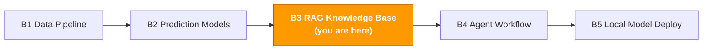

# B3. RAG Knowledge Base System

> **Track**: Path B: Developers · **Module**: B3
> **Last updated**: 2026-07-31
> **Level**: Intermediate → Advanced
> **Prerequisite**: B1 data-pipeline basics (Python, file handling), B2 basic ML concepts
> **Time**: 1 hour a day, 2–3 weeks
---




---

## Chapter Navigation

1. [RAG methodology](#1-rag-methodology) · 2. [Tool landscape](#2-tool-landscape) · 3. [Tech-stack choices](#3-tech-stack-choices-in-detail) · 4. [Hands-on code](#4-hands-on-code) · 5. [E-commerce RAG applications](#5-e-commerce-rag-applications) · 6. [Common traps](#6-common-traps) · 7. [Advanced techniques](#7-advanced-techniques) · 8. [Learning resources](#8-learning-resources)


## What You'll Build

An AI Q&A system based on internal documents — upload product manuals, policy docs, FAQs, and Review data, and the AI auto-retrieves and answers questions.

After this module you'll be able to:
- Understand the core principle and architecture of RAG (Retrieval-Augmented Generation)
- Build a usable RAG system in 10 lines of code with LlamaIndex
- Build a product-FAQ knowledge base from product manuals and Review data
- Merge multiple data sources (product docs + policy files + Reviews) into a multi-document RAG
- Persist with the Chroma vector database, avoiding rebuilding the index every time
- Run an LLM locally with Ollama, without depending on the OpenAI API
- Evaluate the RAG system's retrieval accuracy and answer quality
- Build a complete e-commerce product knowledge-base Q&A system

---

## 1. RAG Methodology

> **Related**: [A4 Customer Service & After-Sales](../a-operators/a4-customer-service.md) for applying RAG to auto-answering CS FAQs · [F3 Knowledge Base & RAG](../0-foundations/f3-rag-knowledge.md) for RAG fundamentals.

### 1.1 What is RAG

RAG (Retrieval-Augmented Generation) is the technique that lets an LLM answer questions based on your private data.

Core idea:

```
User asks → retrieve relevant passages from docs → passages + question sent to the LLM → LLM answers based on the retrieved content
```

**Why not just use ChatGPT directly?**

| Approach | Pros | Cons |
|----------|------|------|
| Ask ChatGPT directly | zero cost, ready to use | doesn't know your product details, internal policy, latest data |
| Paste docs into the chat box | simple | limited by tokens (~128k), too many docs won't fit |
| Fine-tuning | the model "remembers" your knowledge | high cost, slow to update, easily forgets old knowledge |
| **RAG** | **retrieves the latest data in real time, low cost, explainable** | **needs a retrieval system** |

RAG's core strengths are **data freshness** and **explainability**: you can update docs anytime and RAG immediately answers with the latest content; and every answer traces back to a specific source-document passage.

### 1.2 Choosing RAG vs Fine-tuning

This is the most-asked question. Simply put: RAG is for "looking things up," fine-tuning is for "changing style."

| Dimension | RAG | Fine-tuning |
|-----------|-----|-------------|
| Best scenario | answering questions based on docs (FAQ, policy lookup) | changing the model's output style or format |
| Data update | real-time (just update the docs) | needs retraining (time- and money-consuming) |
| Cost | low (just a vector DB + API calls) | high (GPU training + data labeling) |
| Hallucination control | good (answers based on retrieved docs) | poor (the model may make things up) |
| Explainability | strong (can show citation sources) | weak (black box) |
| Knowledge capacity | unlimited (unlimited doc count) | limited (bounded by model capacity) |
| Technical barrier | low (tens of lines of code) | high (needs ML-engineering experience) |

**Decision framework:**

```
What's your need?
Have AI answer questions about your docs/data → RAG
Have AI output in a specific style/format → Fine-tuning
Need both → RAG + Fine-tuning (RAG first, add fine-tuning if not enough)
Not sure → try RAG first (low cost, fast results)
```

### 1.3 Typical e-commerce RAG scenarios

| Scenario | Data source | Example user question | Value |
|----------|-------------|-----------------------|-------|
| Product FAQ | product manuals, spec sheets | "Does this camera support 4K 60fps?" | 5–10× CS efficiency |
| Policy lookup | Amazon policy docs, compliance guides | "What special requirements does the FBA return policy have for electronics?" | reduce compliance risk |
| Review insights | customer-review data | "What's the main complaint about battery life?" | product-improvement direction |
| Supplier knowledge base | supplier manuals, communication records | "What's supplier A's minimum order quantity?" | faster procurement decisions |
| Operations SOP | internal ops manuals | "How to handle an A-to-Z Claim?" | new-hire training efficiency |
| Competitor analysis | competitor Listings, Reviews | "What are competitor X's main selling points?" | differentiation strategy |

> **Key insight**: the RAG value in e-commerce is turning "knowledge scattered everywhere" into "an intelligent assistant you can query anytime." An operations team may have dozens of product manuals, hundreds of pages of policy docs, tens of thousands of Reviews — no one can remember all of it, but RAG can.

### 1.4 RAG architecture landscape

A complete RAG system has two stages:

**Stage 1: Indexing — offline prep**

```
raw docs → document loading → text chunking → embedding → store in the vector database
```

**Stage 2: Querying — online service**

```
user asks → question embedding → vector similarity search → retrieve Top-K relevant passages → construct the prompt → LLM generates the answer
```

**Key choices at each step:**

| Step | Options | Recommended (beginner) | Recommended (production) |
|------|---------|------------------------|--------------------------|
| Document loading | LlamaIndex SimpleDirectoryReader, LangChain Loaders | LlamaIndex | LlamaIndex |
| Text chunking | fixed size, by sentence, by semantics | fixed size (512 tokens) | semantic chunking |
| Embedding model | OpenAI text-embedding-3-small, BGE, E5 | OpenAI (simplest) | BGE-large (open-source, free) |
| Vector database | Chroma, FAISS, Pinecone, Weaviate | Chroma (simplest) | Pinecone (managed service) |
| LLM | Cloud T1/T2 tier, or Ollama local models | Cloud T3 fast tier | Ollama + qwen3:8b (local, free) |

---

## 2. Tool Landscape

| Tool | Type | Difficulty | Best scenario | Install |
|------|------|------------|---------------|---------|
| [LlamaIndex](https://docs.llamaindex.ai/) | RAG framework | beginner | quickly build RAG, document Q&A | `pip install llama-index` |
| [LangChain](https://docs.langchain.com/oss/python/langchain/overview) | LLM-app framework | intermediate | complex LLM workflows, Agents | `pip install langchain` |
| [Chroma](https://www.trychroma.com/) | vector database | beginner | local development, small data | `pip install chromadb` |
| [Ollama](https://ollama.com/) | local LLM | beginner | don't want the OpenAI API, data privacy | [ollama.com/download](https://ollama.com/download) |
| [OpenAI API](https://platform.openai.com/) | cloud LLM | beginner | highest-quality answers, quick prototyping | `pip install openai` |
| [Pinecone](https://www.pinecone.io/) | managed vector DB | intermediate | production, large-scale data | `pip install pinecone-client` |
| [FAISS](https://github.com/facebookresearch/faiss) | vector-search library | intermediate | high-performance, large-scale vector search | `pip install faiss-cpu` |
| [Sentence-Transformers](https://www.sbert.net/) | embedding model | intermediate | open-source, free embeddings | `pip install sentence-transformers` |

**Selection advice:**
- Just starting → LlamaIndex + OpenAI API (results in 10 lines of code)
- Don't want to pay → LlamaIndex + Ollama + Chroma (all local and free)
- Production → LlamaIndex/LangChain + Pinecone + OpenAI (stable and scalable)
- High privacy requirements → Ollama + Chroma (data never leaves your machine)

---

## 3. Tech-Stack Choices in Detail

### 3.1 LlamaIndex vs LangChain

These are the two most popular RAG frameworks, often compared:

| Dimension | LlamaIndex | LangChain |
|-----------|-----------|-----------|
| Positioning | focused on data indexing and retrieval | general LLM-app framework |
| RAG experience | out of the box, build RAG in 5 lines | needs more config, flexible but complex |
| Learning curve | gentle, clear docs | steeper, many concepts (Chain, Agent, Tool) |
| Document loading | 100+ built-in loaders | 100+ built-in loaders |
| Best scenario | document Q&A, knowledge base | complex workflows, multi-step reasoning, Agents |
| Community | active, updates fast | very active, largest ecosystem |

**Conclusion**: for beginners use LlamaIndex (simpler); bring in LangChain when you need complex workflows. This module is centered on LlamaIndex.

Reference docs: [LlamaIndex official docs](https://docs.llamaindex.ai/) | [LangChain official docs](https://docs.langchain.com/oss/python/langchain/overview)

### 3.2 Embedding-model choice

The embedding model determines retrieval quality. Pick the wrong one and retrieval is inaccurate — no matter how strong the downstream LLM.

| Model | Provider | Dimensions | Chinese support | Cost | Recommended scenario |
|-------|----------|------------|-----------------|------|----------------------|
| text-embedding-3-small | OpenAI | 1536 | yes | $0.02/1M tokens | quick prototype, good quality |
| text-embedding-3-large | OpenAI | 3072 | yes | $0.13/1M tokens | chasing highest retrieval accuracy |
| BGE-large-zh-v1.5 | BAAI | 1024 | excellent | free (local) | Chinese docs, data privacy |
| E5-large-v2 | Microsoft | 1024 | yes | free (local) | multilingual scenarios |
| all-MiniLM-L6-v2 | Sentence-Transformers | 384 | fair | free (local) | English docs, limited resources |

**E-commerce recommendations**:
- Mixed Chinese-English docs → `text-embedding-3-small` (OpenAI, most stable quality)
- Chinese-only docs + data privacy → `BGE-large-zh-v1.5` (local, free, good on Chinese)
- Tight budget → `all-MiniLM-L6-v2` (local, free, enough for English)

### 3.3 Vector-database choice

| Database | Type | Data scale | Persistence | Best scenario |
|----------|------|------------|-------------|---------------|
| Chroma | embedded | <1M vectors | local files | dev/test, small teams |
| FAISS | library (not a DB) | <10M vectors | manual save needed | high-performance search, offline |
| Pinecone | cloud-managed | unlimited | automatic in the cloud | production, ops-free |
| Weaviate | self-hosted/cloud | unlimited | automatic | need hybrid search (vector + keyword) |
| Qdrant | self-hosted/cloud | unlimited | automatic | high-performance, filtered queries |

**Recommended path**: use Chroma in the dev phase (zero config), migrate to Pinecone or Qdrant for production.

---

## 4. Hands-On Code

### 4.1 Minimal RAG: build a Q&A system in 10 lines with LlamaIndex

This is the simplest RAG system you can write. Put docs in a folder, and 10 lines of code do Q&A.

> **What this chapter's code needs**: `pip install llama-index chromadb pandas ragas datasets sentence-transformers llama-index-retrievers-bm25`

```python
# Minimal RAG — 10 lines of code
# Prerequisite: pip install llama-index openai
# Env var: export OPENAI_API_KEY="sk-..."

from llama_index.core import VectorStoreIndex, SimpleDirectoryReader

# 1. Load docs (supports .txt, .pdf, .md, .docx, .csv, etc.)
documents = SimpleDirectoryReader("data/product_docs").load_data()
print(f"Loaded {len(documents)} documents")

# 2. Build the index (auto chunk + embed + in-memory vector store)
index = VectorStoreIndex.from_documents(documents)

# 3. Create a query engine
query_engine = index.as_query_engine()

# 4. Ask
response = query_engine.query("Does this product support 4K 60fps?")
print(response)
```

That simple. LlamaIndex does everything behind the scenes:
1. `SimpleDirectoryReader` auto-detects file formats and loads them
2. `VectorStoreIndex.from_documents` auto-chunks (default 1024 tokens), calls the OpenAI Embedding API to generate vectors, stores them in memory
3. `as_query_engine()` creates a query engine, retrieving the Top-2 relevant passages by default
4. `query()` sends the retrieved passages and the question to GPT to generate an answer

> **Note**: this minimal version uses the OpenAI API and needs the `OPENAI_API_KEY` env var. It rebuilds the index each run (calling the Embedding API), incurring API cost. Later we cover persisting with Chroma and replacing OpenAI with Ollama.

**View the retrieved source documents:**

```python
# See which document passages the RAG retrieved
response = query_engine.query("What is the return policy?")

print("Answer:", response)
print("\n--- Citation sources ---")
for node in response.source_nodes:
    print(f"File: {node.metadata.get('file_name', 'unknown')}")
    print(f"Similarity: {node.score:.4f}")
    print(f"Content: {node.text[:200]}...")
    print()
```

> **Explainability**: a big advantage of RAG is that every answer traces back to source docs. This matters a lot in e-commerce — when a CS agent uses AI to answer a customer, the answer must be verifiable.

### 4.2 Product-FAQ knowledge base: build a Q&A system from product manuals

Real scenario: you have a pile of product manuals (PDF/Word/Markdown) and want AI to auto-answer product questions.

```python
import os
from pathlib import Path
from llama_index.core import (
    VectorStoreIndex,
    SimpleDirectoryReader,
    Settings,
    StorageContext,
    load_index_from_storage,
)
from llama_index.core.node_parser import SentenceSplitter

def build_product_faq(
    docs_dir: str,
    chunk_size: int = 512,
    chunk_overlap: int = 50,
    persist_dir: str = "storage/product_faq"
) -> VectorStoreIndex:
    """
    Build an FAQ knowledge base from product docs.

    Args:
        docs_dir: product-docs directory (supports .txt, .pdf, .md, .docx, .csv)
        chunk_size: chunk size (tokens)
        chunk_overlap: chunk-overlap size
        persist_dir: index-persistence directory

    Returns:
        the built vector index
    """
    # Check for an existing persisted index
    if Path(persist_dir).exists():
        print("Loading existing index...")
        storage_context = StorageContext.from_defaults(persist_dir=persist_dir)
        index = load_index_from_storage(storage_context)
        print("Index loaded")
        return index

    # 1. Load docs
    print(f"Loading docs from {docs_dir}...")
    documents = SimpleDirectoryReader(
        docs_dir,
        recursive=True,
        filename_as_id=True,
    ).load_data()
    print(f"Loaded {len(documents)} documents")

    # 2. Configure the chunking strategy
    text_splitter = SentenceSplitter(
        chunk_size=chunk_size,
        chunk_overlap=chunk_overlap,
    )
    Settings.text_splitter = text_splitter

    # 3. Build the index
    print("Building the vector index...")
    index = VectorStoreIndex.from_documents(documents, show_progress=True)

    # 4. Persist (no rebuild next time)
    index.storage_context.persist(persist_dir=persist_dir)
    print(f"Index saved to {persist_dir}")

    return index

def query_product_faq(
    index: VectorStoreIndex,
    question: str,
    top_k: int = 3,
    response_mode: str = "compact"
) -> dict:
    """
    Query the product-FAQ knowledge base.

    Args:
        index: vector index
        question: user question
        top_k: number of doc chunks to retrieve
        response_mode: answer mode
            - "compact": compress all retrieved content into a concise answer (recommended)
            - "refine": refine the answer chunk by chunk (more accurate but slower)
            - "tree_summarize": tree summarization (for long answers)
    """
    query_engine = index.as_query_engine(
        similarity_top_k=top_k,
        response_mode=response_mode,
    )

    response = query_engine.query(question)

    sources = []
    for node in response.source_nodes:
        sources.append({
            "file": node.metadata.get("file_name", "unknown"),
            "score": round(node.score, 4) if node.score else None,
            "text_preview": node.text[:300],
        })

    return {
        "question": question,
        "answer": str(response),
        "sources": sources,
        "num_sources": len(sources),
    }

# Usage example
# index = build_product_faq("data/product_docs", chunk_size=512)
#
# result = query_product_faq(index, "What's the waterproof rating of this camera?")
# print(f"Q: {result['question']}")
# print(f"A: {result['answer']}")
# print(f"\nCited {result['num_sources']} document passages:")
# for s in result['sources']:
# print(f" - {s['file']} (similarity: {s['score']})")
```

> **chunk_size tuning guide**:
> - Product spec sheets (short sentences, structured) → 256–512 tokens
> - Product manuals (paragraph-style descriptions) → 512–1024 tokens
> - Policy docs (long paragraphs, legal language) → 1024–2048 tokens
> - Not sure → start from 512, adjust by answer quality

### 4.3 Multi-document RAG: merge multiple data sources

In e-commerce, knowledge is scattered across many places: product manuals, Review data, policy docs, ops SOPs. Multi-document RAG unifies them into one Q&A system.

```python
from llama_index.core import VectorStoreIndex, SimpleDirectoryReader, Document, Settings
from llama_index.core.node_parser import SentenceSplitter
import pandas as pd

def load_review_data(csv_path: str, text_col: str = "review_text",
                     max_reviews: int = 1000) -> list:
    """Convert Review CSV data into LlamaIndex Document objects."""
    df = pd.read_csv(csv_path)

    if len(df) > max_reviews:
        df = df.sort_values("rating", ascending=True).head(max_reviews)

    documents = []
    for _, row in df.iterrows():
        text = str(row.get(text_col, ""))
        if len(text.strip()) < 10:
            continue

        metadata = {
            "source": "customer_review",
            "rating": int(row.get("rating", 0)),
            "asin": str(row.get("asin", "")),
            "date": str(row.get("date", "")),
        }
        doc = Document(text=text, metadata=metadata)
        documents.append(doc)

    print(f"Loaded {len(documents)} reviews")
    return documents

def build_multi_source_rag(
    product_docs_dir: str = None,
    policy_docs_dir: str = None,
    review_csv: str = None,
    sop_docs_dir: str = None,
    chunk_size: int = 512,
) -> VectorStoreIndex:
    """
    Build a multi-data-source RAG index.
    Merge multiple document types into the same vector index;
    each document carries a source metadata for easy filtering and tracing.
    """
    all_documents = []

    if product_docs_dir:
        docs = SimpleDirectoryReader(product_docs_dir).load_data()
        for doc in docs:
            doc.metadata["source"] = "product_manual"
        all_documents.extend(docs)
        print(f"Product docs: {len(docs)}")

    if policy_docs_dir:
        docs = SimpleDirectoryReader(policy_docs_dir).load_data()
        for doc in docs:
            doc.metadata["source"] = "policy"
        all_documents.extend(docs)
        print(f"Policy docs: {len(docs)}")

    if review_csv:
        review_docs = load_review_data(review_csv)
        all_documents.extend(review_docs)

    if sop_docs_dir:
        docs = SimpleDirectoryReader(sop_docs_dir).load_data()
        for doc in docs:
            doc.metadata["source"] = "sop"
        all_documents.extend(docs)
        print(f"SOP docs: {len(docs)}")

    print(f"\nTotal: {len(all_documents)} documents")

    Settings.text_splitter = SentenceSplitter(chunk_size=chunk_size, chunk_overlap=50)
    index = VectorStoreIndex.from_documents(all_documents, show_progress=True)

    print("Multi-source RAG index built")
    return index

def query_with_source_filter(
    index: VectorStoreIndex,
    question: str,
    source_filter: str = None,
    top_k: int = 5,
) -> dict:
    """
    Query with data-source filtering.

    Args:
        source_filter: data-source filter
            - None: search all sources
            - "product_manual": search product docs only
            - "policy": search policy docs only
            - "customer_review": search Reviews only
            - "sop": search SOPs only
    """
    from llama_index.core.vector_stores import (
        MetadataFilter, MetadataFilters, FilterOperator,
    )

    filters = None
    if source_filter:
        filters = MetadataFilters(filters=[
            MetadataFilter(key="source", operator=FilterOperator.EQ, value=source_filter)
        ])

    query_engine = index.as_query_engine(similarity_top_k=top_k, filters=filters)
    response = query_engine.query(question)

    sources = []
    for node in response.source_nodes:
        sources.append({
            "source_type": node.metadata.get("source", "unknown"),
            "file": node.metadata.get("file_name", ""),
            "score": round(node.score, 4) if node.score else None,
        })

    return {"question": question, "answer": str(response), "sources": sources}

# Usage example
# index = build_multi_source_rag(
# product_docs_dir="data/product_docs",
# policy_docs_dir="data/policy_docs",
# review_csv="data/reviews.csv",
# )
# result = query_with_source_filter(index, "What do customers say about battery life?")
# result = query_with_source_filter(index, "What is the FBA return policy?", source_filter="policy")
```

> **The value of multi-source RAG**: when a CS agent asks "Is this product's return rate high?", the system can simultaneously find customer complaints in Review data, return rules in policy docs, and the handling process in the SOP, giving one comprehensive answer.

### 4.4 Chroma vector database: persistence and incremental updates

The earlier examples rebuild the index each run, wasting time and API cost. Chroma persists vectors to disk and supports incrementally adding new docs.

```python
import chromadb
from llama_index.core import VectorStoreIndex, SimpleDirectoryReader, StorageContext
from llama_index.vector_stores.chroma import ChromaVectorStore

def create_chroma_index(
    docs_dir: str,
    collection_name: str = "product_knowledge",
    persist_dir: str = "chroma_db",
) -> VectorStoreIndex:
    """
    Create a persisted vector index with Chroma.

    Chroma's advantages:
    - Data persisted to disk, survives restart
    - Supports incrementally adding docs (no need to rebuild the whole index)
    - Supports metadata filtering
    - Zero-config, embedded operation
    """
    chroma_client = chromadb.PersistentClient(path=persist_dir)
    chroma_collection = chroma_client.get_or_create_collection(name=collection_name)

    print(f"Collection '{collection_name}': {chroma_collection.count()} existing vectors")

    vector_store = ChromaVectorStore(chroma_collection=chroma_collection)
    storage_context = StorageContext.from_defaults(vector_store=vector_store)

    documents = SimpleDirectoryReader(docs_dir).load_data()
    index = VectorStoreIndex.from_documents(
        documents, storage_context=storage_context, show_progress=True
    )

    print(f"Index built, {chroma_collection.count()} vectors total")
    return index

def load_existing_chroma_index(
    collection_name: str = "product_knowledge",
    persist_dir: str = "chroma_db",
) -> VectorStoreIndex:
    """Load an existing Chroma index (no rebuild)."""
    chroma_client = chromadb.PersistentClient(path=persist_dir)
    chroma_collection = chroma_client.get_collection(name=collection_name)
    vector_store = ChromaVectorStore(chroma_collection=chroma_collection)
    index = VectorStoreIndex.from_vector_store(vector_store)
    print(f"Loaded existing index: {chroma_collection.count()} vectors")
    return index

def add_documents_to_index(index: VectorStoreIndex, new_docs_dir: str) -> int:
    """Incrementally add new docs to the existing index. No need to rebuild the whole index."""
    new_documents = SimpleDirectoryReader(new_docs_dir).load_data()
    for doc in new_documents:
        index.insert(doc)
    print(f"Added {len(new_documents)} documents to the index")
    return len(new_documents)

# Usage example
# index = create_chroma_index("data/product_docs", persist_dir="chroma_db")
# index = load_existing_chroma_index(persist_dir="chroma_db") # loads in seconds
# add_documents_to_index(index, "data/new_docs") # incremental update
```

> **Chroma vs in-memory storage**: for a 100-doc index, in-memory mode costs 30 seconds + $0.01 API on each startup; Chroma mode loads in <1 second at zero cost.

### 4.5 Local RAG (Ollama): no OpenAI dependency, protect business-data privacy

E-commerce data (product cost, supplier info, sales data) is a trade secret. Ollama lets you run an LLM locally, data never leaving your machine.

**Ollama install and model download:**

```bash
# 1. Install Ollama (macOS) — download from https://ollama.com/download

# 2. Download models
ollama pull qwen3:8b # recommended: good at both Chinese/English, 7B params
ollama pull gemma3:12b # Meta open-source, excellent English
ollama pull nomic-embed-text # embedding model (free OpenAI replacement)

# 3. Verify
ollama list # view downloaded models
```

**Build a fully local RAG with Ollama:**

```python
from llama_index.core import VectorStoreIndex, SimpleDirectoryReader, Settings
from llama_index.llms.ollama import Ollama
from llama_index.embeddings.ollama import OllamaEmbedding

def build_local_rag(
    docs_dir: str,
    llm_model: str = "qwen3:8b",
    embed_model: str = "nomic-embed-text",
    ollama_base_url: str = "http://localhost:11434",
) -> VectorStoreIndex:
    """
    Build a fully local RAG system (no external API calls at all).

    Prerequisite:
    1. Ollama installed
    2. LLM model downloaded: ollama pull qwen3:8b
    3. Embedding model downloaded: ollama pull nomic-embed-text
    """
    # Configure the local LLM
    llm = Ollama(
        model=llm_model,
        base_url=ollama_base_url,
        request_timeout=120.0,
        temperature=0.1,
    )

    # Configure the local embedding
    embed = OllamaEmbedding(
        model_name=embed_model,
        base_url=ollama_base_url,
    )

    # Set global config (replaces OpenAI)
    Settings.llm = llm
    Settings.embed_model = embed

    # Load docs and build the index
    documents = SimpleDirectoryReader(docs_dir).load_data()
    print(f"Loaded {len(documents)} documents")

    index = VectorStoreIndex.from_documents(documents, show_progress=True)

    print(f"Local RAG built (LLM: {llm_model}, Embed: {embed_model})")
    print("All data processed locally, not sent to any external service")
    return index

# Usage example
# index = build_local_rag("data/product_docs")
# engine = index.as_query_engine(similarity_top_k=3)
# response = engine.query("How long is this product's warranty?")
```

**Local vs cloud RAG comparison:**

| Dimension | Local RAG (Ollama) | Cloud RAG (OpenAI) |
|-----------|---------------------|--------------------|
| Data privacy | data never leaves your machine | data sent to OpenAI's servers |
| Cost | free (except electricity) | billed per token |
| Answer quality | an 8B local model is usable | cloud T1 frontier tier, highest |
| Speed | depends on hardware (M1 Mac ~30 tokens/s) | fast (cloud GPU) |
| Offline use | no network needed | needs network |
| Hardware requirement | 7B model needs 8GB+ RAM | none |

> **Recommended strategy**: use OpenAI in the dev phase (high answer quality, easy to debug); in production decide by data sensitivity. Use Ollama local deployment for trade secrets.

### 4.6 RAG evaluation: how to measure answer quality

You must evaluate quality before launching a RAG system. Launching without evaluation is like putting an untrained CS agent directly in front of customers.

RAG evaluation has three core dimensions:

| Dimension | Meaning | What it measures |
|-----------|---------|------------------|
| Faithfulness | is the answer based on retrieved docs | did the LLM "fabricate" content not in the docs |
| Relevancy | is the answer relevant to the question | did the answer go off-topic |
| Context Recall | do the retrieved docs contain the correct answer | did retrieval miss key information |

**Evaluate with the RAGAS framework:**

```python
# pip install ragas

from ragas import evaluate
from ragas.metrics import (
    faithfulness, answer_relevancy,
    context_precision, context_recall,
)
from datasets import Dataset

def evaluate_rag_quality(
    questions: list[str],
    answers: list[str],
    contexts: list[list[str]],
    ground_truths: list[str] = None,
) -> dict:
    """
    Evaluate RAG-system quality with the RAGAS framework.

    Args:
        questions: list of test questions
        answers: list of the RAG system's answers
        contexts: list of contexts retrieved for each question
        ground_truths: reference answers (optional; more accurate evaluation if provided)
    """
    data = {
        "question": questions,
        "answer": answers,
        "contexts": contexts,
    }

    metrics = [faithfulness, answer_relevancy, context_precision]

    if ground_truths:
        data["ground_truth"] = ground_truths
        metrics.append(context_recall)

    dataset = Dataset.from_dict(data)
    result = evaluate(dataset=dataset, metrics=metrics)

    print("RAG evaluation results:")
    print(f"Faithfulness: {result['faithfulness']:.3f}")
    print(f"Answer Relevancy: {result['answer_relevancy']:.3f}")
    print(f"Context Precision: {result['context_precision']:.3f}")
    if ground_truths:
        print(f"Context Recall: {result['context_recall']:.3f}")

    return dict(result)

def create_eval_dataset(index, eval_questions: list[dict]) -> tuple:
    """
    Generate an evaluation dataset from the RAG system.

    Args:
        eval_questions: [{"question": "...", "ground_truth": "..."}, ...]
    """
    questions, answers, contexts, ground_truths = [], [], [], []
    query_engine = index.as_query_engine(similarity_top_k=3)

    for item in eval_questions:
        q = item["question"]
        response = query_engine.query(q)

        questions.append(q)
        answers.append(str(response))
        contexts.append([node.text for node in response.source_nodes])
        if "ground_truth" in item:
            ground_truths.append(item["ground_truth"])

    return questions, answers, contexts, ground_truths or None

# Usage example
# eval_questions = [
# {"question": "Does this camera support 4K 60fps?", "ground_truth": "Yes, it supports 4K 60fps video recording."},
# {"question": "How long is the battery life?", "ground_truth": "About 2 hours in standard mode."},
# {"question": "What's the waterproof rating?", "ground_truth": "IPX8, usable at 10m depth."},
# ]
# questions, answers, contexts, truths = create_eval_dataset(index, eval_questions)
# results = evaluate_rag_quality(questions, answers, contexts, truths)
```

**Evaluation-metric reference benchmarks:**

| Metric | Excellent | Good | Needs improvement |
|--------|-----------|------|-------------------|
| Faithfulness | > 0.90 | 0.75–0.90 | < 0.75 |
| Answer Relevancy | > 0.85 | 0.70–0.85 | < 0.70 |
| Context Precision | > 0.80 | 0.60–0.80 | < 0.60 |
| Context Recall | > 0.85 | 0.70–0.85 | < 0.70 |

**What if the evaluation results are poor?**

| Issue | Possible cause | Solution |
|-------|----------------|----------|
| Low faithfulness | the LLM is fabricating | stress "answer only based on the provided docs" in the prompt |
| Low relevancy | the answer goes off-topic | check whether the retrieved docs are relevant, adjust top_k |
| Low context precision | irrelevant docs retrieved | adjust chunk_size, switch the embedding model |
| Low context recall | the correct answer wasn't retrieved | increase top_k, check the docs are correctly chunked |

> **Evaluation ROI**: preparing 20–30 evaluation questions (with reference answers) takes about 2 hours. But those 2 hours help you find 80% of the quality problems, avoiding post-launch complaints of "the AI is making things up."
---

## 5. E-Commerce RAG Applications

### 5.1 Auto-answer CS system

The most direct RAG application: train a CS AI with product manuals and FAQ docs to auto-answer common customer questions.

```python
from llama_index.core import VectorStoreIndex, SimpleDirectoryReader, Settings
from llama_index.core.prompts import PromptTemplate

# Custom CS prompt — controls answer style and boundaries
CUSTOMER_SERVICE_PROMPT = PromptTemplate(
    """You are a professional e-commerce CS assistant. Answer the customer's question based on the product docs below.

Rules:
1. Answer only based on the provided doc content, don't make up information
2. If the docs have no relevant info, say "Sorry, I need to transfer you to a human agent"
3. Answers should be concise, friendly, professional
4. If it involves returns/refunds, guide the customer to contact official CS

Product docs:
{context_str}

Customer question: {query_str}

Answer:"""
)

def build_customer_service_bot(docs_dir: str, chunk_size: int = 256) -> VectorStoreIndex:
    """
    Build a CS Q&A bot.

    Special config for CS scenarios:
    - smaller chunk_size (256): CS questions are usually very specific, small-chunk retrieval is more precise
    - larger top_k (5): retrieve a few more passages to reduce misses
    - custom prompt: control answer style and safety boundaries
    """
    from llama_index.core.node_parser import SentenceSplitter

    Settings.text_splitter = SentenceSplitter(chunk_size=chunk_size, chunk_overlap=30)
    documents = SimpleDirectoryReader(docs_dir, recursive=True).load_data()
    index = VectorStoreIndex.from_documents(documents, show_progress=True)

    print(f"CS knowledge base built: {len(documents)} documents")
    return index

def answer_customer_question(index: VectorStoreIndex, question: str) -> dict:
    """Answer a customer question, with source traceability."""
    query_engine = index.as_query_engine(
        similarity_top_k=5,
        text_qa_template=CUSTOMER_SERVICE_PROMPT,
    )
    response = query_engine.query(question)

    return {
        "question": question,
        "answer": str(response),
        "confidence": "high" if response.source_nodes
                      and response.source_nodes[0].score
                      and response.source_nodes[0].score > 0.8
                      else "medium",
        "sources": [node.metadata.get("file_name", "") for node in response.source_nodes],
    }

# Usage example
# index = build_customer_service_bot("data/customer_service_docs")
# for q in ["Is this camera waterproof?", "How long does the battery last?", "How do I return it?"]:
# result = answer_customer_question(index, q)
# print(f"Q: {result['question']}")
# print(f"A: {result['answer']} (confidence: {result['confidence']})\n")
```

### 5.2 Compliance-document lookup system

Amazon's policy docs are many and long, and the compliance team often needs to look up specific policies. RAG can turn hundreds of pages of policy docs into an instant-query system.

```python
def build_compliance_rag(policy_docs_dir: str, chunk_size: int = 1024) -> VectorStoreIndex:
    """
    Build a compliance-policy lookup system.

    Special handling for policy docs:
    - larger chunk_size (1024): policy clauses are usually long, need full context
    - larger overlap (100): avoid truncating clauses
    """
    from llama_index.core.node_parser import SentenceSplitter

    Settings.text_splitter = SentenceSplitter(chunk_size=chunk_size, chunk_overlap=100)

    documents = SimpleDirectoryReader(policy_docs_dir, recursive=True).load_data()

    for doc in documents:
        filename = doc.metadata.get("file_name", "")
        if "fba" in filename.lower():
            doc.metadata["policy_area"] = "FBA"
        elif "advertising" in filename.lower():
            doc.metadata["policy_area"] = "Advertising"
        elif "brand" in filename.lower():
            doc.metadata["policy_area"] = "Brand Registry"
        else:
            doc.metadata["policy_area"] = "General"

    index = VectorStoreIndex.from_documents(documents, show_progress=True)
    print(f"Compliance knowledge base built: {len(documents)} policy documents")
    return index

# Usage example
# index = build_compliance_rag("data/amazon_policies")
# engine = index.as_query_engine(similarity_top_k=5)
# response = engine.query("What special requirements does the FBA return policy have for electronics?")
```

### 5.3 Internal-training knowledge base

New hires need to learn a lot of operations knowledge. RAG can turn training docs, SOPs, and past cases into an "always-available mentor."

```python
def build_training_rag(
    sop_dir: str = None, case_study_dir: str = None, faq_dir: str = None,
) -> VectorStoreIndex:
    """
    Build an internal-training knowledge base.
    Data sources: SOP docs, case library, FAQ
    """
    all_docs = []

    for dir_path, doc_type in [(sop_dir, "sop"), (case_study_dir, "case_study"), (faq_dir, "faq")]:
        if dir_path:
            docs = SimpleDirectoryReader(dir_path).load_data()
            for d in docs:
                d.metadata["doc_type"] = doc_type
            all_docs.extend(docs)

    index = VectorStoreIndex.from_documents(all_docs, show_progress=True)
    print(f"Training knowledge base: {len(all_docs)} documents")
    return index

# Usage example
# index = build_training_rag(sop_dir="data/sop", case_study_dir="data/cases", faq_dir="data/faq")
# engine = index.as_query_engine()
# response = engine.query("How do I handle an A-to-Z Claim?")
```

> **The ROI of training RAG**: a new hire usually needs 2–4 weeks to get familiar with all processes. With training RAG, new hires can ask anytime, lifting learning efficiency by over 50%. And RAG's answers are consistent — they don't vary by "who's asking."

---

## 6. Common Traps

<!-- claims: illustrative -->

> The numbers in this section are constructed to illustrate the point, not measured.


### 6.1 Poor retrieval quality

This is the most common RAG-system problem. 80% of the time a poor answer is due to inaccurate retrieval.

| Symptom | Possible cause | Solution |
|---------|----------------|----------|
| Answer completely irrelevant | the embedding model doesn't fit your docs' language | switch to BGE-large-zh for Chinese, OpenAI for English |
| Answer partly correct but misses key info | top_k too small, didn't retrieve the key passage | increase top_k (from 2 to 5) |
| Retrieved relevant docs but the answer is wrong | the LLM didn't correctly understand the context | optimize the prompt, explicitly require "answer only based on the docs" |
| Simple questions correct, complex ones wrong | the answer spans multiple doc chunks, a single chunk is incomplete | increase chunk_size or use overlap |

**How to debug retrieval quality:**

```python
def debug_retrieval(index, question: str, top_k: int = 5):
    """
    Debug the retrieval result — see what the RAG actually retrieved.
    When answer quality is poor, check the retrieval step with this function first.
    """
    retriever = index.as_retriever(similarity_top_k=top_k)
    nodes = retriever.retrieve(question)

    print(f"Question: {question}")
    print(f"Retrieved {len(nodes)} document chunks:\n")

    for i, node in enumerate(nodes):
        score = f"{node.score:.4f}" if node.score else "N/A"
        file_name = node.metadata.get("file_name", "unknown")
        print(f"[{i+1}] Similarity: {score} | File: {file_name}")
        print(f"Content: {node.text[:200]}...")
        print()
    return nodes
```

### 6.2 Wrong chunk size

| chunk_size | Effect | Best scenario |
|-----------|--------|---------------|
| 128–256 | precise retrieval but loses context | FAQ, product specs (short sentences) |
| 512 | balances precision and context | general (recommended starting point) |
| 1024 | rich context but retrieval may be imprecise | policy docs, long paragraphs |
| 2048+ | complete context but noisy retrieval | rarely used |

**Rule of thumb**: start from 512, increase if answers lack context, decrease if answers contain too much irrelevant info.

### 6.3 Hallucination

The LLM may "fabricate" information not in the docs. This is very dangerous in CS scenarios.

**How to reduce hallucination:**

1. **Prompt constraints**: explicitly require in the prompt "answer only based on the provided docs; if there's no relevant info, say you don't know"
2. **Lower the temperature**: `temperature=0.1` makes the model more deterministic, reducing creative flourish
3. **Increase top_k**: retrieve more docs, giving the LLM more reference info
4. **Use Faithfulness evaluation**: periodically detect the hallucination rate with RAGAS
5. **Show citation sources**: let users verify the basis of the answer

```python
# Anti-hallucination prompt template
ANTI_HALLUCINATION_PROMPT = """Answer the question based on the docs below.

Important rules:
- Use only information explicitly mentioned in the docs
- If the docs have no relevant info, answer "Based on the available docs, I can't find an answer to this question"
- Don't speculate or add content not in the docs
- Note the information source at the end of the answer

Doc content:
{context_str}

Question: {query_str}

Answer:"""
```

### 6.4 Context-window limit

Even if many relevant docs are retrieved, the LLM's context window has a limit.

| Model | Context window | Suggested top_k |
|-------|----------------|-----------------|
| Cloud T3 fast tier | 1M+ tokens | 5–10 |
| Cloud T1 frontier tier | 1M+ tokens | 5–10 |
| Qwen3 8B | 32k tokens | 3–5 |
| Gemma 3 12B | 128k tokens | 5–8 |

**Formula**: `top_k × chunk_size < 50% of the model's context window` (leave half for the prompt and answer)

> **Common mistake**: setting top_k=20, chunk_size=1024, retrieving 20k tokens of context. For a local model with a 32k window, that's already over 60%, leaving insufficient space for the answer, causing truncation or quality drop.
---

## 7. Advanced Techniques

### 7.1 Hybrid Search (keyword + vector)

Pure vector search has a weakness: it's not great at exact keyword matching. For example, if a user searches "ASIN B0XXXXX," vector search may not find it because the ASIN has no semantic meaning.

Hybrid Search combines the strengths of keyword search (BM25) and vector search:

```python
from llama_index.core import VectorStoreIndex, SimpleDirectoryReader
from llama_index.retrievers.bm25 import BM25Retriever
from llama_index.core.retrievers import QueryFusionRetriever

def build_hybrid_search(
    docs_dir: str,
    vector_top_k: int = 3,
    bm25_top_k: int = 3,
) -> tuple:
    """
    Build hybrid search (vector + BM25 keyword).

    How it works:
    1. Vector search: finds semantically similar docs ("camera waterproof" → "the camera can be used underwater")
    2. BM25 search: finds keyword-matched docs ("B0XXXXX" → docs containing that ASIN)
    3. Fusion ranking: merge the two result lists with Reciprocal Rank Fusion
    """
    documents = SimpleDirectoryReader(docs_dir).load_data()
    index = VectorStoreIndex.from_documents(documents, show_progress=True)

    vector_retriever = index.as_retriever(similarity_top_k=vector_top_k)

    from llama_index.core.node_parser import SentenceSplitter
    splitter = SentenceSplitter(chunk_size=512)
    nodes = splitter.get_nodes_from_documents(documents)
    bm25_retriever = BM25Retriever.from_defaults(nodes=nodes, similarity_top_k=bm25_top_k)

    hybrid_retriever = QueryFusionRetriever(
        retrievers=[vector_retriever, bm25_retriever],
        similarity_top_k=vector_top_k + bm25_top_k,
        num_queries=1,
        mode="reciprocal_rerank",
    )

    print("Hybrid search built (vector + BM25)")
    return hybrid_retriever, index

# Usage example
# retriever, index = build_hybrid_search("data/product_docs")
# nodes = retriever.retrieve("spec parameters of ASIN B0XXXXX") # BM25 excels
# nodes = retriever.retrieve("Can this product be used underwater?") # vector search excels
```

> **When do you need Hybrid Search?** When your docs contain lots of proper nouns (ASIN, SKU, model number), numbers (price, size), or code, pure vector search works poorly, and Hybrid Search can meaningfully improve retrieval quality.

### 7.2 Re-ranking

Retrieved docs are sorted by similarity, but high similarity isn't necessarily most relevant. Re-ranking uses a more precise model to re-sort the retrieval results.

```python
from llama_index.core import VectorStoreIndex
from llama_index.core.postprocessor import SentenceTransformerRerank

def query_with_reranking(
    index: VectorStoreIndex,
    question: str,
    initial_top_k: int = 10,
    final_top_k: int = 3,
    rerank_model: str = "cross-encoder/ms-marco-MiniLM-L-6-v2",
) -> str:
    """
    Query with Re-ranking.

    Flow:
    1. First retrieve initial_top_k candidate docs with vector search (coarse filter)
    2. Re-score the candidates with a Cross-Encoder model (fine sort)
    3. Take the final_top_k most relevant docs to generate the answer
    """
    reranker = SentenceTransformerRerank(model=rerank_model, top_n=final_top_k)

    query_engine = index.as_query_engine(
        similarity_top_k=initial_top_k,
        node_postprocessors=[reranker],
    )

    response = query_engine.query(question)
    return str(response)
```

### 7.3 Agent + RAG

An Agent can automatically decide, based on the user's question, whether to query product docs, policy docs, or Review data. Smarter than manually specifying the data source.

```python
from llama_index.core import VectorStoreIndex, SimpleDirectoryReader
from llama_index.core.tools import QueryEngineTool, ToolMetadata
from llama_index.core.agent import ReActAgent

def build_rag_agent(
    product_docs_dir: str,
    policy_docs_dir: str,
    review_docs_dir: str,
) -> ReActAgent:
    """
    Build a RAG Agent — auto-selects the data source to answer questions.

    The Agent auto-judges which knowledge base to query based on the question:
    - Product-related questions → query product docs
    - Policy-related questions → query policy docs
    - Customer-feedback questions → query Review data
    """
    product_index = VectorStoreIndex.from_documents(
        SimpleDirectoryReader(product_docs_dir).load_data()
    )
    policy_index = VectorStoreIndex.from_documents(
        SimpleDirectoryReader(policy_docs_dir).load_data()
    )
    review_index = VectorStoreIndex.from_documents(
        SimpleDirectoryReader(review_docs_dir).load_data()
    )

    tools = [
        QueryEngineTool(
            query_engine=product_index.as_query_engine(),
            metadata=ToolMetadata(
                name="product_knowledge",
                description="Query product specs, features, usage, and other product-related info.",
            ),
        ),
        QueryEngineTool(
            query_engine=policy_index.as_query_engine(),
            metadata=ToolMetadata(
                name="policy_knowledge",
                description="Query Amazon policies, compliance requirements, return rules, etc.",
            ),
        ),
        QueryEngineTool(
            query_engine=review_index.as_query_engine(),
            metadata=ToolMetadata(
                name="review_insights",
                description="Query customer reviews, feedback, complaints, etc.",
            ),
        ),
    ]

    agent = ReActAgent.from_tools(tools, verbose=True)
    print("RAG Agent built (3 knowledge-base tools)")
    return agent

# Usage example
# agent = build_rag_agent("data/product_docs", "data/policy_docs", "data/review_docs")
# response = agent.chat("Does this camera support 4K 60fps?") # → queries product knowledge
# response = agent.chat("What is the FBA return policy?") # → queries policy knowledge
# response = agent.chat("What do customers say about battery life? How long does the manual claim?") # → queries multiple knowledge bases
```

> **The value of Agent + RAG**: plain RAG needs the user to know "which knowledge base I should query." Agent + RAG lets the AI auto-judge; the user just asks and the system routes to the correct data source. This is the qualitative leap from "tool" to "assistant."
>
> For more on Agents, see [B4 Agent Workflow](b4-agent-workflow.md).

---

## 8. Learning Resources

### 8.1 Free courses and docs

| Resource | Platform | Length | For whom | Link |
|----------|----------|--------|----------|------|
| LlamaIndex official docs | LlamaIndex | continuously updated | RAG beginner to advanced | [docs.llamaindex.ai](https://docs.llamaindex.ai/) |
| Building Agentic RAG | DeepLearning.AI | 1h | RAG + Agent combination | [deeplearning.ai](https://www.deeplearning.ai/courses/building-agentic-rag-with-llamaindex) |
| LangChain official docs | LangChain | continuously updated | LLM-app development | [python.langchain.com](https://docs.langchain.com/oss/python/langchain/overview) |
| HuggingFace NLP Course | HuggingFace | 10h+ | NLP and embedding basics | [huggingface.co/learn/nlp-course](https://huggingface.co/learn/nlp-course) |
| Chroma official docs | Chroma | 2h | vector-database intro | [trychroma.com](https://www.trychroma.com/) |
| Ollama official docs | Ollama | 1h | local LLM deployment | [ollama.com](https://ollama.com/) |

### 8.2 Recommended GitHub repos

| Repo | Stars | Use |
|------|-------|-----|
| [LlamaIndex](https://github.com/run-llama/llama_index) | 37k+ | RAG framework core library |
| [LangChain](https://github.com/langchain-ai/langchain) | 98k+ | LLM-app framework |
| [Chroma](https://github.com/chroma-core/chroma) | 16k+ | open-source vector database |
| [FAISS](https://github.com/facebookresearch/faiss) | 32k+ | high-performance vector search |
| [Ollama](https://github.com/ollama/ollama) | 105k+ | local LLM running |
| [RAGAS](https://github.com/explodinggradients/ragas) | 7k+ | RAG-evaluation framework |

## 9. Completion Checklist

- [ ] Built a minimal RAG in 10 lines with LlamaIndex, answering questions from product docs
- [ ] Built a product knowledge base from product manuals/FAQ docs, supporting at least 3 file formats (.txt, .md, .pdf)
- [ ] Built a multi-document RAG merging at least 2 data sources (e.g., product manuals + Review data), supporting source-filtered queries
- [ ] Persisted the vector index with Chroma, verifying it loads in seconds after restart (without re-calling the Embedding API)
- [ ] Built a fully local RAG system with Ollama, verifying Q&A without any external API
- [ ] Evaluated the RAG system's quality with RAGAS, Faithfulness > 0.75 and Answer Relevancy > 0.70

Complete all of the above and you've mastered the core skills of a RAG knowledge-base system. Next: [B4 Agent Workflow](b4-agent-workflow.md) — build an autonomous decision-making AI Agent.

---

## When this doesn't work

- **You have few enough documents to paste in whole.** Today's context windows hold hundreds of thousands of characters. A few dozen product manuals pasted directly are more accurate and easier to maintain than a retrieval chain — the retrieval layer only adds a stage that can fail. The boundary section in [F3](../0-foundations/f3-rag-knowledge.md) makes the same point.
- **The question needs an aggregate, not a location.** "The five SKUs with the lowest margin" is not something retrieval answers — it returns similar passages, not a total. Query a database. Retrieval QA is good at "where did we say X", not at "how much X is there".
- **Nobody maintains the knowledge base.** RAG faithfully returns what you gave it. One stale fee schedule, policy document or SOP and the system will confidently serve the stale answer — and it is harder to catch than someone leafing through the wrong file. Decide who updates the documents and how often before you launch. That matters more than chunk_size.
- **The answers go straight to customers with no fallback.** When retrieval comes up empty, the model invents. For external use you have to instruct the prompt to say it does not know, test that it actually does on edge questions, and keep a path for a human to take over. Adding the instruction without testing it is the same as not doing it.

---

## Appendix

<!-- claims: illustrative -->

> The numbers in this section are constructed to illustrate the point, not measured.

### Appendix A: RAG architecture diagram

```

RAG system architecture


product manuals policy docs Review data
(.pdf/.md) (.pdf/.docx) (.csv)


document loading (SimpleDirectoryReader)


text chunking (SentenceSplitter)
chunk_size=512, overlap=50


embedding (Embedding Model)
OpenAI / BGE / Ollama


vector database (Chroma / FAISS)
persisted storage, supports incremental updates


indexing stage (offline) querying stage (online)


user asks


similarity search (Top-K) + Re-ranking


prompt construction + LLM generates the answer


answer + citation sources


```

### Appendix B: code cheat sheet

```python
# === LlamaIndex basic RAG ===
from llama_index.core import VectorStoreIndex, SimpleDirectoryReader

documents = SimpleDirectoryReader("docs/").load_data() # load docs
index = VectorStoreIndex.from_documents(documents) # build the index
engine = index.as_query_engine() # create the query engine
response = engine.query("your question") # ask

# === View retrieval sources ===
for node in response.source_nodes:
    print(node.metadata["file_name"], node.score, node.text[:100])

# === Custom chunking ===
from llama_index.core.node_parser import SentenceSplitter
from llama_index.core import Settings
Settings.text_splitter = SentenceSplitter(chunk_size=512, chunk_overlap=50)

# === Chroma persistence ===
import chromadb
from llama_index.vector_stores.chroma import ChromaVectorStore
from llama_index.core import StorageContext

client = chromadb.PersistentClient(path="chroma_db")
collection = client.get_or_create_collection("my_collection")
vector_store = ChromaVectorStore(chroma_collection=collection)
storage_ctx = StorageContext.from_defaults(vector_store=vector_store)
index = VectorStoreIndex.from_documents(docs, storage_context=storage_ctx)

# Load an existing index
index = VectorStoreIndex.from_vector_store(vector_store)

# === Ollama local RAG ===
from llama_index.llms.ollama import Ollama
from llama_index.embeddings.ollama import OllamaEmbedding
Settings.llm = Ollama(model="qwen3:8b", request_timeout=120)
Settings.embed_model = OllamaEmbedding(model_name="nomic-embed-text")

# === Metadata filtering ===
from llama_index.core.vector_stores import MetadataFilter, MetadataFilters, FilterOperator
filters = MetadataFilters(filters=[
    MetadataFilter(key="source", operator=FilterOperator.EQ, value="policy")
])
engine = index.as_query_engine(filters=filters)

# === Re-ranking ===
from llama_index.core.postprocessor import SentenceTransformerRerank
reranker = SentenceTransformerRerank(model="cross-encoder/ms-marco-MiniLM-L-6-v2", top_n=3)
engine = index.as_query_engine(similarity_top_k=10, node_postprocessors=[reranker])

# === RAGAS evaluation ===
from ragas import evaluate
from ragas.metrics import faithfulness, answer_relevancy
from datasets import Dataset
dataset = Dataset.from_dict({
    "question": questions, "answer": answers,
    "contexts": contexts, "ground_truth": truths,
})
result = evaluate(dataset=dataset, metrics=[faithfulness, answer_relevancy])
```

### Appendix C: dependency installation

```bash
# Basic RAG (LlamaIndex + OpenAI)
pip install llama-index openai

# Chroma vector database
pip install llama-index-vector-stores-chroma chromadb

# Ollama local LLM
pip install llama-index-llms-ollama llama-index-embeddings-ollama

# BM25 hybrid search
pip install llama-index-retrievers-bm25

# Re-ranking
pip install sentence-transformers

# RAG evaluation
pip install ragas datasets

# Install everything
pip install llama-index openai \
llama-index-vector-stores-chroma chromadb \
llama-index-llms-ollama llama-index-embeddings-ollama \
llama-index-retrievers-bm25 \
sentence-transformers \
ragas datasets pandas
```

> **Install tip**: LlamaIndex v0.10+ uses a modular architecture; the core `llama-index` package only has base features, and vector databases, LLM providers, etc. need their integration packages installed separately (e.g., `llama-index-vector-stores-chroma`).
---
### Appendix D: FAQ

**Q: Can RAG and Fine-tuning be used together?**
A: Yes. Use RAG for knowledge retrieval first, then a fine-tuned model to generate answers that better match your style. But for most scenarios, RAG alone is enough.

**Q: What if the docs are updated?**
A: Use Chroma's incremental-update feature (`index.insert(new_doc)`), no need to rebuild the whole index. If a doc is modified (not added), delete the old vectors and re-insert.

**Q: How to handle multilingual docs?**
A: Use a multilingual-capable embedding model (like OpenAI `text-embedding-3-small` or `paraphrase-multilingual-MiniLM-L12-v2`). Mixed Chinese-English docs can go in the same index.

**Q: How to optimize the RAG system's response speed?**
A: Three directions: (1) use Chroma persistence to avoid rebuilding the index; (2) reduce top_k to lower LLM input volume; (3) drop to a lower tier (T3 fast is typically 3×+ faster than T1 frontier).

**Q: What about very large data (100k+ docs)?**
A: Local Chroma may not suffice; consider migrating to Pinecone (cloud-managed) or Qdrant (self-hosted). Also optimize chunk_size and the embedding-model choice.

[< B2 Prediction Models](b2-prediction-models.md) | [Path overview](../README.md) | [B4 Agent >](b4-agent-workflow.md)
