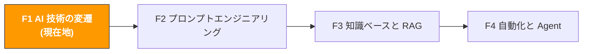

# F1. AI 技術の変遷

> **トラック**: Path 0: AI 基礎 · **モジュール**: F1
> **最終更新**: 2026-07-31
> **難易度**: 入門
> **所要時間**: 2 時間
> **前提**: なし。ゼロから学べます

---




---

## 章ナビゲーション

1. [第一原理](#1-第一原理-llm-は結局何をしているのか) · 2. [発展の系譜](#2-発展の系譜-ルールから知能へ) · 3. [Transformer](#3-transformer-の内側-attention-is-all-you-need) · 4. [大規模言語モデル](#4-大規模言語モデル-gpt-からマルチモーダルへ) · 5. [マルチモーダルと推論](#5-マルチモーダルと推論-ai-の感覚のアップグレード) · 6. [Agent の時代](#6-agent-の時代-対話から行動へ) · 7. [越境EC の視点](#7-越境ec-の視点-各ステップでの-ai-の役割) · 8. [能力の境界](#8-ai-の能力の境界-できることできないこと) · 9. [今後のトレンド](#9-今後のトレンド-次に何が起きるか) · 10. [学習リソース](#10-学習リソース) · 11. [よくある罠](#11-よくある罠) · 12. [完了チェック](#12-完了チェック)


## このモジュールで理解できること

AI は魔法ではなく、明確な動作原理があります。原理を理解するのは技術者になるためではなく、AI に何ができて何ができないか、いつ間違えるかを知るためです。

このモジュールを終えると:
- LLM の本質を一言で説明できる(predict next token)
- 機械学習から Agent までの発展の流れを理解できる
- AI がなぜ「デタラメを言う」のか(幻覚の根本原因)がわかる
- あるタスクが AI に向いているか判断できる
- すべてのコア概念を越境EC のシーンで理解できる

> **核心の考え方**: 数式を理解する必要はありませんが、AI の「思考様式」は理解する必要があります。エンジンの原理を知らなくても車は運転できますが、アクセル・ブレーキ・ハンドルが何をするかは知っている必要があるのと同じです。

---

## 1. 第一原理: LLM は結局何をしているのか

<!-- claims: illustrative -->

> 本節の数字は説明のために作ったものであり、実測値ではない。

### 1.1 一言で言うと

**大規模言語モデル(LLM)の本質は、超強力な「次の単語予測器」です。**

「今日の天気は本当に」と入力すると、LLM はあり得る次の語の確率を計算します:
- 「良い」 → 72%
- 「暑い」 → 15%
- 「寒い」 → 8%
- 「悪い」 → 3%
- その他 → 2%

そして最も確率の高いもの(または確率に従ってサンプリングしたもの)を選び、「良い」を出力。「今日の天気は本当に良い」を新しい入力として、また次の語を予測する。この繰り返しで完全な回答が生成されます。

**それだけです。** ChatGPT、Claude、Gemini — すべての大規模言語モデルは、根底では同じことをしています: predict next token(次のトークンの予測)。

### 1.2 越境EC のアナロジーで理解する

あなたが経験豊富な Amazon 運営者で、「この商品のタイトルはどう書くべき?」と聞かれたとします。

あなたの脳はどう働くでしょうか?
1. 過去に見た数千の成功したタイトルを思い出す
2. 商品特性・キーワード・カテゴリの慣習から、各語が現れる可能性を判断する
3. 一語ずつタイトルを組み立てる

LLM のやることも本質的に同じです。ただし「見てきた」のは数千件ではなく、インターネット上のほぼすべてのテキスト — 数兆語。その「経験」はどんな人間よりも豊富ですが、経験はすべてテキスト由来で、商品が何であるかを本当に「理解」したことはありません。

### 1.3 トークン: AI の最小単位

LLM はテキストを「文字」や「単語」ではなく **トークン** 単位で処理します。

| 言語 | テキスト | トークン数 | 説明 |
|------|----------|-----------|------|
| 英語 | "Hello world" | 2 | 一般的な英単語 = 1 トークン |
| 英語 | "unbelievable" | 3 | 長い単語は分割される: un + believ + able |
| 中国語 | "跨境电商" | 2〜4 | 漢字 1 文字 ≈ 1〜2 トークン |
| 中国語 | "人工智能" | 2〜3 | 頻出語はまとめられることも |
| コード | `print("hello")` | 4〜5 | 記号もそれぞれトークンを占める |

**なぜトークンが重要か?**

- **コスト**: API はトークン課金。GPT-4o は入力約 $2.50/百万トークン、出力 $10/百万トークン
- **コンテキストウィンドウ**: モデルごとに上限がある(GPT-4o: 128K、Claude 3.5: 200K)。超えると AI は前の内容を「覚えていられない」
- **速度**: トークンが多いほど生成は遅くなる

> **実用テクニック**: AI が前の話を「忘れた」と感じたら、会話がコンテキストウィンドウを超えた可能性が高い。対処: 新しい会話を開き、重要情報を再提供する。

### 1.4 なぜ「次の単語の予測」から知能が生まれるのか

最も直感に反する部分です: 「次の単語を予測するだけ」のシステムが、なぜ文章を書き、分析し、コードまで書けるのか?

答えは**スケール**にあります。学習データが十分大きく(数兆トークン)、パラメータが十分多い(数千億個)と、「次の単語予測」という単純なタスクがモデルに次のことを学ばせます:

| 次の単語を予測するために学ばざるを得ないこと | 例 |
|---------------------------------------------|-----|
| **文法規則** | 「彼は今___」 → 動詞(走っている、食べている、書いている) |
| **事実知識** | 「地球は___の周りを回る」 → 太陽 |
| **論理推論** | 「A>B、B>C ならば A___C」 → より大きい |
| **感情理解** | 「この商品は最悪だ、私は___」 → 後悔した、失望した |
| **フォーマット** | 「| 列1 | 列2 |」 → 次の行も表形式 |
| **コードの論理** | 「for i in range(10):」 → 次の行はインデント |

GPT-3(2020)から GPT-4(2023)への飛躍がこれほど大きかったのはそのためです。アルゴリズムの本質的な変化ではなく、規模の量的変化が質的変化を引き起こした。この現象は**創発的能力(Emergent Abilities)**と呼ばれます: 小さいモデルには全くできないことが、大きいモデルには突然できるようになる。

出典：[Emergent Abilities of Large Language Models](https://arxiv.org/abs/2206.07682)


### 1.5 幻覚問題: AI はなぜ「デタラメを言う」のか

「次の単語の予測」を理解すれば、AI 最大の問題 — **幻覚(Hallucination)** — も理解できます。

AI は「事実を思い出している」のではなく「最もありそうな次の語を予測している」。ある事実を支える学習データが不足していると、「もっともらしく見えるが実際は間違った」内容を生成します。

**越境EC での幻覚の例:**

| あなたの質問 | AI がでっち上げる可能性 | なぜでっち上げるのか |
|--------------|------------------------|----------------------|
| 「この ASIN の月販数は?」 | 「データによると月販約 3,500 個です」 | AI はリアルタイムの Amazon データを持たず、「それらしい」数字を作っている |
| 「Amazon DE で Bluetooth イヤホンを売るのに必要な認証は?」 | 「CE 認証と WEEE 登録が必要です」 | 正しいかもしれないが漏れもあり得る。学習データが古い可能性 |
| 「Helium 10 の Diamond プランはいくら?」 | 「$279/月です」 | 価格は変わっているかもしれない。AI は最新価格を知らない |

**幻覚への対処:**

1. **データ系の質問**: 必ずツールで検証(Helium 10、Keepa、Seller Central)。AI の出す具体的な数字を信じない
2. **コンプライアンス系の質問**: AI の回答は出発点にすぎない。最終的には公式文書が基準([A6 コンプライアンス](../a-operators/a6-compliance.md)参照)
3. **分析系の質問**: AI に実データを渡して分析させる。ゼロからデータを生成させない
4. **出典を要求する**: プロンプトに「情報源を明記して」と加える。AI は出典もでっち上げ得るが、少なくとも検証は可能になる

> **核心原則**: AI はアナリストであって、データベースではない。データを与えて分析させる = 信頼できる。何もないところからデータを出させる = 信頼できない。

---

## 2. 発展の系譜: ルールから知能へ

### 2.1 AI 発展のタイムライン

```
1950s〜1980s: シンボリック AI(ルールシステム)
人がルールを書く: 「レビューに 'broken' が含まれるならネガティブと判定」
長所: 説明可能、制御可能
短所: ルールは書き切れず、複雑なケースに対応できない

1990s〜2010s: 機械学習(統計的学習)
ルールを手書きせず、データからパターンを学ぶ
代表: 決定木、SVM、ランダムフォレスト
越境EC での応用: スパムフィルタ、単純な売上予測
短所: 特徴量は人が設計する必要がある(Feature Engineering)

2012〜2017: ディープラーニング(ニューラルネットの復興)
2012: AlexNet が ImageNet で従来手法を圧倒
代表: CNN(画像)、RNN/LSTM(テキスト)
越境EC での応用: 画像認識(商品分類)、感情分析
短所: RNN は長文処理の効率が悪く、学習が遅い

2017: Transformer アーキテクチャの誕生
Google の論文 "Attention Is All You Need"
中核の革新: 自己注意機構(Self-Attention)
RNN の長距離依存の問題を解決
ここがすべての転換点

2018〜2022: 事前学習大規模モデルの時代
2018: BERT(Google) — 理解型モデル
2019: GPT-2(OpenAI) — 生成型モデル
2020: GPT-3 — 175B パラメータ、Few-shot Learning が創発
2022: ChatGPT — AI が一般の視界に入る
越境EC での応用: レビュー分析、商品ページ生成、CS 自動化

2023〜2024: 大規模モデル競争
GPT-4、Claude 2/3、Gemini、Llama 2/3
マルチモーダル(テキスト+画像+音声)
コンテキストウィンドウが 4K → 128K → 1M+
越境EC での応用: マルチモーダル商品分析、長文書処理

2025〜2026: Agent の時代
「対話」から「行動」へ: AI は答えるだけでなくタスクを実行する
MCP プロトコルの標準化: AI が外部ツールへ接続する統一インターフェース
越境EC での応用: 運用モニタリング自動化、スマート補充、マルチプラットフォーム管理
私たちは今ここにいる ← ちょうど良いタイミングで来ましたね
```

出典：[Attention Is All You Need (2017)](https://arxiv.org/abs/1706.03762)、[Emergent Abilities of LLMs](https://arxiv.org/abs/2206.07682)

### 2.2 各段階を越境EC のアナロジーで

| AI の段階 | 越境EC のアナロジー | できること | できないこと |
|-----------|--------------------|-----------|--------------|
| **ルールシステム** | SOP どおりに動く新人運営 | 固定ルールで標準フローを処理 | SOP にないケースで詰まる |
| **機械学習** | データで判断する経験者 | 履歴データからパターンを発見 | 「どのデータを見るか」は人が教える |
| **ディープラーニング** | 画像も読めるベテラン運営 | 生データから特徴を自動抽出 | 一度に一つのこと(分類か生成)しかできない |
| **Transformer/LLM** | 万能型の運営コンサルタント | 文脈理解、テキスト生成、マルチタスク | リアルタイムデータがなく、捏造の可能性 |
| **Agent** | ツールを持つ自律的な運営マネージャー | ツール呼び出し、タスク実行、自律判断 | 複雑な判断はまだ人の監督が必要 |

### 2.3 なぜ 2017 年がすべてを変えたのか

2017 年以前、テキスト処理の主流は RNN(再帰型ニューラルネットワーク)でした。RNN の問題は、単語を一つずつ順番に処理しなければならないこと — 文章を頭から最後まで読まないと理解できないのと同じです。

**RNN のジレンマ(運営シーンのアナロジー):**

500 語の商品レビューを分析するとします。RNN のやり方は:
1. 1 語目を読み、記憶する
2. 2 語目を読み、記憶を更新
3. 3 語目を読み、記憶を更新
4. ...
5. 500 語目に達する頃には、前半の内容は「ぼやけて」いる

50 ページのレポートを読み終わる頃には冒頭を忘れているようなものです。

**Transformer の解決策: 自己注意(Self-Attention)**

Transformer は順次処理ではなく、**すべての単語を同時に見て**、各単語と他のすべての単語との関連度を計算します。

レポートを逐語的に読むのではなく、まず全体をざっと見て、重要な段落同士の関連をマークし、最も関連の深い部分へ直接ジャンプするようなものです。

この一見単純な変化が、2 つの革命的な優位性をもたらしました:
1. **並列計算**: 全単語を同時処理。学習速度は逐語的な RNN より 1〜2 桁速い
2. **長距離依存**: 1 語目と 500 語目の関連が失われない

> **重要な洞察**: Transformer は「より良い RNN」ではなく、まったく新しい発想です。その成功はある真理を証明しています: 問題を解く最良の方法は、既存手法の改良ではなく、完全に異なる角度から取り組むことである場合がある。


---

## 3. Transformer の内側: Attention Is All You Need

<!-- claims: illustrative -->

> 本節の数字は説明のために作ったものであり、実測値ではない。

### 3.1 Transformer のコアコンポーネント

Transformer アーキテクチャは 2 つの主要部分から成ります:

```
Transformer アーキテクチャ
Encoder(エンコーダー) — 入力を理解する
自己注意層: 各単語と他の単語の関連を計算
フィードフォワード網: 各位置に非線形変換
残差接続 + 層正規化: 学習を安定させる

Decoder(デコーダー) — 出力を生成する
マスク付き自己注意層: 生成済みの単語しか見えない(「答えの盗み見」防止)
クロスアテンション層: Encoder の出力に注意を向ける
フィードフォワード網
残差接続 + 層正規化
```

**モデルによって使う組み合わせが違います:**

| モデル型 | 使う部分 | 代表モデル | 得意なこと |
|----------|----------|-----------|------------|
| Encoder-only | エンコーダーのみ | BERT、RoBERTa | 理解タスク: 分類、感情分析、情報抽出 |
| Decoder-only | デコーダーのみ | GPT 系、Claude、Llama | 生成タスク: 文章、対話、コード |
| Encoder-Decoder | 両方 | T5、BART | 翻訳、要約、QA |

> **なぜ今は Decoder-only が主流?** 「生成」が最も汎用的な能力だからです。分類は「ポジティブ/ネガティブ」を生成すれば実現でき、翻訳はターゲット言語を生成すれば実現できる。強力な生成モデル 1 つでほぼすべての NLP タスクがこなせます。

### 3.2 自己注意機構: 商品選定会議のアナロジー

商品選定会議を想像してください。机の上に競合レポートが 5 部(A、B、C、D、E)。

**従来方式(RNN):** A → B → C → D → E と順番に読む。E を読む頃には A の詳細はぼやけている。

**自己注意方式(Transformer):** 5 部を同時に机に広げて:
1. レポート A を見ながら他の 4 部にも目をやり、A と C が同じカテゴリを扱っていると気づく → A-C の関連に高スコア
2. レポート B を見て、B と E の価格帯が重なっていると気づく → B-E の関連に高スコア
3. どのレポートも、自分と他のレポートとの関連度を知っている状態になる

これが「注意スコア(Attention Score)」です。各単語が他のすべての単語との関連度を計算し、関連度で重み付けして情報を集約します。

**数学的な直感(公式を覚える必要なし):**

```
注意 = 私が探しているもの(Query)× あなたが提供できるもの(Key)→ マッチ度
最終出力 = マッチ度で重み付けした情報の集約(Value)
```

EC のアナロジー:
- Query = 「$20〜30 の Bluetooth イヤホンを探している」
- Key = 各商品のタグ(価格、カテゴリ、特徴)
- Value = 各商品の詳細情報
- 注意 = マッチ度に応じて、条件に合う商品に重点的に注目する

### 3.3 位置エンコーディング: AI に語順を教える

自己注意には問題が一つあります: すべての単語を同時に見るため、順序がわからない。「猫が魚を食べる」と「魚が猫を食べる」が同じに見えてしまう。

解決策が**位置エンコーディング(Positional Encoding)**: 各位置に固有の数学的マーカーを与え、「この単語は 3 番目にある」とモデルに知らせます。

Amazon の箇条書きに番号があるのと同じです — 1 番目の Bullet と 5 番目の Bullet では重みが違う。位置そのものが情報を持っています。

### 3.4 パラメータ数とモデル規模

| モデル | 発表 | パラメータ数 | アナロジー |
|--------|------|--------------|------------|
| BERT-base | 2018 | 1.1 億 | 百科事典 1 冊 |
| GPT-2 | 2019 | 15 億 | 小さな図書館 |
| GPT-3 | 2020 | 1,750 億 | 大きな図書館 |
| GPT-4 | 2023 | 約 1.8 兆(噂) | 都市中の図書館すべて |
| Llama 3.1 | 2024 | 4,050 億 | オープンソース界最大の図書館 |
| GPT-4o | 2024 | 非公開 | マルチモーダルの超図書館 |
| Claude Opus 4 | 2025 | 非公開 | 深い推論の図書館 |

**パラメータ数 ≠ 能力。** より重要なのは学習データの質、学習手法(RLHF、DPO)、推論の最適化です。Llama 3.1 70B は多くのタスクで GPT-4 に迫りますが、パラメータ数は 1/25 です。

---

## 4. 大規模言語モデル: GPT からマルチモーダルへ

> **関連**: [F2 プロンプトエンジニアリング](f2-prompt-engineering.md) 実践は F2 へ

### 4.1 GPT シリーズの進化

GPT(Generative Pre-trained Transformer)は OpenAI のモデル群で、「大規模言語モデル」という概念の牽引役です。

```
GPT-1 (2018): 1.17 億パラメータ
「事前学習 + ファインチューニング」のパラダイムが有効と証明
能力は限定的で、主に学術研究向け

GPT-2 (2019): 15 億パラメータ
初めて「ゼロショット」能力を示す(ファインチューニングなしでタスクをこなす)
OpenAI は一時「危険すぎる」として完全版を非公開に
今から見れば能力は基礎的

GPT-3 (2020): 1,750 億パラメータ
質的転換点: Few-shot Learning が創発
例を数個見せれば新しいタスクを習得
商用価値が生まれ始める
API 公開が大量の AI スタートアップを生む

ChatGPT (2022.11): GPT-3.5 + RLHF
モデルの突破ではなく、対話方式の突破
RLHF(人間のフィードバックによる強化学習)が「人間らしい対話」を教えた
2 か月で 1 億ユーザー、史上最速
AI が技術界から一般社会へ

GPT-4 (2023.3): マルチモーダル + 強化された推論
画像入力に対応(画像の説明、チャート分析)
推論能力が大幅向上(司法試験、SAT などに合格)
128K コンテキストウィンドウ
越境EC 応用が爆発: 商品ページ生成、レビュー分析、多言語翻訳

GPT-4o (2024): ネイティブマルチモーダル
テキスト・画像・音声を統一処理
より速く、より安く
リアルタイム音声対話
越境EC: 商品画像分析、競合のビジュアル比較

GPT-4.5 / GPT-5 (2025〜2026): 深い推論
より強い論理推論と計画能力
より長いコンテキストウィンドウ
より優れたツール使用能力
越境EC: 複雑な意思決定支援、自動化ワークフロー
```

### 4.2 主要モデル比較(2026 年初)

| モデル | 企業 | 中核的な強み | コンテキスト | 価格(API) | 向いている用途 |
|--------|------|--------------|--------------|------------|----------------|
| GPT-4o | OpenAI | バランス、マルチモーダル、エコシステム最強 | 128K | $2.5/$10 per M tokens | 汎用、画像分析 |
| Claude Opus 4 | Anthropic | 長文、深い分析、安全性 | 200K+ | $15/$75 per M tokens | 長文書分析、複雑な推論 |
| Claude Sonnet 4 | Anthropic | コスパ、高速 | 200K | $3/$15 per M tokens | 日常使い、コード生成 |
| Gemini 2.5 Pro | Google | 超長コンテキスト、マルチモーダル | 1M+ | $1.25/$5 per M tokens | 超長文書、動画分析 |
| Llama 3.3 | Meta | オープンソース、ローカル展開可 | 128K | 無料(自前ホスト) | データプライバシー、カスタマイズ |
| DeepSeek V3 | DeepSeek | 圧倒的コスパ、中国語に強い | 128K | $0.27/$1.10 per M tokens | 中国語シーン、低予算 |
| Qwen 2.5 | Alibaba | 中国語最強、マルチモーダル | 128K | 従量課金 | 中国語 EC、マルチモーダル |

**越境EC での推奨:**

- **日常運営(商品ページ、レビュー、CS)**: Claude Sonnet 4 か GPT-4o — 速い、質が高い、コストが妥当
- **深い分析(市場レポート、競合研究)**: Claude Opus 4 — 長文処理と深い推論が最強
- **多言語翻訳**: GPT-4o か Gemini — 多言語能力が最もバランス良い
- **低予算**: DeepSeek V3 — コスパ抜群、中国語シーンで優秀
- **データプライバシー重視**: Llama 3.3 ローカル展開 — データがサーバーから出ない([B5 ローカルモデルのデプロイ](../b-developers/b5-local-model-deploy.md)参照)

### 4.3 RLHF: AI に「人の言葉」を教える

素の GPT-3 は能力こそ高いものの、出力は人間の期待にそぐわないことが多かった — 正しい答えでも形式が乱雑だったり、有害コンテンツを生成したり。

**RLHF(Reinforcement Learning from Human Feedback、人間のフィードバックによる強化学習)** は、AI を「能力は高いが使いにくい」から「能力が高くて使いやすい」に変えた鍵となる技術です。

```
RLHF の 3 ステップ:

Step 1: 教師ありファインチューニング(SFT)
人間のアノテーターが高品質な Q&A ペアを書く
そのデータでモデルをファインチューニング
アナロジー: 新入社員に標準業務マニュアルを渡す

Step 2: 報酬モデル(RM)の学習
モデルに複数の回答を生成させる
人間が回答をランキング(どれが良いか)
人間の好みを模倣する「採点モデル」を学習
アナロジー: 良い回答を見分けられる検品担当を育てる

Step 3: 強化学習による最適化(PPO/DPO)
報酬モデルのスコアで生成モデルを最適化
モデルは「人間が良いと感じる」回答の生成を学ぶ
アナロジー: 検品のフィードバックで社員が仕事を改善し続ける
```

**RLHF の効果:**

| 次元 | RLHF 以前 | RLHF 以後 |
|------|-----------|-----------|
| 回答の形式 | 乱雑、不統一 | 構造化、明瞭 |
| 有害コンテンツ | 生成し得る | 大幅に減少 |
| 指示の遵守 | よく脱線する | 正確に従う |
| 対話能力 | 独り言のよう | 人と対話しているよう |

> **重要な洞察**: ChatGPT の成功は GPT-3.5 が GPT-3 よりどれほど強かったかではなく、RLHF が「人の言葉で話す」ことを教えたからです。技術のブレークスルーとユーザー体験のブレークスルーは別物です。


---

## 5. マルチモーダルと推論: AI の感覚のアップグレード

### 5.1 マルチモーダルとは

初期の LLM はテキストしか扱えませんでした。マルチモーダルモデルは複数種類のデータを同時に扱えます:

```
マルチモーダル能力の進化:

2023: テキスト + 画像入力(GPT-4V)
画像を見て質問に答える
チャートやスクリーンショットを分析
越境EC: 競合の画像をアップして AI に分析させる

2024: テキスト + 画像 + 音声(GPT-4o、Gemini)
リアルタイム音声対話
動画コンテンツの理解
越境EC: 商品動画の分析、音声カスタマーサポート

2025〜2026: 統一マルチモーダル(Gemini 2.5、GPT-5)
テキスト・画像・音声・動画をシームレスに行き来
画像や動画の生成
越境EC: 商品メイン画像や A+ コンテンツの自動生成
```

### 5.2 越境EC でのマルチモーダル応用

| シーン | 入力 | AI がすること | 推奨ツール |
|--------|------|---------------|------------|
| 競合画像の分析 | 競合メイン画像のスクショ | デザインスタイル、訴求の見せ方、撮影アングルを分析 | GPT-4o、Gemini |
| 商品不良の検出 | 返品商品の写真 | よくある品質問題の識別、不良の分類 | GPT-4o |
| ページ画像の審査 | 自社の商品画像 | Amazon の画像規約への適合を確認 | Claude Sonnet |
| 競合動画の分解 | 競合の商品動画 | 訴求点の抽出、見せ方の戦略分析 | Gemini 2.5 Pro |
| パッケージデザイン評価 | パッケージのデザイン案 | 視覚的な魅力、情報の階層、コンプライアンスを評価 | GPT-4o |
| 多言語 OCR | 外国語の商品ラベル写真 | ラベル内容の認識と翻訳 | Gemini、GPT-4o |

**実践例 — 競合メイン画像の分析:**

```
この Amazon 商品メイン画像を分析してください(画像をアップロード):

1. 商品の見せ方のアングルと構図
2. 背景の処理方法
3. インフォグラフィック要素の有無
4. 推定の撮影コストと制作難易度
5. 参考にすべきデザインの見どころ 3 つ
6. 改善できる点 3 つ
7. 類似商品を作る場合のメイン画像戦略の提案

<データ規律>
- 金額・販売数・順位・料率に関わる数字は、上で私が提供した情報にあるものだけを使う。渡していないものはすべて「欠測」とし、**推定も、記憶にある業界平均やプラットフォーム料率の引用も禁止**。それらは古くなるうえ、私は実際の資金を投じる判断に使うかもしれない
- 続けるためにある数字が必要なときは、どこで何の項目を調べるべきかを伝え、そこで止まって私の補足を待つこと
- 結論ごとに出典を付す: [私が提供した情報] または [モデル推測]。推測の場合はその根拠も示すこと
</データ規律>
```

### 5.3 推論能力の進化

2024〜2025 年の大きな進展の一つが**推論能力**の向上です。

**推論とは?** 学習データから答えを単純に「思い出す」のではなく、論理的なステップで答えを「導出する」ことです。

```
単純な想起(初期の LLM):
Q: 「フランスの首都は?」
A: 「パリ」 ← 学習データからそのまま想起

推論(新世代の LLM):
Q: 「仕入コスト ¥50、FBA 手数料 $5、販売手数料 15%、
売価 $25 のとき、利益率は?」
A: 多段階の計算が必要:
1. 仕入コストの換算: ¥50 ÷ 7.2 ≈ $6.94
2. 総コスト: $6.94 + $5 + $25×15% = $6.94 + $5 + $3.75 = $15.69
3. 利益: $25 − $15.69 = $9.31
4. 利益率: $9.31 / $25 = 37.2%
```

**推論モデルの代表:**

| モデル | 特徴 | 向いている用途 |
|--------|------|----------------|
| OpenAI o1/o3 | 「考えて」から答える、推論の過程が見える | 数学計算、論理分析、複雑な計画 |
| Claude Opus 4 | 深い分析、長い推論チェーン | 長文書分析、多段階の意思決定 |
| DeepSeek R1 | オープンソースの推論モデル | ローカル展開での推論ニーズ |

> **実用アドバイス**: 日常業務(商品ページ、翻訳、CS 返信)は通常モデルで十分 — 速くて安い。複雑な分析(利益試算、市場評価、戦略立案)のときだけ推論モデルを使う。

---

## 6. Agent の時代: 対話から行動へ

> **関連**: [F4 Agent 自動化](f4-agent-automation.md) 実践は F4 へ

### 6.1 AI Agent とは

**通常の LLM 対話**: 質問すると答えが返る。コンサルタントに相談するのと同じ — 助言はくれるが、実行はしてくれない。

**AI Agent**: AI は答えるだけでなく、**ツールを使い、タスクを実行し、自律的に判断する**。アシスタントを雇うようなもの — 助言だけでなく、メールを送り、データを調べ、レポートまで作ってくれる。

```
通常の対話 vs Agent:

通常の対話:
あなた: 「この競合のレビューを分析して」
AI: 「分析の結果、主な不満点は...」(テキストで回答)

Agent:
あなた: 「この 5 つの競合をモニタリングして、毎週分析レポートを作って」
AI:
1. Amazon API を呼んで最新レビューデータを取得
2. NLP ツールで感情分析とトピック抽出
3. 先週のデータと比較し、変化の傾向を発見
4. 構造化レポートを生成
5. あなたのメールに送信
6. 来週も自動で繰り返す
```

### 6.2 Agent のコア能力

| 能力 | 説明 | 越境EC の例 |
|------|------|-------------|
| **ツール使用** | 外部 API やツールを呼び出す | Helium 10 API でキーワードデータを照会 |
| **計画** | 複雑なタスクをステップに分解 | 「選定レポートを作る」を 5 つのサブタスクに分解 |
| **記憶** | 過去の対話と結果を記憶 | 前回分析したカテゴリと結論を覚えている |
| **自律判断** | 中間結果に応じて戦略を調整 | データ異常を発見したら自動で深掘り |
| **多段実行** | 複数ステップを連続実行 | データ取得 → 分析 → レポート生成 → 送信 |

### 6.3 MCP プロトコル: AI の「USB-C ポート」

2025 年、Anthropic は **MCP(Model Context Protocol、モデルコンテキストプロトコル)** を発表し、AI が外部ツールへ接続する業界標準として急速に普及しました。

**MCP は何を解決したのか?**

MCP 以前は、AI ツールが外部システムに接続するたびにカスタム統合コードが必要でした。初期の携帯電話のように、ブランドごとに充電端子が違っていたのです。

MCP は AI 世界の USB-C — 標準化されたプロトコル 1 つで、どの AI モデルも統一された方法であらゆる外部ツールに接続できます。

```
MCP アーキテクチャ:

AI モデル(Claude/GPT/Gemini)
MCP プロトコル
MCP Server(ツールアダプタ)

外部ツール/データソース
ファイルシステム(ローカルファイルの読み書き)
データベース(データの照会と更新)
API(サードパーティサービスの呼び出し)
メールシステム(メールの送受信)
接続したいあらゆるシステム
```

**越境EC での MCP 応用シーン:**

| MCP Server | 接続先 | できること |
|------------|--------|------------|
| ファイルシステム MCP | ローカルの Excel/CSV | AI が販売レポートを直接読んで分析 |
| データベース MCP | 商品データベース | AI が商品情報や在庫状況を照会 |
| メール MCP | Outlook/Gmail | AI がサプライヤーのメールを読み、自動返信 |
| ブラウザ MCP | Web ページ | AI が競合情報を自動収集 |
| Amazon SP-API MCP | Amazon セラーセントラル | AI が注文・在庫・広告データを直接取得 |

出典：[Anthropic MCP Documentation](https://modelcontextprotocol.io/)、[MCP Guide 2026](https://www.taskade.com/blog/mcp-your-ai-agents-superpower-for-real-world-context-and-automation)

---

## 7. 越境EC の視点: 各ステップでの AI の役割

### 7.1 AI 能力と EC ステップのマッピング

```
越境EC のフルチェーン × AI 能力マトリクス:

商品リサーチ ←→ テキスト分析 + 推論
レビューの不満点抽出(テキスト分析)
市場性の評価(推論)
キーワード需要のクラスタリング(テキスト分析)
トレンド予測(推論 + データ分析)

商品ページ制作 ←→ テキスト生成 + 多言語
タイトル/箇条書き/説明の生成(テキスト生成)
多言語ローカライズ(翻訳 + 文化適応)
A+ コンテンツの企画(マルチモーダル生成)
SEO キーワード最適化(テキスト分析)

広告運用 ←→ データ分析 + 生成
検索語レポート分析(データ分析)
広告コピー A/B テスト(テキスト生成)
入札戦略の提案(推論)
予算配分の最適化(データ分析 + 推論)

CS・アフターケア ←→ テキスト生成 + 多言語 + 感情分析
多言語の CS 返信(生成 + 翻訳)
低評価の分析と対応(感情分析 + 生成)
申立書の作成(生成 + 推論)
返品理由の分析(テキスト分析)

在庫・サプライチェーン ←→ 予測 + 推論
売上予測(時系列予測)
補充の意思決定(推論)
安全在庫の計算(データ分析)
サプライヤー評価(テキスト分析 + 推論)

コンプライアンス・リスク ←→ 知識検索 + 推論
複数市場のコンプライアンス照会(知識検索)
認証要件の整理(テキスト分析)
リスク評価(推論)
コンプライアンス文書の生成(テキスト生成)
```

### 7.2 各 AI 技術の EC における成熟度

| 技術 | 成熟度 | 信頼性 | 推奨の使い方 |
|------|--------|--------|--------------|
| テキスト生成(商品ページ、返信) | | 高 | そのまま使い、人がレビューして微調整 |
| テキスト分析(レビュー、キーワード) | | 高 | そのまま使える。結果は信頼できる |
| 多言語翻訳 | | 中高 | 使用後にネイティブのレビューが必要 |
| マルチモーダル分析(画像、動画) | | 中 | 補助的な参考に。唯一の根拠にしない |
| データ予測(売上、トレンド) | | 中 | 履歴データやツールのデータと併用 |
| Agent 自動化 | | 中低 | 単純タスクは可。複雑タスクは監督必須 |
| 自律的な意思決定 | | 低 | 提案としてのみ参考に。最終判断は人 |

> **核心原則**: 成熟度が高いシーンほど安心して使え、低いシーンほど人の監督が必要。Agent 自動化がまだ未成熟な段階で、広告予算の自律管理を任せてはいけません。

### 7.3 AI ツール選択のデシジョンツリー

```
何をしたい?

コピーを書く(商品ページ/広告/メール)
ChatGPT / Claude で生成 → 人がレビュー → 公開

データを分析(レビュー/キーワード/レポート)
少量(<100 件)→ ChatGPT/Claude に直接貼り付け
中量(100〜1,000 件)→ ファイルを ChatGPT/Claude にアップロード
大量(>1,000 件)→ Python + AI API(Path B 参照)

翻訳/ローカライズ
単純な翻訳 → ChatGPT/Claude/DeepL
本格的なローカライズ → AI 初稿 + ネイティブレビュー

画像/動画の分析
GPT-4o / Gemini にアップロード → 分析結果を取得

予測/意思決定
クイック評価 → ChatGPT/Claude + あなたが用意したデータ
精密な予測 → Python + Prophet/AutoGluon(Path B 参照)

自動化/Agent
簡単な自動化 → Zapier/Make + AI
中程度の自動化 → MCP + Claude/GPT
高度な自動化 → LangGraph/CrewAI(Path B 参照)
```

---

## 8. AI の能力の境界: できること、できないこと

### 8.1 AI が得意なこと(安心して使う)

| 能力 | なぜ得意か | EC での応用 |
|------|------------|-------------|
| テキストの圧縮と要約 | 学習データに大量の要約サンプル | レビュー 100 件 → 核心的な不満点 5 つ |
| パターン認識 | 統計的学習の本質はパターン発見 | キーワードリストから需要クラスタを発見 |
| フォーマット変換 | フォーマットは高度に規則的 | CSV データ → 分析レポート |
| 多言語処理 | 学習データが 100+ 言語をカバー | 多言語の商品ページ生成と翻訳 |
| 創造的な生成 | 既存要素の組み合わせから新しい組み合わせを生む | 広告コピーのバリエーション、訴求点の抽出 |
| コード生成 | 学習データに大量のコード | データ処理スクリプト、自動化ツール |

### 8.2 AI が苦手なこと(慎重に使う)

| 能力 | なぜ苦手か | 対策 |
|------|------------|------|
| リアルタイムデータ | 学習データには締切があり、「今」を知らない | ツールで最新データを取得し、AI に分析させる |
| 正確な計算 | 本質は確率予測であり、電卓ではない | 複雑な計算は Excel/Python、AI は解釈担当 |
| 因果推論 | 相関は見つけられるが、因果は特定できない | AI が仮説を出し、人が因果を検証 |
| 創造的なブレークスルー | 既存知識の組み合わせのみ。真の発明はできない | AI が 80% の下地、人が 20% の革新 |
| 長期記憶 | コンテキストウィンドウは有限。会話が終われば「忘れる」 | 重要情報は会話のたびに再提供 |
| 物理世界の理解 | 身体がなく、物理的なインタラクションを理解しない | 手触りや素材などは人が判断 |

### 8.3 AI に絶対させてはいけないこと(使わない)

| シーン | なぜダメか | 正しいやり方 |
|--------|------------|--------------|
| 最終決定を任せる | AI は結果に責任を負わない。負うのはあなた | AI は分析と提案、決定は人 |
| 法的文書の生成 | 法的な誤りを含み得る | AI が草稿、弁護士がレビュー |
| 機密データの処理 | データが学習に使われる可能性 | ローカルモデルか企業向け API |
| CS の完全自動化 | 誤った発言が紛争を招き得る | AI が草稿、人が確認して送信 |
| 専門認証の代替 | AI は最新の法規の詳細を知らない | AI が一次スクリーニング、認証機関が最終確認 |

---

## 9. 今後のトレンド: 次に何が起きるか

### 9.1 2026〜2027 年の AI トレンド

| トレンド | 説明 | 越境EC への影響 |
|----------|------|------------------|
| **Agent の普及** | AI Agent が技術界から一般ユーザーへ | 運営担当も Agent で日常タスクを自動化 |
| **マルチモーダルの融合** | テキスト/画像/動画/音声をシームレス処理 | 商品画像の自動生成、動画コンテンツの自動分析 |
| **ローカルモデルの成熟** | スマホ/ノート PC で高品質 LLM が動く | プライバシー問題が解決、オフラインでも AI |
| **垂直特化モデル** | 業界別に学習された専門モデル | EC 専用 AI が Amazon のルールと用語に精通 |
| **AI ネイティブツール** | 「AI 機能を足した」から「AI 駆動」へ | Helium 10、Jungle Scout などが AI 化 |
| **プロトコルの標準化** | MCP + A2A が業界標準に | AI ツール同士が協調できる |

### 9.2 越境EC 従事者へのアドバイス

```
短期(今すぐやる):
ChatGPT/Claude で日常運営をこなせるようになる(Path A)
プロンプトのテンプレート集を作る(F2 モジュール)
毎日最低 1 つのタスクを AI で完了する

中期(3〜6 か月):
RAG を習得し、AI に自社データを理解させる(F3 モジュール)
簡単な Agent 自動化を試す(F4 モジュール)
チームの AI 利用規範を作る(Path C)

長期(6〜12 か月):
AI 駆動の運営システムを構築(Path B)
ローカルモデル展開を探索(データプライバシー)
EC 垂直 AI ツールの発展を追う
```

> **最も重要なアドバイス**: AI が「完璧」になるのを待たないこと。AI は永遠に完璧になりませんが、今すでに十分に優秀です。早く使えば早く恩恵を受け、遅れれば競合に優位を譲るだけです。

---

## 10. 学習リソース

### 10.1 入門におすすめ(前提知識ゼロ)

| リソース | プラットフォーム | 長さ | おすすめ理由 |
|----------|------------------|------|--------------|
| [But what is a GPT?](https://www.youtube.com/watch?v=wjZofJX0v4M) | 3Blue1Brown (YouTube) | 27 分 | 最も直感的な Transformer の可視化解説 |
| [Intro to Large Language Models](https://www.youtube.com/watch?v=zjkBMFhNj_g) | Andrej Karpathy (YouTube) | 60 分 | 元 OpenAI 研究者による LLM 入門講義 |
| [ChatGPT Prompt Engineering](https://www.deeplearning.ai/courses/chatgpt-prompt-eng) | DeepLearning.AI | 1.5 時間 | 無料講座、OpenAI 公式協力 |
| [AI for Everyone](https://www.coursera.org/learn/ai-for-everyone) | Coursera (Andrew Ng) | 6 時間 | 非技術者向け AI 入門、Andrew Ng 主講 |

### 10.2 さらに深く

| リソース | プラットフォーム | おすすめ理由 |
|----------|------------------|--------------|
| [Attention Is All You Need](https://arxiv.org/abs/1706.03762) | arXiv | Transformer の原論文。すべてが変わった起点 |
| [The Illustrated Transformer](https://jalammar.github.io/illustrated-transformer/) | Jay Alammar Blog | 最高の Transformer 図解チュートリアル |
| [State of GPT](https://www.youtube.com/watch?v=bZQun8Y4L2A) | Andrej Karpathy (YouTube) | GPT の学習フローの完全解説 |
| [LLM Visualization](https://bbycroft.net/llm) | Brendan Bycroft | LLM の動作原理のインタラクティブ可視化 |

### 10.3 継続的なフォロー

| リソース | 種類 | 更新頻度 |
|----------|------|----------|
| [The Batch](https://www.deeplearning.ai/the-batch/) | ニュースレター | 週次(Andrew Ng 編集) |
| [AI News](https://buttondown.email/ainews) | ニュースレター | 日次 |
| r/LocalLLaMA | Reddit | リアルタイム(ローカルモデルのコミュニティ) |
| [Hugging Face Blog](https://huggingface.co/blog) | ブログ | 週次(オープンソースモデルの動向) |

---

## 11. よくある罠

### 11.1 「モデルが更新された」を「方法論が変わった」と受け取る

技術の進みは速いが、実際にできることの境界は、リリースの頻度ほど速く動かない。新版が出るたびにワークフローを作り直すのは、この分野で最もありがちな時間の浪費だ。判断基準は 1 つ、**これまでできなかったタスクが、今はできるようになったか**。そうでなければ何も触らなくてよい。

### 11.2 過去の型番の挙動から現在の能力を推し量る

本章に出てくる GPT-3 や Claude 2 は叙述の対象だ。当時の制約(短いコンテキスト、ツール利用不可)を根拠に今できるかどうかを判断すると、結論は大きく保守側に振れる。現在の能力は[モデルマトリクス](../resources/model-matrix.md)を見ること。

### 11.3 能力だけ見てコスト曲線を見ない

2 年前は採算が合わず今は合うタスクは、モデルが賢くなったからではなく単価が一桁下がったから、というケースが多い。実行可能性の評価では両方の曲線を併せて読むこと。

---

## 12. 完了チェック

- [ ] 「LLM は next token predictor である」を自分の言葉で説明できる
- [ ] Transformer の自己注意機構を理解した(数学不要、直感で OK)
- [ ] GPT/Claude/Gemini/Llama の違いとそれぞれの強みを知っている
- [ ] RLHF がなぜ ChatGPT を GPT-3 よりずっと使いやすくしたのか理解した
- [ ] AI の幻覚の原因と対処法を知っている
- [ ] Agent と通常の対話の違いを理解した
- [ ] MCP プロトコルが何か、なぜ重要かを知っている
- [ ] ある EC タスクが AI に向くかどうか判断できる

以上をすべて完了すれば、しっかりした AI の基礎認識ができています。次は [F2 プロンプトエンジニアリング](f2-prompt-engineering.md)へ。AI との体系的なコミュニケーション方法を学びます。

---

## この方法が効かないとき

- **モデル選定の根拠として使いたいとき。** 本章が扱うのは、モデルの能力がどこから来るのか、なぜハルシネーションが起きるのかという基礎的な仕組みであって、選定ガイドではない。どのモデルを使うかは [モデルマトリクス](../resources/model-matrix.md) と [F6](f6-ai-tools-comparison.md) を見ること。あちらには検証日があり、本章にはない。
- **「AI に X ができるか」の答えを探しているとき。** Transformer を理解しても、AI が自社の Listing を書けるかどうかはわからない。能力の境界は実測で決まるもので、原理から演繹して出るものではない。[AI 活用成熟度マップ](ai-landscape.md) は業務工程ごとに成熟度を示していて、演繹より確かな出発点になる。
- **技術的な細部が自分の判断を変えないとき。** コードも書かず技術選定もしないなら、注意機構の数式を読んでも使い道がない。本章で効くのは「なぜモデルは自信を持って作り話をするのか」の部分で、日々の判断はそこだけで大半が支えられる。残りは飛ばしてよい。

---

## 付録: 用語集

| 用語 | 英語 | 一言での説明 |
|------|------|--------------|
| LLM | Large Language Model | 大規模言語モデル。ChatGPT/Claude の基盤技術 |
| トークン | Token | AI がテキストを処理する最小単位。約 1 単語、または漢字半分〜1 文字 |
| Transformer | Transformer | 2017 年に発明されたニューラルネット構造。現代 LLM すべての基礎 |
| 自己注意 | Self-Attention | Transformer の中核機構。全位置に同時に注意を向ける |
| RLHF | Reinforcement Learning from Human Feedback | 人間のフィードバックで AI を訓練する手法 |
| 幻覚 | Hallucination | もっともらしいが実際は誤った内容を AI が生成すること |
| マルチモーダル | Multimodal | テキスト・画像・音声など複数のデータを同時に扱うこと |
| Agent | AI Agent | ツールを使い自律的にタスクを実行できる AI システム |
| MCP | Model Context Protocol | AI が外部ツールへ接続する標準化プロトコル |
| RAG | Retrieval-Augmented Generation | あなたのデータに基づいて AI に回答させる技術 |
| ファインチューニング | Fine-tuning | 特定データでモデルを追加訓練すること |
| 創発的能力 | Emergent Abilities | モデル規模の拡大で突然現れる新しい能力 |
| コンテキストウィンドウ | Context Window | AI が一度に処理できる最大テキスト長 |
