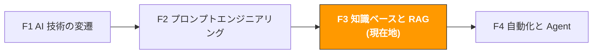

# F3. 知識ベースと RAG

> **トラック**: Path 0: AI 基礎 · **モジュール**: F3
> **最終更新**: 2026-07-31
> **難易度**: 中級
> **所要時間**: 2 時間
> **前提モジュール**: [F1 AI 技術の変遷](f1-ai-evolution.md)、[F2 プロンプトエンジニアリング](f2-prompt-engineering.md)

---




---

## 章ナビゲーション

1. [なぜ AI はあなたの商品情報を知らないのか](#1-なぜ-ai-はあなたの商品情報を知らないのか) · 2. [Embedding の原理](#2-embedding-の原理-ai-に意味を理解させる) · 3. [ベクトルデータベース](#3-ベクトルデータベース-意味を保存し検索する) · 4. [RAG アーキテクチャ](#4-rag-アーキテクチャ-完全なワークフロー) · 5. [実践概要](#5-実践概要-商品ナレッジベースの構築) · 6. [RAG 最適化テクニック](#6-rag-最適化テクニック) · 7. [よくある質問](#7-よくある質問) · 8. [学習リソース](#8-学習リソース) · 9. [よくある罠](#9-よくある罠) · 10. [完了チェック](#10-完了チェック)


## このモジュールで理解できること

なぜ ChatGPT はあなたの商品情報を知らないのか? どうすれば AI にあなたの独自データに基づいて回答させられるのか? RAG がこの問題を解く中核技術です。

このモジュールを終えると:
- AI があなたの商品・ポリシー・社内データを知らない理由を理解できる
- Embedding(ベクトル埋め込み)の原理を平易な言葉で説明できる
- ベクトルデータベースとは何か、なぜ必要かがわかる
- RAG の完全なアーキテクチャとワークフローを理解できる
- どのシーンで RAG が必要か、不要かを判断できる
- 商品ナレッジベース構築の基本ステップを把握できる(コード実装は [B3 RAG ナレッジベース](../b-developers/b3-rag-knowledge-base.md)参照)

> **このモジュールの位置づけ**: 概念理解を作ること。コードは不要です。実際に RAG システムを構築したい場合は、修了後に [Path B: B3 RAG ナレッジベース](../b-developers/b3-rag-knowledge-base.md)へ進んでください。

---

## 1. なぜ AI はあなたの商品情報を知らないのか

### 1.1 AI の知識はどこから来るのか

F1 の内容を思い出してください: LLM の知識はすべて学習データ由来です。学習データはインターネット上の公開テキスト — Wikipedia、ニュース、フォーラム、コードリポジトリなど。

**AI が知っていること:**
- Amazon プラットフォームの一般的なルールとポリシー(公開情報)
- よくあるカテゴリの一般的特徴(公開の議論)
- 汎用的な EC 運営の知識(ブログ、チュートリアル)

**AI が知らないこと:**
- あなたの商品の具体的なスペックと訴求点
- 社内の価格戦略と利益データ
- サプライヤー情報と仕入コスト
- 過去の販売データとトレンド
- CS の SOP と社内ポリシー
- 最新のプラットフォームポリシー変更(学習データには締切がある)

### 1.2 AI にあなたのデータを「知らせる」3 つの方法

| 方法 | 原理 | 長所 | 短所 | 向いているシーン |
|------|------|------|------|------------------|
| **直接貼り付け** | データをプロンプトに入れる | 最も簡単、コストゼロ | コンテキストウィンドウの制限(128K〜1M トークン) | データが少ない(<50 ページ) |
| **ファインチューニング** | あなたのデータでモデルを再学習 | モデルが知識を「記憶」する | 高コスト、更新が遅い、忘却の可能性 | モデルのスタイル/形式を変えたいとき |
| **RAG** | 関連データをリアルタイム検索してプロンプトに注入 | データは常に最新、低コスト、説明可能 | 検索システムの構築が必要 | データ量が多く、頻繁に更新される |

### 1.3 越境EC のアナロジーで理解する

**直接貼り付け** = すべての資料を印刷して机に広げ、アシスタントに見せながら答えさせる。
- 資料が少ないうちは問題ない
- 多くなると机に載りきらない(コンテキストウィンドウの制限)

**ファインチューニング** = アシスタントに 1 か月かけて全資料を暗記させる。
- 暗記後の回答は速い
- しかし資料が更新されたら暗記し直し(再学習)
- 記憶が混ざる可能性もある(幻覚)

**RAG** = アシスタントに書類キャビネットと検索システムを与える。質問のたびに、アシスタントはまずキャビネットから関連資料を探し、それに基づいて答える。
- キャビネットはいつでも更新できる
- 回答の根拠が追える(具体的な文書まで遡れる)
- キャビネットは無限に大きくできる

> **結論**: 越境EC チームにとって RAG が最も実用的です。データ量が多い、更新が頻繁、追跡可能性が必要 — この 3 つの特徴は RAG の強みに完璧に合致します。

---

## 2. Embedding の原理: AI に意味を「理解」させる

### 2.1 Embedding とは

Embedding(ベクトル埋め込み)は、テキストを数値の並び(ベクトル)に変換する技術です。この数値の並びがテキストの「意味」を捉えます。

**直感的な理解:**

地図上に商品を配置することを想像してください。従来の方法はキーワードマッチ — 「Bluetooth イヤホン」は、その文字列を含む文書しかマッチしません。

Embedding の方法は、各商品を「意味空間」に配置します:
- 「Bluetooth イヤホン」と「ワイヤレスイヤホン」は意味空間で近い(意味が似ている)
- 「Bluetooth イヤホン」と「Bluetooth スピーカー」は中くらいの距離(関連はあるが別物)
- 「Bluetooth イヤホン」と「キッチンナイフ」は意味空間で遠い(まったく無関係)

```
意味空間のイメージ(2D に簡略化):

オーディオ機器
↑
Bluetooth スピーカー    ワイヤレスイヤホン
Bluetooth イヤホン
スマートウォッチ    有線イヤホン

← ウェアラブル    アクセサリ →

スマホケース

キッチンナイフ(遠く離れて、この領域にはない)
```

実際の Embedding は 2D ではなく 768D や 1536D(数百〜数千次元)ですが、原理は同じ: 意味が似たテキストは、ベクトル距離が近い。

### 2.2 Embedding の処理過程

```
入力テキスト → Embedding モデル → ベクトル(数値の並び)

例:
「この Bluetooth イヤホンはノイズキャンセリングが優秀」
→ [0.12, -0.34, 0.56, 0.78, -0.23, ..., 0.45] (1536 個の数値)

「このワイヤレスイヤホンのアクティブノイキャンは素晴らしい」
→ [0.11, -0.32, 0.55, 0.79, -0.21, ..., 0.44] (1536 個の数値)

2 つのベクトルは非常に近い → 意味が似ている!
```

### 2.3 よく使われる Embedding モデル

| モデル | 提供元 | 次元 | 価格 | 向いているシーン |
|--------|--------|------|------|------------------|
| text-embedding-3-small | OpenAI | 1536 | $0.02/M tokens | コスパ最高、まず選ぶべき |
| text-embedding-3-large | OpenAI | 3072 | $0.13/M tokens | より高い精度が必要なとき |
| Voyage-3 | Voyage AI | 1024 | $0.06/M tokens | コードと技術文書 |
| BGE-M3 | BAAI | 1024 | 無料(オープンソース) | 多言語、ローカル展開 |
| Cohere Embed v3 | Cohere | 1024 | $0.10/M tokens | 多言語検索 |

**越境EC での推奨:**
- 低予算: OpenAI text-embedding-3-small(安くて優秀)
- 多言語ニーズ: BGE-M3(オープンソース無料、中英日独仏をサポート)
- データプライバシー: BGE-M3 ローカル展開(データがサーバーから出ない)

### 2.4 キーワード検索 vs 意味検索

| 次元 | キーワード検索 | 意味検索(Embedding) |
|------|----------------|----------------------|
| 原理 | キーワードの完全一致 | 意味の類似度でマッチ |
| 「ワイヤレスイヤホン」で「Bluetooth イヤホン」を見つけられる? | 不可(キーワードが違う) | 可(意味が似ている) |
| "earphone noise cancel" で日本語文書を見つけられる? | 不可(言語が違う) | 可(言語をまたぐ意味マッチ) |
| 速度 | 非常に速い | 速い(ミリ秒単位) |
| 向いているシーン | 既知の内容の正確な検索 | あいまい検索、言語をまたぐ検索 |

> **実運用ではハイブリッド検索が最良**: まずキーワード検索で範囲を絞り、次に意味検索で正確にマッチさせる。これが 2026 年の RAG システムの主流です。

---

## 3. ベクトルデータベース: 意味を保存し検索する

<!-- claims: illustrative -->

> 本節の数字は説明のために作ったものであり、実測値ではない。


### 3.1 なぜベクトルデータベースが必要か

通常のデータベース(MySQL、PostgreSQL)は正確なクエリが得意です: 「価格 = $25.99 の商品を探す」。

しかし意味的なクエリは苦手です: 「『ノイズキャンセリングが弱い』と意味が近いレビューを探す」。

ベクトルデータベースはベクトルの保存と検索のために設計されており、数百万のベクトルから最も似た数件をミリ秒で見つけられます。

### 3.2 主要ベクトルデータベースの比較

| データベース | タイプ | 価格 | 向いているシーン | 特徴 |
|--------------|--------|------|------------------|------|
| [Chroma](https://www.trychroma.com/) | 組み込み型 | 無料・オープンソース | プロトタイプ、小規模 | Python ネイティブ、最も簡単 |
| [FAISS](https://github.com/facebookresearch/faiss) | ライブラリ | 無料・オープンソース | 大規模、高性能 | Meta 製、非常に高速 |
| [Pinecone](https://www.pinecone.io/) | クラウド | 無料枠 + 有料 | 本番環境、運用レス | フルマネージド、すぐ使える |
| [Weaviate](https://weaviate.io/) | セルフホスト/クラウド | 無料・オープンソース | ハイブリッド検索 | キーワード + 意味のハイブリッド対応 |
| [Qdrant](https://qdrant.tech/) | セルフホスト/クラウド | 無料・オープンソース | 高性能な本番環境 | Rust 製、性能が優秀 |
| [pgvector](https://github.com/pgvector/pgvector) | PostgreSQL 拡張 | 無料 | PostgreSQL を使っているチーム | 追加のデータベースが不要 |

**越境EC での推奨:**
- まず試す: Chroma(最も簡単、10 行のコードで動く)
- 本番環境: Pinecone(運用レス)か Qdrant(セルフホスト)
- PostgreSQL がすでにある: pgvector(追加インフラ不要)

出典：[Vector Databases 2026 Guide](https://iterathon.tech/blog/vector-databases-ai-applications-guide)、[Embeddings and Vector Databases Guide](https://tutorialq.com/ai/machine-learning/embeddings-and-vector-databases)

### 3.3 ベクトルデータベースのワークフロー

```
書き込みフェーズ(一度きり):
文書 → チャンキング(分割)→ Embedding モデル → ベクトル → ベクトル DB へ保存

クエリフェーズ(質問のたび):
ユーザーの質問 → Embedding モデル → クエリベクトル → ベクトル DB 検索 → 最も似た文書チャンクを返す
```

**チャンキング(分割)が鍵:**

50 ページの製品マニュアルを 1 つのベクトルとして保存はできません — 大きすぎて意味が薄まります。文書を小さなチャンクに切る必要があります:

| 分割戦略 | チャンクサイズ | 向いているシーン |
|----------|----------------|------------------|
| 段落単位 | 100〜300 字 | 構造化文書(FAQ、ポリシー) |
| 固定長 | 500〜1,000 字 | 長い文書(製品マニュアル) |
| 意味単位 | 自動検出 | 混在コンテンツ(レビュー、メール) |
| 見出しレベル単位 | H1/H2/H3 で分割 | Markdown/HTML 文書 |

> **チャンキングの黄金律**: 各チャンクは 1 つの完結した情報単位を含むこと。小さすぎると文脈を失い、大きすぎるとノイズが入る。500〜1,000 字がたいてい良い出発点です。

---

## 4. RAG アーキテクチャ: 完全なワークフロー

### 4.1 RAG の 3 つのステージ

```
ステージ 1: インデックス作成(Indexing)— 一度きりの準備

文書収集 → 文書分割 → Embedding 生成
↓ ↓ ↓
製品マニュアル 500 字/チャンク ベクトル化
FAQ 文書
レビューデータ → ベクトル DB へ保存
ポリシー文書


ステージ 2: 検索(Retrieval)— 質問のたび

ユーザーの質問 → クエリベクトル生成 → ベクトル DB 検索
↓ ↓
「この商品は防水?」 関連文書チャンク Top 5 を返す


ステージ 3: 生成(Generation)— 質問のたび

システムプロンプト + 検索された文書チャンク + ユーザーの質問
↓
LLM へ送信
↓
LLM が検索内容に基づいて回答を生成
「製品マニュアルによると、本製品は IPX5 防水に対応し...」

```

### 4.2 RAG vs AI に直接聞く場合の比較

**シーン: 顧客が「お宅の Bluetooth イヤホンはどのバージョンに対応?」と質問**

**AI に直接聞く(RAG なし):**
```
AI: 「一般的に、2024〜2025 年のイヤホンは Bluetooth 5.0 か 5.3 に対応して...」
→ 一般論。あなたの商品の具体的な情報ではない
```

**RAG を使う:**
```
RAG が検索した文書チャンク:
「製品型番 XB-500、Bluetooth バージョン 5.3、AAC/SBC/LDAC コーデック対応、
接続距離 15 m、2 台同時接続に対応。」

AI は検索内容に基づいて回答:
「当社の XB-500 は Bluetooth 5.3 に対応し、AAC、SBC、LDAC の
オーディオコーデックをサポート。接続距離は最大 15 m、
2 台のデバイスへの同時接続にも対応しています。」
→ 正確、具体的、あなたの商品データに基づいている
```

### 4.3 越境EC における RAG の応用シーン

> **関連**: [B3 RAG ナレッジベース](../b-developers/b3-rag-knowledge-base.md) 構築の実践は B3 へ · [A4 カスタマーサービス](../a-operators/a4-customer-service.md) CS FAQ 自動回答への応用は A4 へ。

| シーン | ナレッジベースの内容 | 質問の例 | 価値 |
|--------|----------------------|----------|------|
| **製品 FAQ システム** | マニュアル、スペック、使用説明 | 「どれくらい持つ?」「急速充電対応?」 | CS 効率 +80% |
| **社内ポリシー照会** | 返品ポリシー、価格ルール、承認フロー | 「欧州の返品ポリシーは?」 | 新人の即戦力化 |
| **コンプライアンス知識庫** | 各市場の認証要件、法規文書 | 「日本で Bluetooth 製品を売るのに必要な認証は?」 | コンプライアンスリスク低減 |
| **競合情報庫** | 競合のレビュー、ページ、価格履歴 | 「競合 A の最近の低評価は何が多い?」 | 競合モニタリングの自動化 |
| **運営 SOP 庫** | 操作マニュアル、ベストプラクティス、事例集 | 「新商品出品の標準フローは?」 | チームの知識蓄積 |
| **サプライヤー情報庫** | サプライヤー資料、見積、やり取りの記録 | 「工場 B と前回合意した価格は?」 | 調達判断の支援 |

### 4.4 RAG のプロンプト設計

RAG システムで LLM に送るプロンプトは通常 3 つの部分から成ります:

```
システムプロンプト(固定):
「あなたは製品カスタマーサポートのアシスタントです。以下の参考資料に
基づいてユーザーの質問に答えてください。参考資料に該当情報がない場合は、
わからない旨を明確に伝え、答えを作り出さないでください。
回答には情報源を明記してください。」

検索された文書チャンク(動的):
---参考資料ここから---
[チャンク 1]: 製品型番 XB-500、Bluetooth 5.3...
[チャンク 2]: 防水等級 IPX5、雨中での使用が可能...
[チャンク 3]: バッテリー: ANC オンで 30 時間、オフで 50 時間...
---参考資料ここまで---

ユーザーの質問(動的):
「このイヤホンは泳ぐときに使える?」
```

**設計の重要原則:**

| 原則 | 方法 | なぜ重要か |
|------|------|------------|
| 資料に基づく回答を明示的に指示 | 「以下の参考資料に基づいて回答」 | AI の情報捏造を減らす |
| 「わからない」を許可する | 「資料になければその旨を明示」 | 無理な回答による誤りを防ぐ |
| 出典の明記を要求 | 「情報源を明記して」 | 検証と追跡を容易に |
| 回答範囲を限定 | 「製品関連の質問にのみ回答」 | AI が無関係な質問に答えるのを防ぐ |

### 4.5 RAG の評価指標

RAG システムを作った後、良し悪しをどう知るか? 2 つの次元で評価します:

**検索品質:**

| 指標 | 意味 | 測り方 |
|------|------|--------|
| 再現率(Recall) | 関連文書が検索されたか | テスト質問を用意し、検索結果に正しい文書が含まれるか確認 |
| 適合率(Precision) | 検索された文書はすべて関連しているか | Top-5 のうち本当に関連するものがいくつか確認 |
| MRR(Mean Reciprocal Rank) | 正しい文書は何位に出るか | 正解文書の順位が上なほど良い |

**生成品質:**

| 指標 | 意味 | 測り方 |
|------|------|--------|
| 忠実性(Faithfulness) | 回答は検索内容に基づいているか | 回答中の情報がすべて検索文書内に見つかるか確認 |
| 関連性(Relevancy) | 回答は質問に答えているか | 人が的を射ているか評価 |
| 完全性(Completeness) | 関連情報をすべてカバーしたか | 重要情報の漏れを確認 |

**簡単な評価方法:**

テスト質問と模範回答を 20〜30 組用意し、定期的にテストを実行して品質の変化を追跡します。

```
テストセットの例:
| 質問 | 期待する回答 | 期待する引用文書 |
|------|--------------|------------------|
| 「Bluetooth バージョンは?」 | 「5.3」 | product_spec.md |
| 「水中で使える?」 | 「IPX5 防水。水しぶきは防げるが水没は不可」 | product_spec.md |
| 「保証期間は?」 | 「12 か月」 | warranty_policy.md |
```

### 4.6 RAG のコスト分析

| コスト項目 | 一度きり | 継続 | 説明 |
|------------|----------|------|------|
| Embedding 生成 | $0.01〜0.10 | | 文書量に依存(1,000 ページで約 $0.05) |
| ベクトル DB | $0 | $0〜50/月 | Chroma は無料、Pinecone に無料枠あり |
| LLM API 呼び出し | | $0.01〜0.10/回 | クエリごとの LLM 費用 |
| 開発時間 | 8〜40 時間 | 2〜4 時間/月 | 構築 + 保守 |

**コスト試算の例(小規模な商品ナレッジベース):**

```
文書量: 製品マニュアル 50 冊 + FAQ 500 件 ≈ 約 200 ページ
Embedding 費用: $0.02(一度きり)
ベクトル DB: $0(ローカルの Chroma)
月間クエリ数: 1,000 回
LLM 費用: $5〜10/月(T3 高速級)
月額合計: $5〜10

人件費との比較:
CS が毎日 30 件の製品質問に回答 × 5 分/件 = 2.5 時間/日
月間人件費: 2.5h × 22 日 × $15/h = $825

ROI: ($825 − $10) / $10 = 8,150%
```

---

## 5. 実践概要: 商品ナレッジベースの構築

> このセクションは概念的なステップの説明です。完全なコード実装は [B3 RAG ナレッジベース](../b-developers/b3-rag-knowledge-base.md)を参照してください。

### 5.1 最小の RAG システム(コード 10 行)

LlamaIndex + Chroma なら、Python 10 行で使える RAG システムが作れます:

```python
# 概念的なコード(完全版は B3 モジュール)
from llama_index.core import VectorStoreIndex, SimpleDirectoryReader

# 1. 文書を読み込む(製品マニュアル、FAQ など)
documents = SimpleDirectoryReader("product_docs/").load_data()

# 2. インデックスを構築(自動分割 + Embedding + 保存)
index = VectorStoreIndex.from_documents(documents)

# 3. クエリエンジンを作成
query_engine = index.as_query_engine()

# 4. 質問する
response = query_engine.query("この製品の Bluetooth バージョンは?")
print(response)
# → 「製品マニュアルによると、XB-500 は Bluetooth 5.3 に対応し...」
```

### 5.2 構築ステップの概要

```
Step 1: 文書の収集(1〜2 時間)
製品マニュアル(PDF/Word)
FAQ 文書
CS のよくある質問と回答
製品スペック表
社内ポリシー文書

Step 2: 文書の前処理(30 分)
統一フォーマットへ変換(テキスト/Markdown)
フォーマットの問題を掃除(文字化け、余分な空行)
内容の完全性を確認

Step 3: RAG システムの構築(1〜2 時間)
依存のインストール(pip install llama-index chromadb)
Embedding モデルと LLM の設定
文書をロードしてインデックス構築
クエリの効果をテスト

Step 4: 最適化と運用(継続)
分割戦略の調整
検索パラメータの最適化
新しい文書の追加
回答品質のモニタリング
```

### 5.3 コードを書かずに使える RAG

コードを書きたくない場合、以下のツールが RAG 機能を標準装備しています:

| ツール | 価格 | 特徴 | 向いている人 |
|--------|------|------|--------------|
| ChatGPT + ファイルアップロード | $20/月(Plus) | PDF/文書をアップして直接質問 | 個人利用、文書が少ない |
| Claude + Projects | $20/月(Pro) | プロジェクトを作り、複数文書を知識ベースに | 個人利用、長期的な知識ベースが必要 |
| Notion AI | $10/月 | Notion のノートに基づく AI 問答 | チームがすでに Notion を使用 |
| Dify | 無料・オープンソース | ビジュアルに RAG アプリを構築 | カスタマイズしたいがコードは最小限に |
| Coze | 無料 | ByteDance 製、中国語フレンドリー | 中国語シーン、素早い構築 |

---

## 6. RAG 最適化テクニック

### 6.1 RAG 品質を左右する要因

| 要因 | 影響 | 最適化の方向 |
|------|------|--------------|
| **分割戦略** | チャンクが大きい → ノイズ増;小さい → 文脈喪失 | サイズを試す。500〜1,000 字から |
| **Embedding モデル** | モデル品質が意味理解の精度を決める | OpenAI か BGE-M3 を。古いモデルは避ける |
| **検索数(Top-K)** | 少なすぎ → 重要情報を逃す;多すぎ → ノイズ | Top-5 から始めて効果で調整 |
| **文書品質** | ゴミを入れればゴミが出る | 内容の正確さと形式の明瞭さを確保 |
| **クエリの書き換え** | ユーザーの質問は不正確なことがある | LLM で質問を書き換えてから検索 |

### 6.2 上級 RAG パターン(2026)

```
基本 RAG(Naive RAG):
質問 → 検索 → 生成
シンプルだが有効。大半のシーンに適合

上級 RAG(Advanced RAG):
質問 → クエリ書き換え → ハイブリッド検索 → リランキング → 生成
クエリ書き換え: LLM でユーザーの質問を最適化
ハイブリッド検索: キーワード + 意味の同時検索
リランキング: Cross-Encoder で検索結果を並べ直す
品質要求が高いシーンに

モジュラー RAG(Modular RAG):
質問 → ルーティング → 最適な検索戦略の選択 → 複数ソース検索 → 融合 → 生成
ルーティング: 質問タイプを判定し戦略を選択
複数ソース検索: 複数の知識ベースを同時に検索
融合: 複数ソースの結果を統合
複雑なエンタープライズ用途に
```

出典：[RAG Architecture Guide 2026](https://ztabs.co/blog/rag-architecture-guide)、[RAG Systems Production Guide 2026](https://iterathon.tech/blog/rag-systems-production-guide-2025)

---

## 7. よくある質問

### 7.1 RAG FAQ

| 質問 | 回答 |
|------|------|
| 「RAG と ChatGPT へのファイルアップロードは何が違う?」 | ChatGPT のファイルアップロードも本質は RAG の一種。ただし分割戦略や検索パラメータは制御できない。自前の RAG は完全にカスタマイズ可能。 |
| 「データが少ない(<10 文書)けど RAG は必要?」 | 不要。ChatGPT/Claude へのアップロードで十分。RAG の価値はデータ量が多いとき(50+ 文書)に顕著。 |
| 「RAG は 100% 正確?」 | いいえ。RAG は幻覚を減らすが消せない。検索が重要情報を逃すことも、LLM が検索内容を誤読することもある。重要な回答は必ず人がレビューを。 |
| 「多言語の文書を同じ知識ベースに入れられる?」 | 可能。ただし多言語対応の Embedding モデル(BGE-M3 など)を推奨。または言語ごとにインデックスを分ける。 |
| 「RAG システムの費用は?」 | 最小構成: Chroma(無料)+ OpenAI Embedding($0.02/M tokens)+ T3 高速級の LLM。1,000 クエリで約 $1〜2。 |
| 「データセキュリティは?」 | ローカル Embedding(BGE-M3)+ ローカル LLM(Ollama)+ ローカルベクトル DB(Chroma)なら、データは一切サーバーの外に出ない。 |

### 7.2 RAG が不要なケース

| シーン | なぜ不要か | 代替案 |
|--------|------------|--------|
| データがごく少ない(<10 ページ) | プロンプトに直接入れれば足りる | ChatGPT/Claude のファイルアップロード |
| リアルタイム更新が不要 | データが固定 | ファインチューニングの方が合うかも |
| 出力スタイルだけ変えたい | RAG が解くのは「知識」の問題で「スタイル」ではない | ファインチューニングかプロンプト調整 |
| 一般知識の質問 | AI がすでに知っている情報に RAG は不要 | 直接 AI に聞く |

---

## 8. 学習リソース

### 8.1 入門におすすめ

| リソース | ソース | おすすめ理由 |
|----------|--------|--------------|
| [Building RAG from Scratch](https://www.deeplearning.ai/courses/building-evaluating-advanced-rag) | DeepLearning.AI | 無料講座。ゼロから RAG を構築 |
| [LlamaIndex 公式チュートリアル](https://docs.llamaindex.ai/en/stable/getting_started/starter_example/) | LlamaIndex | 最も簡単な RAG 入門。コード 10 行 |
| [RAG Architecture Guide 2026](https://ztabs.co/blog/rag-architecture-guide) | ZTabs | 最新の RAG アーキテクチャ全景 |
| [Embeddings Guide](https://tutorialq.com/ai/machine-learning/embeddings-and-vector-databases) | TutorialQ | Embedding とベクトル DB の平易な解説 |

### 8.2 さらに深く

| リソース | ソース | おすすめ理由 |
|----------|--------|--------------|
| [B3 RAG ナレッジベースモジュール](../b-developers/b3-rag-knowledge-base.md) | ecommerce-ai-skills | 本ハブの技術実践モジュール、完全なコード付き |
| [Vector Databases 2026 Guide](https://iterathon.tech/blog/vector-databases-ai-applications-guide) | Iterathon | ベクトル DB の選定と本番デプロイのガイド |
| [Retrieval-Augmented Generation (RAG) 論文](https://arxiv.org/abs/2005.11401) | Meta AI | RAG の原論文(2020)。理論的基礎の理解に |

## 9. よくある罠

### 9.1 RAG がハルシネーションを消すと思い込む

RAG が減らすのは「何もないところからの捏造」だ。「検索できたが読み違えた」「検索できないのに答えた」は消えない。本当の防御線は、プロンプトで出典の明記を求め、「資料にない」と答えることを許すことだ。

### 9.2 チャンク分割の既定値をそのまま使う

固定長の分割は仕様表やコンプライアンス条文を途中で断ち切る。取り出された断片が答えられないのは当然だ。EC では意味単位(1 SKU、1 ポリシー、1 FAQ)での分割のほうが、文字数での分割よりたいてい良い。

### 9.3 ナレッジベースを作るだけで保守しない

商品仕様、プラットフォームのポリシー、送料規則はいずれも変わる。RAG の最も多い失敗は技術的な問題ではなく、中の資料が半年放置されていることだ。それは使わないより危険になる。

### 9.4 データベースでやるべきことを RAG でやる

「先月どの SKU が一番売れたか」は SQL クエリであって意味検索の問題ではない。構造化クエリを RAG に押し込むと、遅くて不正確になる。

---

## この方法が効かないとき

- **文書が数十件に満たないとき。** RAG の価値は「大量のテキストから関連する数段落を見つける」ところにある。製品マニュアルが十数件しかないなら、全文をコンテキストウィンドウに入れるほうが簡単で正確だ。今のモデルは数十万字を保持できるので、検索層はむしろ新しい失敗点を増やすだけになる。
- **必要な答えが位置ではなく集計のとき。** 「全商品のうち返品率が高い上位 3 件は」— これは検索で答えられる問いではない。返ってくるのは似た段落であって合計ではない。この種はデータベースに聞くこと。検索型 QA が得意なのは「X はどこに書いてあるか」であり、「X は全部でいくつか」ではない。
- **文書自体が誤っている、または古いとき。** RAG は与えられたものを忠実に拾ってくる。2 年前の料率表がナレッジベースに残っていれば、2 年前の料率を自信満々で顧客に伝える。公開前の文書棚卸しは chunk_size の調整よりはるかに重要である。
- **誤答の責任を負う立場のとき。** サポートボットが顧客に直接返信する、コンプライアンス回答をそのまま申告に使う — こうした場面では、検索が空振りしたときに作文する RAG の性質が実害になる。人手レビューを挟むか、「見つからなければ知らないと言え」と Prompt で縛った上で、実際にそうなるか検証すること(本章 §7 のカスタマーサポート Prompt はこの用途である)。

---

## 10. 完了チェック

- [ ] AI があなたの商品情報を知らない理由を説明できる
- [ ] Embedding の概念を理解した(テキスト → ベクトル → 意味の類似度)
- [ ] ベクトルデータベースの役割と主要な選択肢を知っている
- [ ] RAG の 3 ステージ構成(インデックス → 検索 → 生成)を描ける
- [ ] あるシーンに RAG が必要かどうか判断できる
- [ ] コード不要の RAG 方案を最低 1 つ知っている(ChatGPT ファイルアップロード / Claude Projects)

以上をすべて完了すれば、AI に独自データを使わせる中核技術を理解できています。次は [F4 自動化と Agent](f4-agent-automation.md)へ。AI に「答える」だけでなく「実行させる」方法を学びます。
