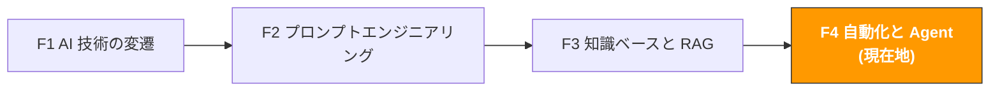

# F4. 自動化と AI Agent

> **トラック**: Path 0: AI 基礎 · **モジュール**: F4
> **最終更新**: 2026-07-31
> **難易度**: 中級
> **所要時間**: 2 時間
> **前提モジュール**: [F1 AI 技術の変遷](f1-ai-evolution.md)、[F2 プロンプトエンジニアリング](f2-prompt-engineering.md)、[F3 知識ベースと RAG](f3-rag-knowledge.md)

---




---

## 章ナビゲーション

1. [プロンプトから Agent へ](#1-プロンプトから-agent-へ-ai-能力の-4-つのレベル) · 2. [自動化の 3 層モデル](#2-自動化の-3-層モデル) · 3. [MCP プロトコル詳解](#3-mcp-プロトコル詳解) · 4. [Agent フレームワーク全景](#4-agent-フレームワーク全景) · 5. [10 の EC Agent シーン](#5-10-の越境ec-agent-シーン) · 6. [セキュリティとリスク](#6-セキュリティとリスク) · 7. [実装ロードマップ](#7-実装ロードマップ) · 8. [学習リソース](#8-学習リソース) · 9. [よくある罠](#9-よくある罠) · 10. [完了チェック](#10-完了チェック)


## このモジュールで理解できること

AI は単なる問答ツールではありません。ツールを使い、タスクを実行し、自律的に判断できるようになったとき、AI は Agent — 本物のデジタルアシスタント — になります。

このモジュールを終えると:
- プロンプトから Agent へのアップグレードの道筋を理解できる
- 自動化の 3 層モデル(スクリプト → ワークフロー → Agent)を習得できる
- MCP プロトコルのアーキテクチャと応用を深く理解できる
- 主要な Agent フレームワーク(LangGraph、CrewAI)を知る
- 10 の越境EC Agent シーンの実現性と ROI を評価できる
- Agent のセキュリティリスクと対処法がわかる

> **このモジュールの位置づけ**: 概念理解とシーン判断力を作ること。Agent を実際に構築したい場合は、修了後に [Path B: B4 AI Agent と自動化](../b-developers/b4-agent-workflow.md)へ進んでください。

---

## 1. プロンプトから Agent へ: AI 能力の 4 つのレベル

### 1.1 AI 能力のアップグレードの道筋

```
Level 1: 単発の対話(プロンプト → レスポンス)
質問すると答えが返る
記憶なし、ツールなし、行動なし
例: ChatGPT に「Listing タイトルを書いて」と聞く
価値: 情報取得とコンテンツ生成

Level 2: 複数ターンの対話(Conversation)
AI が過去のやり取りを記憶する
出力を反復して磨ける
例: Claude と議論しながら市場分析を段階的に仕上げる
価値: 協働的なコンテンツ制作と分析

Level 3: ツール拡張(Tool-Augmented LLM)
AI が外部ツールを呼んで情報を得られる
ただし各ステップは人がトリガーする必要がある
例: AI が電卓を呼んで利益を計算、検索エンジンでデータを調べる
価値: より正確な分析と計算

Level 4: 自律 Agent(Autonomous Agent)
AI が自律的にタスクを計画し、ツールを呼び、行動する
多段階の複雑なタスクを処理できる
例: AI が競合を自動監視、変化を分析、レポート生成、メール送信
価値: 真の自動化。人手の解放
```

### 1.2 越境EC のアナロジー

| AI レベル | アナロジー | あなたがすること |
|-----------|------------|------------------|
| Level 1 単発の対話 | 通りすがりに質問する | 聞いて、答えて、終わり |
| Level 2 複数ターン | コンサルと会議で議論 | あなたが議論を主導し、相手が助言 |
| Level 3 ツール拡張 | ノート PC を持ったコンサル | 「データ調べて」と言えば調べて報告 |
| Level 4 自律 Agent | 常勤アシスタントを雇う | 「毎週競合レポートを」と言えば、全部やってくれる |

### 1.3 なぜ 2025〜2026 が Agent の爆発期か

3 つの条件が 2025 年に同時に成熟しました:

| 条件 | 2023 年の状態 | 2025〜2026 年の状態 |
|------|---------------|---------------------|
| **モデル能力** | GPT-4 が出たばかり、推論は限定的 | T1 フロンティア級は多段推論を安定してこなす |
| **ツールプロトコル** | ツールごとにカスタム統合が必要 | MCP が標準化、プラグアンドプレイ |
| **フレームワークの成熟** | LangChain 初期、バグ多め | LangGraph/CrewAI が本番運用可能 |

---

## 2. 自動化の 3 層モデル

### 2.1 3 層アーキテクチャ

```
Layer 1: スクリプト自動化(Script Automation)
何: コードで固定手順を自動実行
特徴: 決定論的で信頼できるが柔軟性がない
ツール: Python スクリプト、Cron 定時タスク、シェルスクリプト
例: 毎日 Amazon 販売レポートを自動ダウンロード
向く: 繰り返しが多く、手順固定、判断不要なタスク
越境EC: レポートダウンロード、データ結合、形式変換

Layer 2: ワークフロー自動化(Workflow Automation)
何: ビジュアルツールで複数ステップとサービスを連結
特徴: スクリプトより柔軟、条件分岐に対応、ただし事前定義フロー
ツール: Zapier、Make (Integromat)、n8n、Power Automate
例: 新しい低評価 → 自動分類 → 関係者に通知 → 返信ドラフト生成
向く: システムをまたぐフロー、条件判断が必要だがロジックは事前定義可能
越境EC: 注文異常アラート、在庫警告、レビュー監視

Layer 3: Agent 自動化(Agent Automation)
何: AI が自律的にタスクを計画・実行し、不確実性に対応
特徴: 柔軟、想定外に対応、ただし監督が必要
ツール: LangGraph、CrewAI、AutoGPT
例: AI が市場変化を自律分析し、価格変更の要否を判断、調価案を起草
向く: 判断と意思決定が必要、フローが完全に確定せず、変化への適応が必要
越境EC: スマート選品、適応型広告最適化、複数市場の戦略調整
```

### 2.2 3 層の比較

| 次元 | スクリプト自動化 | ワークフロー自動化 | Agent 自動化 |
|------|------------------|--------------------|--------------|
| 柔軟性 | 低(固定フロー) | 中(事前定義の分岐) | 高(自律判断) |
| 信頼性 | 高(決定論的) | 高 | 中(誤りうる) |
| 技術ハードル | プログラミング必要 | 低(ビジュアル) | 中〜高 |
| 保守コスト | 低 | 中 | 高 |
| 向くタスク | 単純な繰り返し | システムをまたぐフロー | 複雑な判断 |
| 人の監督 | 不要 | ときどき | しばしば必要 |
| コスト | 低 | 中 | 高(API 呼び出し費) |

### 2.3 どの層を選ぶ? デシジョンフレーム

```
あなたのタスクは?

完全に固定のフロー、判断不要?
→ Layer 1: スクリプト自動化
例: 毎日レポートをダウンロード、Excel を結合、メール送信

ほぼ固定で、少数の条件分岐?
→ Layer 2: ワークフロー自動化
例: 新レビュー ≤ 3 星 → 運営に通知 → 返信ドラフト生成

内容の理解・判断・不確実性への対応が必要?
→ Layer 3: Agent 自動化
例: 競合の戦略変化を分析し、価格調整の要否を判断

わからない?
Layer 1 から始めて段階的にアップグレード
スクリプトで解けるものを先に、残りはワークフロー、
最後に Agent を検討
```

> **核心原則**: 単純な方法で解けるものに複雑な方法を使わないこと。スクリプトで済むものに Agent を使わない。Agent の価値は「スクリプトとワークフローでは解けない」タスクの処理にあります。

### 2.4 3 層が協調する実例

**シーン: 競合監視と対応システム**

```
Layer 1(スクリプト):
毎日定時に Python スクリプトを実行
Amazon SP-API で競合の価格、BSR、レビューデータを取得
データベースに保存
出力: 生データ

Layer 2(ワークフロー):
データ変化を検知(価格 10% 超の下落、新規低評価 5 件超)
アラート通知をトリガー(Slack/メール)
データ変化のサマリーを自動生成
出力: アラート + サマリー

Layer 3(Agent):
アラートとデータを受信
競合の戦略変化の原因を分析(値下げ販促? 在庫処分? 新商品攻勢?)
自社への影響を評価
対応案を生成(価格追随? 広告調整? 販促強化?)
実行計画を起草
出力: 分析レポート + 対応案(人のレビュー後に実行)
```

---

## 3. MCP プロトコル詳解

> **完全なツール集**: [MCP・Agent ツール集](../resources/awesome-mcp-agents.md) EC 向け MCP Server、Agent フレームワーク、外部 Awesome Lists の完全リスト。Shopify/Amazon/Google Ads/Meta Ads など 30+ の MCP Server と 7 大 Agent フレームワークを含む。

### 3.1 MCP の核心概念

MCP(Model Context Protocol)は Anthropic が 2024 年末に発表したオープンプロトコルで、2026 年には AI が外部ツールへ接続する業界標準になりました。OpenAI、Google、Microsoft もすでに対応しています。

**MCP の 3 つの核心コンポーネント:**

```

MCP Host(ホスト)
AI モデルを動かすアプリ
例: Claude Desktop、Kiro、Cursor、VS Code

MCP Client(クライアント)
ホスト内部の接続マネージャー
MCP Server との通信を担う

MCP Server(サーバー)
具体的なツール能力を提供するアダプタ
例: ファイルシステム Server、データベース Server、メール Server

```

**MCP Server は 3 種類の能力を提供します:**

| 能力 | 説明 | 例 |
|------|------|-----|
| **Tools(ツール)** | AI が呼び出せる関数 | メール送信、DB 照会、ファイル読み書き |
| **Resources(リソース)** | AI が読み取れるデータ | ファイル内容、DB レコード、API レスポンス |
| **Prompts(プロンプトテンプレート)** | 事前定義の対話テンプレート | 標準化された分析フロー、レポートテンプレート |

出典：[MCP Protocol Documentation](https://modelcontextprotocol.io/)、[MCP Guide 2026](https://robomotion.io/blog/mcp-explained-why-model-context-protocol-matters-in-2026)

### 3.2 MCP のワークフロー

```
ユーザー: 「今日の Amazon 注文データを調べて」


MCP Host(Claude Desktop)
AI が意図を理解し、ツールを呼ぶと判断


MCP Client
"amazon-sp-api" MCP Server を見つける


MCP Server(amazon-sp-api)
Amazon SP-API を呼んで注文データを取得


データを AI に返す


AI がデータに基づいて回答:
「今日は 47 件の注文、総売上 $1,234.56...」
```

### 3.3 越境EC でよく使う MCP Server

| MCP Server | 機能 | 応用シーン |
|-----------|------|------------|
| **filesystem** | ローカルファイルの読み書き | ローカルの Excel レポート、CSV データを分析 |
| **sqlite / postgres** | データベース操作 | 商品 DB、注文 DB を照会 |
| **fetch** | HTTP リクエスト | 外部 API 呼び出し、Web データ取得 |
| **gmail / outlook** | メール操作 | サプライヤーのメール読み取り、レポート送信 |
| **slack** | Slack メッセージ | アラート通知、チーム協働 |
| **puppeteer** | ブラウザ自動化 | 競合データ収集、スクショ比較 |
| **memory** | 知識グラフ | 構造化知識の保存と検索 |

### 3.4 MCP vs 従来の API 統合

| 次元 | 従来の API 統合 | MCP |
|------|-----------------|-----|
| 開発コスト | ツールごとにカスタムコード | 標準化プロトコル、プラグアンドプレイ |
| 保守コスト | API 変更を 1 つずつ更新 | Server が独立更新、他に影響しない |
| エコシステム | 断片的 | 統一、コミュニティが Server を共有 |
| セキュリティ | 各自で実装 | プロトコルレベルの権限制御 |
| アナロジー | 機器ごとに違う充電ケーブル | USB-C の統一ポート |

### 3.5 A2A プロトコル: Agent 同士の協業

MCP が解くのは「AI がツールに接続する」問題。2025 年に Google が発表した **A2A(Agent-to-Agent)プロトコル** が解くのは「Agent 同士の協業」問題です。

```
MCP: 垂直統合(AI ↔ ツール)
AI がファイルシステムを呼ぶ
AI がデータベースを呼ぶ
AI が API を呼ぶ

A2A: 水平協業(Agent ↔ Agent)
選品 Agent が結果を Listing Agent に渡す
Listing Agent が結果を広告 Agent に渡す
複数の Agent が協業して複雑なタスクを完了
```

**MCP + A2A = 完全な Agent インフラ**

出典：[MCP vs A2A Guide](https://learndevrel.com/blog/mcp-vs-a2a)

---

## 4. Agent フレームワーク全景

### 4.1 主要フレームワークの比較

| フレームワーク | タイプ | 向くシーン | 技術ハードル | GitHub Stars |
|----------------|--------|------------|--------------|--------------|
| [LangGraph](https://github.com/langchain-ai/langgraph) | 開発フレームワーク | カスタム Agent ワークフロー | 高(Python 必要) | 10K+ |
| [CrewAI](https://github.com/crewAIInc/crewAI) | マルチ Agent フレームワーク | 複数 Agent の協業 | 中 | 25K+ |
| [AutoGPT](https://github.com/Significant-Gravitas/AutoGPT) | 自律 Agent | 探索的なタスク | 中 | 170K+ |
| [Dify](https://github.com/langgenius/dify) | ローコードプラットフォーム | AI アプリの高速構築 | 低 | 55K+ |
| [Coze](https://www.coze.com/) | ノーコードプラットフォーム | Bot の高速構築 | 最低 | N/A(商用製品) |

### 4.2 フレームワーク選択ガイド

```
あなたの技術レベルは?

プログラミングできない
高速構築したい → Coze(ノーコード、中国語フレンドリー)
より制御したい → Dify(ローコード、ビジュアル)

基礎的な Python ができる
単一 Agent → LangGraph(最も柔軟)
複数 Agent の協業 → CrewAI(マルチ Agent オーケストレーション)

個人 AI アシスタントが欲しい
```

### 4.3 LangGraph: 最も柔軟な Agent フレームワーク

> **関連**: [B4 AI Agent とワークフロー自動化](../b-developers/b4-agent-workflow.md) Agent システム構築の実践は B4 へ

LangGraph は LangChain チームが出した Agent フレームワークで、Agent の振る舞いを**状態グラフ(State Graph)**としてモデル化するのが核心です。

```
LangGraph の核心概念:

State(状態): Agent の現在の情報と文脈
Node(ノード): Agent が実行する各操作
Edge(エッジ): ノード間の接続と条件判断

例 — 競合分析 Agent:

データ取得 → 変化を分析 → 重要度を判断

重要な変化 | 重要でない

深掘り分析 | ログ記録

レポート生成

通知送信
```

### 4.4 CrewAI: マルチ Agent 協業

CrewAI の核心は、専門化した複数の Agent が「チーム」を組み、それぞれの役割を果たすことです。

```
CrewAI の例 — 選品チーム:

Agent 1: 市場リサーチャー
役割: 市場データとトレンドを収集
ツール: Google Trends API、Amazon データ
出力: 市場分析レポート

Agent 2: 競合アナリスト
役割: 競合の優劣を分析
ツール: レビュー分析、Listing 比較
出力: 競合分析レポート

Agent 3: 財務アナリスト
役割: 利益と ROI を計算
ツール: コスト計算機、FBA 手数料試算
出力: 利益分析レポート

Agent 4: 意思決定アドバイザー
役割: すべての分析を統合し、提言する
入力: 前 3 つの Agent のレポート
出力: Go/No-Go 提言 + アクションプラン

ワークフロー: Agent 1 → Agent 2 → Agent 3 → Agent 4
```

---

## 5. 10 の越境EC Agent シーン

> **関連**: [D2 TikTok Shop AI ガイド](../d-platforms/tiktok-shop-ai-guide.md) TikTok Shop の自動化運営は D2 へ

### 5.1 シーン一覧

| # | シーン | 自動化レベル | 技術難易度 | 期待 ROI | 推奨優先度 |
|---|--------|--------------|------------|----------|------------|
| 1 | 競合監視とアラート | Layer 2-3 | | 高 | |
| 2 | レビュー自動分析 | Layer 2-3 | | 高 | |
| 3 | 在庫警告と補充提案 | Layer 1-2 | | 高 | |
| 4 | 多言語 CS アシスタント | Layer 3 | | 高 | |
| 5 | Listing 品質巡回 | Layer 2-3 | | 中 | |
| 6 | 広告自動最適化 | Layer 3 | | 高 | |
| 7 | 選品情報収集 | Layer 2-3 | | 中 | |
| 8 | コンプライアンス自動チェック | Layer 2-3 | | 中 | |
| 9 | サプライヤー連絡アシスタント | Layer 3 | | 中 | |
| 10 | フルファネル運営 Agent | Layer 3 | | 極めて高 | (長期目標) |

### 5.2 シーン詳解

**シーン 1: 競合監視とアラート**

```
トリガー: 毎日定時 / リアルタイム監視
入力: 競合 ASIN リスト
フロー:
1. [スクリプト] 競合の価格、BSR、レビューデータを取得
2. [スクリプト] 前日データと比較、変化を検知
3. [ワークフロー] 変化が閾値超え → アラートをトリガー
4. [Agent] 変化の原因を分析、対応提案を生成
出力: アラート通知 + 分析レポート + 対応提案
ツール: Python + Amazon SP-API + LLM
期待効果: 「週 1 回の手動確認」から「リアルタイム監視・自動分析」へ
```

**シーン 2: レビュー自動分析**

```
トリガー: 新レビューの出現
入力: 新規レビュー内容
フロー:
1. [スクリプト] 新レビューを検知
2. [Agent] レビューの感情とトピックを分析
3. [Agent] 低評価なら原因を分析し返信ドラフトを生成
4. [ワークフロー] 運営担当にレビュー通知
出力: レビュー分析 + 返信ドラフト + トレンドレポート
ツール: Python + LLM + Slack/メール通知
期待効果: 低評価の応答時間が 24 時間 → 2 時間
```

**シーン 3: 在庫警告と補充提案**

```
トリガー: 毎日定時
入力: 販売データ、在庫データ、サプライヤー納期
フロー:
1. [スクリプト] 現在庫と直近の販売データを取得
2. [スクリプト] 安全在庫と在庫切れ予測日を計算
3. [ワークフロー] 在庫が安全ラインを下回る → 警告
4. [Agent] 季節性・販促計画を考慮し補充提案を生成
出力: 在庫状態レポート + 補充提案 + 緊急度ランキング
ツール: Python + pandas + LLM
期待効果: 欠品率 −50%、在庫回転率 +20%
```

**シーン 4: 多言語 CS アシスタント**

```
トリガー: 顧客メッセージ受信
入力: 顧客メッセージ(任意の言語)
フロー:
1. [Agent] 言語を検出、必要なら中国語へ翻訳
2. [Agent] 商品ナレッジベース(RAG)から関連情報を検索
3. [Agent] 返信ドラフトを生成(ターゲット言語)
4. [ワークフロー] CS 担当に送りレビュー
出力: 翻訳 + 返信ドラフト + 参照情報源
ツール: LLM + RAG + CS システム統合
期待効果: 応答時間 −70%、言語カバレッジ 2 種 → 5 種
```

**シーン 5: Listing 品質巡回**

```
トリガー: 毎週定時 / Listing 更新後
入力: 全在庫商品の Listing 内容
フロー:
1. [スクリプト] 全 Listing 内容を取得
2. [Agent] タイトル長、キーワードカバレッジ、Bullet 品質をチェック
3. [Agent] 競合 Listing と比較し差を発見
4. [Agent] 最適化提案と優先度を生成
出力: Listing 品質スコアカード + 最適化提案 + 優先度
ツール: Python + LLM + Amazon SP-API
期待効果: Listing 品質の一貫性向上、転換率 +5〜10%
```

**シーン 6-10 の概要:**

| シーン | 核心価値 | 主な課題 |
|--------|----------|----------|
| 6. 広告自動最適化 | 入札と予算をリアルタイム調整 | 慎重さが必要、誤判断の損失が大きい |
| 7. 選品情報収集 | カテゴリ機会を自動発見 | データソースが多く、クロス検証が必要 |
| 8. コンプライアンス自動チェック | 出品前に自動でコンプラチェック | 法規更新が頻繁、知識庫の保守が必要 |
| 9. サプライヤー連絡アシスタント | サプライヤーメールを自動翻訳・起草 | 商談には人情味が必要 |
| 10. フルファネル運営 Agent | 選品からアフターまで全自動化 | 長期ビジョン、現状の技術は未成熟 |

### 5.3 実施優先度の提案

```
第 1 段階(今すぐ、1〜2 週間):
シーン 3: 在庫警告(スクリプトレベル、最も簡単)
シーン 2: レビュー分析(ChatGPT/Claude で手動、フローを確立)
投入: 数時間のスクリプト開発 + AI ツールの購読

第 2 段階(1〜2 か月):
シーン 1: 競合監視(スクリプト + ワークフロー)
シーン 5: Listing 巡回(Agent レベル)
シーン 4: 多言語 CS(RAG + Agent)
投入: 1〜2 週間の開発 + RAG システム構築

第 3 段階(3〜6 か月):
シーン 6: 広告最適化(慎重なテストが必要)
シーン 7: 選品情報(複数データソース統合が必要)
シーン 8: コンプラチェック(知識庫の保守が必要)
投入: 継続的な開発と最適化

長期目標(6〜12 か月):
シーン 9-10: 高度な Agent 協業
技術成熟度のさらなる向上が必要
```

---

## 6. セキュリティとリスク

### 6.1 Agent のリスクマトリクス

| リスク種別 | 説明 | 深刻度 | 対処 |
|------------|------|--------|------|
| **権限過大** | すべきでないことをする権限を持つ | 高 | 最小権限の原則。必要な権限だけ |
| **データ漏洩** | 機密データを外部へ送る | 高 | データ分級。機密は外部 API を通さない |
| **誤った判断** | 誤ったビジネス判断をする | 高 | 重要判断は必ず人がレビュー |
| **幻覚による行動** | 誤情報に基づいて操作する | 中 | 操作前にデータ源を検証 |
| **コスト暴走** | API を大量呼び出しで費用急増 | 中 | 呼び出し上限と予算アラートを設定 |
| **ループ実行** | 無限ループに陥る | 中 | 最大ステップ数とタイムアウトを設定 |

### 6.2 セキュリティのベストプラクティス

```
原則 1: 最小権限
Agent は必要なデータとツールだけにアクセスできる
Agent に管理者権限を与えない
Agent の権限を定期的に見直す

原則 2: Human-in-the-Loop
重要操作(メール送信、価格変更、発注)は必ず人が確認
Agent が提案し、人が意思決定
「自動実行」と「承認が必要」の 2 モードを設定

原則 3: 監視と監査
Agent の全操作ログを記録
異常行動のアラートを設定
Agent の判断品質を定期的にレビュー

原則 4: 段階的な権限委譲
第 1 段階: Agent はデータ読み取りとレポート生成のみ
第 2 段階: Agent はコンテンツを起草可能(人のレビュー後に公開)
第 3 段階: 低リスク操作は自動実行可能
第 4 段階: 高リスク操作は依然として人の承認が必要

原則 5: フェイルセーフ
Agent はエラー時に自動停止し、続行しない
ロールバック機構を設定(Agent の操作を取り消せる)
バックアップ策を持つ(Agent が使えないときの手動フロー)
```

### 6.3 データセキュリティの分級

| データレベル | 例 | 外部 API を使える? | 推奨方案 |
|--------------|-----|--------------------|----------|
| 公開データ | 競合の Listing、公開レビュー | 使える | ChatGPT/Claude API |
| 内部データ | 販売レポート、運営データ | 慎重に | 企業版 API(学習に使われない) |
| 機密データ | 利益データ、サプライヤー価格 | 非推奨 | ローカルモデル(Ollama + Llama) |
| 極秘データ | アカウントパスワード、API キー | 絶対不可 | AI を通さず、従来の暗号化方式で |

---

## 7. 実装ロードマップ

### 7.1 ゼロから Agent までのロードマップ

```
Week 1-2: 基礎を作る
Path 0 の全モジュールを修了(あなたは今ここ)
ChatGPT/Claude を日常運営で使い始める
プロンプトテンプレート集を作る
成果: 個人の AI 利用習慣

Week 3-4: スクリプト自動化
基礎的な Python を学ぶ(まだなら)
最初の自動化スクリプトを書く(レポートダウンロード/データ結合)
定時タスクを設定
成果: 2〜3 個の自動化スクリプト

Month 2: ワークフロー自動化
ワークフローツールを選ぶ(Zapier/Make/n8n)
最初のワークフローを構築(レビュー監視 → 通知)
RAG ナレッジベースを構築(商品 FAQ)
成果: 2〜3 個のワークフロー + ナレッジベース

Month 3-4: Agent 入門
LangGraph か CrewAI を学ぶ
最初の Agent を構築(競合分析 Agent)
MCP Server を設定(ファイルシステム、データベース)
成果: 使える Agent 1 つ

Month 5-6: Agent 最適化
Agent の能力を拡張(ツール増、シーン増)
監視と監査の仕組みを構築
チームへ展開
成果: Agent システム + チーム利用規範
```

### 7.2 役割別のロードマップ

| 役割 | 重点 | 推奨パス |
|------|------|----------|
| 運営 | 既存 AI ツールを使いこなす + 簡単な自動化 | Path 0 → Path A → Zapier/Make ワークフロー |
| 技術 | Agent システムの構築 | Path 0 → Path B(重点は B4) → LangGraph/CrewAI |
| マネージャー | Agent の能力境界を理解し戦略を立てる | Path 0 → Path C → チームの Agent ニーズを評価 |

---

## 8. 学習リソース

### 8.1 入門におすすめ

| リソース | ソース | おすすめ理由 |
|----------|--------|--------------|
| [AI Agents in LangGraph](https://www.deeplearning.ai/courses/ai-agents-in-langgraph) | DeepLearning.AI | 無料講座、LangGraph Agent 入門 |
| [Multi AI Agent Systems with CrewAI](https://www.deeplearning.ai/courses/multi-ai-agent-systems-with-crewai) | DeepLearning.AI | 無料講座、マルチ Agent 協業 |
| [MCP 公式ドキュメント](https://modelcontextprotocol.io/) | Anthropic | MCP プロトコルの権威ある参考 |

### 8.2 さらに深く

| リソース | ソース | おすすめ理由 |
|----------|--------|--------------|
| [B4 AI Agent と自動化](../b-developers/b4-agent-workflow.md) | ecommerce-ai-skills | 本ハブの技術実践モジュール |
| [Building Effective Agents](https://www.anthropic.com/research/building-effective-agents) | Anthropic | Anthropic 公式の Agent 設計ガイド |
| [LangGraph Documentation](https://langchain-ai.github.io/langgraph/) | LangChain | LangGraph の完全ドキュメント |
| [The AI Agent Landscape 2026](https://learndevrel.com/blog/openclaw-ai-agent-phenomenon) | LearnDevRel | 2026 年の Agent エコシステム全景分析 |

---

## 9. よくある罠

### 9.1 Agent を使うために Agent を使う

流れが固定のタスクは Chain のほうが簡単・安価・制御しやすい。Agent が費用に見合うのは、途中で何に当たるか分からず AI の判断が要る、本物の不確実性がある場合だ。

### 9.2 初日から書き込み権限を与える

Agent に直接価格変更・発注・メッセージ送信をさせると、誤ったときの代償が節約した時間をはるかに上回る。まず読み取り専用で回し、判断の質をしばらく観察してから段階的に開放する。

### 9.3 反復回数の上限を設定しない

ループの暴走はコスト暴走の最大の原因だ。`recursion_limit` は必須であって任意ではない。

### 9.4 ツールの生の戻り値をそのままモデルに渡す

ツールが 500 行返し、モデルが知る必要があるのはどの行が異常かだけ、という状況。先にコードで集約すること。**コードで計算できることにモデルの金を払わない。**

---

## 10. 完了チェック

- [ ] AI 能力の 4 レベル(対話 → 複数ターン → ツール拡張 → Agent)を理解した
- [ ] 自動化の 3 層モデル(スクリプト → ワークフロー → Agent)を区別し、いつどれを使うか判断できる
- [ ] MCP プロトコルのアーキテクチャと役割を理解した
- [ ] 少なくとも 3 つの Agent フレームワークの特徴と適用シーンを知っている
- [ ] 10 の EC Agent シーンの実現性と優先度を評価できる
- [ ] Agent のセキュリティリスクと対処法を知っている
- [ ] 明確な個人/チームの Agent 実装ロードマップを持っている

---

## この方法が効かないとき

- **処理が 1 ステップ、または手順が完全に固定のとき。** 「この Review をドイツ語に訳す」に Agent は要らない。API 呼び出し 1 回で済む。Agent のコストは多段の推論とツール呼び出しから来るもので、「次に何をするか」が本当に前の結果次第であるときにだけ、そのコストが何かを買っている。固定手順ならワークフローツール([F5](f5-rpa-automation.md))のほうが安く、予測もしやすい。
- **ツールが返すデータが信頼できないとき。** Agent はツールの戻り値をもとに次の手を決める。在庫 API に遅延があったり、レポートの口がたまに空を返したりすると、Agent は「データがおかしい」と気づかない。誤ったデータを持ったまま、各ステップで自信を持って進んでいく。上に Agent を載せる前に、データソースの信頼性を先に片づけること。
- **動作が不可逆で、人の承認が挟まらないとき。** 自動価格改定、発注、クレームへの自動返信 — 一度判断を誤れば損害はもう出ている。この種の正しい形は、Agent が提案し人が確認する構成(本章の human-in-the-loop の例)であって、完全自動ではない。判断基準は「間違えたら取り消せるか」であり、「間違える確率が低いか」ではない。
- **何が浮くのかまだ言えないとき。** Agent の開発と保守のコストは、スクリプト 1 本よりはるかに高い。「この Agent は週にどの具体的な動作を置き換え、それぞれ元は何分かかっていたか」を言えないなら、おそらくアーキテクチャそのものに払っている。まずその動作を書き出すこと([A14](../a-operators/a14-operations-agent.md) のタスク分流表)。その後で判断すればいい。

---

## Path 0 修了、おめでとうございます!

しっかりした AI の基礎認識ができました。今やあなたは理解しています:
- AI の本質(predict next token)と能力の境界
- AI と体系的にコミュニケーションする方法(CRISP + 上級テクニック)
- AI に独自データを使わせる方法(RAG)
- AI を「質問に答える」から「タスクを実行する」へアップグレードする方法(Agent)

**次は、役割に応じて学習パスを選びましょう:**

| あなたは誰か | 推奨パス | 核心の目標 |
|--------------|----------|------------|
| 運営 | [Path A: AI 実践で効率化](../a-operators/) | AI ツールで運営効率を 3〜10 倍に |
| 技術 | [Path B: AI システム構築](../b-developers/) | AI 駆動の EC ツールとシステムを構築 |
| マネージャー | [Path C: AI 戦略の実装](../c-managers/) | 実行可能なチーム AI 導入計画を策定 |
