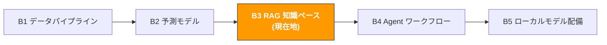

# B3. RAG 知識ベースシステム

> **トラック**: Path B: 技術 · **モジュール**: B3
> **最終更新**: 2026-07-31
> **難易度**: 中級 → 上級
> **前提**: B1 データパイプラインの基礎(Python、ファイル処理)、B2 の基本 ML 概念
> **所要時間**: 1 日 1 時間、2〜3 週間
---




---

## 章ナビゲーション

1. [RAG 方法論](#1-rag-方法論) · 2. [ツール全景](#2-ツール全景) · 3. [技術スタックの選択詳解](#3-技術スタックの選択詳解) · 4. [コード実践](#4-コード実践) · 5. [EC RAG 応用](#5-ec-rag-応用シーン) · 6. [よくある罠](#6-よくある罠) · 7. [上級テクニック](#7-上級テクニック) · 8. [学習リソース](#8-学習リソース)


## このモジュールで構築するもの

社内文書ベースの AI Q&A システム 製品マニュアル、ポリシー文書、FAQ、Review データをアップロードすると、AI が自動で検索して質問に答える。

修了後には:
- RAG(Retrieval-Augmented Generation)の核心原理とアーキテクチャを理解できる
- LlamaIndex で 10 行のコードで使える RAG システムを構築できる
- 製品マニュアルと Review データから製品 FAQ 知識ベースを構築できる
- 複数のデータ源(製品文書 + ポリシー文書 + Review)を統合してマルチドキュメント RAG を構築できる
- Chroma ベクトルデータベースで永続化し、毎回インデックスを再構築するのを回避できる
- Ollama でローカルに LLM を実行し、OpenAI API に依存しない
- RAG システムの検索精度と回答品質を評価できる
- 完全な EC 製品知識ベース Q&A システムを構築できる

---

## 1. RAG 方法論

> **関連**: [A4 カスタマーサービスとアフターケア](../a-operators/a4-customer-service.md) RAG システムの CS FAQ 自動回答への応用シーンは A4 へ · [F3 知識ベースと RAG](../0-foundations/f3-rag-knowledge.md) RAG 基礎理論は F3 へ。

### 1.1 RAG とは

RAG(Retrieval-Augmented Generation、検索拡張生成)は LLM にあなたのプライベートデータに基づいて質問に答えさせる技術。

核心の考え方:

```
ユーザーが質問 → 文書から関連段落を検索 → 段落+質問を LLM に送る → LLM が検索内容に基づいて回答
```

**なぜ ChatGPT を直接使わないか?**

| 方式 | 利点 | 欠点 |
|------|------|------|
| ChatGPT に直接質問 | ゼロコスト、すぐ使える | あなたの製品詳細、社内ポリシー、最新データを知らない |
| 文書を対話ボックスに貼り付け | シンプル | token 制限(約 128k)、文書が多いと入らない |
| Fine-tuning 微調整 | モデルがあなたの知識を「記憶」 | コストが高い、更新が遅い、古い知識を忘れやすい |
| **RAG** | **最新データをリアルタイム検索、低コスト、説明可能** | **検索システムの構築が必要** |

RAG の核心的な強みは**データの鮮度**と**説明可能性**: いつでも文書を更新でき、RAG は即座に最新内容で回答できる;しかも各回答は具体的なソース文書の段落に遡れる。

### 1.2 RAG vs Fine-tuning の選択

これは最もよく聞かれる質問。簡単に言うと: RAG は「資料を調べる」に向き、Fine-tuning は「スタイルを変える」に向く。

| 次元 | RAG | Fine-tuning |
|------|-----|-------------|
| 向くシーン | 文書に基づいて質問に答える(FAQ、ポリシー照会) | モデルの出力スタイルや形式を変える |
| データ更新 | リアルタイム(文書を更新すればよい) | 再訓練が必要(時間もお金もかかる) |
| コスト | 低(ベクトルDB + API 呼び出しだけ) | 高(GPU 訓練 + データラベリング) |
| ハルシネーション制御 | 良(回答が検索した文書に基づく) | 悪(モデルが内容を捏造しうる) |
| 説明可能性 | 強(引用元を表示できる) | 弱(ブラックボックス) |
| 知識容量 | 無限(文書数に制限なし) | 有限(モデル容量に制限される) |
| 技術的ハードル | 低(数十行のコード) | 高(ML エンジニアリング経験が必要) |

**決定フレーム:**

```
あなたのニーズは何?
AI に文書/データについての質問に答えさせる → RAG
AI に特定のスタイル/形式で出力させる → Fine-tuning
両方必要 → RAG + Fine-tuning(まず RAG、効果が足りなければ Fine-tuning を追加)
不確実 → まず RAG を試す(低コスト、速く効果)
```

### 1.3 EC RAG の典型シーン

| シーン | データ源 | ユーザー質問の例 | 価値 |
|--------|----------|------------------|------|
| 製品 FAQ | 製品マニュアル、仕様書 | 「このカメラは 4K 60fps 対応?」 | CS 効率が 5-10 倍向上 |
| ポリシー照会 | Amazon ポリシー文書、コンプライアンスガイド | 「FBA 返品ポリシーは電子製品に特別要件がある?」 | コンプライアンスリスク低減 |
| Review 洞察 | 顧客レビューデータ | 「電池持ちへの主な不満は?」 | 製品改善の方向 |
| サプライヤー知識ベース | サプライヤーマニュアル、連絡記録 | 「サプライヤー A の最小発注量は?」 | 調達判断の加速 |
| 運営 SOP | 社内操作マニュアル | 「A-to-Z Claim をどう処理する?」 | 新人研修の効率 |
| 競合分析 | 競合 Listing、Review | 「競合 X の主な訴求点は?」 | 差別化戦略 |

> **重要な洞察**: EC シーンでの RAG の価値は「あちこちに散らばった知識」を「いつでも照会できるインテリジェントアシスタント」に変えること。運営チームには数十の製品マニュアル、数百ページのポリシー文書、数万件の Review があるかも 誰も全部を記憶できないが、RAG はできる。

### 1.4 RAG アーキテクチャの全景

完全な RAG システムは 2 つの段階を含む:

**段階 1: インデックス(Indexing) オフライン準備**

```
生文書 → 文書ロード → テキスト分割(Chunking) → ベクトル化(Embedding) → ベクトルデータベースに保存
```

**段階 2: クエリ(Querying) オンラインサービス**

```
ユーザーが質問 → 質問をベクトル化 → ベクトル類似度検索 → Top-K の関連段落を取得 → Prompt を構築 → LLM が回答を生成
```

**各段階のキーな選択:**

| 段階 | 選択肢 | 推奨(入門) | 推奨(本番) |
|------|--------|-------------|-------------|
| 文書ロード | LlamaIndex SimpleDirectoryReader, LangChain Loaders | LlamaIndex | LlamaIndex |
| テキスト分割 | 固定サイズ、文単位、意味単位 | 固定サイズ(512 tokens) | 意味分割 |
| Embedding モデル | OpenAI text-embedding-3-small, BGE, E5 | OpenAI(最も簡単) | BGE-large(オープンソース無料) |
| ベクトルデータベース | Chroma, FAISS, Pinecone, Weaviate | Chroma(最も簡単) | Pinecone(マネージドサービス) |
| LLM | クラウド T1/T2 級、または Ollama ローカルモデル | クラウド T3 高速級 | Ollama + qwen3:8b(ローカル無料) |

---

## 2. ツール全景

| ツール | 種類 | 難度 | 最適シーン | インストール |
|--------|------|------|------------|--------------|
| [LlamaIndex](https://docs.llamaindex.ai/) | RAG フレームワーク | 入門 | RAG を素早く構築、文書 Q&A | `pip install llama-index` |
| [LangChain](https://docs.langchain.com/oss/python/langchain/overview) | LLM アプリフレームワーク | 中級 | 複雑な LLM ワークフロー、Agent | `pip install langchain` |
| [Chroma](https://www.trychroma.com/) | ベクトルデータベース | 入門 | ローカル開発、小規模データ | `pip install chromadb` |
| [Ollama](https://ollama.com/) | ローカル LLM | 入門 | OpenAI API を使いたくない、データプライバシー | [ollama.com/download](https://ollama.com/download) |
| [OpenAI API](https://platform.openai.com/) | クラウド LLM | 入門 | 最高品質の回答、素早いプロトタイプ | `pip install openai` |
| [Pinecone](https://www.pinecone.io/) | マネージドベクトルDB | 中級 | 本番環境、大規模データ | `pip install pinecone-client` |
| [FAISS](https://github.com/facebookresearch/faiss) | ベクトル検索ライブラリ | 中級 | 高性能、大規模ベクトル検索 | `pip install faiss-cpu` |
| [Sentence-Transformers](https://www.sbert.net/) | Embedding モデル | 中級 | オープンソース無料の Embedding | `pip install sentence-transformers` |

**選択のアドバイス:**
- 始めたばかり → LlamaIndex + OpenAI API(10 行のコードで結果)
- お金を使いたくない → LlamaIndex + Ollama + Chroma(すべてローカル無料)
- 本番環境 → LlamaIndex/LangChain + Pinecone + OpenAI(安定して拡張可能)
- プライバシー要求が高い → Ollama + Chroma(データが本機を出ない)

---

## 3. 技術スタックの選択詳解

### 3.1 LlamaIndex vs LangChain

これらは RAG 分野で最も人気の 2 大フレームワークで、よく比較される:

| 次元 | LlamaIndex | LangChain |
|------|-----------|-----------|
| 位置づけ | データインデックスと検索に特化 | 汎用 LLM アプリフレームワーク |
| RAG 体験 | 箱を開けてすぐ、5 行で RAG 構築 | より多くの設定が必要、柔軟だが複雑 |
| 学習曲線 | 緩やか、ドキュメントが明快 | やや急、概念が多い(Chain、Agent、Tool) |
| 文書ロード | 100+ の内蔵ローダー | 100+ の内蔵ローダー |
| 向くシーン | 文書 Q&A、知識ベース | 複雑なワークフロー、多段推論、Agent |
| コミュニティ | 活発、更新が速い | 非常に活発、エコシステムが最大 |

**結論**: 入門は LlamaIndex(よりシンプル)、複雑なワークフローが必要なとき LangChain を導入。本モジュールは LlamaIndex を主とする。

参考ドキュメント: [LlamaIndex 公式ドキュメント](https://docs.llamaindex.ai/) | [LangChain 公式ドキュメント](https://docs.langchain.com/oss/python/langchain/overview)

### 3.2 Embedding モデルの選択

Embedding モデルが検索品質を決める。モデルを間違えると検索が不正確になり、後の LLM がいくら強くても無駄。

| モデル | 提供者 | 次元 | 中国語対応 | コスト | 推奨シーン |
|--------|--------|------|------------|--------|------------|
| text-embedding-3-small | OpenAI | 1536 | 可 | $0.02/1M tokens | 素早いプロトタイプ、品質良 |
| text-embedding-3-large | OpenAI | 3072 | 可 | $0.13/1M tokens | 最高の検索精度を追求 |
| BGE-large-zh-v1.5 | BAAI | 1024 | 優秀 | 無料(ローカル実行) | 中国語文書、データプライバシー |
| E5-large-v2 | Microsoft | 1024 | 可 | 無料(ローカル実行) | 多言語シーン |
| all-MiniLM-L6-v2 | Sentence-Transformers | 384 | 一般 | 無料(ローカル実行) | 英語文書、リソース限定 |

**EC シーンの推奨**:
- 中英混合文書 → `text-embedding-3-small`(OpenAI、品質が最も安定)
- 純中国語文書 + データプライバシー → `BGE-large-zh-v1.5`(ローカル無料、中国語効果が良い)
- 予算限定 → `all-MiniLM-L6-v2`(ローカル無料、英語は十分)

### 3.3 ベクトルデータベースの選択

| データベース | 種類 | データ規模 | 永続化 | 向くシーン |
|--------------|------|------------|--------|------------|
| Chroma | 組み込み | <100 万ベクトル | ローカルファイル | 開発テスト、小チーム |
| FAISS | ライブラリ(DB でない) | <1000 万ベクトル | 手動保存が必要 | 高性能検索、オフラインシーン |
| Pinecone | クラウドマネージド | 無限 | クラウドで自動 | 本番環境、運用不要 |
| Weaviate | セルフホスト/クラウド | 無限 | 自動 | ハイブリッド検索が必要(ベクトル+キーワード) |
| Qdrant | セルフホスト/クラウド | 無限 | 自動 | 高性能、フィルタクエリ |

**推奨パス**: 開発段階は Chroma(ゼロ設定)、本番環境は Pinecone か Qdrant に移行。

---

## 4. コード実践

### 4.1 最小 RAG: 10 行のコードで LlamaIndex Q&A システムを構築

これは書ける最もシンプルな RAG システム。文書をフォルダに置き、10 行のコードで Q&A できる。

> **本章のコードの依存**: `pip install llama-index chromadb pandas ragas datasets sentence-transformers llama-index-retrievers-bm25`

```python
# 最小 RAG 10 行のコード
# 前提: pip install llama-index openai
# 環境変数: export OPENAI_API_KEY="sk-..."

from llama_index.core import VectorStoreIndex, SimpleDirectoryReader

# 1. 文書をロード(.txt, .pdf, .md, .docx, .csv などに対応)
documents = SimpleDirectoryReader("data/product_docs").load_data()
print(f"{len(documents)} 個の文書をロード")

# 2. インデックスを構築(自動分割 + Embedding + メモリベクトル保存)
index = VectorStoreIndex.from_documents(documents)

# 3. クエリエンジンを作成
query_engine = index.as_query_engine()

# 4. 質問
response = query_engine.query("この製品は 4K 60fps 対応?")
print(response)
```

これだけシンプル。LlamaIndex は裏ですべてをやっている:
1. `SimpleDirectoryReader` がファイル形式を自動認識してロード
2. `VectorStoreIndex.from_documents` が自動分割(デフォルト 1024 tokens)、OpenAI Embedding API を呼んでベクトル生成、メモリに保存
3. `as_query_engine()` がクエリエンジンを作成、デフォルトで Top-2 の関連段落を検索
4. `query()` が検索した段落と質問を GPT に送り、回答を生成

> **注意**: この最小版は OpenAI API を使い、`OPENAI_API_KEY` 環境変数の設定が必要。実行のたびにインデックスを再構築(Embedding API を呼ぶ)し、API コストがかかる。後で Chroma での永続化と Ollama での OpenAI 代替を紹介する。

**検索したソース文書を確認:**

```python
# RAG がどの文書段落を検索したか確認
response = query_engine.query("返品ポリシーは何?")

print("回答:", response)
print("\n--- 引用元 ---")
for node in response.source_nodes:
    print(f"ファイル: {node.metadata.get('file_name', 'unknown')}")
    print(f"類似度: {node.score:.4f}")
    print(f"内容: {node.text[:200]}...")
    print()
```

> **説明可能性**: RAG の大きな利点は各回答がソース文書に遡れること。EC シーンで非常に重要 CS 担当が AI で顧客の質問に答えるとき、回答に根拠があることを確保する必要がある。

### 4.2 製品 FAQ 知識ベース: 製品マニュアルから Q&A システムを構築

実際のシーン: 大量の製品マニュアル(PDF/Word/Markdown)があり、AI に製品関連の質問を自動で答えさせたい。

```python
import os
from pathlib import Path
from llama_index.core import (
    VectorStoreIndex,
    SimpleDirectoryReader,
    Settings,
    StorageContext,
    load_index_from_storage,
)
from llama_index.core.node_parser import SentenceSplitter

def build_product_faq(
    docs_dir: str,
    chunk_size: int = 512,
    chunk_overlap: int = 50,
    persist_dir: str = "storage/product_faq"
) -> VectorStoreIndex:
    """
    製品文書から FAQ 知識ベースを構築する。

    Args:
        docs_dir: 製品文書ディレクトリ(.txt, .pdf, .md, .docx, .csv 対応)
        chunk_size: 分割サイズ(tokens)
        chunk_overlap: 分割の重複サイズ
        persist_dir: インデックス永続化ディレクトリ

    Returns:
        構築されたベクトルインデックス
    """
    # 既存の永続化インデックスをチェック
    if Path(persist_dir).exists():
        print("既存インデックスをロード...")
        storage_context = StorageContext.from_defaults(persist_dir=persist_dir)
        index = load_index_from_storage(storage_context)
        print("インデックスのロード完了")
        return index

    # 1. 文書をロード
    print(f"{docs_dir} から文書をロード...")
    documents = SimpleDirectoryReader(
        docs_dir,
        recursive=True,
        filename_as_id=True,
    ).load_data()
    print(f"{len(documents)} 個の文書をロード")

    # 2. 分割戦略を設定
    text_splitter = SentenceSplitter(
        chunk_size=chunk_size,
        chunk_overlap=chunk_overlap,
    )
    Settings.text_splitter = text_splitter

    # 3. インデックスを構築
    print("ベクトルインデックスを構築...")
    index = VectorStoreIndex.from_documents(documents, show_progress=True)

    # 4. 永続化(次回は再構築不要)
    index.storage_context.persist(persist_dir=persist_dir)
    print(f"インデックスを {persist_dir} に保存")

    return index

def query_product_faq(
    index: VectorStoreIndex,
    question: str,
    top_k: int = 3,
    response_mode: str = "compact"
) -> dict:
    """
    製品 FAQ 知識ベースを照会する。

    Args:
        index: ベクトルインデックス
        question: ユーザーの質問
        top_k: 検索する文書ブロック数
        response_mode: 回答モード
            - "compact": すべての検索内容を圧縮して簡潔に回答(推奨)
            - "refine": ブロックごとに回答を精錬(より正確だが遅い)
            - "tree_summarize": 木状の要約(長い回答に向く)
    """
    query_engine = index.as_query_engine(
        similarity_top_k=top_k,
        response_mode=response_mode,
    )

    response = query_engine.query(question)

    sources = []
    for node in response.source_nodes:
        sources.append({
            "file": node.metadata.get("file_name", "unknown"),
            "score": round(node.score, 4) if node.score else None,
            "text_preview": node.text[:300],
        })

    return {
        "question": question,
        "answer": str(response),
        "sources": sources,
        "num_sources": len(sources),
    }

# 使用例
# index = build_product_faq("data/product_docs", chunk_size=512)
#
# result = query_product_faq(index, "このカメラの防水等級は?")
# print(f"Q: {result['question']}")
# print(f"A: {result['answer']}")
# print(f"\n{result['num_sources']} 個の文書段落を引用:")
# for s in result['sources']:
# print(f" - {s['file']} (類似度: {s['score']})")
```

> **chunk_size 調整ガイド**:
> - 製品仕様書(短文、構造化)→ 256-512 tokens
> - 製品マニュアル(段落式の記述)→ 512-1024 tokens
> - ポリシー文書(長段落、法律用語)→ 1024-2048 tokens
> - 不確実 → 512 から始め、回答品質で調整

### 4.3 マルチドキュメント RAG: 複数のデータ源を統合

EC シーンでは、知識が複数の場所に散らばる: 製品マニュアル、Review データ、ポリシー文書、運営 SOP。マルチドキュメント RAG はそれらを 1 つの Q&A システムに統一する。

```python
from llama_index.core import VectorStoreIndex, SimpleDirectoryReader, Document, Settings
from llama_index.core.node_parser import SentenceSplitter
import pandas as pd

def load_review_data(csv_path: str, text_col: str = "review_text",
                     max_reviews: int = 1000) -> list:
    """Review CSV データを LlamaIndex Document オブジェクトに変換する。"""
    df = pd.read_csv(csv_path)

    if len(df) > max_reviews:
        df = df.sort_values("rating", ascending=True).head(max_reviews)

    documents = []
    for _, row in df.iterrows():
        text = str(row.get(text_col, ""))
        if len(text.strip()) < 10:
            continue

        metadata = {
            "source": "customer_review",
            "rating": int(row.get("rating", 0)),
            "asin": str(row.get("asin", "")),
            "date": str(row.get("date", "")),
        }
        doc = Document(text=text, metadata=metadata)
        documents.append(doc)

    print(f"{len(documents)} 件の Review をロード")
    return documents

def build_multi_source_rag(
    product_docs_dir: str = None,
    policy_docs_dir: str = None,
    review_csv: str = None,
    sop_docs_dir: str = None,
    chunk_size: int = 512,
) -> VectorStoreIndex:
    """
    マルチデータ源 RAG インデックスを構築する。
    複数の文書タイプを同じベクトルインデックスに統合、
    各文書に source メタデータを持たせ、フィルタと追跡を容易にする。
    """
    all_documents = []

    if product_docs_dir:
        docs = SimpleDirectoryReader(product_docs_dir).load_data()
        for doc in docs:
            doc.metadata["source"] = "product_manual"
        all_documents.extend(docs)
        print(f"製品文書: {len(docs)} 個")

    if policy_docs_dir:
        docs = SimpleDirectoryReader(policy_docs_dir).load_data()
        for doc in docs:
            doc.metadata["source"] = "policy"
        all_documents.extend(docs)
        print(f"ポリシー文書: {len(docs)} 個")

    if review_csv:
        review_docs = load_review_data(review_csv)
        all_documents.extend(review_docs)

    if sop_docs_dir:
        docs = SimpleDirectoryReader(sop_docs_dir).load_data()
        for doc in docs:
            doc.metadata["source"] = "sop"
        all_documents.extend(docs)
        print(f"SOP 文書: {len(docs)} 個")

    print(f"\n合計: {len(all_documents)} 個の文書")

    Settings.text_splitter = SentenceSplitter(chunk_size=chunk_size, chunk_overlap=50)
    index = VectorStoreIndex.from_documents(all_documents, show_progress=True)

    print("マルチ源 RAG インデックス構築完了")
    return index

def query_with_source_filter(
    index: VectorStoreIndex,
    question: str,
    source_filter: str = None,
    top_k: int = 5,
) -> dict:
    """
    データ源フィルタ付きのクエリ。

    Args:
        source_filter: データ源フィルタ
            - None: 全データ源を検索
            - "product_manual": 製品文書のみ検索
            - "policy": ポリシー文書のみ検索
            - "customer_review": Review のみ検索
            - "sop": SOP のみ検索
    """
    from llama_index.core.vector_stores import (
        MetadataFilter, MetadataFilters, FilterOperator,
    )

    filters = None
    if source_filter:
        filters = MetadataFilters(filters=[
            MetadataFilter(key="source", operator=FilterOperator.EQ, value=source_filter)
        ])

    query_engine = index.as_query_engine(similarity_top_k=top_k, filters=filters)
    response = query_engine.query(question)

    sources = []
    for node in response.source_nodes:
        sources.append({
            "source_type": node.metadata.get("source", "unknown"),
            "file": node.metadata.get("file_name", ""),
            "score": round(node.score, 4) if node.score else None,
        })

    return {"question": question, "answer": str(response), "sources": sources}

# 使用例
# index = build_multi_source_rag(
# product_docs_dir="data/product_docs",
# policy_docs_dir="data/policy_docs",
# review_csv="data/reviews.csv",
# )
# result = query_with_source_filter(index, "顧客は電池持ちについて何と言っている?")
# result = query_with_source_filter(index, "FBA 返品ポリシーは何?", source_filter="policy")
```

> **マルチ源 RAG の価値**: CS 担当が「この製品の返品率は高い?」と聞くと、システムは Review データから顧客の不満、ポリシー文書から返品規則、SOP から処理フローを同時に見つけ、総合的な回答を出せる。

### 4.4 Chroma ベクトルデータベース: 永続化保存と増分更新

前の例は実行のたびにインデックスを再構築し、時間と API 費用を浪費する。Chroma を使うとベクトルをディスクに永続化でき、新文書の増分追加に対応する。

```python
import chromadb
from llama_index.core import VectorStoreIndex, SimpleDirectoryReader, StorageContext
from llama_index.vector_stores.chroma import ChromaVectorStore

def create_chroma_index(
    docs_dir: str,
    collection_name: str = "product_knowledge",
    persist_dir: str = "chroma_db",
) -> VectorStoreIndex:
    """
    Chroma で永続化ベクトルインデックスを作成する。

    Chroma の利点:
    - データをディスクに永続化、再起動しても失わない
    - 文書の増分追加に対応(インデックス全体の再構築不要)
    - メタデータフィルタに対応
    - ゼロ設定、組み込み実行
    """
    chroma_client = chromadb.PersistentClient(path=persist_dir)
    chroma_collection = chroma_client.get_or_create_collection(name=collection_name)

    print(f"Collection '{collection_name}': {chroma_collection.count()} 個の既存ベクトル")

    vector_store = ChromaVectorStore(chroma_collection=chroma_collection)
    storage_context = StorageContext.from_defaults(vector_store=vector_store)

    documents = SimpleDirectoryReader(docs_dir).load_data()
    index = VectorStoreIndex.from_documents(
        documents, storage_context=storage_context, show_progress=True
    )

    print(f"インデックス構築完了、計 {chroma_collection.count()} 個のベクトル")
    return index

def load_existing_chroma_index(
    collection_name: str = "product_knowledge",
    persist_dir: str = "chroma_db",
) -> VectorStoreIndex:
    """既存の Chroma インデックスをロード(再構築しない)。"""
    chroma_client = chromadb.PersistentClient(path=persist_dir)
    chroma_collection = chroma_client.get_collection(name=collection_name)
    vector_store = ChromaVectorStore(chroma_collection=chroma_collection)
    index = VectorStoreIndex.from_vector_store(vector_store)
    print(f"既存インデックスをロード: {chroma_collection.count()} 個のベクトル")
    return index

def add_documents_to_index(index: VectorStoreIndex, new_docs_dir: str) -> int:
    """既存インデックスに新文書を増分追加する。インデックス全体の再構築は不要。"""
    new_documents = SimpleDirectoryReader(new_docs_dir).load_data()
    for doc in new_documents:
        index.insert(doc)
    print(f"{len(new_documents)} 個の文書をインデックスに新規追加")
    return len(new_documents)

# 使用例
# index = create_chroma_index("data/product_docs", persist_dir="chroma_db")
# index = load_existing_chroma_index(persist_dir="chroma_db") # 秒単位でロード
# add_documents_to_index(index, "data/new_docs") # 増分更新
```

> **Chroma vs メモリ保存**: 100 文書のインデックスで、メモリモードは起動ごとに 30 秒 + $0.01 API 費用;Chroma モードはロード <1 秒、ゼロ費用。

### 4.5 ローカル RAG(Ollama): OpenAI に依存せず、商業データのプライバシーを保護

EC データ(製品コスト、サプライヤー情報、販売データ)は商業機密。Ollama はローカルで LLM を実行でき、データが本機を出ない。

**Ollama のインストールとモデルダウンロード:**

```bash
# 1. Ollama をインストール(macOS) https://ollama.com/download からダウンロード

# 2. モデルをダウンロード
ollama pull qwen3:8b # 推奨: 中英どちらも良い、7B パラメータ
ollama pull gemma3:12b # Meta オープンソース、英語が優秀
ollama pull nomic-embed-text # Embedding モデル(OpenAI の無料代替)

# 3. 検証
ollama list # ダウンロード済みモデルを確認
```

**Ollama で完全ローカルの RAG を構築:**

```python
from llama_index.core import VectorStoreIndex, SimpleDirectoryReader, Settings
from llama_index.llms.ollama import Ollama
from llama_index.embeddings.ollama import OllamaEmbedding

def build_local_rag(
    docs_dir: str,
    llm_model: str = "qwen3:8b",
    embed_model: str = "nomic-embed-text",
    ollama_base_url: str = "http://localhost:11434",
) -> VectorStoreIndex:
    """
    完全ローカルの RAG システムを構築する(いかなる外部 API も呼ばない)。

    前提:
    1. Ollama インストール済み
    2. LLM モデルダウンロード済み: ollama pull qwen3:8b
    3. Embedding モデルダウンロード済み: ollama pull nomic-embed-text
    """
    # ローカル LLM を設定
    llm = Ollama(
        model=llm_model,
        base_url=ollama_base_url,
        request_timeout=120.0,
        temperature=0.1,
    )

    # ローカル Embedding を設定
    embed = OllamaEmbedding(
        model_name=embed_model,
        base_url=ollama_base_url,
    )

    # グローバル設定(OpenAI を代替)
    Settings.llm = llm
    Settings.embed_model = embed

    # 文書をロードしインデックスを構築
    documents = SimpleDirectoryReader(docs_dir).load_data()
    print(f"{len(documents)} 個の文書をロード")

    index = VectorStoreIndex.from_documents(documents, show_progress=True)

    print(f"ローカル RAG 構築完了(LLM: {llm_model}, Embed: {embed_model})")
    print("すべてのデータをローカルで処理、外部サービスに送信していない")
    return index

# 使用例
# index = build_local_rag("data/product_docs")
# engine = index.as_query_engine(similarity_top_k=3)
# response = engine.query("この製品の保証期間はどれくらい?")
```

**ローカル vs クラウド RAG の比較:**

| 次元 | ローカル RAG (Ollama) | クラウド RAG (OpenAI) |
|------|------------------------|------------------------|
| データプライバシー | データが本機を出ない | データを OpenAI サーバーに送信 |
| コスト | 無料(電気代を除く) | token 課金 |
| 回答品質 | 8B ローカルモデルで実用 | クラウド T1 フロンティア級が最高 |
| 速度 | ハードウェア次第(M1 Mac 約 30 tokens/s) | 速い(クラウド GPU) |
| オフライン利用 | ネット不要 | ネットが必要 |
| ハードウェア要件 | 7B モデルは 8GB+ RAM が必要 | 要件なし |

> **推奨戦略**: 開発段階は OpenAI(回答品質が高く、デバッグが便利)、本番環境はデータの機密度で決める。商業機密が絡むなら Ollama ローカル配備。

### 4.6 RAG 評価: 回答品質をどう測るか

RAG システムは本番投入前に必ず品質を評価する。評価せず投入するのは、研修を受けていない CS 担当を直接顧客に対面させるのと同じ。

RAG 評価には 3 つの核心次元がある:

| 次元 | 意味 | 何を測るか |
|------|------|------------|
| Faithfulness(忠実度) | 回答が検索した文書に基づくか | LLM が文書にない内容を「捏造」していないか |
| Relevancy(関連性) | 回答が質問に関連するか | 回答が脱線していないか |
| Context Recall(文脈再現) | 検索した文書に正しい答えが含まれるか | 検索段階でキー情報を漏らしていないか |

**RAGAS フレームワークで評価:**

```python
# pip install ragas

from ragas import evaluate
from ragas.metrics import (
    faithfulness, answer_relevancy,
    context_precision, context_recall,
)
from datasets import Dataset

def evaluate_rag_quality(
    questions: list[str],
    answers: list[str],
    contexts: list[list[str]],
    ground_truths: list[str] = None,
) -> dict:
    """
    RAGAS フレームワークで RAG システムの品質を評価する。

    Args:
        questions: テスト質問のリスト
        answers: RAG システムの回答のリスト
        contexts: 各質問で検索した文脈のリスト
        ground_truths: 標準回答(オプション、あれば評価がより正確)
    """
    data = {
        "question": questions,
        "answer": answers,
        "contexts": contexts,
    }

    metrics = [faithfulness, answer_relevancy, context_precision]

    if ground_truths:
        data["ground_truth"] = ground_truths
        metrics.append(context_recall)

    dataset = Dataset.from_dict(data)
    result = evaluate(dataset=dataset, metrics=metrics)

    print("RAG 評価結果:")
    print(f"Faithfulness(忠実度): {result['faithfulness']:.3f}")
    print(f"Answer Relevancy(関連性): {result['answer_relevancy']:.3f}")
    print(f"Context Precision(文脈精度): {result['context_precision']:.3f}")
    if ground_truths:
        print(f"Context Recall(文脈再現): {result['context_recall']:.3f}")

    return dict(result)

def create_eval_dataset(index, eval_questions: list[dict]) -> tuple:
    """
    RAG システムから評価データセットを生成する。

    Args:
        eval_questions: [{"question": "...", "ground_truth": "..."}, ...]
    """
    questions, answers, contexts, ground_truths = [], [], [], []
    query_engine = index.as_query_engine(similarity_top_k=3)

    for item in eval_questions:
        q = item["question"]
        response = query_engine.query(q)

        questions.append(q)
        answers.append(str(response))
        contexts.append([node.text for node in response.source_nodes])
        if "ground_truth" in item:
            ground_truths.append(item["ground_truth"])

    return questions, answers, contexts, ground_truths or None

# 使用例
# eval_questions = [
# {"question": "このカメラは 4K 60fps 対応?", "ground_truth": "はい、4K 60fps の動画録画に対応。"},
# {"question": "電池持ちはどれくらい?", "ground_truth": "標準モードで約 2 時間。"},
# {"question": "防水等級は?", "ground_truth": "IPX8、水深 10 メートルで使用可能。"},
# ]
# questions, answers, contexts, truths = create_eval_dataset(index, eval_questions)
# results = evaluate_rag_quality(questions, answers, contexts, truths)
```

**評価指標の参考ベンチマーク:**

| 指標 | 優秀 | 良好 | 要改善 |
|------|------|------|--------|
| Faithfulness | > 0.90 | 0.75-0.90 | < 0.75 |
| Answer Relevancy | > 0.85 | 0.70-0.85 | < 0.70 |
| Context Precision | > 0.80 | 0.60-0.80 | < 0.60 |
| Context Recall | > 0.85 | 0.70-0.85 | < 0.70 |

**評価結果が悪いときは?**

| 問題 | 考えられる原因 | 解決策 |
|------|----------------|--------|
| Faithfulness が低い | LLM が内容を捏造している | Prompt で「提供された文書のみに基づいて回答」を強調 |
| Relevancy が低い | 回答が脱線 | 検索した文書が関連するか確認、top_k を調整 |
| Context Precision が低い | 無関係な文書を検索している | chunk_size を調整、Embedding モデルを換える |
| Context Recall が低い | 正しい答えが検索されていない | top_k を増やす、文書が正しく分割されているか確認 |

> **評価の投入対効果**: 20-30 の評価質問(標準回答付き)の準備に約 2 時間かかる。しかしこの 2 時間の投入で品質問題の 80% を発見でき、投入後に「AI が変なことを言う」とユーザーに苦情されるのを回避できる。
---

## 5. EC RAG 応用シーン

### 5.1 CS 自動回答システム

最も直接的な RAG 応用: 製品マニュアルと FAQ 文書で CS AI を訓練し、顧客のよくある質問に自動回答する。

```python
from llama_index.core import VectorStoreIndex, SimpleDirectoryReader, Settings
from llama_index.core.prompts import PromptTemplate

# カスタム CS Prompt 回答スタイルと境界を制御
CUSTOMER_SERVICE_PROMPT = PromptTemplate(
    """あなたはプロフェッショナルな EC CS アシスタントです。以下の製品文書に基づいて顧客の質問に答えてください。

ルール:
1. 提供された文書内容のみに基づいて回答し、情報を捏造しない
2. 文書に関連情報がなければ「申し訳ございません、有人 CS におつなぎします」と言う
3. 回答は簡潔、フレンドリー、プロフェッショナルに
4. 返品/返金に関わる場合は公式 CS に連絡するよう誘導

製品文書:
{context_str}

顧客の質問: {query_str}

回答:"""
)

def build_customer_service_bot(docs_dir: str, chunk_size: int = 256) -> VectorStoreIndex:
    """
    CS Q&A ボットを構築する。

    CS シーンの特殊設定:
    - chunk_size が小さめ(256): CS の質問は通常とても具体的、小ブロック検索がより精確
    - top_k が大きめ(5): 数個多く検索し、漏れを減らす
    - カスタム Prompt: 回答スタイルと安全境界を制御
    """
    from llama_index.core.node_parser import SentenceSplitter

    Settings.text_splitter = SentenceSplitter(chunk_size=chunk_size, chunk_overlap=30)
    documents = SimpleDirectoryReader(docs_dir, recursive=True).load_data()
    index = VectorStoreIndex.from_documents(documents, show_progress=True)

    print(f"CS 知識ベース構築完了: {len(documents)} 個の文書")
    return index

def answer_customer_question(index: VectorStoreIndex, question: str) -> dict:
    """顧客の質問に回答、ソース追跡付き。"""
    query_engine = index.as_query_engine(
        similarity_top_k=5,
        text_qa_template=CUSTOMER_SERVICE_PROMPT,
    )
    response = query_engine.query(question)

    return {
        "question": question,
        "answer": str(response),
        "confidence": "high" if response.source_nodes
                      and response.source_nodes[0].score
                      and response.source_nodes[0].score > 0.8
                      else "medium",
        "sources": [node.metadata.get("file_name", "") for node in response.source_nodes],
    }

# 使用例
# index = build_customer_service_bot("data/customer_service_docs")
# for q in ["このカメラは防水?", "電池はどれくらい使える?", "返品はどうする?"]:
# result = answer_customer_question(index, q)
# print(f"Q: {result['question']}")
# print(f"A: {result['answer']} (信頼度: {result['confidence']})\n")
```

### 5.2 コンプライアンス文書照会システム

Amazon のポリシー文書は多くて長く、コンプライアンスチームはよく特定のポリシーを照会する必要がある。RAG は数百ページのポリシー文書を即時照会システムに変えられる。

```python
def build_compliance_rag(policy_docs_dir: str, chunk_size: int = 1024) -> VectorStoreIndex:
    """
    コンプライアンスポリシー照会システムを構築する。

    ポリシー文書の特殊処理:
    - chunk_size が大きめ(1024): ポリシー条項は通常長く、完全な文脈が必要
    - overlap を大きめ(100): 条項の切断を回避
    """
    from llama_index.core.node_parser import SentenceSplitter

    Settings.text_splitter = SentenceSplitter(chunk_size=chunk_size, chunk_overlap=100)

    documents = SimpleDirectoryReader(policy_docs_dir, recursive=True).load_data()

    for doc in documents:
        filename = doc.metadata.get("file_name", "")
        if "fba" in filename.lower():
            doc.metadata["policy_area"] = "FBA"
        elif "advertising" in filename.lower():
            doc.metadata["policy_area"] = "Advertising"
        elif "brand" in filename.lower():
            doc.metadata["policy_area"] = "Brand Registry"
        else:
            doc.metadata["policy_area"] = "General"

    index = VectorStoreIndex.from_documents(documents, show_progress=True)
    print(f"コンプライアンス知識ベース構築完了: {len(documents)} 個のポリシー文書")
    return index

# 使用例
# index = build_compliance_rag("data/amazon_policies")
# engine = index.as_query_engine(similarity_top_k=5)
# response = engine.query("FBA 返品ポリシーは電子製品にどんな特別要件がある?")
```

### 5.3 社内研修知識ベース

新人は入社時に大量の運営知識を学ぶ必要がある。RAG は研修文書、SOP、過去事例を「いつでも聞ける指導者」に変えられる。

```python
def build_training_rag(
    sop_dir: str = None, case_study_dir: str = None, faq_dir: str = None,
) -> VectorStoreIndex:
    """
    社内研修知識ベースを構築する。
    データ源: SOP 文書、事例ライブラリ、FAQ
    """
    all_docs = []

    for dir_path, doc_type in [(sop_dir, "sop"), (case_study_dir, "case_study"), (faq_dir, "faq")]:
        if dir_path:
            docs = SimpleDirectoryReader(dir_path).load_data()
            for d in docs:
                d.metadata["doc_type"] = doc_type
            all_docs.extend(docs)

    index = VectorStoreIndex.from_documents(all_docs, show_progress=True)
    print(f"研修知識ベース: {len(all_docs)} 個の文書")
    return index

# 使用例
# index = build_training_rag(sop_dir="data/sop", case_study_dir="data/cases", faq_dir="data/faq")
# engine = index.as_query_engine()
# response = engine.query("A-to-Z Claim をどう処理する?")
```

> **研修 RAG の ROI**: 新人の入社は通常 2-4 週間かけて全フローに慣れる必要がある。研修 RAG があれば、新人はいつでも質問でき、学習効率が 50% 以上向上する。しかも RAG の回答は一貫しており、「聞く人が違う」で異なる答えになることがない。

---

## 6. よくある罠

<!-- claims: illustrative -->

> 本節の数字は説明のために作ったものであり、実測値ではない。


### 6.1 検索品質が悪い

これは RAG システムで最もよくある問題。回答が悪いのは 80% が検索の不正確さが原因。

| 症状 | 考えられる原因 | 解決策 |
|------|----------------|--------|
| 回答が完全に無関係 | Embedding モデルが文書の言語に合わない | 中国語文書は BGE-large-zh、英語は OpenAI に換える |
| 回答が部分的に正しいがキー情報を漏らす | top_k が小さすぎ、キー段落を検索していない | top_k を増やす(2 から 5 へ) |
| 関連文書を検索したが回答が正しくない | LLM が文脈を正しく理解していない | Prompt を最適化、「文書のみに基づいて回答」を明確に要求 |
| 簡単な質問は正しいが複雑な質問はダメ | 答えが複数の文書ブロックに跨り、単一ブロックが不完全 | chunk_size を増やすか overlap を使う |

**検索品質のデバッグ方法:**

```python
def debug_retrieval(index, question: str, top_k: int = 5):
    """
    検索結果をデバッグ RAG が実際に何を検索したか確認。
    回答品質が悪いとき、まずこの関数で検索段階を確認。
    """
    retriever = index.as_retriever(similarity_top_k=top_k)
    nodes = retriever.retrieve(question)

    print(f"質問: {question}")
    print(f"{len(nodes)} 個の文書ブロックを検索:\n")

    for i, node in enumerate(nodes):
        score = f"{node.score:.4f}" if node.score else "N/A"
        file_name = node.metadata.get("file_name", "unknown")
        print(f"[{i+1}] 類似度: {score} | ファイル: {file_name}")
        print(f"内容: {node.text[:200]}...")
        print()
    return nodes
```

### 6.2 Chunk サイズが不適切

| chunk_size | 効果 | 向くシーン |
|-----------|------|------------|
| 128-256 | 検索が精確だが文脈を失う | FAQ、製品仕様(短文) |
| 512 | 精度と文脈をバランス | 汎用シーン(推奨の起点) |
| 1024 | 文脈が豊富だが検索が不精確になりうる | ポリシー文書、長段落 |
| 2048+ | 文脈は完全だが検索のノイズが大きい | ほとんど使わない |

**経験則**: 512 から始め、回答に文脈が足りなければ大きく、回答に無関係な情報が多すぎれば小さくする。

### 6.3 ハルシネーション問題(Hallucination)

LLM が文書にない情報を「捏造」しうる。これは CS シーンで非常に危険。

**ハルシネーションを減らす方法:**

1. **Prompt 制約**: Prompt で「提供された文書のみに基づいて回答、文書に関連情報がなければ知らないと言う」を明確に要求
2. **temperature を下げる**: `temperature=0.1` でモデルをより決定論的にし、創造的な発揮を減らす
3. **top_k を増やす**: より多くの文書を検索し、LLM により多くの参考情報を与える
4. **Faithfulness 評価を使う**: RAGAS で定期的にハルシネーション率を検出
5. **引用元を表示**: ユーザーが回答の根拠を検証できるように

```python
# ハルシネーションを減らす Prompt テンプレート
ANTI_HALLUCINATION_PROMPT = """以下の文書に基づいて質問に答えてください。

重要ルール:
- 文書に明確に記載された情報のみ使用
- 文書に関連情報がなければ「現有の文書では、この質問の答えを見つけられません」と回答
- 文書にない内容を推測したり補ったりしない
- 回答の末尾に情報源を注記

文書内容:
{context_str}

質問: {query_str}

回答:"""
```

### 6.4 コンテキストウィンドウの制限

多くの関連文書を検索しても、LLM のコンテキストウィンドウには制限がある。

| モデル | コンテキストウィンドウ | 推奨 top_k |
|--------|------------------------|------------|
| クラウド T3 高速級 | 1M+ tokens | 5-10 |
| クラウド T1 フロンティア級 | 1M+ tokens | 5-10 |
| Qwen3 8B | 32k tokens | 3-5 |
| Gemma 3 12B | 128k tokens | 5-8 |

**計算式**: `top_k × chunk_size < モデルのコンテキストウィンドウの 50%`(半分を Prompt と回答に残す)

> **よくある誤り**: top_k=20, chunk_size=1024 を設定し、20k tokens の文脈を検索。32k ウィンドウのローカルモデルには、これで既に 60% 以上を占め、回答に残るスペースが不足し、回答が切れるか品質が下がる。
---

## 7. 上級テクニック

### 7.1 Hybrid Search(ハイブリッド検索: キーワード + ベクトル)

純ベクトル検索には弱点がある: 精確なキーワードマッチが不得意。例えばユーザーが "ASIN B0XXXXX" を検索すると、ベクトル検索は見つけられないかも、ASIN 番号に意味がないため。

Hybrid Search はキーワード検索(BM25)とベクトル検索の強みを組み合わせる:

```python
from llama_index.core import VectorStoreIndex, SimpleDirectoryReader
from llama_index.retrievers.bm25 import BM25Retriever
from llama_index.core.retrievers import QueryFusionRetriever

def build_hybrid_search(
    docs_dir: str,
    vector_top_k: int = 3,
    bm25_top_k: int = 3,
) -> tuple:
    """
    ハイブリッド検索(ベクトル + BM25 キーワード)を構築する。

    動作原理:
    1. ベクトル検索: 意味的に類似した文書を探す(「カメラ 防水」 → 「カメラは水中で使える」)
    2. BM25 検索: キーワードマッチの文書を探す(「B0XXXXX」 → その ASIN を含む文書)
    3. 融合ランキング: Reciprocal Rank Fusion で 2 つの結果リストを統合
    """
    documents = SimpleDirectoryReader(docs_dir).load_data()
    index = VectorStoreIndex.from_documents(documents, show_progress=True)

    vector_retriever = index.as_retriever(similarity_top_k=vector_top_k)

    from llama_index.core.node_parser import SentenceSplitter
    splitter = SentenceSplitter(chunk_size=512)
    nodes = splitter.get_nodes_from_documents(documents)
    bm25_retriever = BM25Retriever.from_defaults(nodes=nodes, similarity_top_k=bm25_top_k)

    hybrid_retriever = QueryFusionRetriever(
        retrievers=[vector_retriever, bm25_retriever],
        similarity_top_k=vector_top_k + bm25_top_k,
        num_queries=1,
        mode="reciprocal_rerank",
    )

    print("ハイブリッド検索構築完了(ベクトル + BM25)")
    return hybrid_retriever, index

# 使用例
# retriever, index = build_hybrid_search("data/product_docs")
# nodes = retriever.retrieve("ASIN B0XXXXX の仕様パラメータ") # BM25 が得意
# nodes = retriever.retrieve("この製品は水中で使える?") # ベクトル検索が得意
```

> **いつ Hybrid Search が必要か?** 文書に大量の固有名詞(ASIN、SKU、型番)、数字(価格、サイズ)、コードが含まれるとき、純ベクトル検索は効果が悪く、Hybrid Search が検索品質を大きく高められる。

### 7.2 Re-ranking(再ランキング)

検索した文書は類似度でソートされるが、類似度が高い = 最も関連とは限らない。Re-ranking はより精確なモデルで検索結果を再ソートする。

```python
from llama_index.core import VectorStoreIndex
from llama_index.core.postprocessor import SentenceTransformerRerank

def query_with_reranking(
    index: VectorStoreIndex,
    question: str,
    initial_top_k: int = 10,
    final_top_k: int = 3,
    rerank_model: str = "cross-encoder/ms-marco-MiniLM-L-6-v2",
) -> str:
    """
    Re-ranking 付きのクエリ。

    フロー:
    1. まずベクトル検索で initial_top_k 個の候補文書を検索(粗選別)
    2. Cross-Encoder モデルで候補文書を再スコアリング(精選別)
    3. final_top_k 個の最も関連する文書で回答を生成
    """
    reranker = SentenceTransformerRerank(model=rerank_model, top_n=final_top_k)

    query_engine = index.as_query_engine(
        similarity_top_k=initial_top_k,
        node_postprocessors=[reranker],
    )

    response = query_engine.query(question)
    return str(response)
```

### 7.3 Agent + RAG

Agent はユーザーの質問に応じて自動で決められる: 製品文書を調べるか、ポリシー文書を調べるか、Review データを調べるか。手動でデータ源を指定するよりインテリジェント。

```python
from llama_index.core import VectorStoreIndex, SimpleDirectoryReader
from llama_index.core.tools import QueryEngineTool, ToolMetadata
from llama_index.core.agent import ReActAgent

def build_rag_agent(
    product_docs_dir: str,
    policy_docs_dir: str,
    review_docs_dir: str,
) -> ReActAgent:
    """
    RAG Agent を構築 データ源を自動選択して質問に答える。

    Agent は質問内容に応じてどの知識ベースを照会すべきか自動判断:
    - 製品関連の質問 → 製品文書を照会
    - ポリシー関連の質問 → ポリシー文書を照会
    - 顧客フィードバックの質問 → Review データを照会
    """
    product_index = VectorStoreIndex.from_documents(
        SimpleDirectoryReader(product_docs_dir).load_data()
    )
    policy_index = VectorStoreIndex.from_documents(
        SimpleDirectoryReader(policy_docs_dir).load_data()
    )
    review_index = VectorStoreIndex.from_documents(
        SimpleDirectoryReader(review_docs_dir).load_data()
    )

    tools = [
        QueryEngineTool(
            query_engine=product_index.as_query_engine(),
            metadata=ToolMetadata(
                name="product_knowledge",
                description="製品仕様、機能、使い方など製品関連情報を照会。",
            ),
        ),
        QueryEngineTool(
            query_engine=policy_index.as_query_engine(),
            metadata=ToolMetadata(
                name="policy_knowledge",
                description="Amazon ポリシー、コンプライアンス要件、返品規則などを照会。",
            ),
        ),
        QueryEngineTool(
            query_engine=review_index.as_query_engine(),
            metadata=ToolMetadata(
                name="review_insights",
                description="顧客レビュー、フィードバック、苦情などの情報を照会。",
            ),
        ),
    ]

    agent = ReActAgent.from_tools(tools, verbose=True)
    print("RAG Agent 構築完了(3 つの知識ベースツール)")
    return agent

# 使用例
# agent = build_rag_agent("data/product_docs", "data/policy_docs", "data/review_docs")
# response = agent.chat("このカメラは 4K 60fps 対応?") # → 製品知識ベースを照会
# response = agent.chat("FBA 返品ポリシーは何?") # → ポリシー知識ベースを照会
# response = agent.chat("顧客は電池持ちに何とフィードバック?マニュアルの表記は何時間?") # → 複数の知識ベースを照会
```

> **Agent + RAG の価値**: 普通の RAG はユーザーが「どの知識ベースを調べるべきか」を知る必要がある。Agent + RAG は AI に自動判断させ、ユーザーは質問するだけでシステムが正しいデータ源にルーティングする。これが「ツール」から「アシスタント」への質的変化。
>
> Agent の詳細は [B4 Agent ワークフロー](b4-agent-workflow.md) 参照。

---

## 8. 学習リソース

### 8.1 無料講座とドキュメント

| リソース | プラットフォーム | 長さ | 向く相手 | リンク |
|----------|------------------|------|----------|--------|
| LlamaIndex 公式ドキュメント | LlamaIndex | 継続更新 | RAG 入門から上級 | [docs.llamaindex.ai](https://docs.llamaindex.ai/) |
| Building Agentic RAG | DeepLearning.AI | 1h | RAG + Agent の組み合わせ | [deeplearning.ai](https://www.deeplearning.ai/courses/building-agentic-rag-with-llamaindex) |
| LangChain 公式ドキュメント | LangChain | 継続更新 | LLM アプリ開発 | [python.langchain.com](https://docs.langchain.com/oss/python/langchain/overview) |
| HuggingFace NLP Course | HuggingFace | 10h+ | NLP と Embedding の基礎 | [huggingface.co/learn/nlp-course](https://huggingface.co/learn/nlp-course) |
| Chroma 公式ドキュメント | Chroma | 2h | ベクトルデータベース入門 | [trychroma.com](https://www.trychroma.com/) |
| Ollama 公式ドキュメント | Ollama | 1h | ローカル LLM 配備 | [ollama.com](https://ollama.com/) |

### 8.2 おすすめ GitHub リポジトリ

| リポジトリ | Star | 用途 |
|------------|------|------|
| [LlamaIndex](https://github.com/run-llama/llama_index) | 37k+ | RAG フレームワークの中核ライブラリ |
| [LangChain](https://github.com/langchain-ai/langchain) | 98k+ | LLM アプリフレームワーク |
| [Chroma](https://github.com/chroma-core/chroma) | 16k+ | オープンソースのベクトルデータベース |
| [FAISS](https://github.com/facebookresearch/faiss) | 32k+ | 高性能ベクトル検索 |
| [Ollama](https://github.com/ollama/ollama) | 105k+ | ローカル LLM 実行 |
| [RAGAS](https://github.com/explodinggradients/ragas) | 7k+ | RAG 評価フレームワーク |

## 9. 完了チェック

- [ ] LlamaIndex で 10 行のコードで最小 RAG を構築、製品文書の質問に答えられる
- [ ] 製品マニュアル/FAQ 文書から製品知識ベースを構築、最低 3 種のファイル形式(.txt, .md, .pdf)に対応
- [ ] マルチドキュメント RAG を構築、最低 2 つのデータ源(製品マニュアル + Review データなど)を統合、データ源別のフィルタクエリに対応
- [ ] Chroma でベクトルインデックスを永続化、再起動後に秒単位でロードできることを検証(Embedding API を再呼び出ししない)
- [ ] Ollama で完全ローカルの RAG システムを構築、外部 API なしで Q&A できることを検証
- [ ] RAGAS で RAG システムの品質を評価、Faithfulness > 0.75 かつ Answer Relevancy > 0.70

以上をすべて完了すれば、RAG 知識ベースシステムの中核スキルを習得しています。次は [B4 Agent ワークフロー](b4-agent-workflow.md)へ。自律的に意思決定する AI Agent の構築方法を学びます。

---

## この方法が効かないとき

- **文書が少なく、丸ごと文脈に入れられるとき。** 今のコンテキストウィンドウは数十万字を保持できる。製品マニュアル数十件をそのまま貼るほうが、検索チェーンを組むより正確で保守も楽だ — 検索層は失敗しうる工程を 1 つ増やすだけである。[F3](../0-foundations/f3-rag-knowledge.md) の境界節も同じことを言っている。
- **問いが位置ではなく集計を求めているとき。** 「粗利が最も低い 5 SKU は」— これは検索で答えられない。返ってくるのは似た段落であって合計ではない。データベースに聞くこと。検索型 QA が得意なのは「X はどこに書いてあるか」であり、「X は全部でいくつか」ではない。
- **ナレッジベースを誰も保守していないとき。** RAG は与えられたものを忠実に返す。料率表・規約・SOP のどれか 1 つが古ければ、システムは古い答えを自信満々で出す。しかも人が誤ったファイルをめくるより気づきにくい。公開前に、誰がどの頻度で文書を更新するかを決めること。chunk_size より重要である。
- **回答が直接顧客に出て、受け皿がないとき。** 検索が空振りするとモデルは作文する。対外利用では、「見つからなければ知らないと言え」と Prompt で縛り、境界的な問いで実際にそう振る舞うか検証し、人が引き取る導線も残すこと。検証せずに指示だけ足すのは、やっていないのと同じである。

---

## 付録

<!-- claims: illustrative -->

> 本節の数字は説明のために作ったものであり、実測値ではない。

### 付録 A: RAG アーキテクチャ図

```

RAG システムアーキテクチャ


製品マニュアル ポリシー文書 Review データ
(.pdf/.md) (.pdf/.docx) (.csv)


文書ロード (SimpleDirectoryReader)


テキスト分割 (SentenceSplitter)
chunk_size=512, overlap=50


ベクトル化 (Embedding Model)
OpenAI / BGE / Ollama


ベクトルデータベース (Chroma / FAISS)
永続化保存、増分更新に対応


インデックス段階(オフライン) クエリ段階(オンライン)


ユーザーが質問


類似度検索 (Top-K) + Re-ranking


Prompt 構築 + LLM が回答生成


回答 + 引用元


```

### 付録 B: コード早見表

```python
# === LlamaIndex 基礎 RAG ===
from llama_index.core import VectorStoreIndex, SimpleDirectoryReader

documents = SimpleDirectoryReader("docs/").load_data() # 文書をロード
index = VectorStoreIndex.from_documents(documents) # インデックスを構築
engine = index.as_query_engine() # クエリエンジンを作成
response = engine.query("あなたの質問") # 質問

# === 検索元を確認 ===
for node in response.source_nodes:
    print(node.metadata["file_name"], node.score, node.text[:100])

# === カスタム分割 ===
from llama_index.core.node_parser import SentenceSplitter
from llama_index.core import Settings
Settings.text_splitter = SentenceSplitter(chunk_size=512, chunk_overlap=50)

# === Chroma 永続化 ===
import chromadb
from llama_index.vector_stores.chroma import ChromaVectorStore
from llama_index.core import StorageContext

client = chromadb.PersistentClient(path="chroma_db")
collection = client.get_or_create_collection("my_collection")
vector_store = ChromaVectorStore(chroma_collection=collection)
storage_ctx = StorageContext.from_defaults(vector_store=vector_store)
index = VectorStoreIndex.from_documents(docs, storage_context=storage_ctx)

# 既存インデックスをロード
index = VectorStoreIndex.from_vector_store(vector_store)

# === Ollama ローカル RAG ===
from llama_index.llms.ollama import Ollama
from llama_index.embeddings.ollama import OllamaEmbedding
Settings.llm = Ollama(model="qwen3:8b", request_timeout=120)
Settings.embed_model = OllamaEmbedding(model_name="nomic-embed-text")

# === メタデータフィルタ ===
from llama_index.core.vector_stores import MetadataFilter, MetadataFilters, FilterOperator
filters = MetadataFilters(filters=[
    MetadataFilter(key="source", operator=FilterOperator.EQ, value="policy")
])
engine = index.as_query_engine(filters=filters)

# === Re-ranking ===
from llama_index.core.postprocessor import SentenceTransformerRerank
reranker = SentenceTransformerRerank(model="cross-encoder/ms-marco-MiniLM-L-6-v2", top_n=3)
engine = index.as_query_engine(similarity_top_k=10, node_postprocessors=[reranker])

# === RAGAS 評価 ===
from ragas import evaluate
from ragas.metrics import faithfulness, answer_relevancy
from datasets import Dataset
dataset = Dataset.from_dict({
    "question": questions, "answer": answers,
    "contexts": contexts, "ground_truth": truths,
})
result = evaluate(dataset=dataset, metrics=[faithfulness, answer_relevancy])
```

### 付録 C: 依存関係のインストール

```bash
# 基礎 RAG(LlamaIndex + OpenAI)
pip install llama-index openai

# Chroma ベクトルデータベース
pip install llama-index-vector-stores-chroma chromadb

# Ollama ローカル LLM
pip install llama-index-llms-ollama llama-index-embeddings-ollama

# BM25 ハイブリッド検索
pip install llama-index-retrievers-bm25

# Re-ranking
pip install sentence-transformers

# RAG 評価
pip install ragas datasets

# 全部インストール
pip install llama-index openai \
llama-index-vector-stores-chroma chromadb \
llama-index-llms-ollama llama-index-embeddings-ollama \
llama-index-retrievers-bm25 \
sentence-transformers \
ragas datasets pandas
```

> **インストールのヒント**: LlamaIndex v0.10+ はモジュラーアーキテクチャを採用、コアパッケージ `llama-index` は基礎機能のみで、ベクトルデータベースや LLM プロバイダなどは対応する統合パッケージ(`llama-index-vector-stores-chroma` など)を個別にインストールする必要がある。
---
### 付録 D: よくある質問 FAQ

**Q: RAG と Fine-tuning は一緒に使える?**
A: 使える。まず RAG で知識検索を提供し、次に Fine-tuned モデルであなたのスタイルにより合った回答を生成。ただし大半のシーンでは RAG 単独で十分。

**Q: 文書が更新されたら?**
A: Chroma の増分更新機能(`index.insert(new_doc)`)を使い、インデックス全体の再構築は不要。文書が修正された(新規でなく)場合は、古いベクトルを削除してから再挿入を推奨。

**Q: 多言語文書はどう処理する?**
A: 多言語対応の Embedding モデル(OpenAI `text-embedding-3-small` や `paraphrase-multilingual-MiniLM-L12-v2` など)を使う。中英混合文書は同じインデックスに入れられる。

**Q: RAG システムの応答速度はどう最適化する?**
A: 3 方向: (1) Chroma 永続化でインデックス再構築を回避;(2) top_k を減らして LLM 入力量を減らす;(3) 級を下げる(T3 高速級は T1 フロンティア級より 3 倍以上速いのが普通)。

**Q: データ量が非常に大きい(10 万+ 文書)場合は?**
A: ローカル Chroma では足りないかも、Pinecone(クラウドマネージド)か Qdrant(セルフホスト)への移行を検討。同時に chunk_size と Embedding モデルの選択を最適化。

[< B2 予測モデル](b2-prediction-models.md) | [Path 総覧](../README.md) | [B4 Agent >](b4-agent-workflow.md)
